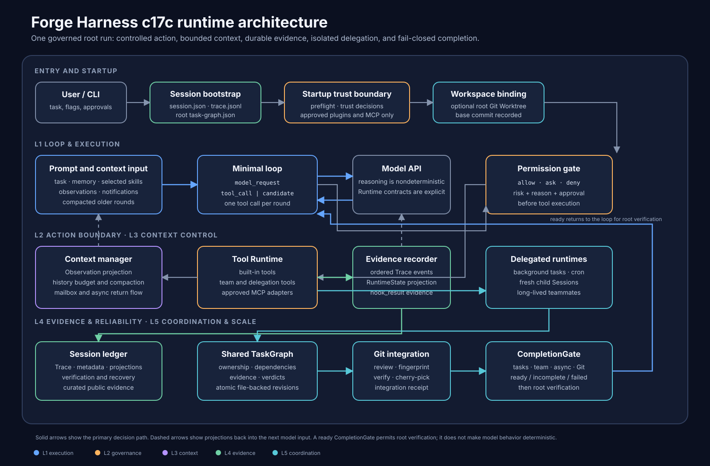

# Forge Harness

[简体中文](README.zh-CN.md)

Forge Harness is a runnable TypeScript coding-agent Runtime. A model's claim that a task is complete is a proposal, not proof. Permissions, execution evidence, isolated workspaces, and verifier commands determine whether the run may finish.

The implementation stops at `c17c Coordination / Completion Protocol`. The repository provides source code for local inspection and execution, not a hosted service. The Chinese tutorial separately explains how the mechanisms evolved.

## One observed completion

The current [c17c live snapshot](docs/assets/evidence/c17c-team-completion.json) records one model-driven run:

```text
pre-approval writes  blocked
edit plan            approved
artifact write       completed in teammate Worktree
task verification    passed
Git integration      receipt recorded
premature candidate  deferred
teammates            stopped, unread=0
root verification    passed
session              completed in 31 rounds
```

This records one run and does not guarantee future model behavior. `npm run smoke:c17c-capstone` is a deterministic, model-free check of TaskGraph ownership, review, verification, Git integration, and CompletionGate invariants. It does not replay the live run.

## Runtime at a glance



A root run owns the full decision path:

```text
prompt assembly
  -> model response
  -> permission policy and optional approval
  -> Tool Runtime
  -> bounded observation and Trace evidence
  -> TaskGraph, child, teammate, and Git obligations
  -> CompletionGate
  -> root verifier
  -> final answer
```

The five Forge layers are architecture lenses, not chapter order:

| Layer | Responsibility |
| --- | --- |
| `L1 Loop & Execution` | Model turns, tool dispatch, and final-answer flow. |
| `L2 Governance & Action Boundary` | Permission decisions, approvals, path boundaries, and extension trust. |
| `L3 Context & Knowledge` | Prompt assembly, memory, selected skills, observations, and compaction. |
| `L4 State, Evidence & Reliability` | Session metadata, Trace events, RuntimeState, verification, and receipts. |
| `L5 Coordination & Scale` | Background work, Worktrees, child Sessions, TaskGraph, teammates, and CompletionGate. |

Read the [Architecture overview](docs/architecture-overview.md) for module ownership, state boundaries, and the c17c completion protocol.

## What is governed

- Built-in and MCP tool calls cross an explicit `allow`, `ask`, or `deny` policy before execution.
- Tool results use one structured path into bounded observations, RuntimeState, and the append-only Trace.
- A candidate answer is not final until pending activity settles, CompletionGate is ready, and the configured verifier passes.
- Edit-capable root, child, and teammate work can use generated Git Worktrees with recorded source identity.
- Plugins pass descriptor preflight and a per-Session trust decision before import or MCP startup.
- c17c requires actor-owned evidence, review, edit-plan approval, source verification, Git integration receipts, teammate shutdown, and completed team state.

The [Evidence Index](docs/evidence-index.md) maps each statement to source, tests, deterministic smoke runs, optional live evidence, and a stated limitation.

## Requirements and setup

Use Node.js `20.19.0` or newer.

```bash
npm install
cp .env.example .env
npm run build
```

Set the model connection in `.env`:

```text
OPENAI_API_KEY=...
OPENAI_MODEL=gpt-5.4-mini
OPENAI_BASE_URL=
```

Leave `OPENAI_BASE_URL` empty for the default OpenAI endpoint. A compatible gateway can be configured explicitly.

## Run the CLI

Start with a bounded read task:

```bash
npm run start -- "Read package.json and summarize the available Runtime commands. Do not modify files."
```

Add a root verifier when completion needs a command-level invariant:

```bash
npm run start -- --verify "npm run build" "Inspect the project and report readiness only after the verifier passes."
```

Bind the root run to a generated Git Worktree when the task may edit files:

```bash
npm run start -- --worktree "Inspect the repository and make one explicitly requested change."
```

These commands call the model service configured in `.env`. Mutation, plugin trust, external tools, verification, and Git integration may require interactive approval.

## Deterministic validation

The main checks do not call a model service:

```bash
npm run docs:check
npm run typecheck
npm run test
npm run build
```

Two focused c17c smoke tests exercise the integration path without model output:

```bash
npm run smoke:c17c-capstone
npm run smoke:c17c-child
```

The capstone smoke combines TaskGraph ownership, review, verification, Git integration, and CompletionGate. The child smoke focuses on one-shot edit-source integration. Neither proves future model adherence or external service availability.

## Demo runbooks

- [Verification / Recovery](docs/demos/verification-recovery.md)
- [Worktree isolation](docs/demos/worktree-isolation.md)
- [Async child handoff](docs/demos/async-child-handoff.md)
- [MCP and plugin trust](docs/demos/mcp-plugin-trust.md)
- [c17c team completion](docs/demos/c17c-team-completion.md)

Each runbook separates a repeatable deterministic check from an optional model-driven run.

## Documentation

- [Architecture overview](docs/architecture-overview.md): current c17c execution, state, trust, isolation, and completion boundaries.
- [Engineering case study](docs/engineering-case-study.md): the failures that forced each Runtime mechanism and the alternatives not taken.
- [Evidence Index](docs/evidence-index.md): claim-to-source, test, smoke, and live-evidence mapping.
- [Design Studies](docs/design-studies/README.md): context management, Tool Runtime, Session persistence, and multi-agent coordination.
- [Tutorial roadmap](docs/02-tutorial-roadmap.md): the two-part Chinese learning path.
- [Project architecture](docs/01-project-architecture.md): tutorial-era target boundaries and checkpoint mapping.
- [Appendix](docs/appendix/minimal-mcp-server.md): local MCP and plugin fixtures used by the extension chapters.
- [Agent instructions](AGENTS.md): repository rules for coding agents.

## Tutorial path

The tutorial answers a different question from the Runtime documentation: how did the system reach its current shape?

- `Part 1: Core Harness` develops the single-agent execution, governance, context, evidence, and verification path.
- `Part 2: Scale & Extensions` adds background work, Worktrees, isolated delegation, MCP, plugins, TaskGraph, teammates, and c17c completion.

Start at [c00 Orientation](docs/tutorial/c00-orientation.md) or use the [Tutorial roadmap](docs/02-tutorial-roadmap.md). The tutorial remains in Chinese and is not rewritten as portfolio or release material.

## Clean local run artifacts

Runs can accumulate local data under `.forge/sessions/` and `.forge/worktrees/`:

```bash
npm run clean:runs
```

The command reports counts and asks for `y/N`. Automation can opt in explicitly:

```bash
npm run clean:runs -- --yes
```

Cleanup removes registered generated Worktrees through Git, then deletes only the two generated roots. It preserves `.forge/mcp.json`, plugins, memory, skills, and Git branches.

## Boundaries

The c17c Runtime does not implement crash-safe resume, Attempts, idempotent replay, reconciliation, distributed coordination, remote workers, high availability, an operating-system sandbox, a plugin marketplace, RAG, a vector database, a web UI, or a hosted control plane.

Git Worktrees isolate file changes, not processes, credentials, network access, or host permissions. Approved plugin hooks are trusted in-process code. Live model runs are examples, while deterministic tests and smoke commands are the repeatable evidence layer.

## License

Licensed under the [Apache License 2.0](LICENSE).
