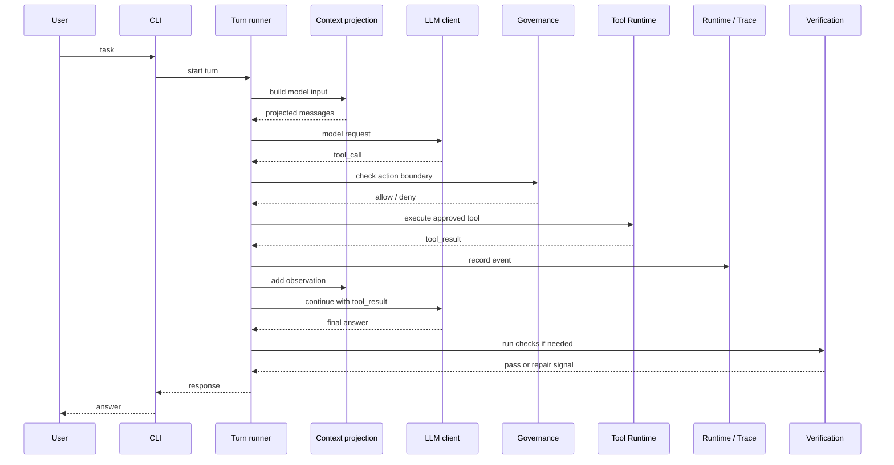
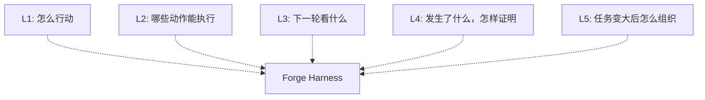

# 项目架构

这份文档描述 Forge Harness 完成后的项目形态。`c01` 只恢复 `src/cli/` 和 `src/core/` 的最小 scaffold；下面的模块边界仍然是目标方向，不是 `c01` 必须一次建完的目录清单。

章节顺序放在 [教程路线](02-tutorial-roadmap.md)。这里关心的是：最后这个 harness 由哪些部分组成，一次 agent turn 怎样跑起来，每个部分大概在哪些章节里长出来。

## 一次 agent turn 怎么跑

`agent loop` 是行为模式：模型提出下一步，harness 执行动作，把结果交回模型，直到可以回答用户。

`Turn runner` 是执行这个模式的核心模块。它调用 LLM client，也调用 Tool Runtime；LLM client 和 Tool Runtime 不直接互相调用。

这张图只画一轮最常见的路径。真实实现里，`tool_call -> tool_result -> model request` 可能重复多次；`deny`、tool error、check failure 会把 turn 带进 repair path。

| Side system | 怎么接入 turn |
| --- | --- |
| `Context projection` | 准备模型下一轮应该看到的 messages、observations 和约束。 |
| `Governance` | 在 tool 执行前判断动作边界，决定 allow、deny 或 ask for approval。 |
| `Runtime / Trace` | 记录事件、tool result、检查结果和可恢复状态。 |
| `Verification` | 在 final answer 前后运行检查，失败时把 repair signal 交回 `Turn runner`。 |
| `Extensions` | 通过 hooks、adapters、plugins 接入主流程，不直接改写 turn runner。 |

## 模块边界

这些模块是完成后的目标边界。早期章节可以先把代码写得更小，等痛点出现后再拆开。

| Module | 负责什么 | 主要章节 |
| --- | --- | --- |
| `src/cli/` | 接收任务、解析参数、把请求交给 harness；启动 Leader 管理的 teammate process。 | `c01`, `c17b` |
| `src/core/` | turn runner、agent loop control、LLM call path。 | `c01`, `c08`, `c17c` |
| `src/tools/` | tool definition、dispatch、adapter、tool result。 | `c02`, `c04`, `c16a`, `c16b`, `c17a` 到 `c17c` |
| `src/governance/` | risk classification、permission decision、approval。 | `c03`, `c14`, `c16a`, `c16b`, `c17c` |
| `src/context/` | `Observation`、`ContextProjection`、prompt assembly、compaction、mailbox projection。 | `c05`, `c11`, `c12`, `c16b`, `c17b`, `c17c` |
| `src/runtime/` | `Session`、`TraceEvent`、`RuntimeState`、`Verification`、workspace binding、replay。 | `c06`, `c07`, `c08`, `c13`, `c14`, `c16b`, `c17a` 到 `c17c` |
| `src/domain/` | shared runtime terms and protocols。 | `c17a` 到 `c17c` 随需要补齐 |
| `src/extensions/` | hooks、skills、background runs、subagents、MCP、plugin loading、team runtime 和 coordination protocol。 | `c09` 到 `c17c` |

不要提前建一个 `src/state/` god module。状态应该以 domain data 和 runtime projection 的形式存在，由使用它的模块持有。

## Forge 5 layers: 五个工程问题

Forge 5 layers 不是五个目录，也不是章节顺序。它们更像五个检查问题：这个 harness 能不能行动，动作会不会越界，下一轮模型看到什么，运行过程有没有证据，任务变大后怎么组织。

| Layer | 它问的问题 | 包含的机制 | 主要章节 |
| --- | --- | --- | --- |
| `L1 Loop & Execution` | 模型输出怎样变成真实动作？ | agent loop、model call、tool call、tool result、tool dispatch、shell/file tools、MCP adapter、explicit integration。 | `c01`, `c02`, `c04`, `c16a`, `c17c` |
| `L2 Governance & Action Boundary` | 哪些动作能执行，执行前要过什么边界？ | risk classification、permission decision、approval、deny rules、safe executor、reviewable file editing、worktree boundary、plugin session trust、Leader review gate。 | `c03`, `c04`, `c14`, `c16a`, `c16b`, `c17c` |
| `L3 Context & Knowledge` | 模型下一轮应该看到什么？ | message history、`Observation`、`ContextProjection`、system prompt assembly、skills、memory、context compaction、summary handoff、plugin skill namespace、mailbox message。 | `c05`, `c11`, `c12`, `c15a`, `c15b`, `c16b`, `c17b`, `c17c` |
| `L4 State, Evidence & Reliability` | 运行中发生了什么，完成前怎样证明？ | `Session`、`TraceEvent`、`RuntimeState`、checks、failure summary、recovery loop、child session evidence、plugin activation snapshot、task graph、team lifecycle、completion evidence。 | `c06`, `c07`, `c08`, `c09`, `c10`, `c12`, `c13`, `c14`, `c15a`, `c15b`, `c16a`, `c16b`, `c17a`, `c17b`, `c17c` |
| `L5 Coordination & Scale` | 任务变长、变多、变并行后怎么组织？ | hooks、todo/task state、background tasks、cron、child sessions、async handoff、plugin loading、shared task graph、long-lived teammates、mailbox、coordination protocol。 | `c09`, `c10`, `c13`, `c14`, `c15a`, `c15b`, `c16b`, `c17a`, `c17b`, `c17c` |

## Layer 重叠怎么读

一个章节可以同时落在多层。真实机制本来就会同时影响行动、边界、上下文、状态和协作。

| Chapter | 为什么会重叠 |
| --- | --- |
| `c04 Reviewable File Editing` | file editing 是一种 execution path，也需要 review 和 permission boundary。 |
| `c12 Context Compaction` | compaction 会决定下一轮看什么，也要保留状态、证据和未解决问题。 |
| `c14 Worktree Isolation` | worktree 是 filesystem boundary，也给恢复、review 和并行工作留下空间。 |
| `c16a MCP Tool Integration` | MCP adapter 扩展 tool execution，但外部工具仍要走 permission 和 result protocol。 |
| `c16b Plugin Loading / Registration` | Plugin 用一个 boundary 协调 skills、hooks 与 MCP；同时影响 session trust、prompt knowledge、startup evidence 和扩展规模，因此属于 `L2 + L3 + L4 + L5`。 |
| `c17a Shared Team Task Graph` | task graph 既是多个 session 的共享工作状态，也是 trace 和 completion 使用的证据，因此属于 `L5 + L4`。 |
| `c17b Long-Lived Teammates / Mailbox` | teammate process 增加可长期寻址的并发成员，mailbox 决定下一轮能看到什么，lifecycle 和投递结果还要进入证据，因此属于 `L5 + L3 + L4`。 |
| `c17c Coordination / Completion Protocol` | assignment、plan approval、review、integration 和 completion gate 同时影响执行、治理、上下文、证据与团队协调，因此覆盖五层。 |

## 课程怎样对应这些模块

`Part 1: Core Harness` 先让单 agent harness 能行动、受治理、能投影上下文、能记录状态、能验证结果。

`Part 2: Scale & Extensions` 在这个 core 上继续加压力：任务变长，上下文变大，运行需要后台继续，修改需要隔离，外部工具需要接入。

具体章节顺序见 [教程路线](02-tutorial-roadmap.md)。
