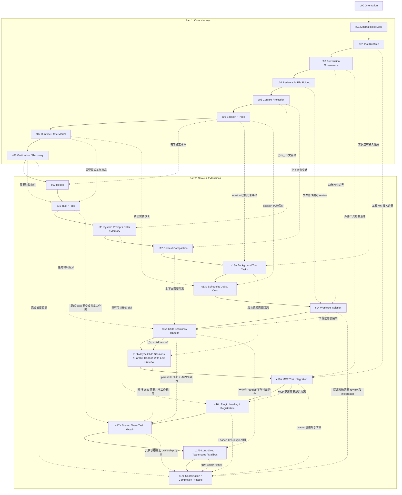

# 教程路线

Forge 的教程按 runnable milestone 推进。每章只加入一个主要机制，完成后留下能运行、能验证的 checkpoint。

架构层用来定位章节，章节顺序用来解释生长过程。

## 课程生长图

图里有两种线。

实线是阅读顺序。你可以从上往下按章节走。

虚线表示后面的章节从前面的哪个问题长出来。

## Part 2 的顺序

`Part 2` 的顺序按任务变长后的问题来排。每一章都复用 `Core Harness` 已经有的边界。

原来的 `c13 Background / Cron` 拆成两章：`c13a Background Tool Tasks` 只处理当前 session 内的后台 tool task；`c13b Scheduled Jobs / Cron` 再处理 durable job、schedule 和 worker wakeup。`c15 Child Sessions / Subagents` 也拆成两章：`c15a Child Sessions / Handoff` 先讲同步 child session、profile、worktree-bound edit 和 summary handoff；`c15b Async Child Sessions / Parallel Handoff` 再讲异步 research/edit child、notification 回流、final gate 和 edit preview metadata。外部扩展也分两步：`c16a MCP Tool Integration` 先完成 MCP runtime path，`c16b Plugin Loading / Registration` 再处理 plugin manifest 和组件注册。

`c17` 分成三个 checkpoint。`c17a Shared Team Task Graph` 先让 parent 和现有 child sessions 共享工作状态；`c17b Long-Lived Teammates / Mailbox` 把一次性 child 扩展成由 Leader 管理的独立 teammate processes；`c17c Coordination / Completion Protocol` 再把 task ownership、消息、review、integration 和 team completion 收束成一条完整运行路径。

`c17a` 保存 owner 并保证图更新的原子性，但不定义谁有权建立 ownership；assign 和 claim 的权限留到 `c17c`。`c17b` 只提供 direct message 和 fan-out broadcast，普通消息不能修改 task owner 或 status；这一章也不做 group chat、完整 session resume 或 capability routing。MCP/plugins 继续由 Leader 持有，不进入 teammate process。`c17c` 的 integration 遇到冲突时会阻止 task 和 team completion，不自动解决冲突。

| Chapter | 从哪里长出来 | 为什么现在需要 | 完成后有什么 |
| --- | --- | --- | --- |
| `c09` Hooks | `c06 Session / Trace` | Trace 已经有稳定事件，logging、metrics、notification 不该继续塞进 loop。 | lifecycle events 上有 hook runner。 |
| `c10` Task / Todo | `c07 RuntimeState` + `c08 Verification / Recovery` | 任务变长后，需要显式计划、状态和 acceptance。 | work state 能进入 trace、state 和 context projection。 |
| `c11` System Prompt / Skills / Memory | `c05 Context Projection` | context pipeline 已经存在，可复用 instruction 和项目知识需要正规入口。 | prompt 由 policy、skills、memory 和当前任务组装。 |
| `c12` Context Compaction | `c05 Context Projection` + `c06 Session / Trace` | 长 session 会超过 context budget，模型上下文和 trace 需要分工。 | 长任务能保留状态、证据和未解决问题。 |
| `c13a` Background Tool Tasks | `c02 Tool Runtime` + `c06 Session / Trace` | 有些 bash 命令要在当前 session 里后台运行，并把结果回流给模型。 | foreground loop 可以启动 session-scoped background task，并通过 notification 接收结果。 |
| `c13b` Scheduled Jobs / Cron | `c06 Session / Trace` + `c07 RuntimeState` | 有些任务不只是不阻塞 foreground，而是要稍后或定时发生。 | harness 有 durable cron schedule、worker wakeup 和 fresh scheduled run。 |
| `c14` Worktree Isolation | `c03 Permission Governance` + `c04 Reviewable File Editing` | 修改范围变大或并行后，需要 filesystem boundary。 | 每条工作线有独立工作区。 |
| `c15a` Child Sessions / Handoff | `c10 Task / Todo` + `c12 Context Compaction` + `c14 Worktree Isolation` | 子任务需要独立上下文、profile 边界、独立工作区和 summary handoff。 | 同步 child session 隔离执行，再把结果作为 handoff 交回主任务。 |
| `c15b` Async Child Sessions / Parallel Handoff | `c13a Background Tool Tasks` + `c15a Child Sessions / Handoff` | 独立 research 和 edit preview 子任务不该总是阻塞 parent session。 | 异步 child session 能启动、完成、通知，并在 final 前回流 handoff；edit child 只返回 worktree preview metadata。 |
| `c16a` MCP Tool Integration | `c02 Tool Runtime` + `c03 Permission Governance` | 外部 MCP tools 不能绕过 runtime、permission 和 result protocol。 | 一个 foreground stdio MCP server 走同一条 tool runtime path。 |
| [`c16b` Plugin Loading / Registration](tutorial/c16b-plugin-loading-registration.md) | `c09 Hooks` + `c11 Skills / Memory` + `c16a MCP Tool Integration` | 已配置的本地扩展需要 manifest、trust 和统一 loading boundary，不能让每种组件自行接入。 | enabled plugin 经全量 preflight 与 session trust 后，把 namespaced skills/hooks 和 multi-server MCP 交给现有子系统。 |
| `c17a` Shared Team Task Graph | `c10 Task / Todo` + `c15a/c15b Child Sessions` | parent 和 child 各自维护 task snapshot，不能表达共享 dependency、owner 和并发更新。 | parent、sync child 和 async child 共享一份 session-scoped 磁盘 task graph。 |
| `c17b` Long-Lived Teammates / Mailbox | `c15a/c15b Child Sessions` + `c17a Shared Team Task Graph` | fresh child 交出一次 handoff 就结束，不能被持续寻址，也不能等待后续消息。 | Leader 能启动和管理独立 teammate processes，并通过持久 mailbox 做 direct message、fan-out broadcast 和 explicit rejoin。 |
| `c17c` Coordination / Completion Protocol | `c08 Verification / Recovery` + `c14 Worktree Isolation` + `c16a/c16b Extensions` + `c17a/c17b Team Foundations` | task graph 和 mailbox 只能保存状态、传递消息，不能决定谁接任务、哪些产物可整合，以及团队何时真正完成。 | 一个 capstone run 串起 Leader assign、idle teammate 对 ready + unowned task 的原子 claim、plan approval、review/integration、graceful shutdown 和 completion gate。 |

`c02` 只落地 `bash`、`read`、`ls` 这三个 built-in tools。`edit` / `write` 会在 `c04 Reviewable File Editing` 里进入；`grep` / `find` 会在 `c05 Context Projection` 里和搜索输出的上下文压力一起讲。

## 章节表

| Chapter | Layer | Problem | Mechanism | Milestone |
| --- | --- | --- | --- | --- |
| [`c00` Orientation](tutorial/c00-orientation.md) | all | 课程需要先讲清楚方向。 | harness philosophy、5 layers、chapter contract。 | 能解释课程怎样按问题生长。 |
| [`c01` Minimal Real Loop](tutorial/c01-minimal-real-loop.md) | `L1` | LLM 只能回答，不能行动。 | 最小 model call + one tool path。 | CLI 跑通一次 tool call round trip。 |
| [`c02` Tool Runtime](tutorial/c02-tool-runtime.md) | `L1` | 第二个工具会让 loop routing 膨胀。 | tool definition、registry、dispatcher、result protocol；内置 `bash`、`read`、`ls`。 | 新工具能注册进 runtime，不改 core loop。 |
| [`c03` Permission Governance](tutorial/c03-permission-governance.md) | `L2` | Tool call 会产生 side effects。 | risk classification、permission decision、approval model。 | 高风险动作执行前经过决策。 |
| [`c04` Reviewable File Editing](tutorial/c04-reviewable-file-editing.md) | `L1 + L2` | coding agent 需要改文件，但不能只靠 shell。 | exact edit、`edit` / `write` tools、diff-like result。 | 文件修改变成可 review 的 tool result。 |
| [`c05` Context Projection](tutorial/c05-context-projection.md) | `L3` | raw history、tool output 和搜索结果会挤满下一轮 input。 | `grep` / `find` search tools、`Observation`、`ContextProjection`。 | 模型下一轮只看到被投影后的上下文。 |
| [`c06` Session / Trace](tutorial/c06-session-trace.md) | `L4` | 运行结束后无法 inspect、resume 或 replay。 | `Session` metadata、JSONL `TraceEvent`。 | 每次 run 留下可检查 trace。 |
| [`c07` Runtime State Model](tutorial/c07-runtime-state-model.md) | `L4` | Trace 记录过去，但 harness 还需要当前决策视图。 | `RuntimeState` projection。 | 当前任务、工具、错误和检查状态可读。 |
| [`c08` Verification / Recovery](tutorial/c08-verification-recovery.md) | `L4` | final answer 不等于任务完成。 | checks、failure summary、repair loop、retry limit。 | harness 完成前会验证，失败后能进入 repair。 |
| [`c09` Hooks](tutorial/c09-hooks.md) | `L5 + L4` | 生命周期扩展点不该散落在 core loop。 | stable event points、hook runner。 | cross-cutting behavior 挂在 loop 外侧。 |
| [`c10` Task / Todo](tutorial/c10-task-todo.md) | `L5 + L4` | 复杂任务需要可见计划和 acceptance。 | `todo` tool、task snapshot、`task_state_updated`。 | 计划进入 trace、state 和 context projection。 |
| [`c11` System Prompt / Skills / Memory](tutorial/c11-system-prompt-skills-memory.md) | `L3` | instruction 和项目知识不能每次手写进 prompt。 | prompt assembly、skills、memory notes。 | 上下文由 pipeline 组装。 |
| [`c12` Context Compaction](tutorial/c12-context-compaction.md) | `L3 + L4` | 长 session 会超过 context budget。 | compaction policy、summary handoff。 | 长任务能保留状态、证据和未解决问题。 |
| [`c13a` Background Tool Tasks](tutorial/c13a-background-tool-tasks.md) | `L5 + L4` | 长命令不该总是阻塞 foreground loop。 | session-scoped background bash task、notification 回流、background trace。 | foreground loop 能启动后台任务，并在后续 round 接收结果。 |
| [`c13b` Scheduled Jobs / Cron](tutorial/c13b-scheduled-jobs-cron.md) | `L5 + L4` | 有些任务需要稍后或定时继续，而不是只在当前 session 内后台运行。 | durable cron schedule、worker wakeup、fresh scheduled run trace。 | harness 能创建 cron schedule，并由 worker 触发新的 agent run。 |
| [`c14` Worktree Isolation](tutorial/c14-worktree-isolation.md) | `L2 + L4 + L5` | 并行或高风险修改会污染主工作区。 | session-bound worktree、merge review。 | 每条工作线有独立 filesystem boundary。 |
| [`c15a` Child Sessions / Handoff](tutorial/c15a-child-sessions-handoff.md) | `L5 + L3 + L4` | 独立子任务会挤占主上下文，也需要独立工作区。 | 同步 child session、profile、summary handoff、workspace binding。 | 子任务隔离执行，再把结果交回主任务。 |
| [`c15b` Async Child Sessions / Parallel Handoff With Edit Preview](tutorial/c15b-async-child-sessions-parallel-handoff.md) | `L5 + L3 + L4` | research 和 edit preview 子任务可能很慢，串行等待会卡住 parent session。 | async child session、child registry、handoff notification、final gate、edit preview metadata。 | parent 能继续推进，并在后续 round 接收 child handoff。 |
| [`c16a` MCP Tool Integration](tutorial/c16a-mcp-tool-integration.md) | `L1 + L2 + L4` | 内置 tools 不够，外部 MCP tools 也要被治理。 | strict project config、startup trust、dynamic MCP runtime、permission/result/trace adapter。 | 一个 local stdio MCP server 复用 Tool Runtime、permission、ToolResult 和 trace。 |
| [`c16b` Plugin Loading / Registration](tutorial/c16b-plugin-loading-registration.md) | `L2 + L3 + L4 + L5` | 已配置的本地 plugin 还没有统一、安全、可追踪的 loading 与 registration 边界。 | strict preflight、per-session trust、namespace、component registration、activation snapshot。 | 两个 enabled fixtures 把 skills、observe-only hooks 和 multi-server MCP 接入既有子系统。 |
| `c17a` Shared Team Task Graph | `L5 + L4` | parent 和 child 的 task snapshot 彼此隔离，依赖、owner 和验收证据无法共享。 | session-scoped 磁盘 task graph、dependency、owner、acceptance/evidence、原子更新。 | parent、sync child 和 async child 能读写同一份工作图。 |
| `c17b` Long-Lived Teammates / Mailbox | `L5 + L3 + L4` | 一次性 child 不能长期存在，也没有可寻址的异步通信路径。 | Leader-managed teammate process、persistent teammate definition、lifecycle、file mailbox、direct/broadcast、explicit rejoin。 | named teammates 能跨多个 turn 存活、收发消息并在失败后由 Leader 重新加入。 |
| `c17c` Coordination / Completion Protocol | all | 有共享工作图和 mailbox，仍缺少 ownership、验收、代码整合与团队收尾规则。 | Leader assign、ready-task atomic claim、plan approval、completion evidence、review/integration、shutdown、completion gate。 | comprehensive run 串起 one-shot children、long-lived teammates、Leader extensions、verification 和已整合产物。 |

## Branch 和 tag

`main` 保留最新集成课程。

`tutorial/cNN-*` branches 保留对应章节的 runnable checkpoint。

`tutorial-cNN-*` tags 是冻结 checkpoint。不要移动已发布 tag。如果要修旧 checkpoint，更新对应 branch，再创建 `-v2` tag。

## 章节约束

每个 runnable chapter 都要有一份章节约束。它是作者和 agent 的写作前检查，不是默认展示给读者的章节内容。

章节约束至少包含：

- branch name
- source paths
- commands
- expected observations
- doc invariants
- verification steps
- known non-goals
- next gap

如果文档和实现不一致，先判断改动属于 evergreen docs、milestone-coupled docs 还是 shared fix。共享修复从最早受影响 branch 开始，再 forward-port 到后续 branches 和 `main`。
