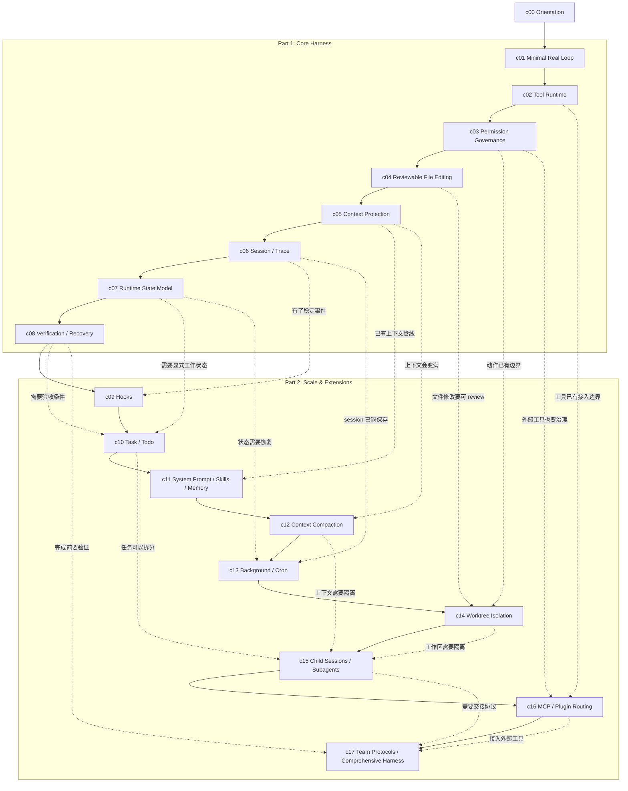

# 教程路线

Forge 的教程按 runnable milestone 推进。每章只加入一个主要机制，完成后留下能运行、能验证的 checkpoint。

架构层用来定位章节，章节顺序用来解释生长过程。

## 课程生长图

图里有两种线。

实线是阅读顺序。你可以从上往下按章节走。

虚线表示后面的章节从前面的哪个问题长出来。

## Part 2 的顺序

`Part 2` 的顺序按任务变长后的问题来排。每一章都复用 `Core Harness` 已经有的边界。

| Chapter | 从哪里长出来 | 为什么现在需要 | 完成后有什么 |
| --- | --- | --- | --- |
| `c09` Hooks | `c06 Session / Trace` | Trace 已经有稳定事件，logging、metrics、notification 不该继续塞进 loop。 | lifecycle events 上有 hook runner。 |
| `c10` Task / Todo | `c07 RuntimeState` + `c08 Verification / Recovery` | 任务变长后，需要显式计划、状态和 acceptance。 | work state 能进入 trace、state 和 context projection。 |
| `c11` System Prompt / Skills / Memory | `c05 Context Projection` | context pipeline 已经存在，可复用 instruction 和项目知识需要正规入口。 | prompt 由 policy、skills、memory 和当前任务组装。 |
| `c12` Context Compaction | `c05 Context Projection` + `c06 Session / Trace` | 长 session 会超过 context budget，模型上下文和 trace 需要分工。 | 长任务能保留状态、证据和未解决问题。 |
| `c13` Background / Cron | `c06 Session / Trace` + `c07 RuntimeState` | 有些任务不发生在当前 foreground turn 里。 | harness 能创建后台或定时工作。 |
| `c14` Worktree Isolation | `c03 Permission Governance` + `c04 Reviewable File Editing` | 修改范围变大或并行后，需要 filesystem boundary。 | 每条工作线有独立工作区。 |
| `c15` Child Sessions / Subagents | `c10 Task / Todo` + `c12 Context Compaction` + `c14 Worktree Isolation` | 子任务需要独立上下文、独立工作区和 summary handoff。 | 子任务隔离执行，再把结果交回主任务。 |
| `c16` MCP / Plugin Routing | `c02 Tool Runtime` + `c03 Permission Governance` | 外部 tools 不能绕过 registry、permission 和 result protocol。 | 外部工具走同一条 tool runtime path。 |
| `c17` Team Protocols / Comprehensive Harness | `c08 Verification / Recovery` + `c15 Child Sessions / Subagents` + `c16 MCP / Plugin Routing` | 机制变多后，需要重新收束成一条可解释的 agent turn。 | 一个 capstone run 串起 tools、permission、context、trace、state、verification。 |

## 章节表

| Chapter | Layer | Problem | Mechanism | Milestone |
| --- | --- | --- | --- | --- |
| [`c00` Orientation](tutorial/c00-orientation.md) | all | 课程需要先讲清楚方向。 | harness philosophy、5 layers、chapter contract。 | 能解释课程怎样按问题生长。 |
| [`c01` Minimal Real Loop](tutorial/c01-minimal-real-loop.md) | `L1` | LLM 只能回答，不能行动。 | 最小 model call + one tool path。 | CLI 跑通一次 tool call round trip。 |
| `c02` Tool Runtime | `L1` | 第二个工具会让 loop routing 膨胀。 | tool definition、registry、dispatcher、result protocol。 | 新工具能注册进 runtime，不改 core loop。 |
| `c03` Permission Governance | `L2` | Tool call 会产生 side effects。 | risk classification、permission decision、approval model。 | 高风险动作执行前经过决策。 |
| `c04` Reviewable File Editing | `L1 + L2` | coding agent 需要改文件，但不能只靠 shell。 | exact edit、write tool、diff-like result。 | 文件修改变成可 review 的 tool result。 |
| `c05` Context Projection | `L3` | raw history 和 tool output 会挤满下一轮 input。 | `Observation`、`ContextProjection`。 | 模型下一轮只看到被投影后的上下文。 |
| `c06` Session / Trace | `L4` | 运行结束后无法 inspect、resume 或 replay。 | `Session` metadata、JSONL `TraceEvent`。 | 每次 run 留下可检查 trace。 |
| `c07` Runtime State Model | `L4` | Trace 记录过去，但 harness 还需要当前决策视图。 | `RuntimeState` projection。 | 当前任务、工具、错误和检查状态可读。 |
| `c08` Verification / Recovery | `L4` | final answer 不等于任务完成。 | checks、failure summary、repair loop、retry limit。 | harness 完成前会验证，失败后能进入 repair。 |
| `c09` Hooks | `L5 + L4` | 生命周期扩展点不该散落在 core loop。 | stable event points、hook runner。 | cross-cutting behavior 挂在 loop 外侧。 |
| `c10` Task / Todo | `L5 + L4` | 复杂任务需要可见计划和 acceptance。 | task/todo state、status transition。 | 计划进入 trace、state 和 context projection。 |
| `c11` System Prompt / Skills / Memory | `L3` | instruction 和项目知识不能每次手写进 prompt。 | prompt assembly、skills、memory notes。 | 上下文由 pipeline 组装。 |
| `c12` Context Compaction | `L3 + L4` | 长 session 会超过 context budget。 | compaction policy、summary handoff。 | 长任务能保留状态、证据和未解决问题。 |
| `c13` Background / Cron | `L5 + L4` | 有些任务需要后台运行或稍后继续。 | background run、scheduled session。 | harness 能创建非阻塞或定时工作。 |
| `c14` Worktree Isolation | `L2 + L4 + L5` | 并行或高风险修改会污染主工作区。 | session-bound worktree、merge review。 | 每条工作线有独立 filesystem boundary。 |
| `c15` Child Sessions / Subagents | `L5 + L3 + L4` | 独立子任务会挤占主上下文，也需要独立工作区。 | child session、summary handoff、workspace binding。 | 子任务隔离执行，再把结果交回主任务。 |
| `c16` MCP / Plugin Routing | `L1 + L2` | 内置 tools 不够，外部工具也要被治理。 | MCP/plugin adapter through Tool Runtime。 | 外部工具复用 permission 和 result protocol。 |
| `c17` Team Protocols / Comprehensive Harness | all | 机制多了以后，需要回到一条可解释 agent turn。 | capstone run、team handoff。 | 串起 tools、permission、context、trace、state、verification。 |

## Branch 和 tag

`main` 保留最新集成课程。

`tutorial/cNN-*` branches 保留对应章节的 runnable checkpoint。

`tutorial-cNN-*` tags 是冻结 checkpoint。不要移动已发布 tag。如果要修旧 checkpoint，更新对应 branch，再创建 `-v2` tag。

## 章节约束

每个 runnable chapter 都要有一份章节约束。它可以放在章节开头或结尾，但写作前先确定。

章节约束至少包含：

- branch name
- source paths
- commands
- expected observations
- doc invariants
- verification steps
- known non-goals

如果文档和实现不一致，先判断改动属于 evergreen docs、milestone-coupled docs 还是 shared fix。共享修复从最早受影响 branch 开始，再 forward-port 到后续 branches 和 `main`。

## forge-tutorial-maintenance

后续创建本地 skill：`forge-tutorial-maintenance`。

第一版只需要 workflow。它负责提醒 agent 检查 chapter contract、docs/source 一致性、branch backport 或 forward-port、tag readiness，以及 `docs/tutorial/*.md` 的 `$humanizer-zh` pass。脚本等流程稳定后再补。
