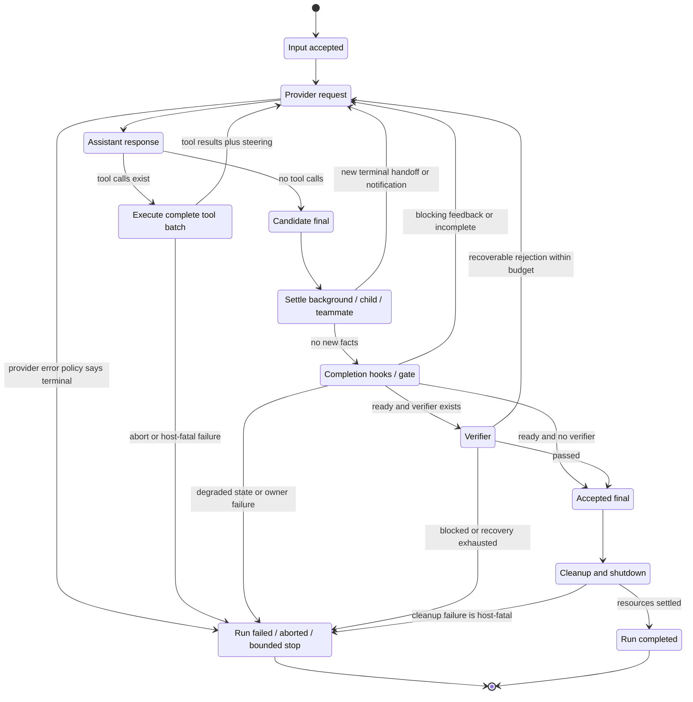

# Agent loop 与 completion：一次 run 到底什么时候结束？

## 1. Research question

先给结论：**当 host 还有 gate 时，provider 返回一段没有 tool call 的文本，只能产生 `candidate final`，不能单独证明 run 已完成。** Forge 先等待 background task、async child 和 teammate 的新事实，再检查 TaskGraph、owner 状态，以及是否存在 `CHERRY_PICK_HEAD`；只有 `CompletionGate` 返回 `ready`，且可选 verifier 接受候选答案，文本才升级为 `final_answer`。[CODE][Forge@75714f2:src/core/minimalLoop.ts:L453-L552] [CODE][Forge@75714f2:src/runtime/completionGate.ts:L42-L139]

这个问题由一个很具体的故障逼出来：模型说“完成了”，但 child 仍在改文件，teammate 只是在 `idle`，edit task 还停在 `submitted`，或者验证刚失败。若 loop 把 no-tool response 直接当成功，最终答案会抢在事实收敛之前出现。

本文回答四个问题：

1. `run`、`turn`、provider request 和 tool cycle 分别在哪里结束？
2. no-tool response、`stopReason`、max turns、abort 与 error 各自说明了什么？
3. root、child、background worker、teammate、hook 和 verifier 谁拥有哪一级 completion？
4. Forge 为什么把“候选答案已生成”“任务已交付”“结果已验收”“工作已集成”“执行单元已关闭”分成不同事实？

## 2. Scope and versions

本文只使用 [SOURCES](SOURCES.md) 冻结的本地 snapshot，不引用网页，也不把后续版本行为倒推到这些 commit。

| 研究对象 | Snapshot | 本文采用的运行面 | 证据边界 |
| --- | --- | --- | --- |
| Claude Code repaired source | `430502e` | `query()`、Stop hooks、Agent tool、in-process teammate | 仓库自述是从 leaked source 修复出的本地可运行副本，并列出 stub 与启动修复；它不是官方 public source。[DOC][Claude@430502e:README.en.md:L1-L8] [DOC][Claude@430502e:README.en.md:L189-L200] `package.json` 没有 test script，因此本文不把源码分支写成已由 test 证明的产品保证。[CODE][Claude@430502e:package.json:L1-L12] |
| Pi Agent | `977ec833` | `pi-agent-core` 的 loop，加上 coding-agent host 的 post-run policy | core 与 coding-agent host 分层；max-turn、permission、subagent 等不能从 extension 示例反推成 core primitive。 |
| Forge Harness | `75714f2` | c17c root loop、async producers、TaskGraph、CompletionGate、verifier、team shutdown | code 与 focused tests 是主要依据；c18 的 cross-run recovery 不在本文实现范围。 |

本文所说的 Claude、Pi、Forge 均只指上表 snapshot。尤其是 Claude 一节，confidence 上限受 provenance、generated/bundled code 和缺失 tests 限制。

## 3. Terminology

| 术语 | 本文定义 | 不等于什么 |
| --- | --- | --- |
| `provider request` | 向模型 provider 发出一次 request，并取得一条 assistant response | 不等于完整 turn；response 可能要求 tool call |
| `tool cycle` | assistant tool calls 被查找、执行并形成配对 tool results，再交回模型 | 不等于 run；之后通常还有下一次 provider request |
| `turn` | 一次 assistant response，加上该 response 所要求的完整 tool batch 与 `turn_end` | 不等于 root task 完成 |
| `run` | host 从接受一批输入，到 loop、queue、gate、verification 与收尾都 settle 的一次执行 | 不等于整个持久 session |
| `candidate final` | 没有更多 tool call 时模型给出的候选文本 | 不等于 accepted final |
| `accepted final` | host 的 completion policy 与 verifier 接受后的答案 | 不等于所有 cleanup 已成功 |
| `idle` | 执行单元当前没有正在处理的 prompt，可以继续接收工作 | 不等于 terminal；Claude teammate 明确把 idle 标成“NOT completed”。[CODE][Claude@430502e:src/utils/swarm/inProcessRunner.ts:L1311-L1361] |
| `submitted` | owner 已交结果，等待 review、verify 或 integration | 不等于 `completed` |
| `verified` | 某一 source fingerprint 通过 verifier | 不等于已合入 target |
| `integrated` | 已验证 source 的 receipt 与 target integration 已记录 | 对 Forge edit task 而言，这是进入 `completed` 的必要条件。[CODE][Forge@75714f2:src/runtime/teamTaskStore.ts:L801-L850] |
| `completed` | 某个 owner domain 接受的 terminal success 状态 | child task completed 不等于 root run completed |
| `shutdown` | 执行单元不再接受工作，资源释放进入收尾 | 不等于答案内容正确；它解决的是 lifecycle closure |

Pi 把 `agent_end` 与真正 idle 也分开：`agent_end` 只承诺 loop 不再发事件；listeners 全部 settle、`finishRun()` 清空 active state 后，`waitForIdle()` 才完成。[CODE][Pi@977ec833:packages/agent/src/agent.ts:L306-L323] [CODE][Pi@977ec833:packages/agent/src/agent.ts:L522-L576]

## 4. Observable behavior

从使用者视角看，no-tool response 有两种截然不同的含义：

| Host 状态 | 可观察结果 | completion 含义 |
| --- | --- | --- |
| 没有 pending producer、没有额外 gate、没有 verifier | 文本可立即成为 final | 这是最小 loop 的结束条件，不是通用 agent contract |
| 有 background/child/team facts 尚未 settle | host 把新通知写回 context，再请求模型 | 原文本作废，只是 premature candidate |
| TaskGraph 有未完成项或 teammate 未 shutdown | host 注入 blocker | 模型需要继续协调，不能宣布完成 |
| TaskGraph degraded、owner failed 或 Git 正在 cherry-pick | host 失败关闭 | run 以 failure 结束，不回传部分答案冒充 success |
| verifier recoverable failure | host 注入验证反馈并允许有限重试 | candidate 被拒绝，但 run 尚未 terminal |
| verifier passed 或未配置 | host 接受 final，然后执行 session cleanup | accepted answer 与 settled run 仍是两个时点 |

Forge 的代码先把 `response.output_text` 命名为 `candidateAnswer`，再依次 settle 三类异步来源、评估 CompletionGate、运行 verifier。这个命名对应实际控制流。[CODE][Forge@75714f2:src/core/minimalLoop.ts:L453-L586]

Claude snapshot 也不把 provider 的 `stop_reason` 当唯一事实。它记录是否真的收到 `tool_use` block，并把“没有 tool block”写成 loop-exit signal，但仍保留 Stop-hook retry。[CODE][Claude@430502e:src/query.ts:L551-L568] Pi 的低层 loop 则在 tool batch、steering 和 follow-up 都清空后发 `agent_end`；coding-agent host 仍可能因 retry、compaction 或 `agent_end` handler 新入队的消息继续调用 `Agent.continue()`。[CODE][Pi@977ec833:packages/agent/src/agent-loop.ts:L155-L275] [CODE][Pi@977ec833:packages/coding-agent/src/core/agent-session.ts:L1061-L1103]

## 5. Control flow

下面的图是一个 host-aware lifecycle，不把三套实现强行画成同一份源码。虚线语义由后文比较表限定。



三个边界最容易混淆：

- provider response 结束，只说明这次模型调用结束；
- accepted final 说明 host 接受了内容；
- run completed 还要求 owned resources settle。Forge 在 `finishSession()` 中先清理 background tasks，再关闭 `ToolRuntime`，最后发 `session_ended`。[CODE][Forge@75714f2:src/core/minimalLoop.ts:L1016-L1040]

## 6. Data model and ownership

### Completion ownership 对照

| 事实 | Claude Code | Pi Agent | Forge Harness |
| --- | --- | --- | --- |
| 谁判断当前 response 没有 tool work | `query()` 观察真实 `toolUseBlocks` | core loop 检查 typed `toolCall` blocks | `MinimalLoopSession` 过滤 `function_call` output |
| 谁决定是否继续同一 run | `query()` + Stop hooks + token/max-turn policy | core queue boundary；coding-agent host 追加 retry/compaction policy | root loop settle producers，再由 CompletionGate/verifier 决定 |
| 谁拥有 foreground tool completion | streaming executor / tool execution path | core tool batch | root loop 的 `ToolRuntime` call |
| 谁拥有 background child lifecycle | Agent task registry；async abort 与 parent Escape 解耦 | core 没有原生 background/subagent contract | `AsyncChildSessionManager` 持有 handle、terminal record 与一次性 notification |
| 谁拥有 teammate work status | teammate task state；idle 非 terminal | core 不适用 | `TeammateManager` 持有 process/session state，TaskGraph 持有交付事实 |
| 谁接受协作任务结果 | task/hook/team policy；完整 taxonomy 因缺失 source 不能封闭证明 | host/extension 自定义 | research 由 Leader review；edit 由 verify + integration receipt |
| 谁接受 root final | normal path 上的 Stop hooks 后由 query 返回 | core 发 `agent_end`；host listener/continuation settle 后 idle | CompletionGate `ready` 后，verifier 或 root loop接受 |
| 谁负责 shutdown | query/agent cleanup 与 UI cancel/kill paths | `Agent` active run + host/runtime dispose | root wrapper、background manager、tool runtime、teammate manager、MCP sessions各自收尾 |

Claude background agent 使用不链接 parent 的 abort controller，因此 parent Escape 不等于 child terminal；它由显式 kill path结束。[CODE][Claude@430502e:src/tools/AgentTool/AgentTool.tsx:L686-L752] Forge 的 child manager 把运行 handle、terminal result、notification cursor 分开，`settleBeforeFinal()` 至少等待一个 activity edge，再按创建顺序 drain terminal notifications。[CODE][Forge@75714f2:src/extensions/childSessions.ts:L350-L476]

### Forge 的交付状态不是布尔值

Forge TaskGraph 的持久状态是 `pending | in_progress | submitted | completed | blocked`。[CODE][Forge@75714f2:src/domain/teamTask.ts:L1-L12] `verified` 和 `integrated` 不是额外 status 字符串，而是 `submitted` task 上的 verdict 与 receipt。对 edit task：

```text
pending
  -> in_progress
  -> submitted + source + fingerprint
  -> submitted + passed verdict
  -> completed + matching integrationReceipt
```

schema 明确要求 completed edit 同时有 submission、verdict、matching receipt 和 evidence。[CODE][Forge@75714f2:src/domain/teamTask.ts:L580-L639] [CODE][Forge@75714f2:src/domain/teamTask.ts:L673-L674]

## 7. Invariants

1. **No-tool 只产生候选事实。** 一旦 host 配置了异步 producer、completion policy 或 verifier，模型文本必须经过这些 owner；provider 无权越级宣布 root success。[CODE][Forge@75714f2:src/core/minimalLoop.ts:L453-L552]
2. **一个 turn 先完成当前 tool batch，再接收 steering。** Pi 在 tool results 和 `turn_end` 后才 drain steering；测试确认两个 tool result 都先于 queued message。[CODE][Pi@977ec833:packages/agent/src/agent-loop.ts:L202-L260] [TEST][Pi@977ec833:packages/agent/test/agent-loop.test.ts:L681-L785]
3. **Abort 不能制造孤儿 tool call。** Claude streaming abort 会 drain executor 或补 synthetic tool results，然后才返回 `aborted_streaming`。[CODE][Claude@430502e:src/query.ts:L1011-L1052]
4. **Child terminal 不等于 root terminal。** Forge child terminal record 只是可消费 source；root 仍要把它提交到 task、验证、集成并通过 CompletionGate。[CODE][Forge@75714f2:src/extensions/childSessions.ts:L393-L429] [TEST][Forge@75714f2:test/runtime/teamTaskProtocol.test.ts:L124-L207]
5. **`idle` 不是 `completed`，`submitted` 也不是。** Claude teammate 进入 idle 后继续等下一条消息；Forge CompletionGate 要求 teammate `stopped`，并把任何非-completed task 当 blocker。[CODE][Claude@430502e:src/utils/swarm/inProcessRunner.ts:L1311-L1417] [CODE][Forge@75714f2:src/runtime/completionGate.ts:L42-L117]
6. **Bounded stop、abort、error 与 success 分开。** Claude max turns 返回专门 reason；Pi 把 provider error/abort 编码在 assistant message 并终止 low-level run；Forge round cap 抛错并发 `session_failed`。[CODE][Claude@430502e:src/query.ts:L1704-L1712] [CODE][Pi@977ec833:packages/agent/src/types.ts:L18-L32] [CODE][Forge@75714f2:src/core/minimalLoop.ts:L617-L631]

## 8. Failure semantics

### 常见 false-completion 场景

| 场景 | 错误结论 | 正确处理 |
| --- | --- | --- |
| 1. response 没有 tool call，但 Stop hook 返回 blocking feedback | “模型停了，所以完成” | Claude 把 feedback 加回 messages 并重试；hook 也可以阻止继续。[CODE][Claude@430502e:src/query.ts:L1267-L1305] |
| 2. no-tool candidate 出现时 background task 刚完成 | “先展示答案，通知以后再说” | Forge 先 drain notification；若注入了新事实，丢弃 candidate 并进入下一轮。[CODE][Forge@75714f2:src/core/minimalLoop.ts:L453-L490] |
| 3. async child 仍在运行 | “parent 已无工具，所以 child 无关” | CompletionGate 报 incomplete；focused test 证明 parent 可以继续，但 premature final 必须等 terminal handoff。[CODE][Forge@75714f2:src/runtime/completionGate.ts:L109-L116] [TEST][Forge@75714f2:test/core/minimalLoop.test.ts:L1916-L2033] |
| 4. teammate 报 idle，但仍有 owned task 或未读消息 | “worker 安静了，所以团队完成” | idle 只表示可接新工作；Forge 要求 task completed、mailbox drained、teammate stopped。[CODE][Forge@75714f2:src/runtime/completionGate.ts:L87-L107] |
| 5. edit task 已 `submitted` 且 verifier passed | “验证通过，所以已交付” | verified source 还必须与 integration receipt fingerprint/source 对齐；测试在 receipt 前保持 `submitted`。[TEST][Forge@75714f2:test/runtime/teamTaskProtocol.test.ts:L172-L207] |
| 6. candidate answer 的 verifier recoverable failure | “答案大致正确，先返回再修” | Forge 注入 verification feedback，仅允许有界 recovery；失败候选不写 `final_answer`。[CODE][Forge@75714f2:src/core/minimalLoop.ts:L530-L586] |
| 7. provider 返回 `error` 或 `aborted` assistant message | “loop 正常返回，所以成功” | Pi low-level run 结束，但 terminal reason 仍是 error/aborted；caller 必须检查语义状态。[CODE][Pi@977ec833:packages/agent/src/agent-loop.ts:L192-L200] |
| 8. 达到 max turns | “最后一条文本可以当 partial success” | Claude 返回 `max_turns`；Forge 抛出 bounded-failure，不静默接受 partial answer。[CODE][Claude@430502e:src/query.ts:L1704-L1712] [CODE][Forge@75714f2:src/core/minimalLoop.ts:L617-L631] |
| 9. accepted final 已生成，但 cleanup 抛错 | “有 final text，所以 run promise 必然成功” | Forge 先 close runtime 再发 `session_ended`；custom close error 可能让整个 run reject。[CODE][Forge@75714f2:src/core/minimalLoop.ts:L1016-L1040] [INF] 这里只推断当前调用顺序的结果，不声称已有 focused failure test。 |
| 10. teammate busy 或仍拥有 unfinished task，却收到 shutdown | “shutdown request 等于已停机” | Forge 拒绝 shutdown，直到 teammate idle 且没有 unfinished ownership。[CODE][Forge@75714f2:src/extensions/teammates.ts:L806-L843] |

Tool error 也不自动等于 root failure。Claude 与 Pi 都把多类 tool failure 规范化成 model-visible tool result，让模型有机会修正；是否上升为 run failure 是 host policy，而不是“throw 与否”的偶然结果。[CODE][Claude@430502e:src/query.ts:L893-L997] [CODE][Pi@977ec833:packages/agent/src/agent-loop.ts:L196-L224]

## 9. Claude Code

Claude snapshot 的 loop 以实际 `tool_use` blocks 控制 tool cycle，不单信 `stop_reason`。没有 tool block 时，normal path 仍要经过 Stop hooks；blocking error 触发新一轮，`preventContinuation` 产生独立 terminal reason，最后才返回 `completed`。[CODE][Claude@430502e:src/query.ts:L551-L568] [CODE][Claude@430502e:src/query.ts:L1267-L1357]

这里有三种不同 failure policy：

- streaming abort 先补齐 tool-result pairing，再返回 `aborted_streaming`；[CODE][Claude@430502e:src/query.ts:L1011-L1052]
- API error 跳过普通 Stop hooks，异步触发 `StopFailure` 后返回，目的是避免 error → hook block → retry 的 death spiral；[CODE][Claude@430502e:src/query.ts:L1258-L1265]
- Stop-hook implementation 自身抛错时记录 warning 并 fail open。[CODE][Claude@430502e:src/query/stopHooks.ts:L456-L472]

Steering 也有边界。queue 是 process-global，但每个 loop 只 drain 发给自己的 notification；slash command 留给 turn 结束后的 command processor，regular user prompt 只交给 main thread。[CODE][Claude@430502e:src/query.ts:L1547-L1589]

协作层更能说明“局部完成”不等于“全局完成”：background agent 的 task status 先置为 completed，以便 `TaskOutput(block=true)` 解阻，再做 handoff classification、worktree cleanup 与 notification。[CODE][Claude@430502e:src/tools/AgentTool/AgentTool.tsx:L951-L991] in-process teammate 完成一个 prompt 后进入 idle、等待下一条消息；只有退出 persistent loop 才写 terminal completed，并有 once-guard 避免 killed → completed 覆盖。[CODE][Claude@430502e:src/utils/swarm/inProcessRunner.ts:L1311-L1464]

这些机制能说明 repaired snapshot 的实现，却不能替代官方产品 contract。`query/transitions.ts` 缺失，完整 terminal union 无法核对；仓库又没有 conventional tests。本文因此把 Claude completion taxonomy 的 confidence 定为 Medium。

## 10. Pi Agent

Pi core 的边界更小。`runLoop()` 做一件清楚的事：完成当前 provider turn 和所有 tool results，运行 `prepareNextTurn`/`shouldStopAfterTurn`，drain steering；只有在 inner loop 本来要停时才 poll follow-up。两层 queue 都空后发 `agent_end`。[CODE][Pi@977ec833:packages/agent/src/agent-loop.ts:L155-L275]

几个细节值得保留：

- provider failure 按 `StreamFn` contract 编码为 final assistant message 的 `stopReason: error | aborted`，不应作为普通 throw 处理；[CODE][Pi@977ec833:packages/agent/src/types.ts:L18-L32]
- `shouldStopAfterTurn` 是 graceful boundary：本 turn 的 assistant 与 tools 已完成，但 queue 尚未继续 drain；focused test 还确认 follow-up 不会被 poll。[TEST][Pi@977ec833:packages/agent/test/agent-loop.test.ts:L1104-L1198]
- `Agent.abort()` 只传播 cooperative signal；`waitForIdle()` 还要等 `agent_end` listeners settle。[CODE][Pi@977ec833:packages/agent/src/agent.ts:L306-L323] [TEST][Pi@977ec833:packages/agent/test/agent.test.ts:L263-L299]
- coding-agent host 在一次 core run 后检查 retry、compaction 和由 `agent_end` handlers 新入队的消息，必要时调用 `continue()`。[CODE][Pi@977ec833:packages/coding-agent/src/core/agent-session.ts:L1061-L1103]

在这个 snapshot 的 `Agent`/coding-agent runtime source 中，没有内建 `maxTurns` option；host 可以用 `shouldStopAfterTurn` 计数实现 bounded policy。[INF] 这是当前 source surface 的 negative evidence，不是对所有 Pi extension 的断言。

Pi core 也没有原生 persistent teammate 或 background subagent protocol。example extension 可以在 tool 内 spawn child process，但它的 process-close 语义不能抬升成 core completion guarantee。

## 11. Forge Harness

Forge 把 candidate acceptance 写在 root loop，而不是依赖 prompt 让模型“自觉”。每轮先 drain background、child 与 Leader mailbox；no-tool response 出现后再调用各自的 settle boundary。只要新事实进入 history，候选文本就作废。[CODE][Forge@75714f2:src/core/minimalLoop.ts:L371-L490]

之后 `CompletionGate` 读取一组明确输入：TaskGraph 中的 task status、TaskGraph runtime projection 的 health、teammate state/unread count，以及 pending child/background count；Git 一侧只检查 `CHERRY_PICK_HEAD` 是否存在。problems 优先于 blockers；只有两者都空才 `ready`。[CODE][Forge@75714f2:src/runtime/completionGate.ts:L42-L138] edit integration receipt 通过 TaskGraph transition 间接影响 gate，gate 本身不检查 Git history、source fingerprint 或完整 integration state。focused tests覆盖 unfinished task、verified-but-not-integrated、blocked/owner-failed 和 all-complete/all-stopped 四类结果。[TEST][Forge@75714f2:test/runtime/completionGate.test.ts:L17-L199]

Leader 仍是 acceptance owner。research result 要 evidence、submission、Leader review 才 completed；edit result 要 approved plan、submission fingerprint、verification 和 matching integration receipt。[TEST][Forge@75714f2:test/runtime/teamTaskProtocol.test.ts:L87-L207] CompletionGate 只读，不替 task、teammate 或 Git owner 做隐式修复。

### DS01-E1：no-tool 与 pending child 对照实验

| 字段 | 内容 |
| --- | --- |
| Research question | 同样是 no-tool response，为什么裸 loop 可以一轮结束，而 pending child 必须让 candidate 失效？ |
| Repository | `Forge@75714f2` |
| Command | 见下方完整命令 |
| Preconditions | 可用的 Node.js/Vitest runtime；不需要 API key、network 或真实 child process |
| Expected observation | 第一 case 一次 request 返回 trimmed final；第二 case 第一次 no-tool 文本不成为 final，child terminal handoff 注入后才接受后续答案。[TEST][Forge@75714f2:test/core/minimalLoop.test.ts:L1916-L2033] [TEST][Forge@75714f2:test/core/minimalLoop.test.ts:L2139-L2154] |
| Actual observation | 默认 npm wrapper 在 Vitest 启动前因 WSL launcher失败；改用 worktree现有 Linux Node与上述 Vitest入口后，`1 test file passed`、`2 tests passed`、`35 skipped`，exit `0`，fresh-run duration `434ms`。[RUN] |
| Artifacts | stdout结果；source/test files 未修改 |
| Limitation | 这次 run只覆盖裸 no-tool与pending async child两条 targeted cases，不覆盖 teammate、CompletionGate全部分支、Claude或Pi行为 |

从 research worktree root 执行：

```bash
env TMPDIR=/tmp TEMP=/tmp TMP=/tmp CODEX_PERMISSION_PROFILE=:workspace \
  node ../../node_modules/vitest/vitest.mjs run test/core/minimalLoop.test.ts \
  -t 'stops immediately when the model returns no tool calls|lets the parent continue after async delegation and gates final until child handoff returns'
```

这次 focused run证明两条 Forge observable paths在当前 snapshot成立；它不把相邻机制顺带变成已验证 contract。

## 12. Comparative analysis

| 比较轴 | Claude Code repaired source | Pi Agent | Forge Harness |
| --- | --- | --- | --- |
| no-tool response | 进入 Stop-hook completion path | core 在 queues 清空时结束 | 明确命名 candidate，先过 producer/gate/verifier |
| stop reason | 不信 `tool_use` stop reason，观察真实 block | `error/aborted/length/toolUse/stop` 进入 typed flow | OpenAI response 以有无 function call 分支；host 自己定义 terminal policy |
| steering | tool batch 后、agent-scoped drain | tool batch 后 drain；follow-up 在 would-stop boundary | mailbox/notifications 在 request 前及 candidate gate 再 drain |
| completion hooks | Stop/SubagentStop/TaskCompleted/TeammateIdle，可 block | awaited event listeners 与 host extension policy | lifecycle hooks observe-only；CompletionGate 与 verifier独立拥有 acceptance |
| max turns | `maxTurns` 返回专门 reason | core 没有内建 hard cap | `maxToolRounds` 抛 failure，不返回 partial success |
| background ownership | async agent 可脱离 parent Escape，显式 kill | core 无原生 background child | manager-owned handles + root completion blocker |
| teammate idle | nonterminal，可继续收消息 | core 不适用 | nonterminal；root completion 要求 stopped |
| task交付 | task/team mechanisms存在，但完整 taxonomy 受 source gap 限制 | core 不定义 | submitted、verified、integrated、completed 显式分离 |
| final acceptance owner | query normal path + Stop policy | core/host 分层 | root CompletionGate + verifier |
| shutdown | agent/query cleanup 多路径 | active run、listeners、host dispose | background、tool runtime、team、MCP 按 owner 收尾 |

三者都把真实副作用与协作状态交给 host owner，所以 `done` 不能只从模型输出推导。[INF] 这是比较推论；它不把三套 product policy 说成同一实现。

## 13. Forge design decision

Forge 应保留 c17c 的两级结束语义，不把它压回“no tool calls means done”：

```text
candidate accepted
  = no new producer facts
  + CompletionGate.ready
  + verifier passed or absent

run settled
  = candidate accepted
  + owned cleanup and shutdown settled
```

采用的机制：

- root loop 是 final acceptance owner；child/teammate只能提交事实，不能直接结束 root；
- CompletionGate 只读取 owner state，不在 gate 内自动 claim、review、integrate 或 kill；
- `submitted`、verification verdict、integration receipt 与 `completed` 保持分离；
- abort、bounded stop、owner failure 与 success 使用不同 terminal evidence；
- lifecycle hook 继续 observe-only，不能覆盖 CompletionGate 的判定。

明确不采用的做法：

- 不复制 Claude 的完整 Stop-hook、task-classifier 与 background-session平台；
- 不把 Pi 的 minimal core stop boundary误写成 Forge 的团队 completion policy；
- 不新增全局 `isDone` state；事实仍由 TaskGraph、manager、Git 和 verifier各自持有；
- 不在本研究中实现 c18 resume、Attempt、idempotency 或 reconciliation。

这个决定符合 Forge 的五层边界：L1 负责 loop，L4 负责 verification/evidence，L5 负责 coordination convergence；CompletionGate 是只读交汇点，不是 `src/state/` god module。

## 14. Production implications

若把这套机制用于长时间、无人值守或跨进程 production run，还需要补六件事：

1. **Attempt identity。** provider request、tool side effect、task mutation、verification 与 integration receipt 应绑定同一 Attempt，才能在 crash 后判断“没做”“做过但未记账”或“记账过期”。
2. **Durable producer registry。** 当前 Forge async child/background handle 在 process memory；重启后不能据此恢复 pending count。
3. **Reconciliation。** Git cherry-pick 成功与 TaskGraph receipt 持久化之间存在 crash window；CompletionGate 只能看当前不一致，不能修复它。
4. **统一 cancel contract。** provider、generic ToolRuntime、MCP、child、background process 与 teammate 现在各有停止机制；production 需要可追踪的 cancel request、ack 和 terminal receipt。
5. **Cleanup failure policy。** 应明确“答案已接受但 close 失败”是 failed、degraded 还是 completed-with-warning，并让 operator 看见两级状态。
6. **Gate observability。** 每次 candidate 被哪一个 blocker 拒绝、等待哪个 owner、等待多久，应形成稳定 event，而不是只留下最终答案。

这些是 c18 及更后面的可靠性问题。它们不会改变本文的核心边界：final text 属于 model output，completion 属于 host protocol。

## 15. Evidence confidence and open questions

| 结论 | Confidence | 理由 |
| --- | --- | --- |
| Forge no-tool candidate与pending child gate | High | 直接 code + focused tests，且两条 targeted cases fresh run通过 |
| Forge CompletionGate、verifier ordering | High | 直接 code + focused tests；本次 targeted run没有覆盖全部 gate/verifier cases |
| Forge submitted/verified/integrated/completed 语义 | High | schema、transition code 与 protocol tests相互支持 |
| Pi core turn/queue/agent-end ordering | High | code + focused tests |
| Pi 没有内建 maxTurns | Medium | 当前 source surface 的 negative evidence；extension 可另行实现 |
| Claude visible loop/Stop/abort/idle paths | Medium | 直接 code，但 repaired leaked provenance、generated artifacts、missing modules、no tests |
| Claude 当前官方产品的完整 completion contract | Unknown | 本地材料无权证明 |

仍需回答的问题：

1. Forge 将来把 `accepted final` 与 `session_ended` 暴露成一个还是两个 public result？
2. c18 如何在 restart 后重建 pending producers，而不把 trace projection当 owner truth？
3. verifier passed 后 source drift、cleanup failure或Git receipt crash分别应进入哪种 terminal state？
4. Stop/completion hook 若超时，默认 fail-open 还是 fail-closed，谁能配置？
5. 长期 teammate 的 `idle`、`stopped` 与“可重连”是否需要 durable epoch/session fencing？

## 16. Interview takeaway

### 30 秒回答

一次 agent run 不是在模型停止输出时结束。no-tool response 只是 candidate；host 还要等本 turn 的 tools、steering、background/child/teammate facts settle，再检查 task ownership、verification、integration 和 shutdown。Forge 把这些事实交给各自 owner，root 的 CompletionGate 只读汇总。只有 gate ready、verifier 接受，并且收尾完成后，run 才真正结束。

### 3 分钟深挖

我会先分四层：provider request、turn、candidate acceptance、run settlement。provider request 返回 no-tool text，只关闭模型调用。turn 还要保证已发出的 tool calls 全部配对；Pi 和 Claude 都把 steering 放在 tool batch 后。接着 host 才能判断 candidate：Claude normal path 会跑 Stop hooks；Pi core 会在 steering/follow-up queues 清空后发 `agent_end`，coding-agent host 仍可因 retry 或 compaction继续；Forge 则显式 settle background、async child、teammate mailbox，再读 CompletionGate。

协作把问题变得更严格。child completed 只说明 child 产生了 terminal handoff；teammate idle 只说明暂时没 prompt；edit task submitted 或 verified 仍可能没有集成。Forge 因而要求 matching integration receipt 才把 edit task置为 completed，并要求所有 teammates stopped、mailbox drained、pending producers为零。最后还要区分 accepted final 与 cleanup：ToolRuntime 或 process close 失败时，答案内容可能已经被接受，但 run lifecycle 尚未干净结束。

设计上我不会添加一个全局 `isDone`。TaskGraph 持有交付事实，manager 持有 process/child facts，Git 与 verifier持有 source facts，CompletionGate 只做收敛判断。这样 crash recovery 将来可以围绕 Attempt 和 reconciliation 增量加入，不必把整个 runtime塞进中央 state。

### 追问

1. 为什么 `agent_end`、`final_answer` 和 `session_ended` 应是三个事件？
2. verifier 通过后文件又漂移，应该回到 `in_progress`、`submitted` 还是直接 failed？
3. 一个 background child 不响应 abort 时，root 应等待、detach 还是强杀？依据是什么？
4. CompletionGate 应该只读还是允许自动修复 blocker？
5. 如何设计 Attempt ID，让 tool side effect 与 integration receipt 在 crash 后可 reconciliation？
