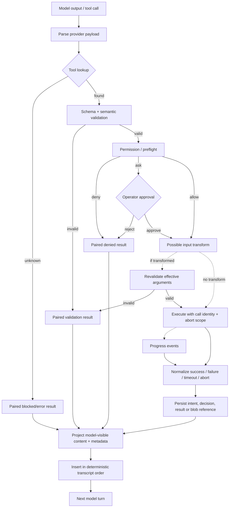

# Tool Runtime 与 Action Boundary：从模型意图到真实副作用

## 1. Research question

模型给出的 tool call 只是一个带名字和参数的候选动作。它穿过解析、schema、权限、并发和扩展边界后，可能改动文件、启动进程或调用外部服务。系统必须能回答：模型原本请求了什么，谁批准了什么，实际执行了什么，结果以什么顺序回到模型，以及进程在任意两步之间退出后还剩下哪些可恢复证据。

本文研究的具体痛点是：Forge 已经把 built-in tool 与 MCP tool 接入同一条治理路径，但目前仍是串行、无通用 rewrite、无通用 progress/abort、无 durable attempt 的教学实现。[CODE][Forge@75714f2:src/core/minimalLoop.ts:L1059-L1154] [CODE][Forge@75714f2:src/tools/types.ts:L1-L43] 若把 Claude Code 或 Pi 的并发、hook、rewrite 机制直接抄进来，动作边界会同时出现参数身份、许可对象、结果顺序和 crash recovery 四类新问题。[INF]

因此，本文追踪一条完整链路：

```text
model output
→ parse
→ lookup
→ validation
→ permission / preflight
→ possible transform
→ execution
→ progress
→ normalization
→ persistence
→ projection
→ next turn
```

本文不比较工具数量。研究重点是每一步的 owner、失败后的配对结果、rewrite 后的重新验证、并发事件与 transcript 的顺序，以及副作用成功但 receipt 尚未持久化时能否安全重试。

## 2. Scope and versions

研究对象固定为 [SOURCES](SOURCES.md) 中的三个本地 snapshot，证据规则采用 [METHODOLOGY](METHODOLOGY.md) 的标签与置信度定义。

| 研究对象 | 固定版本 | 本文采用的边界 |
| --- | --- | --- |
| Forge Harness | `main@75714f2`，已集成 `c17c`。 | 当前 minimal loop、ToolRuntime、governance、MCP adapter 与 tests；不把 roadmap 中的 c18 当作已实现能力。 |
| Pi Agent | `main@977ec833`，相关 packages 为 `0.83.0`。 | 以 `pi-agent-core` 的 tool loop 为主；权限、MCP 与其他 host policy 只在 extension/host 层成立。 |
| Claude local snapshot | repaired local copy `main@430502e`，不是官方 canonical source。[DOC][Claude@430502e:README.en.md:L1-L8] [DOC][Claude@430502e:README.en.md:L189-L200] | 只陈述该 snapshot 可定位的代码路径。仓库无常规 tests，缺失模块及 repaired/generated provenance 会降低置信度。[CODE][Claude@430502e:package.json:L1-L12] |

本文不运行真实 provider、MCP server 或付费请求，也不把 UI 表现反推成底层 primitive。[DOC][Forge@75714f2:docs/tutorial/c16a-mcp-tool-integration.md:L31-L35] 对 Claude rewrite 路径的结论严格限定为“源码候选风险”，不是已证实 exploit，更不是当前官方 Claude Code 的产品结论。[INF]

## 3. Terminology

| 术语 | 本文含义 |
| --- | --- |
| original request | provider 输出经语法解析后、任何 hook 或 permission transform 之前的工具名、call identity 与参数。 |
| effective request | 所有获准 transform 完成后，真正送入 tool body 的参数；没有 rewrite 机制时与 original request 相同。 |
| schema owner | 声明参数结构、执行 parse/coercion/validation，并决定失败如何进入 transcript 的模块。 |
| preflight | 不产生目标副作用的准备判断，例如 lookup、schema、并发分类、静态安全检查与 capability intersection。 |
| permission | 对具体候选动作作出 `allow`、`ask` 或 `deny` 的政策决定。它不是 schema validation 的别名。 |
| progress | tool 尚未 settled 时发出的中间状态；它不能替代 final result，也不应改变 final transcript slot。 |
| normalization | 把 unknown、invalid、denied、aborted、thrown、timed out 与成功值收敛成 loop 可消费的结果协议。 |
| persistence | 将 intent、decision、result 或大输出写入 session/trace/file；它不等于副作用本身已具备 exactly-once 语义。 |
| projection | 从完整 runtime result 中挑选下一轮模型可见内容；details、diagnostics、usage 与存储引用可以只留在 metadata。 |
| action boundary | 从非可信模型意图跨到真实 Workspace State 或外部副作用的确定性边界。 |

本文持续区分 `Session History`、`Runtime State`、`Model Context` 与 `Workspace State`。例如，一个 `tool_result` 已进入 Session History，并不能证明对应 Git、文件或远端服务状态可由该记录回滚；相反，副作用已经成功，也可能尚未来得及写入结果 receipt。[INF]

## 4. Observable behavior

三套实现都尽量让单次 tool call 最终形成 model-visible 的配对结果，但它们在 rewrite、并发、permission ownership 与 durable evidence 上并不等价。

| 可观察阶段 | Claude local snapshot | Pi Agent | Forge Harness |
| --- | --- | --- | --- |
| parse / lookup | alias-aware lookup；unknown 立即成为配对错误。[CODE][Claude@430502e:src/Tool.ts:L343-L360] [CODE][Claude@430502e:src/services/tools/toolExecution.ts:L337-L489] | provider adapter 先产出 typed `ToolCall`；core 按名字 lookup，unknown 转 error result。[CODE][Pi@977ec833:packages/ai/src/utils/json-parse.ts:L27-L124] [CODE][Pi@977ec833:packages/agent/src/agent-loop.ts:L600-L663] | loop 保留 raw JSON string；registry 精确 lookup，unknown 为 `blocked`。[CODE][Forge@75714f2:src/tools/types.ts:L1-L43] [CODE][Forge@75714f2:src/tools/runtime.ts:L10-L34] |
| schema / semantic validation | 初始 Zod parse，再执行 tool-specific validation。[CODE][Claude@430502e:src/services/tools/toolExecution.ts:L599-L733] | schema validation/coercion 在 `beforeToolCall` 前。[CODE][Pi@977ec833:packages/agent/src/agent-loop.ts:L616-L656] [CODE][Pi@977ec833:packages/ai/src/utils/validation.ts:L256-L310] | generic runtime 不递归验证；built-in handler 拥有语义校验，MCP 只在 host 侧保证 object-root/JSON object，递归 schema 交给 server。[CODE][Forge@75714f2:src/extensions/mcpToolAdapter.ts:L88-L120] [CODE][Forge@75714f2:src/extensions/mcpSession.ts:L136-L166] |
| permission / rewrite | `PreToolUse` 可 rewrite 或 deny，随后 permission 仍执行；hook allow 不能越过 settings/safety。[CODE][Claude@430502e:src/services/tools/toolHooks.ts:L321-L433] | core 无 permission subsystem；host 把 extension `tool_call` 映射到 `beforeToolCall`，可 block 或改参数。[CODE][Pi@977ec833:packages/coding-agent/src/core/agent-session.ts:L460-L518] | policy 先决定 `allow/ask/deny`；ask 还需 operator approval；没有参数 rewrite 字段。[CODE][Forge@75714f2:src/governance/types.ts:L3-L28] [CODE][Forge@75714f2:src/core/minimalLoop.ts:L1078-L1138] |
| execution order | safe calls 可并发，exclusive call 形成 barrier；final slots 保持输入顺序。[CODE][Claude@430502e:src/services/tools/StreamingToolExecutor.ts:L23-L205] [CODE][Claude@430502e:src/services/tools/StreamingToolExecutor.ts:L407-L440] | 默认整批并发；任一 tool 声明 `sequential`，整批串行。end event 可按完成顺序，结果消息保持 source order。[CODE][Pi@977ec833:packages/agent/src/agent-loop.ts:L411-L426] [TEST][Pi@977ec833:packages/agent/test/agent-loop.test.ts:L586-L679] | request 明确 `parallel_tool_calls: false`；仍以 awaited `for ... of` 按 response order 逐个处理。[CODE][Forge@75714f2:src/core/minimalLoop.ts:L426-L440] [CODE][Forge@75714f2:src/core/minimalLoop.ts:L589-L615] [RUN] DS02-E1 |
| progress / abort | 每 call 有 child abort controller；progress 可即时发出，final 仍等待 batch barrier。[CODE][Claude@430502e:src/services/tools/StreamingToolExecutor.ts:L265-L440] | `execute(signal, onUpdate)`；settled 后的 late progress 被忽略，已排队 progress 先于 final settle。[CODE][Pi@977ec833:packages/agent/src/agent-loop.ts:L666-L707] [TEST][Pi@977ec833:packages/agent/test/agent.test.ts:L301-L430] | generic `ToolRuntime` 没有 progress callback 或 `AbortSignal`；bash、MCP、background 各有局部 timeout/cancel。[CODE][Forge@75714f2:src/tools/types.ts:L1-L43] [TEST][Forge@75714f2:test/core/bashTool.test.ts:L77-L101] |
| exception / normalization | validation、deny、call error 等变成 paired result。[CODE][Claude@430502e:src/services/tools/toolExecution.ts:L337-L489] [CODE][Claude@430502e:src/services/tools/toolExecution.ts:L979-L1103] | unknown、invalid、blocked、abort、tool throw、post-hook throw 都成为 error result。[CODE][Pi@977ec833:packages/agent/src/agent-loop.ts:L600-L746] | registry 捕获 handler exception，统一为 `failed`；deny/ask rejection 为 `blocked` observation。[CODE][Forge@75714f2:src/tools/runtime.ts:L3-L37] [TEST][Forge@75714f2:test/core/minimalLoop.test.ts:L1539-L1605] |
| large output | 以 `tool_use_id` 幂等落盘；存储失败退回 inline；每条消息的持久化选择被冻结。[CODE][Claude@430502e:src/utils/toolResultStorage.ts:L137-L184] [CODE][Claude@430502e:src/utils/toolResultStorage.ts:L267-L334] [CODE][Claude@430502e:src/utils/toolResultStorage.ts:L739-L768] | core result 可携带 `details`、usage 与 content；本文证据未显示统一的大输出外置协议。[CODE][Pi@977ec833:packages/agent/src/agent-loop.ts:L756-L786] | MCP 文本/structured output 归一化后使用共享 20,000 字符边界；rich-only 失败，mixed rich 被省略并写 diagnostics。[CODE][Forge@75714f2:src/extensions/mcpToolAdapter.ts:L140-L211] [TEST][Forge@75714f2:test/extensions/mcpToolAdapter.test.ts:L185-L280] |
| persistence / next turn | final results input-ordered进入消息；大结果可外置，但 transcript append 仍有 buffered crash window。[CODE][Claude@430502e:src/utils/sessionStorage.ts:L606-L686] | completed `message_end` 才持久化；没有 request/tool-start journal。[CODE][Pi@977ec833:packages/coding-agent/src/core/agent-session.ts:L618-L665] | raw call、decision、result/projection 写 trace/history，但没有 durable Attempt 或 replay contract。[CODE][Forge@75714f2:src/core/minimalLoop.ts:L1059-L1154] [CODE][Forge@75714f2:src/runtime/traceRecorder.ts:L5-L28] |

[INF] 因而“都支持工具”只是表面相似。Claude 把丰富 permission、hook、并发和存储机制放进同一 product runtime；Pi core 只提供 loop/hook primitive，把权限与 MCP 留给 host/extension；Forge 则刻意让 built-in 与 MCP 汇入同一小型治理/结果边界，但不提供 rewrite 或通用并发。

## 5. Control flow

下面的 Mermaid 先画出需要审计的完整动作链。虚线节点表示只有部分实现具备；`original arguments` 与 `effective arguments` 必须在允许 transform 的系统里分别观察。



这张图是分析框架，不是对三项目执行顺序的混写：

- Claude 的实际路径是 initial parse/validation → `PreToolUse` rewrite → permission → call。permission 内部顺序为 abort → deny → ask → tool-specific/interaction/content/safety → bypass/always-allow → passthrough-to-ask。[CODE][Claude@430502e:src/services/tools/toolExecution.ts:L754-L861] [CODE][Claude@430502e:src/utils/permissions/permissions.ts:L1158-L1318]
- Pi 的实际路径是 validation/coercion → `beforeToolCall` → execute。测试直接证明 hook 可在 validation 后修改参数，core 没有第二次 schema parse。[TEST][Pi@977ec833:packages/agent/test/agent-loop.test.ts:L444-L504]
- Forge 的实际路径是 record raw call → policy decision → optional approval → execute 同一份 raw arguments → Observation → textual projection → history/trace；`PermissionDecision` 不携带 transform。[CODE][Forge@75714f2:src/core/minimalLoop.ts:L1059-L1154] [CODE][Forge@75714f2:src/governance/types.ts:L3-L28]

并发会让“执行顺序”和“模型看到的顺序”分裂：

1. Pi 在 parallel mode 先按 source order 做 preflight，再并发执行；`tool_execution_end` 依完成顺序出现，而 `Promise.all` 组装的 `toolResult` 仍按 assistant source order持久化。[CODE][Pi@977ec833:packages/agent/src/agent-loop.ts:L489-L554] [TEST][Pi@977ec833:packages/agent/test/agent-loop.test.ts:L586-L679]
2. Claude 先为每个输入预留 slot，再把安全调用并发、exclusive 调用作为 barrier；progress 可即时到达，final result 仍按输入 slot 返回。[CODE][Claude@430502e:src/services/tools/StreamingToolExecutor.ts:L23-L205] [CODE][Claude@430502e:src/services/tools/StreamingToolExecutor.ts:L407-L440]
3. Forge 不存在该分裂：当前 loop 逐个 await，而且 provider request 关闭 parallel tool calls。[CODE][Forge@75714f2:src/core/minimalLoop.ts:L426-L440] [CODE][Forge@75714f2:src/core/minimalLoop.ts:L589-L615]

[INF] 在 Pi 或 Claude 的并发批次中，一个 call 被 deny 或 rewrite-invalid，并不天然取消无依赖 sibling；该失败通常只占据自己的结果 slot。若产品希望“任一 deny 取消整批”，必须把它定义为额外 batch policy，不能从 source-ordered transcript 推导出来。Forge 的串行路径则先把当前 deny 投影成结果，再进入后续 call；它仍不是事务式“整批全有或全无”。

## 6. Data model and ownership

动作链里的风险往往来自多个 owner 对同一字段作了不同解释。

| 数据 / 决定 | Claude local snapshot | Pi Agent | Forge Harness |
| --- | --- | --- | --- |
| tool schema | `Tool` contract 声明 schema、validation、permission、progress、normalization metadata。[CODE][Claude@430502e:src/Tool.ts:L362-L503] | tool 定义 + `pi-ai` validation/coercion；provider adapter 先把 wire payload 转 typed call。[CODE][Pi@977ec833:packages/ai/src/utils/validation.ts:L256-L310] | `ToolDefinition` 暴露 schema；built-in handler 或 MCP server 持有递归语义，generic runtime 保留 raw JSON。[CODE][Forge@75714f2:src/tools/types.ts:L1-L43] |
| call identity | executor slot 与 per-call child abort controller 绑定同一次 tool use；大结果文件以 `tool_use_id` 命名。[CODE][Claude@430502e:src/services/tools/StreamingToolExecutor.ts:L265-L395] [CODE][Claude@430502e:src/utils/toolResultStorage.ts:L137-L184] | provider `ToolCall` identity 贯穿 events/result；没有 durable tool-start journal。[CODE][Pi@977ec833:packages/agent/src/agent-loop.ts:L586-L786] [INF] | `ToolCallRequest` 包含 name、raw arguments 与可选 call/round context；trace/history 使用该 call identity，但没有跨 run Attempt ID。[CODE][Forge@75714f2:src/tools/types.ts:L1-L43] [CODE][Forge@75714f2:src/core/minimalLoop.ts:L1059-L1154] |
| original / effective args | `PreToolUse` 和 permission 可产出 processed/updated input；源码路径未显示统一的第二次 schema parse。[CODE][Claude@430502e:src/services/tools/toolExecution.ts:L754-L861] [CODE][Claude@430502e:src/services/tools/toolExecution.ts:L1128-L1222] | hook 直接收到 validated object 并可修改；测试证明修改值到达执行体且不重验。[TEST][Pi@977ec833:packages/agent/test/agent-loop.test.ts:L444-L504] | original 即 effective；policy 与 runtime 收到 byte-identical `rawArguments`。[TEST][Forge@75714f2:test/core/minimalLoop.test.ts:L1488-L1537] |
| authorization | permission engine 与 hook policy；hook allow 仍受 settings/safety约束。[CODE][Claude@430502e:src/services/tools/toolHooks.ts:L321-L433] | core 不拥有 authorization；coding-agent extension hook 可实现 gate。[CODE][Pi@977ec833:packages/coding-agent/src/core/agent-session.ts:L460-L518] | governance policy 拥有 `allow/ask/deny`，operator 只裁决 ask；runtime 不再自行改变决策。[CODE][Forge@75714f2:src/governance/types.ts:L3-L28] |
| result metadata | structured output、large-result reference、post-hook processing可与模型内联文本不同。[CODE][Claude@430502e:src/services/tools/toolExecution.ts:L1397-L1542] | content 与 `details`、usage、added tool names、error flag、timestamp 分开。[CODE][Pi@977ec833:packages/agent/src/agent-loop.ts:L756-L786] | `ToolResult` 有四态与 content/summary；Observation 再投影为稳定文本，MCP diagnostics 可不进入主要文本。[CODE][Forge@75714f2:src/context/observation.ts:L3-L29] [CODE][Forge@75714f2:src/context/projection.ts:L3-L24] |
| persistence owner | session storage 串行 buffered append；large-result store 单独持久化。[CODE][Claude@430502e:src/utils/sessionStorage.ts:L606-L686] | coding-agent 在 completed `message_end` 写 session tree。[CODE][Pi@977ec833:packages/coding-agent/src/core/agent-session.ts:L618-L665] | trace recorder append events；InputHistoryManager 持有进程内 history，Workspace State 由工具/Git独立持有。[CODE][Forge@75714f2:src/runtime/traceRecorder.ts:L5-L28] [CODE][Forge@75714f2:src/context/compaction.ts:L138-L196] |

模型可见内容与 runtime metadata 必须分别看待：

- Forge 先把 `ToolResult` 转 `Observation`，再生成稳定四行文本；这保证下一轮输入一致，却不意味着所有 diagnostics、内部对象或原始大输出都原样进入 Model Context。[CODE][Forge@75714f2:src/context/observation.ts:L3-L29] [CODE][Forge@75714f2:src/context/projection.ts:L3-L24]
- Pi result 可同时保存模型消费的 `content` 和 host/extension 消费的 `details`、usage 等字段。[CODE][Pi@977ec833:packages/agent/src/agent-loop.ts:L756-L786]
- Claude 可把大结果换成持久化引用；存储失败时退回原内容，以可用性换取 transcript 体积。[CODE][Claude@430502e:src/utils/toolResultStorage.ts:L267-L334]

[INF] 三项目都没有证据支持“tool call identity 就是 exactly-once identity”。Claude 的 `tool_use_id` 只对大结果落盘幂等；Pi 当前 coding-agent 只持久化 completed message boundary；Forge 的 call/round identity 没有 durable retry/reconciliation contract。副作用成功与结果落盘之间仍可能发生进程退出，重放 transcript 也不能据此安全重放副作用。

## 7. Invariants

从现有实现可以提炼出八条核心不变量；前五条已有项目证据，后三条是 Forge 若未来增加 rewrite/parallelism 时应保持的设计约束。

1. **每个已接受的 tool call 都应有配对终态。** Claude 在 streaming、model failure 与 abort 时会补 synthetic result；Pi 将 unknown、invalid、blocked、abort 与 throw 收敛为 error result；Forge 将 deny 变成 `blocked` observation，而不是让 transcript 留下孤立 call。[CODE][Claude@430502e:src/query.ts:L893-L1052] [CODE][Pi@977ec833:packages/agent/src/agent-loop.ts:L600-L746] [CODE][Forge@75714f2:src/core/minimalLoop.ts:L1082-L1135]
2. **deny 不得调用目标 runtime。** Forge 的 deny/ask-reject tests 直接断言 runtime 未执行。[TEST][Forge@75714f2:test/core/minimalLoop.test.ts:L1539-L1605] Claude 与 Pi 也在 blocked/permission-denied 分支生成结果后跳过 call body。[CODE][Claude@430502e:src/services/tools/toolExecution.ts:L979-L1103] [CODE][Pi@977ec833:packages/agent/src/agent-loop.ts:L640-L663]
3. **并发完成顺序不得偷偷改变 transcript 顺序。** Pi 的并发测试证明 end events 可乱序，但 result messages 回到 source order；Claude 以预留 slot 实现同类约束。[TEST][Pi@977ec833:packages/agent/test/agent-loop.test.ts:L586-L679] [CODE][Claude@430502e:src/services/tools/StreamingToolExecutor.ts:L407-L440]
4. **progress 只在 unsettled window 有效。** Pi 忽略 settled 后回调，并等待已排队 progress 后再 final；Claude 同样把即时 progress 与 ordered final 分离。[TEST][Pi@977ec833:packages/agent/test/agent.test.ts:L301-L430] [CODE][Claude@430502e:src/services/tools/StreamingToolExecutor.ts:L407-L440]
5. **unknown、invalid 与 permission deny 是不同错误类别。** Forge 至少区分 registry `blocked`、handler `failed` 与 governance `blocked`，MCP timeout 又映射为 `timed_out`；合并成一个 exception 会丢失模型纠错与审计信息。[CODE][Forge@75714f2:src/tools/runtime.ts:L3-L37] [CODE][Forge@75714f2:src/extensions/mcpToolAdapter.ts:L140-L211]
6. **任何 transform 都要保留 original 与 effective request。** 建议 future Forge trace 同时记录二者、transform owner 与原因，approval 展示 effective request，并在最后一次 transform 后重新验证。
7. **batch policy 必须显式。** 建议把“单 call 失败是否取消 sibling”“exclusive barrier 如何插入”“abort 是否传播”写成 typed policy，不能依赖 `Promise.all` 或 provider 输出顺序的偶然行为。
8. **side-effect receipt 与 model projection 不应互为唯一真相。** 建议将可重试动作的 attempt/receipt 交给 owner module；模型可见摘要只做投影，不能承担 crash reconciliation。

## 8. Failure semantics

下表列出至少五个必须独立处理的 failure window。它们不是一条 `catch` 能安全抹平的同类错误。

| 失败场景 | 当前语义 | 风险与边界 |
| --- | --- | --- |
| unknown tool | Claude、Pi 都生成 paired error；Forge registry 返回 `blocked`。[CODE][Claude@430502e:src/services/tools/toolExecution.ts:L337-L489] [CODE][Pi@977ec833:packages/agent/src/agent-loop.ts:L600-L663] [CODE][Forge@75714f2:src/tools/runtime.ts:L10-L34] | 模型可改名重试；不能把 unknown 当成已执行失败。 |
| malformed / invalid args | Pi 在执行前 schema validate/coerce；Claude 初始 Zod/tool validation；Forge built-in handler 处理 semantic validation，MCP host 只检查 object shape。[CODE][Pi@977ec833:packages/ai/src/utils/validation.ts:L256-L310] [CODE][Claude@430502e:src/services/tools/toolExecution.ts:L599-L733] [CODE][Forge@75714f2:src/extensions/mcpSession.ts:L136-L166] | schema owner 不一致时，host 与 remote server 可能给出不同错误语义。 |
| deny / ask rejected | 三者都能把当前 call 变成 result 而不执行；Pi 的权限只是 host/extension policy，不是 core guarantee。[CODE][Claude@430502e:src/services/tools/toolExecution.ts:L979-L1103] [CODE][Pi@977ec833:packages/coding-agent/src/core/agent-session.ts:L460-L518] [TEST][Forge@75714f2:test/core/minimalLoop.test.ts:L1539-L1605] | 并发 batch 中是否继续 sibling 是另一条政策，不能从 deny 本身推导。 |
| rewrite 破坏 schema | Pi test 证明可发生且不会二次 parse。[TEST][Pi@977ec833:packages/agent/test/agent-loop.test.ts:L444-L504] Claude path 也未看到统一 second parse。[CODE][Claude@430502e:src/services/tools/toolExecution.ts:L1128-L1222] | Pi 是已证明 contract；Claude 只是 source-level candidate risk，尚无 test/run 证明可利用。[INF] Forge 当前无 rewrite，因此没有这个窗口。[TEST][Forge@75714f2:test/core/minimalLoop.test.ts:L1488-L1537] |
| abort before / during call | Pi cooperative signal 能提前阻止或传给 tool；不合作的 tool 可延迟 settle。[CODE][Pi@977ec833:packages/agent/src/agent.ts:L306-L323] [CODE][Pi@977ec833:packages/agent/src/agent-loop.ts:L666-L703] Claude 为每 call 建 child controller；Forge 只有 bash/MCP 等局部机制。[CODE][Claude@430502e:src/services/tools/StreamingToolExecutor.ts:L265-L395] [TEST][Forge@75714f2:test/core/bashTool.test.ts:L77-L101] | abort signal 不是副作用回滚。进程收到 cancel 前已写文件时，仍需 receipt/reconciliation。 |
| tool / post-hook throws | Claude 与 Pi 归一化为 error result；Forge registry 捕获 handler exception。[CODE][Claude@430502e:src/services/tools/toolExecution.ts:L979-L1103] [CODE][Pi@977ec833:packages/agent/src/agent-loop.ts:L697-L746] [CODE][Forge@75714f2:src/tools/runtime.ts:L3-L37] | post-hook 失败与目标 tool 失败应分开记录，否则会误判副作用是否发生。 |
| parallel partial failure | Pi/Claude 保持每个输入 slot 的 final result；Forge 当前无 direct parallel batch。[TEST][Pi@977ec833:packages/agent/test/agent-loop.test.ts:L586-L679] [CODE][Claude@430502e:src/services/tools/StreamingToolExecutor.ts:L23-L205] | 已完成 sibling 不能靠丢弃 transcript 撤销；需要明确 fail-fast、best-effort 或 barrier policy。 |
| late progress | Pi settled 后忽略，并保证 queued progress 先于 final。[TEST][Pi@977ec833:packages/agent/test/agent.test.ts:L301-L430] | 若 progress 被误当成 durable completion，UI、gate 和重试会看到冲突状态。 |
| large-result storage failure | Claude 回退 inline；Forge MCP 对 rich-only/mixed-rich 有明确失败/诊断映射。[CODE][Claude@430502e:src/utils/toolResultStorage.ts:L267-L334] [TEST][Forge@75714f2:test/extensions/mcpToolAdapter.test.ts:L185-L280] | 外置文件存在不代表 transcript append 成功；反之 inline fallback 可能放大 context。 |
| side effect success / result persistence crash | Claude append 是 buffered，Pi 只在 completed message_end 持久化，Forge trace append 不驱动 replay。[CODE][Claude@430502e:src/utils/sessionStorage.ts:L606-L686] [CODE][Pi@977ec833:packages/coding-agent/src/core/agent-session.ts:L618-L665] [CODE][Forge@75714f2:src/runtime/traceRecorder.ts:L5-L28] | 三者在本文证据范围内都不能宣称通用 exactly-once tool execution。[INF] |
| dynamic MCP disappearance | Forge composite 保留 stale owner，让该 runtime 决定 unavailable/failure；MCP session 关闭后移除 definitions。[CODE][Forge@75714f2:src/tools/compositeRuntime.ts:L12-L41] [TEST][Forge@75714f2:test/tools/compositeRuntime.test.ts:L49-L61] | catalog snapshot 与执行时 liveness 会分离；lookup success 不保证远端仍在线。 |

## 9. Claude Code

Claude local snapshot 展示的是三者中最丰富、也最难一眼审计的 action boundary。

**入口与 contract。** `Tool` 同时声明 schema、是否可并发、是否只读/破坏性、是否可中断或 defer、MCP metadata、progress、input validation、permission 与 result mapping；alias-aware lookup 在执行前解析名称。[CODE][Claude@430502e:src/Tool.ts:L343-L503] 这使 built-in、extension-provided behavior 与 MCP-backed call 可以进入相近的 orchestration vocabulary，但并不表示它们的连接、权限和 failure semantics 完全相同。[INF]

**执行链。** `toolExecution` 依次处理 lookup、初始 Zod parse、tool-specific validation、可选 Bash 分类、`PreToolUse`、permission、call、structured-output mapping、large-result storage 与 `PostToolUse`。[CODE][Claude@430502e:src/services/tools/toolExecution.ts:L337-L410] [CODE][Claude@430502e:src/services/tools/toolExecution.ts:L599-L733] [CODE][Claude@430502e:src/services/tools/toolExecution.ts:L754-L932] [CODE][Claude@430502e:src/services/tools/toolExecution.ts:L1181-L1295] [CODE][Claude@430502e:src/services/tools/toolExecution.ts:L1397-L1542] unknown、validation error、permission deny 与 caught exception 都尽量被配对回当前 tool use，而不是逃出 loop。[CODE][Claude@430502e:src/services/tools/toolExecution.ts:L337-L489] [CODE][Claude@430502e:src/services/tools/toolExecution.ts:L979-L1103]

**rewrite 与 permission。** `PreToolUse` 可返回 rewritten input、allow 或 deny；hook 的 allow 仍不能越过 settings deny/ask 与 safety checks。[CODE][Claude@430502e:src/services/tools/toolHooks.ts:L321-L433] initial parse 发生在 rewrite 前，后续 `processedInput`/`updatedInput` 进入 call path；本次源码审阅没有看到统一的第二次 `inputSchema.safeParse`。[CODE][Claude@430502e:src/services/tools/toolExecution.ts:L754-L861] [CODE][Claude@430502e:src/services/tools/toolExecution.ts:L1128-L1222] [INF] 这只能支持“rewrite 可能使先前 validation 失效”的候选风险。由于该 repaired snapshot 没有常规 tests，本文没有运行可控 rewrite 实验，也无法证明 invalid effective input 一定到达所有 tool body，更不能称其为 exploit。

**并发、progress 与 abort。** Streaming executor 先按输入顺序预留 result slot，unknown tool 立即占用错误 slot，再把安全调用并发、exclusive 调用设置 barrier；无法确定分类时保守串行，默认并发上限为十。[CODE][Claude@430502e:src/services/tools/StreamingToolExecutor.ts:L23-L205] [CODE][Claude@430502e:src/services/tools/toolOrchestration.ts:L8-L116] 每个调用有 child abort controller，Bash error 具有特殊 sibling-cancel 行为；progress 可先到达 UI/observer，final result 仍按 input slot 排列。[CODE][Claude@430502e:src/services/tools/StreamingToolExecutor.ts:L265-L440]

**大结果与 MCP。** 大结果以 `tool_use_id` 和 `wx` 方式幂等写入；image passthrough，写失败退回原内容，已决定的 per-message storage fate 被固定以保持 cache/resume 稳定。[CODE][Claude@430502e:src/utils/toolResultStorage.ts:L137-L184] [CODE][Claude@430502e:src/utils/toolResultStorage.ts:L267-L334] [CODE][Claude@430502e:src/utils/toolResultStorage.ts:L739-L768] MCP 在更下层负责连接新鲜度、progress、错误归一化与 session-expiry 单次 retry；这部分 remote lifecycle 不是普通本地 function call 的同义词。[CODE][Claude@430502e:src/services/mcp/client.ts:L1216-L1402] [CODE][Claude@430502e:src/services/mcp/client.ts:L1675-L1945] [CODE][Claude@430502e:src/services/mcp/client.ts:L3029-L3245]

这套设计的优势是 product policy 丰富且 concurrent transcript 仍有确定顺序；代价是 schema、hook、permission、safety、storage 与 remote transport 的 ownership 较分散，必须靠更强的 trace 与 targeted tests 才能证明 rewrite/abort race 没有跨层裂缝。[INF]

## 10. Pi Agent

Pi 把 action boundary 拆成“core loop primitive”与“coding-agent/extension policy”两层，这个边界比功能数量更值得借鉴。

**解析与 core chain。** provider adapter 先把 wire output 变成 typed `ToolCall`；通用 incomplete-JSON helper 会尝试修复/partial parse，失败回退 `{}`。core 从 typed call 开始执行 name lookup → optional `prepareArguments` → schema validation/coercion → `beforeToolCall` → `execute(signal, onUpdate)` → `afterToolCall` → normalized `ToolResultMessage`。[CODE][Pi@977ec833:packages/ai/src/utils/json-parse.ts:L27-L124] [CODE][Pi@977ec833:packages/agent/src/agent-loop.ts:L586-L786] 因此，不能把某个 provider adapter 的字符串修复算法写成整个 loop 的统一 parsing guarantee。[INF]

**validation-after-rewrite gap 是测试事实。** focused test 让 `beforeToolCall` 修改已经 validation 的对象，并证明修改后的参数到达执行体；core 没有再做 schema parse。[TEST][Pi@977ec833:packages/agent/test/agent-loop.test.ts:L444-L504] 这是当前 snapshot 的明确 hook contract，并非只根据 absence 得出的候选风险。若 extension 将 `beforeToolCall` 用作 permission/rewrite boundary，extension 就同时承担 effective input 的可信度。[INF]

**权限归 host。** coding-agent 把 extension 的 `tool_call`/`tool_result` handler 映射到 core before/after hooks；Pi core 本身没有 `allow/ask/deny` authorization subsystem。[CODE][Pi@977ec833:packages/coding-agent/src/core/agent-session.ts:L460-L518] 项目文档也明确把 permission popups 与 MCP 留给 extensions/packages。[DOC][Pi@977ec833:packages/coding-agent/README.md:L491-L505] 所以“Pi 可以用 extension 实现权限”与“Pi core 保证权限”是两条不同结论。

**并发与顺序。** 默认 batch parallel；只要任一被调用 tool 标为 `executionMode: "sequential"`，整批就串行。[CODE][Pi@977ec833:packages/agent/src/agent-loop.ts:L411-L426] 测试显示两个 tool 的 completion events 顺序为后完成优先，而落入 transcript 的 result messages 仍按 source order。[TEST][Pi@977ec833:packages/agent/test/agent-loop.test.ts:L586-L679] invalid、blocked、abort 与 throw 各自占据原 slot，不需要把整批改成异常控制流。[CODE][Pi@977ec833:packages/agent/src/agent-loop.ts:L600-L746]

**progress 与 model-visible result。** `onUpdate` 只在未 settled 时被接受；late callback 丢弃，已经 queue 的 updates 会在 final result 前完成。[CODE][Pi@977ec833:packages/agent/src/agent-loop.ts:L666-L707] [TEST][Pi@977ec833:packages/agent/test/agent.test.ts:L301-L430] final result 把 `content` 与 `details`、usage、动态新增 tool names、error flag、timestamp 分离，允许 UI/extension 与模型使用不同投影。[CODE][Pi@977ec833:packages/agent/src/agent-loop.ts:L756-L786]

**built-in、extension 与 MCP。** extension 注册的 tool 会进入 coding-agent 的 runner/tool registry，冲突采用 first registration，同时记录 resource diagnostic。[CODE][Pi@977ec833:packages/coding-agent/src/core/extensions/runner.ts:L450-L472] [CODE][Pi@977ec833:packages/coding-agent/src/core/resource-loader.ts:L626-L633] MCP 不是 core discovery/runtime；它必须由 extension/package 自行实现连接、namespace、permission 与 shutdown。[DOC][Pi@977ec833:packages/coding-agent/README.md:L382-L396] [DOC][Pi@977ec833:packages/coding-agent/README.md:L491-L505] 因而本文只比较进入 core loop 后的 common tool contract，不替不存在的 built-in MCP policy 补结论。

## 11. Forge Harness

Forge 当前刻意选择一条短而可解释的动作链。

**调用与 governance。** model response 中的 function call 先记录 raw arguments，再交 policy；`deny` 或被拒绝的 `ask` 生成 model-visible `blocked` observation，只有 `allow`/获批 ask 才执行 runtime。[CODE][Forge@75714f2:src/core/minimalLoop.ts:L1059-L1154] deny test 证明 runtime 未执行；allow test 证明 policy 与 runtime 收到 byte-identical `rawArguments`。[TEST][Forge@75714f2:test/core/minimalLoop.test.ts:L1488-L1605] `PermissionDecision` 只有 action、risk、reason，没有 transformed input，因此 Forge 当前不存在通用 rewrite 或“rewrite 后漏掉 revalidation”的路径。[CODE][Forge@75714f2:src/governance/types.ts:L3-L28]

**registry 与 composition。** `ToolRuntime` 用 name → handler 精确路由，unknown 返回 `blocked`，handler exception 转 `failed`；`CompositeRuntime` 检测跨 runtime duplicate，并为动态消失的 tool 保留最后 owner，让 owner 返回 unavailable/failure。[CODE][Forge@75714f2:src/tools/runtime.ts:L3-L37] [CODE][Forge@75714f2:src/tools/compositeRuntime.ts:L3-L50] focused tests 覆盖 unknown、duplicate 与 stale owner。[TEST][Forge@75714f2:test/tools/toolRuntime.test.ts:L30-L61] [TEST][Forge@75714f2:test/tools/compositeRuntime.test.ts:L32-L67]

**MCP 不绕过 action boundary。** adapter 把 configured ∩ discovered 且 schema/name-compatible 的远端 tool 转成普通 `ToolDefinition`，session call 再转成统一 `ToolResult`；extra/missing/incompatible 各有 diagnostic。[CODE][Forge@75714f2:src/extensions/mcpToolAdapter.ts:L44-L138] [TEST][Forge@75714f2:test/extensions/mcpToolAdapter.test.ts:L34-L181] permission 按最终 exact tool name 查表，只确认 arguments 是 object，再与 built-in policy 合成；不会仅凭 `mcp_` prefix 推断 owner。[CODE][Forge@75714f2:src/governance/mcpPolicy.ts:L4-L36] [TEST][Forge@75714f2:test/governance/mcpPolicy.test.ts:L32-L64] 这说明 built-in 与 MCP 共享治理/结果形状，但 recursive validation、liveness、timeout 与 rich-content mapping 仍由 MCP adapter/session 特有模块负责。

**串行、progress 与 cancellation 边界。** provider request 设置 `parallel_tool_calls: false`，loop 仍用 awaited `for ... of` 逐个执行。[CODE][Forge@75714f2:src/core/minimalLoop.ts:L426-L440] [CODE][Forge@75714f2:src/core/minimalLoop.ts:L589-L615] [RUN] **DS02-E1** 使用[保留在研究目录的 Vitest fixture](experiments/README.md)，让一个 fake response 同时返回 `alpha`、`beta` 两个 calls；结果严格观察到 `permission → execute-start → execute-end` 先完整经过 `alpha`，再经过 `beta`，两轮 request 的 `parallel_tool_calls` 都是 `false`，第二轮 tool results 依次为 `call_a`、`call_b`。完整命令为：

```text
env TMPDIR=/tmp TEMP=/tmp TMP=/tmp CODEX_PERMISSION_PROFILE=:workspace \
  node ../../node_modules/vitest/vitest.mjs run \
  --config docs/design-studies/experiments/vitest.ds02.config.ts
```

[RUN] **DS02-E1** fresh run 的 exit code 为 `0`，`1 file / 1 test passed`，耗时 `447ms`；fixture、专用 config、stdout 与 SHA-256 均已保留，但主 `vitest.config.ts` 不会把它纳入普通 suite。generic runtime 也没有 progress callback、shared `AbortSignal`、deadline、idempotency key 或 transform field。[CODE][Forge@75714f2:src/tools/types.ts:L1-L43] Bash timeout/cancel 与 MCP timeout 是局部机制，不能被描述为通用 ToolRuntime contract。[TEST][Forge@75714f2:test/core/bashTool.test.ts:L77-L101] [CODE][Forge@75714f2:src/extensions/mcpSession.ts:L136-L166]

**结果与持久化。** `ToolResult` 转 `Observation` 后再投影为稳定文本，blocked 不进入 generic `RuntimeProblem`，failed/timed_out 才进入 health projection。[CODE][Forge@75714f2:src/context/observation.ts:L3-L29] [CODE][Forge@75714f2:src/context/projection.ts:L3-L24] [CODE][Forge@75714f2:src/runtime/state.ts:L642-L668] trace 记录丰富，但 sequence 在 recorder 进程内从 1 开始，没有 loader/replay/fsync/transaction；它是证据，不是 action recovery log。[CODE][Forge@75714f2:src/runtime/traceRecorder.ts:L5-L28]

## 12. Comparative analysis

以下比较不打分，而是把同一场景下的 ownership 与 trade-off 放在一起。

| 决策场景 | Claude local snapshot | Pi Agent | Forge Harness | 设计含义 |
| --- | --- | --- | --- | --- |
| valid input 被 rewrite 成 invalid | source path 未见统一二次 parse；无 test，属于候选风险。[CODE][Claude@430502e:src/services/tools/toolExecution.ts:L1128-L1222] [INF] | test 已证明 hook 修改后不重验。[TEST][Pi@977ec833:packages/agent/test/agent-loop.test.ts:L444-L504] | 没有 rewrite，original/effective 相同。[TEST][Forge@75714f2:test/core/minimalLoop.test.ts:L1488-L1537] | 一旦引入 transform，就要显式保存两份 input，并在最终 effective input 上 validation + permission。 |
| 一个 call 被 deny，siblings 可执行 | ordered slot + concurrent/exclusive executor；本文未见“deny 全批取消”政策。[CODE][Claude@430502e:src/services/tools/StreamingToolExecutor.ts:L23-L205] [INF] | blocked call 成 error slot；parallel siblings 仍由各自 promise 结算。[CODE][Pi@977ec833:packages/agent/src/agent-loop.ts:L489-L554] [INF] | 当前 serial；deny 当前 call 后继续 response-order loop，不是事务式 rollback。[CODE][Forge@75714f2:src/core/minimalLoop.ts:L589-L615] [INF] | batch cancellation 必须成为显式 policy，而不是 permission 的隐含副作用。 |
| 两个 safe calls 反序完成 | progress/end 可反序，final input-ordered。[CODE][Claude@430502e:src/services/tools/StreamingToolExecutor.ts:L407-L440] | test 明确证明 end completion-order、result source-order。[TEST][Pi@977ec833:packages/agent/test/agent-loop.test.ts:L586-L679] | 不并发；没有反序窗口。[CODE][Forge@75714f2:src/core/minimalLoop.ts:L426-L440] | observer event order 与 transcript order 是两种 contract。 |
| tool 抛异常 | paired normalized result。[CODE][Claude@430502e:src/services/tools/toolExecution.ts:L979-L1103] | paired error result，post-hook throw 也归一化。[CODE][Pi@977ec833:packages/agent/src/agent-loop.ts:L697-L746] | registry 生成 `failed` result。[CODE][Forge@75714f2:src/tools/runtime.ts:L3-L37] | paired transcript 不代表副作用未部分发生；需要 tool-specific receipt。 |
| 远端 MCP tool | client 另有 connection/auth/retry/progress 生命周期。[CODE][Claude@430502e:src/services/mcp/client.ts:L1675-L1945] | core 没有 MCP；extension 自行定义全部 policy。[DOC][Pi@977ec833:packages/coding-agent/README.md:L491-L505] | adapter 进入相同 runtime/governance/result path，remote schema/liveness 仍特有。[CODE][Forge@75714f2:src/extensions/mcpToolAdapter.ts:L44-L211] | “common envelope”与“相同 guarantee”不能画等号。 |
| 大输出 | 以 call ID 外置，失败 inline fallback。[CODE][Claude@430502e:src/utils/toolResultStorage.ts:L137-L334] | 通用 result 结构保存 content/details；无统一外置证据。[CODE][Pi@977ec833:packages/agent/src/agent-loop.ts:L756-L786] | MCP 统一截断/稳定 structured projection；rich-only/mixed-rich 有显式语义。[CODE][Forge@75714f2:src/extensions/mcpToolAdapter.ts:L140-L211] | blob retention、模型摘要和审计 metadata 应分开。 |

[INF] 三套方案采用了不同的最小单位：Claude 是 product-grade invocation pipeline；Pi core 是可由 host 注入 policy 的 typed event/tool loop；Forge 是 serial governed call。对 Forge 来说，可迁移的是有证据支撑的具体语义，例如 ordered slots、paired errors、original/effective separation 与 explicit abort ownership；不必连同更大的 feature surface 一起搬入。

## 13. Forge design decision

Forge 当前阶段应继续选择“串行、无 rewrite、单一 governance path”作为默认设计。当前教程还没有遇到必须靠并发或 rewrite 才能解决的问题；此时加入它们，会让 L1 Loop、L2 Governance、L3 Context 与 L4 Reliability 同时扩张。[CODE][Forge@75714f2:src/core/minimalLoop.ts:L426-L440] [CODE][Forge@75714f2:src/governance/types.ts:L3-L28]

建议按以下顺序演进：

1. **先固化 characterization，不改行为。** DS02-E1 已用 research-only fixture 确认两个 calls 的 policy、execute、result 与下一轮 insertion 都遵循严格 response order。它保存在 design studies 下且不进入普通 suite；下次课程章节修改这条路径时，再决定是否把该 case 升格为 permanent regression test。
2. **只有出现真实 transform 痛点时才加 rewrite。** 新类型至少区分 `originalArguments`、`effectiveArguments`、`transformSource` 与 `transformReason`；每次 transform 后重新 schema validation，permission 和 ask UI 都针对 effective request，同时 trace 保留 original request。
3. **只有 I/O latency 成为可测痛点时才加 parallel batch。** 先定义 `parallel-safe`/`exclusive` 分类、source-order result slots、progress order、per-call abort、sibling-cancel policy 与 partial failure，再打开 provider parallel flag。
4. **progress 与 cancellation 分开加入。** progress 是观测协议，abort 是控制协议。共享 `AbortSignal` 只有在两个以上 runtime 重复实现相同取消痛点后才值得进入 generic `ToolRuntime`。
5. **large output 延续 projection-first。** 保留模型摘要、runtime metadata 与外置 artifact 的三层结构；外置引用需要 retention、访问边界与缺失文件语义，不能只复制一个字符阈值。
6. **不要在本文阶段实现 durable execution。** Attempt ID、intent journal、idempotency/retry classification 与 reconciliation 属于 c18 production-hardening；应由具体副作用 owner 记录 receipt，而不是创建 `src/state/` 总控模块。[DOC][Forge@75714f2:docs/02-tutorial-roadmap.md:L88-L116]

若未来引入 rewrite，推荐的最小顺序是：

```text
parse original
→ validate original
→ transform with named owner
→ validate effective
→ permission on effective
→ approval displays original/effective diff
→ execute effective
→ persist both + receipt
```

这比把 transform 隐藏在 permission callback 的返回值里多几个字段，却显著缩小了审计与重放时的歧义。

## 14. Production implications

把当前教学机制放入 production，会立即遇到以下边界：

- **intent durability。** [INF] 在外部副作用前仅写 trace 仍不足以安全重试。production 需要 durable attempt state（prepared/running/succeeded/failed/unknown）、tool-specific idempotency classification 与 receipt reconciliation。
- **crash window。** [INF] 进程可能在“permission 已批、side effect 已发生、result 未 append”之间退出。恢复器必须先观察 Workspace/remote truth，再决定补 receipt、标 unknown 或人工介入，不能自动重放所有 call。
- **permission freshness。** 长任务、remote MCP 与动态 tool catalog 会让审批时对象和执行时对象分离。需要绑定 schema/version/server identity，并在高风险动作执行前重新确认关键 preconditions。
- **parallel isolation。** 共享 cwd、环境变量、Git index 或 remote resource 的 calls 即使都标 read-only，也可能竞争缓存/限流。parallel-safe 应是经过 owner 证明的 capability，而不是默认乐观分类。
- **abort semantics。** `AbortSignal` 只能请求停止，不能证明目标副作用已回滚。production receipt 应区分 `cancel_requested`、`cancelled_before_effect`、`effect_unknown` 与 `completed_after_cancel`。
- **large-result governance。** 外置结果涉及 retention、加密、权限、redaction、断链与 session export。模型投影可截断，审计 artifact 不应因此静默消失。
- **extension/MCP trust。** common `ToolResult` 只统一 loop 形状；remote server、extension code 与 built-in handler 的 provenance、credentials、timeouts、shutdown 和 schema authority 仍需单独治理。[INF]

这些要求不意味着 Forge 现在要变成 workflow engine。它们说明 current action boundary 的保证只到“单 run 内、按当前 owner 路径产生可配对结果”，不包括任意 crash 后的 exactly-once 副作用。[INF]

## 15. Evidence confidence and open questions

| 结论 | 置信度 | 依据与尚未回答的问题 |
| --- | --- | --- |
| Forge policy/approval 在 runtime execution 前，deny 不执行 | High | code 与 focused tests 一致。[CODE][Forge@75714f2:src/core/minimalLoop.ts:L1078-L1138] [TEST][Forge@75714f2:test/core/minimalLoop.test.ts:L1539-L1605] |
| Forge 没有通用 rewrite，allow 参数原样传递 | High | type 中无 transform，test 断言 exact raw args。[CODE][Forge@75714f2:src/governance/types.ts:L3-L28] [TEST][Forge@75714f2:test/core/minimalLoop.test.ts:L1488-L1537] |
| Forge tool calls 当前串行且结果按 source order 回到下一轮 | High | 两处 direct code 与 retained DS02-E1 deterministic fixture/run 一致。[CODE][Forge@75714f2:src/core/minimalLoop.ts:L426-L440] [CODE][Forge@75714f2:src/core/minimalLoop.ts:L589-L615] [RUN] DS02-E1 |
| Pi parallel final results 保持 source order | High | implementation 与 focused test 交叉支持。[CODE][Pi@977ec833:packages/agent/src/agent-loop.ts:L489-L554] [TEST][Pi@977ec833:packages/agent/test/agent-loop.test.ts:L586-L679] |
| Pi hook 可在 validation 后改参数且不重验 | High | focused test 直接覆盖。[TEST][Pi@977ec833:packages/agent/test/agent-loop.test.ts:L444-L504] |
| Claude final slots input-ordered、progress 可即时 | Medium | direct source 支持；local snapshot 没有 tests，且 provenance 较弱。[CODE][Claude@430502e:src/services/tools/StreamingToolExecutor.ts:L407-L440] |
| Claude rewrite 后可能缺少统一 schema revalidation | Medium for candidate；Unknown for exploit/product impact | 可见 path 未找到 second parse，但没有 focused test/run，且 snapshot 不是官方 canonical source。[CODE][Claude@430502e:src/services/tools/toolExecution.ts:L754-L861] [CODE][Claude@430502e:src/services/tools/toolExecution.ts:L1128-L1222] [INF] |
| 三者提供通用 exactly-once tool execution | Unknown / unsupported | 当前证据只显示配对结果、局部幂等或 completed-message persistence，没有通用 intent journal + receipt reconciliation。[INF] |

可执行但本研究未运行的 open-question protocols：

1. Claude：构造 strict fake tool，让 `PreToolUse` 与 permission 分别把 valid input 改成 invalid，记录最终 tool body 是否收到、哪一层报错以及 original/effective trace 是否齐全。
2. Forge：把 DS02-E1 扩展为 permanent regression 时，再加入第一个 call deny、throw 与 timeout 的 variants，确认后续 call、result slot 和下一轮 input 的政策仍然显式。
3. 三者：在 side effect success、result normalization、session append 三个边界注入 crash，确认恢复后状态被标为 completed、unknown 还是可安全 retry。
4. MCP：catalog discovery 后关闭 transport，再调用 stale name，比较 lookup、permission、remote liveness 与 model-visible error 的责任归属。

## 16. Interview takeaway

### 30 秒回答

Tool runtime 要把模型意图变成可审计副作用：先解析、lookup、validation 和 permission，再执行、归一化、持久化，并按确定顺序投影回模型。Pi 证明并发完成顺序可以不同于 transcript 顺序，也证明 validation 后的 hook rewrite 若不重验会穿透 schema；Claude 有更完整的并发、权限和大结果管线，但 rewrite 风险在本地材料里只是一项候选；Forge 当前选择串行、无 rewrite、built-in/MCP 共用治理路径，适合这一教学阶段。

### 3 分钟深挖

我会先画出 original request 与 effective request。没有 rewrite 时两者相同；一旦允许 hook/permission 改参数，就必须保留二者、重新 validation，并让 permission/approval 针对最终 effective input。然后把三种顺序分开：preflight 顺序、实际完成顺序、模型 transcript 顺序。Pi 和 Claude 都允许安全工具并发，但 final result 保持模型 source order；progress 可以按完成时机到达。Forge 则关闭 provider parallel calls，并逐个 await，所以现在没有并发歧义。

错误语义必须配对，但不能合并：unknown、invalid、deny、timeout、abort 和 tool exception 都应返回当前 call 的结果，不过“有结果”不能证明副作用没有部分发生。production gap 位于 side effect success 与 receipt persistence 之间；call ID、trace 或大结果文件名都不是通用 exactly-once guarantee。Forge 已用 DS02-E1 刻画当前串行行为，后续只在真实痛点出现时分别加入 rewrite、parallelism、progress/abort，并把 durable attempt 与 reconciliation 留给 c18。

### 追问

1. **为什么 permission 必须针对 effective input？** 因为用户批准 `read ./a` 后，hook 若改成 `write /etc/x`，原许可已不再描述实际副作用；需要重验并重新展示或决策。
2. **并发工具为什么还要 source-order transcript？** 它让同一 model output 在不同机器和时序下生成稳定下一轮 context，同时保留 completion-order events 给 UI 与 tracing。
3. **tool result 已持久化，为什么仍不是 exactly-once？** 因为副作用与 result append 不是一个原子事务；可能先成功后 crash，也可能结果写入前执行状态未知。
4. **MCP tool 进入同一 runtime 是否就和 built-in 同样安全？** 不是。它只共享 lookup/governance/result envelope；远端 schema authority、transport liveness、credentials、timeout 与 shutdown 仍是额外边界。
5. **Forge 何时值得打开 parallel tool calls？** 当串行 I/O latency 已有可复现实验，并且 parallel-safe 分类、exclusive barrier、ordered slots、abort propagation 与 partial-failure policy 都能先写成测试时。
