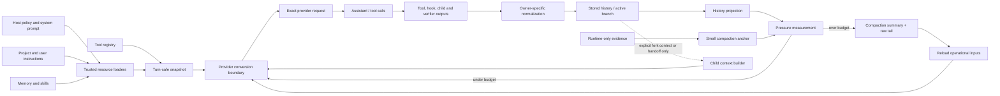

# Context 构造与 Compaction：下一轮模型到底看到什么？

## 1. Research question

Context 机制面对的痛点比“对话太长”更具体。同一轮请求会同时接收 host policy、项目指令、skills、tool schemas、历史消息、tool results、verification feedback 与协作结果；这些材料的来源、信任等级、生命周期和压缩方式并不相同。Forge 现在已经把 prompt assembly、Observation projection、RuntimeState 与 compaction 分开，但 active model context 仍是进程内投影，不能从 trace 恢复。[CODE][Forge@75714f2:src/context/promptAssembly.ts:L131-L188] [CODE][Forge@75714f2:src/context/compaction.ts:L138-L196] [DOC][Forge@75714f2:docs/tutorial/c06-session-trace.md:L55-L62]

本文研究两个问题：一次 provider request 的 context 应如何从不同 owner 的材料构造；发生 compaction、resource reload、parent-child delegation 或进程重启时，哪些信息应保留原文，哪些可以总结，哪些必须重新加载，哪些只能留在 runtime evidence 中。

## 2. Scope and versions

研究快照固定在 [SOURCES](SOURCES.md) 中：Claude `430502e`、Pi `977ec833`、Forge `75714f2`。Pi 的主要对象是 shipped `pi-coding-agent`，不是仍在演进的 `AgentHarness`。Forge 的边界是已经集成到 `c17c` 的 tutorial harness。[DOC][Pi@977ec833:packages/coding-agent/README.md:L491-L505] [DOC][Forge@75714f2:README.md:L3-L15]

Claude 证据必须额外降权。本地仓库自述为从 leaked source 修复的可运行副本，并列出 stub 与启动路径修复；它能证明该 snapshot 的机制，不能单独证明当前官方 Claude Code 产品行为。[DOC][Claude@430502e:README.en.md:L1-L8] [DOC][Claude@430502e:README.en.md:L189-L200]

本文只研究 context construction、pressure measurement、compaction、reload 与 isolation。模型质量、产品功能数量、在线服务行为和未在本地 snapshot 中出现的实现不在范围内。没有运行真实 provider，也不把文档里的未来设计当作 shipped guarantee。

## 3. Terminology

以下四个对象必须分开：

| 术语 | 定义 | 典型 owner | 不能据此推出 |
| --- | --- | --- | --- |
| Stored history | 已发生消息、branch/compaction entry 或内存 round segment 的保存形态。它可以比当前请求包含更多分支和旧消息。 | session/history owner | 下一轮模型会看到全部内容 |
| Active model context | 当前 provider request 中实际发送的 `instructions`、messages/input 与 tool schemas。 | loop + context builder + provider adapter | 磁盘上存在的材料已自动进入模型 |
| User-visible transcript | TUI/CLI 给人看的消息、摘要和状态提示。 | product UI / transcript adapter | 显示文本就是 canonical storage 或精确 provider payload |
| Runtime-only evidence | session metadata、RuntimeState、trace fields、usage、trust decision、source path、hash 等运行证据。 | 对应 domain owner | 模型知道这些字段，或它们都该塞进 prompt |

Pi 直接把 durable `custom` entry 与 model-visible `custom_message` 分成两种类型；这说明“持久化”与“进入 context”是两个独立决定。[CODE][Pi@977ec833:packages/coding-agent/src/core/session-manager.ts:L94-L140] Forge 也只把 `inputHistory.modelInput()`、assembled instructions 与 tool definitions 交给 provider，而不是把 session metadata 或 RuntimeState 整体传入。[CODE][Forge@75714f2:src/core/minimalLoop.ts:L397-L440]

本文还使用三个动作词：

- projection：从 owner data 生成本轮可消费视图，不改变 source of truth。
- compaction：用一个有 provenance 的 summary 替换可压缩历史，同时保留必要 raw tail。
- reload：从 authoritative source 重新读取 instructions、memory、skills 或 tool registry；它不是从 summary 猜回原文。

## 4. Observable behavior

用户能观察到的行为，取决于 context item 落在哪一层：

| 场景 | Stored history | Active model context | User-visible transcript | Runtime-only evidence |
| --- | --- | --- | --- | --- |
| 普通 tool round | 保存或暂存 call/result | 下一轮包含投影后的 result | 可显示 call 与 result 摘要 | 原始参数、status、usage、trace sequence 可另外保存 |
| compaction 前 | 旧 rounds 与 recent tail 都在 | 完整或接近完整 branch | 仍可浏览旧记录 | pressure、trigger、source counts |
| compaction 后 | durable 系统保留旧 entries 与 compaction entry；Forge 当前只改内存 history | summary + recent raw rounds | 显示一次 compaction | source range、omissions、resource revisions |
| resource reload | 历史通常不改 | 下一安全边界重建 prompt/tools | 可提示 reload diagnostics | source path、trust、hash、load errors |
| child run | parent 与 child history 分开 | child 只收显式 task/profile/context | parent 只看到 handoff/terminal result | child session/trace/workspace linkage |
| verification failure | 可作为新 recovery item | 下一轮看到结构化失败反馈 | 用户看到 failed/recovery | verifier status、attempt count、evidence |

Forge 的 verifier 在 candidate answer 后执行；recoverable failure 被格式化成新的 user item，再触发 reactive compaction 检查。[CODE][Forge@75714f2:src/core/minimalLoop.ts:L520-L586] 因而 verification failure 既有 runtime evidence，也可以被显式投影成下一轮 context，但两者不是同一份数据。

## 5. Control flow



顺序有两个不能交换的边界。第一，history transform 必须先于 provider conversion；Pi 的 core 按 `transformContext -> convertToLlm -> Context -> stream` 执行，test 也断言 converter 收到的是已经裁剪后的 messages。[CODE][Pi@977ec833:packages/agent/src/agent-loop.ts:L281-L312] [TEST][Pi@977ec833:packages/agent/test/agent-loop.test.ts:L221-L272] 第二，tool schemas 与 internal messages 需要在 provider boundary 重建，而不是直接透传；Claude snapshot 在调用前构造 schemas、规范化 messages、修复 tool pairing 并裁剪过量 media。[CODE][Claude@430502e:src/services/api/claude.ts:L1231-L1320]

## 6. Data model and ownership

下面的 Context Ledger 是分析 schema，不是建议新增一个集中式 state store。编号在两张表中一致。`Model-visible` 指该 item 可进入当前请求，`runtime-only` 指它默认只由 owner 或 trace 消费。

### Ledger A: source, owner, scope, visibility, persistence

| # | Context item | Source / load | Owner / scope | Visibility | Persistence |
| --- | --- | --- | --- | --- | --- |
| 1 | System prompt | host defaults、custom/append prompt、agent profile；startup 或 reload 时组装 | host/context builder；root 或 child session | Model-visible；transcript 通常只记 summary；source metadata runtime-only | source file/config 可持久；assembled string 通常在内存 |
| 2 | Project/user instructions | `AGENTS.md`、`CLAUDE.md` 等按 cwd/ancestor 查找 | resource loader；global/project/path scope | Model-visible；load path、diagnostic runtime-only | 文件持久，active copy 在内存。Pi 按 global 后 ancestor outer-to-inner 加载。[CODE][Pi@977ec833:packages/coding-agent/src/core/resource-loader.ts:L118-L156] |
| 3 | Persistent/auto memory | user/project memory file或相关 memory attachment；显式选择或 relevance surfacing | memory loader；user/project/agent scope | 被选内容 Model-visible；rank、mtime、截断信息 runtime-only | source 文件持久；Claude 对 surfaced memory 设 line/byte limit。[CODE][Claude@430502e:src/utils/attachments.ts:L2269-L2320] |
| 4 | Skills | metadata catalog 在 prompt；body 按 invocation/read 加载 | skill loader；managed/user/project/plugin/path scope | catalog 与已选 body Model-visible；collision diagnostics runtime-only | `SKILL.md` 持久；Pi catalog 只含 metadata，显式 `/skill:` 再读当前 body。[CODE][Pi@977ec833:packages/coding-agent/src/core/skills.ts:L327-L360] [CODE][Pi@977ec833:packages/coding-agent/src/core/agent-session.ts:L1296-L1325] |
| 5 | Tool definitions | built-in/plugin/MCP registry 在 turn-safe boundary 生成 provider schema | Tool Runtime / extension owner；session 或 agent scope | schema Model-visible；implementation、permission state runtime-only | registry 多为 runtime dependency；active names/revision 才适合持久 |
| 6 | History | user/assistant/tool/summary entries 或 round segments | session/history owner；session branch scope | active branch projection Model-visible；inactive siblings runtime-only/user-inspectable | Pi/Claude JSONL 可持久；Forge 当前 history 在进程内。[CODE][Pi@977ec833:packages/coding-agent/src/core/session-manager.ts:L325-L470] [CODE][Forge@75714f2:src/context/compaction.ts:L138-L196] |
| 7 | File reads/tool results | tool execution result，经 Observation/message normalizer 投影 | tool owner 产生，context projection owner 消费；round scope | 投影内容 Model-visible；raw metadata/usage runtime-only；transcript 可显示摘要 | 若 session 保存 message 则持久；workspace file 仍由 filesystem owner 管理。Forge 使用稳定四行 projection。[CODE][Forge@75714f2:src/context/observation.ts:L3-L29] [CODE][Forge@75714f2:src/context/projection.ts:L15-L24] |
| 8 | Hook output | hook result 只有通过明确的 additional-context/result adapter 才进入 history | hook runner；event/agent/session scope | explicit context 可 Model-visible；普通 hook status runtime-only | 取决于 session/trace owner；不能假定 hook stdout 自动持久 |
| 9 | Subagent/team result | child terminal handoff、mailbox notification、task evidence | child/team protocol owner；parent 只拥有接收后的 projection | handoff/summary Model-visible；child full history/runtime-only and child-owned | child trace/workspace 可单独持久；parent 不复制完整 child transcript |
| 10 | Verification failure | verifier 的 structured result | verification owner；candidate/attempt scope | 格式化 recovery message Model-visible；原始 status/evidence runtime-only；transcript 可显示 | 当前 Forge 写入内存 history 与 trace，不构成跨进程 recovery journal。[CODE][Forge@75714f2:src/core/minimalLoop.ts:L536-L585] |
| 11 | Session metadata | session id、cwd、model、parent edge、workspace binding | session owner；session scope | 默认 runtime-only；不应无条件进入 prompt | Forge `session.json` 持久这些字段，但不嵌入 trace events。[CODE][Forge@75714f2:src/runtime/session.ts:L32-L64] |
| 12 | Runtime state | trace event reducer或当前 loop state | owner-local projection；run/attempt scope | 默认 runtime-only；仅最小 anchor 可进入 compaction source | Forge 当前只在内存 reducer 中更新，随后委托 trace write。[CODE][Forge@75714f2:src/runtime/state.ts:L626-L639] |
| 13 | Compaction summary | summary model或extension生成，绑定 source range/tail anchor | history/session owner；branch scope | Model-visible，通常 user-visible | Pi 将 summary、`firstKeptEntryId`、usage 写成 entry；Forge 当前 summary 仅替换内存 history。[CODE][Pi@977ec833:packages/coding-agent/src/core/session-manager.ts:L69-L92] [CODE][Forge@75714f2:src/context/compaction.ts:L164-L191] |

### Ledger B: budget, compaction, reload, trust, enforcement

| # | Context item | Budget / compaction | Reload behavior | Trust / enforcement |
| --- | --- | --- | --- | --- |
| 1 | System prompt | 不应与旧 conversation 一起被 summary 吞掉；单独计量 assembled size | 在 session start/reload 或明确 safe point 重建 | host policy 最高；custom replacement/append precedence 必须显式。Claude snapshot 区分 override、agent、custom、default 与 append。[CODE][Claude@430502e:src/utils/systemPrompt.ts:L28-L123] |
| 2 | Project/user instructions | 大文件需截断、pointer 或按 path 激活；summary 不能成为唯一副本 | compact/resume 后从 authoritative files 重读并记录 revision | project input 属于 untrusted instructions；load trust 与 tool permission 分开。Pi 的 project trust 不保护 `AGENTS.md`/`CLAUDE.md`，也不是 sandbox。[DOC][Pi@977ec833:packages/coding-agent/docs/security.md:L5-L37] |
| 3 | Persistent/auto memory | 每个 block 与总量都要上限；记录 omitted bytes/lines | 根据 session policy 重载，并检测 mtime/hash drift | user memory、project memory、model-written memory分开标 provenance；写入 memory 需要 action boundary |
| 4 | Skills | catalog 常驻小预算，body progressive disclosure；已调用 skill在 compact 后重附或重读 | reload 后重建 catalog；invoked skill 要么带 hash 重读，要么保留已用版本 | source scope、collision、invocation eligibility 与 code execution trust 分开 |
| 5 | Tool definitions | schema 独立计入 request pressure；不由 conversation summary压缩 | turn-safe refresh，不能在 in-flight request 中突变 | registry/trust 决定 exposure；permission 决定 call。Claude 在 turns 间 refresh tools。[CODE][Claude@430502e:src/query.ts:L1659-L1671] |
| 6 | History | 按完整 round/entry group压缩；保留 pinned task 与 recent raw tail | resume 时从 active leaf重建 | malformed parent、tool pairing、branch selection 必须验证，不能靠模型补洞 |
| 7 | File reads/tool results | per-result cap、aggregate cap、binary/media policy；老结果可 summary/pointer化 | summary 只保存发现，必要时由 tool重新读取 workspace truth | tool output 是 untrusted data；不能自动提升为 system instruction |
| 8 | Hook output | explicit context 才占 context budget；普通 telemetry 不占 | reload hooks不等于重放旧 hook output | hook trust、timeout、failure policy 与是否 Model-visible 分开。Claude 的 SubagentStart additional context被包装成 attachment message。[CODE][Claude@430502e:src/tools/AgentTool/runAgent.ts:L530-L555] |
| 9 | Subagent/team result | 只注入 bounded handoff/evidence pointer，不复制 full transcript | child重启应重新建立依赖，不把旧进程状态当活状态 | parent验证来源/session/task binding；child不能靠文本扩大能力 |
| 10 | Verification failure | 保留最近失败与 acceptance；重复失败可折叠为结构化摘要 | resume 要从 durable attempt/result重建；当前 Forge 尚未做到 | verifier是 enforcement owner；模型只获得可操作 feedback，不能改写 verdict |
| 11 | Session metadata | 不进入普通 history budget；只选必要字段投影 | resume先验证 schema、cwd/workspace binding | metadata parser fail closed；路径不能成为越界授权 |
| 12 | Runtime state | 只给 compactor一个小 anchor，禁止 dump 全状态 | 从 owner snapshot/event reducer重建，而不是从 prose summary猜 | projection不是 source of truth；Forge anchor只含 status、round、task/tool/verifier/problem摘要。[CODE][Forge@75714f2:src/context/compaction.ts:L227-L267] |
| 13 | Compaction summary | summary 本身有大小、内容与 source coverage检查；recompaction替换旧 summary，不叠加 | reload operational inputs，再把 summary作为 history checkpoint | summary是 model-generated、低于 host policy；空 summary fail closed，缺 headings应记录 diagnostics |

## 7. Invariants

1. **Active context is a projection, not storage.** Stored history 可以保留 inactive branches、raw metadata 与旧 entries；一次 request 只取 active branch、current instructions、allowed tools 与明确 projection。[CODE][Pi@977ec833:packages/coding-agent/src/core/session-manager.ts:L418-L470]
2. **Provider conversion is the last semantic boundary.** Context transforms、compaction 与 branch selection先完成，provider adapter随后进行 schema/message conversion；否则 budget measurement 与实际 payload会分叉。[CODE][Pi@977ec833:packages/agent/src/agent-loop.ts:L281-L312] [TEST][Pi@977ec833:packages/agent/test/agent-loop.test.ts:L221-L272]
3. **Compaction operates on complete ownership units.** 一个 tool call/result pair或一个 Forge round segment不能只删一半。Forge test证明旧 round被一个 summary替换，recent rounds仍成组保留。[TEST][Forge@75714f2:test/context/compaction.test.ts:L106-L136]
4. **Operational context is reconstructed, not trusted to prose.** Tool catalog、instructions、memory/skills、plan与live dependencies必须重载或按 revision重附。Claude snapshot在 full compact 后重建 file、agent、plan、skill、tool 与 MCP attachments。[CODE][Claude@430502e:src/services/compact/compact.ts:L517-L620]
5. **Parent-child context crosses only an explicit boundary.** Fresh child不自动继承 parent full history；fork context、task、profile、read cache或handoff必须逐项声明。Claude snapshot可选择过滤后的 fork messages并创建 agent-specific context；Forge child另建 session/trace并从 child task启动。[CODE][Claude@430502e:src/tools/AgentTool/runAgent.ts:L368-L410] [CODE][Claude@430502e:src/tools/AgentTool/runAgent.ts:L697-L714] [CODE][Forge@75714f2:src/extensions/childSessions.ts:L160-L225]
6. **Pressure unit and request unit must be named.** Character estimate、token estimate、provider-reported usage与schema overhead不是同一个数。Forge当前明确用 24k/36k character budgets，而不是 tokenizer window。[CODE][Forge@75714f2:src/context/compaction.ts:L84-L89]

## 8. Failure semantics

### Existing-test before/after analysis

Forge 的 deterministic compaction test 给出可检查的 before/after：

```text
before: pinned task + round 1(call,result) + round 2(call,result) + round 3(call,result)
after:  pinned task + one compaction summary + round 2(call,result) + round 3(call,result)
```

test 还证明第二次 compact 会替换第一次 summary，而不是不断叠加 summaries；source builder记录被截断字符数，并把 recent raw round只列入 index、不混进待总结正文。[TEST][Forge@75714f2:test/context/compaction.test.ts:L59-L103] [TEST][Forge@75714f2:test/context/compaction.test.ts:L106-L178] 这个 test 证明 in-memory projection invariant，不证明 process restart 后仍能恢复同一 context。

主要 failure semantics 如下：

| Failure | 当前证据 | 合理处理 |
| --- | --- | --- |
| summary为空 | Forge标为 invalid并抛错；hard budget后仍超限也fail closed。[CODE][Forge@75714f2:src/context/compaction.ts:L203-L217] [CODE][Forge@75714f2:src/core/minimalLoop.ts:L710-L752] | 保留旧history，不提交空checkpoint；返回可定位failure event |
| summary缺少固定heading | Forge接受非空summary但记录missing headings。[TEST][Forge@75714f2:test/context/compaction.test.ts:L181-L195] | 标usable-with-diagnostics；不要伪称完整覆盖 |
| overflow反复重试 | Pi shipped coding-agent只允许一次compact-and-retry。[CODE][Pi@977ec833:packages/coding-agent/src/core/agent-session.ts:L1979-L2011] [TEST][Pi@977ec833:packages/coding-agent/test/suite/agent-session-compaction.test.ts:L305-L329] | 有界重试，保留原错误entry，停止自动循环 |
| instructions/skills在compact后丢失 | prose summary无法可靠恢复精确policy | 用source revision/hash重载；重载失败则阻止下一请求或显式降级，不能静默猜测 |
| provider payload超出本地estimate | schemas、media与adapter normalization可能改变真实size | 在provider boundary记录实际input usage；下一轮校准，不把estimated chars称为tokens |
| parent/child context泄漏 | parent full history或高权限instructions被无意复制 | child builder使用allowlist；handoff只回传bounded result与evidence pointers |
| project instruction含prompt injection | trust只决定是否加载某些资源，不能净化内容 | provenance label + action governance；tool output/project docs永不自动升级为host policy |

## 9. Claude Code

Claude snapshot 把 prompt precedence做得很细：custom system prompt可以完全替换default/system context，append prompt另行追加；user context则从 memory files聚合 `CLAUDE.md` 与日期信息。[CODE][Claude@430502e:src/utils/queryContext.ts:L30-L74] [CODE][Claude@430502e:src/context.ts:L152-L188]

它的skills来自managed、user、project、additional与legacy sources，并按resolved path first-wins去重；nested skill discovery会尊重gitignore，越靠近目标文件的目录优先。[CODE][Claude@430502e:src/skills/loadSkillsDir.ts:L625-L763] [CODE][Claude@430502e:src/skills/loadSkillsDir.ts:L853-L915] 这套机制适合平台化产品，但Forge不需要复制所有source classes。

compaction前先执行PreCompact hooks；成功后清read-file caches，再重新附上files、async agents、plan、invoked skills、tool/agent/MCP deltas和SessionStart hook messages。[CODE][Claude@430502e:src/services/compact/compact.ts:L387-L424] [CODE][Claude@430502e:src/services/compact/compact.ts:L517-L620] summary agent被禁止调用tools，forked path也被限制为一turn。[CODE][Claude@430502e:src/services/compact/compact.ts:L1125-L1133] [CODE][Claude@430502e:src/services/compact/compact.ts:L1188-L1200]

Forge可借鉴的是summary与operational reload的分工。这个snapshot的`package.json`没有test script，证据调查也未找到可交叉验证这些路径的常规tests；本文把confidence降为Medium。[INF] [CODE][Claude@430502e:package.json:L1-L12]

## 10. Pi Agent

Pi把通用loop和coding-agent host分开。core只要求 `transformContext` 与 `convertToLlm`；coding-agent converter再处理bash、custom、branch summary、compaction summary和context exclusion。[CODE][Pi@977ec833:packages/agent/src/agent-loop.ts:L281-L312] [CODE][Pi@977ec833:packages/coding-agent/src/core/messages.ts:L140-L195]

`DefaultResourceLoader.reload()`重新解析settings/packages/extensions/skills/prompts/themes/context files与system prompt files。`AgentSession`用当前tool names、snippets、skills、context files、custom/append prompt重建system prompt，并只在next-turn safe point刷新system prompt、tools、model和thinking level。[CODE][Pi@977ec833:packages/coding-agent/src/core/resource-loader.ts:L387-L545] [CODE][Pi@977ec833:packages/coding-agent/src/core/agent-session.ts:L520-L540] [CODE][Pi@977ec833:packages/coding-agent/src/core/agent-session.ts:L1021-L1055]

Pi shipped coding-agent没有一个名为“long-term memory”的独立retrieval subsystem。可持久知识由session entries、context files、skills、prompt templates和extension custom entries组合而成；这是从exhaustive loaders/types得出的边界，不应改写成“Pi没有memory能力”。[INF] [CODE][Pi@977ec833:packages/coding-agent/src/core/session-manager.ts:L94-L140] [CODE][Pi@977ec833:packages/coding-agent/src/core/resource-loader.ts:L387-L545]

manual compaction先abort当前run，允许extension取消或提供summary，再append compaction entry并重建agent messages；overflow recovery有一次重试上限。[CODE][Pi@977ec833:packages/coding-agent/src/core/agent-session.ts:L1778-L1924] [CODE][Pi@977ec833:packages/coding-agent/src/core/agent-session.ts:L1942-L2042]

## 11. Forge Harness

Forge当前边界很小：`.forge/memory.md` 与排序后的skills在session构造时加载；prompt固定按base rules、tool rules、memory、skill catalog、selected skill bodies排序。只有leading slash invocation选择skill body，没有auto-router。[CODE][Forge@75714f2:src/context/promptAssembly.ts:L45-L86] [CODE][Forge@75714f2:src/context/promptAssembly.ts:L88-L188]

history按round分段。soft budget之前自动compact，新增context越过hard budget后reactive compact；summary call没有tools。compaction source含task、小型RuntimeState anchor、recent-history index与trimmed older history，并记录source/omission counts。[CODE][Forge@75714f2:src/core/minimalLoop.ts:L687-L853] [CODE][Forge@75714f2:src/context/compaction.ts:L99-L136]

当前budget是character estimate；instructions/memory/skill bodies不会随每次request reload；summary与history只在进程内；trace只保存prompt section names/counts，不保存完整assembled prompt。因此它能解释本次run如何compact，不能精确重建进程死亡前的active context。[CODE][Forge@75714f2:src/core/minimalLoop.ts:L409-L439] [DOC][Forge@75714f2:docs/tutorial/c06-session-trace.md:L55-L62]

## 12. Comparative analysis

| Dimension | Claude snapshot | Pi shipped coding-agent | Forge current |
| --- | --- | --- | --- |
| Prompt sources | 多级precedence、memory attachments、dynamic skills/MCP | resource loader统一reload，context files + skills + custom prompt | base/tool rules + one project memory + explicit skills |
| History owner | query/session message chain与多种compact projection | v3 JSONL tree + active leaf + compaction entry | in-memory round segments |
| Skill disclosure | 多source catalog、dynamic discovery、invoked skill reattachment | metadata catalog，read或`/skill:`加载body | leading slash选择，body直接进入assembled prompt |
| Pressure | token estimates、tool-result budgets、多级compact gates | provider usage/window + message estimates | fixed character soft/hard budget |
| After compact | summary + operational attachments + cache cleanup | durable summary entry + retained tail + rebuilt messages | one in-memory summary + recent raw rounds |
| Reload | tool refresh between turns；部分module cache reset | full resource reload与next-turn snapshot | active session无resource reload |
| Parent-child | 可选fork messages，agent-specific tools/context/sidechain | core无native subagent；扩展自行定义 | fresh child session/trace，显式handoff |
| Trust | source-specific policies，细节多但本snapshot provenance较弱 | project trust是pre-load guard，不是sandbox | plugin/session trust与tool governance已有，prompt data仍需provenance |

比较的落点是 context owner、projection、provider boundary 与 durable recovery的分工。Claude倾向在compaction后重附operational state；Pi把resource reload放在host；Forge已经有最小projection与compaction，但缺少可重建manifest。

## 13. Forge design decision

当前c17c应保留现状，不为了“将来可能恢复”提前扩张。只有进入c18、跨进程context重建已经成为具体痛点时，才建议采用一个小型、request-scoped `Context Manifest`；它不是中央 `src/state/`。manifest只记录本轮context如何被构造，不接管各domain的source of truth。建议字段包括：session/attempt/round、active history head、compaction checkpoint id、每个resource的source kind/path/hash/trust、tool catalog revision、provider adapter/model、pressure unit与before/after值、omissions，以及最终input item/tool counts。[DOC][Forge@75714f2:docs/02-tutorial-roadmap.md:L94-L116]

具体决策如下：

1. History仍由session owner管理；RuntimeState、TaskGraph、workspace、verifier仍各自持有事实。manifest只保存references和construction receipt。[INF] [CODE][Forge@75714f2:src/runtime/state.ts:L626-L639] [CODE][Forge@75714f2:src/runtime/session.ts:L32-L64]
2. Compaction entry持久化 `sourceEntryIds/sourceHead`、summary、retained-tail anchor、pressure与resource revisions。整round替换规则沿用现有`InputHistoryManager`。[INF] [CODE][Forge@75714f2:src/context/compaction.ts:L138-L196]
3. Resume/compact后重新加载system prompt、project instructions、memory与skills。hash一致时可复用；hash变化时记录drift，并由policy决定接受新版本还是要求用户确认。summary不保存这些文件的替代副本。[INF] [CODE][Pi@977ec833:packages/coding-agent/src/core/resource-loader.ts:L387-L545] [CODE][Claude@430502e:src/services/compact/compact.ts:L517-L620]
4. Provider adapter接收已经定型的internal context，返回actual usage/capability diagnostics。pressure同时记录local estimate与provider-reported usage，禁止用一个字段混称tokens。[INF] [CODE][Pi@977ec833:packages/agent/src/agent-loop.ts:L281-L312] [CODE][Forge@75714f2:src/context/compaction.ts:L84-L89]
5. Child只获得profile allowlist、delegated task、必要resource revisions与显式fork/handoff。parent只接收bounded terminal result和evidence pointer，不合并child full history。[INF] [CODE][Forge@75714f2:src/extensions/childSessions.ts:L160-L225]

这仍然是一个tutorial-sized mechanism：一份construction receipt、一个durable compaction checkpoint、一个reload boundary。它不提前实现向量检索、全局memory service或跨provider prompt optimizer。

## 14. Production implications

- Reproducibility：只保存summary不够；需要知道哪版instructions、skills与tool catalog构造了请求。source hash比复制所有内容更便于diff，但敏感user memory不能无条件写入trace。
- Security：project docs、tool output、hook output与model-written memory都可能含prompt injection。provenance与trust决定“从哪来”，governance决定“能做什么”，两者不能合并。
- Cost and latency：progressive disclosure降低常驻context；reload与hashing增加I/O。可以按revision缓存，但cache key必须包含cwd、trust scope和source version。
- Multi-provider：provider conversion会修复、过滤或拒绝不同message/schema形态。manifest应记录adapter与capability decision，而不是宣称internal context等于wire payload。
- Privacy：file reads、memory与child results可能含secret。trace默认记录摘要、hash与omission metadata；exact payload需要单独retention/encryption policy。
- Operations：compaction model call本身会失败或被中断。只有durable compaction entry写入后，新的active context才算committed；否则保留旧head重试。

## 15. Evidence confidence and open questions

| Area | Confidence | Reason |
| --- | --- | --- |
| Pi transform/conversion、resource reload、compaction | High | direct code与focused tests一致 |
| Forge prompt/Observation/compaction before-after | High | direct code与deterministic tests一致 |
| Claude prompt/compact reconstruction | Medium | direct repaired source可读，但provenance较弱且缺常规tests |
| “Pi没有first-class memory subsystem” | Medium | exhaustive local loaders/types支持absence inference；不是产品能力断言 |
| Forge cross-process context reconstruction | Unknown/currently absent | trace不是full request dump，history/summary没有loader |

仍需回答：

1. Forge的resource drift默认应接受、冻结旧版，还是请求确认？
2. pressure应以provider tokenizer、reported usage还是conservative hybrid为enforcement值？
3. 哪些tool results必须保留raw content，哪些只保存workspace pointer/hash？
4. compaction summary的schema要不要从headings升级为typed sections？
5. child是否允许继承parent某段raw history；若允许，谁选择并记录source range？

## 16. Interview takeaway

### 30 秒回答

Context不是conversation history的同义词。系统要把stored history、active model context、user transcript和runtime evidence分开；每轮先从不同owner构造context，再在provider boundary转换。Compaction只压缩可替代的旧history，instructions、skills、tools、runtime anchors和workspace facts必须按revision重载。Parent与child通过显式task/handoff交换bounded context，不能默认复制整段history。

### 3 分钟深挖

我会先画一份Context Ledger，为system prompt、project instructions、memory、skills、tool definitions、history、tool results、hook/child/verifier output、session metadata、RuntimeState和compaction summary标注source、owner、scope、visibility、persistence、budget、reload与trust。然后定义三个边界：history projection选择active branch；compaction以完整round为单位替换旧history并保留raw tail；provider adapter最后做wire conversion并回报actual usage。恢复时读取durable compaction checkpoint，再按hash重载instructions/memory/skills/tools，不能从summary猜operational state。Forge现有实现已经证明round compaction与fail-closed hard budget；等c18出现跨进程重建痛点时，再增加durable checkpoint和request-scoped manifest。

### 追问

1. 为什么RuntimeState不应该整体放进每轮prompt？
2. compaction后如何证明tool call/result没有被拆开？
3. resource file在session中途变化时，resume应采用哪一版？
4. provider-reported tokens与本地character estimate冲突时，谁负责决策？
5. 如何让child获得足够背景，又不继承parent的权限与敏感history？
