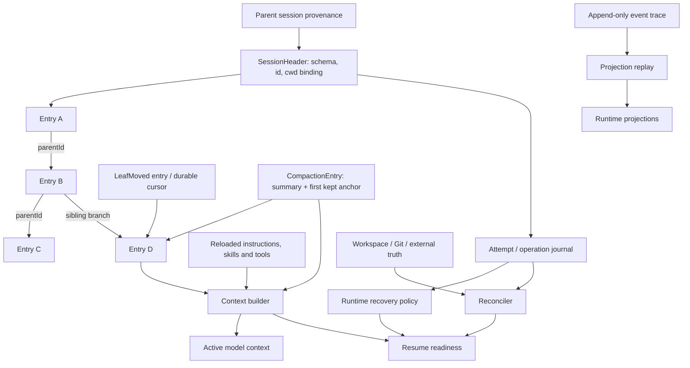

# Session 持久化与分支：Resume 能恢复到哪一层？

## 1. Research question

迫使 session persistence 存在的痛点是：进程退出后，“用户说过什么”“runtime 正执行到哪里”“workspace 已经发生什么副作用”会立刻分叉。保存 messages 可以恢复一段 conversation，却不能证明 provider request、tool call、Git integration 或 mailbox delivery能从中断点安全继续。Forge当前把 `session.json`、`trace.jsonl`、TaskGraph和workspace metadata分别保存，但明确不实现resume、event replay与crash reconciliation。[CODE][Forge@75714f2:src/runtime/session.ts:L86-L170] [DOC][Forge@75714f2:README.md:L108-L112]

本文研究：session identity、append log、tree/branch/fork、compaction checkpoint与cwd/workspace binding应怎样建模；resume时如何把conversation persistence、runtime recovery、workspace reconciliation、event replay和context reconstruction拆成五个可验证步骤。

## 2. Scope and versions

研究版本固定在 [SOURCES](SOURCES.md)：Claude `430502e`、Pi `977ec833`、Forge `75714f2`。Claude来源是repaired leaked-source snapshot，证据只约束该commit。[DOC][Claude@430502e:README.en.md:L1-L8] Pi以当前shipped coding-agent的`SessionManager`/`AgentSessionRuntime`为主；`packages/agent`下的新`Session`与`AgentHarness`只作方向对照。其文档也明说部分facade仍planned、auto-compaction/retry decision尚未实现。[DOC][Pi@977ec833:packages/agent/docs/agent-harness.md:L1-L20] [DOC][Pi@977ec833:packages/agent/docs/agent-harness.md:L218-L236]

本文把message replay限制为conversation/projection重建；现有证据不支持exactly-once execution。本文也不为Forge实现c18，design decision都停在设计study层。

## 3. Terminology

| 术语 | 精确定义 | 成功条件 |
| --- | --- | --- |
| Conversation persistence | 保存user/assistant/tool/summary与branch关系，使已完成对话可重新读取 | active branch能被确定性重建 |
| Context reconstruction | 从active branch、latest compaction、resources与tool catalog构造下一次model input | 重建的context有source revision与可解释omission |
| Runtime recovery | 识别中断的Attempt、provider request、tool call、queue与pending write，并选择interrupt/retry/continue policy | 不把未知状态误判为完成或安全重跑 |
| Workspace reconciliation | 比较session intent/receipt与filesystem、Git、进程或外部服务的真实状态 | side effect与owner record重新对齐 |
| Event replay | 按顺序reduce durable events以重建projection | reducer得到可验证state；不自动重做side effects |
| Resume | 打开既有session并创建兼容的runtime dependencies，再从durable boundary继续 | identity、cwd、schema、active leaf与dependencies通过验证 |
| Branch | 在同一history tree选择较早parent并继续，旧siblings保留 | leaf selection持久且下一append的parent正确 |
| Fork / clone | 创建新session identity；fork从指定较早点，clone复制当前active branch | provenance指向source session/entry，两个session后续独立 |

Pi的current coding-agent schema说明了conversation persistence的范围：entry union有messages、model/thinking changes、compaction、branch summary、custom data与metadata，但没有provider-request-start或tool-call-start journal。[CODE][Pi@977ec833:packages/coding-agent/src/core/session-manager.ts:L30-L172] completed message在`message_end`时才append。[CODE][Pi@977ec833:packages/coding-agent/src/core/agent-session.ts:L618-L665] 因此从这些entries恢复messages，不等于恢复一个in-flight tool execution。[INF] [CODE][Pi@977ec833:packages/coding-agent/src/core/session-manager.ts:L143-L156] [CODE][Pi@977ec833:packages/coding-agent/src/core/agent-session.ts:L624-L643]

## 4. Observable behavior

### Branch / fork / resume matrix

| Operation | Session identity / file | Selected history | Workspace/process effect | Durable guarantee | 明确不保证 |
| --- | --- | --- | --- | --- | --- |
| Continue | 通常沿用最近或已选session | 该session的active leaf | 新进程/runtime重新建立 | 取决于resume loader | 不恢复旧process stack或in-flight stream |
| Resume | 同一session identity并采用既有file | loader选定leaf，应用compaction/context projection | abort/settle旧runtime后以session cwd创建新runtime。Pi执行此顺序。[CODE][Pi@977ec833:packages/coding-agent/src/core/agent-session-runtime.ts:L196-L224] | completed entries与可重建resources | 不自动安全重跑未完成tool |
| Same-file branch / tree | 同一file | leaf移到旧entry；下一append形成sibling | 同一cwd/runtime | **Pi current shipped：leaf move本身只在内存；新append后branch path才落盘。**[CODE][Pi@977ec833:packages/coding-agent/src/core/session-manager.ts:L1354-L1374] | 在没有新append前关闭重开仍保持所选leaf |
| Fork | 新identity、新file，保存`parentSession`或`forkedFrom` | 指定entry之前/之处的path | 创建fresh runtime；workspace policy另算 | copied path与provenance | 原session的live process、locks、in-flight operations随fork复制 |
| Clone | 新identity、新file | 当前active branch | fresh runtime | 当前branch的conversation副本 | inactive siblings、process state或external side effects自动克隆 |
| Event replay | identity不必变化 | 读取events而非messages | 只重建projection | deterministic reducer范围内的state | replay messages/events就是runtime recovery |

Pi文档清楚区分同文件`/tree`、新文件`/fork`与复制当前branch的`/clone`。[DOC][Pi@977ec833:packages/coding-agent/docs/sessions.md:L69-L127] Claude snapshot的branch command则分配新session ID、重写parent chain并写入新file，然后resume到fork。[CODE][Claude@430502e:src/commands/branch/branch.ts:L57-L164] [CODE][Claude@430502e:src/commands/branch/branch.ts:L222-L295]

从用户视角看，resume成功后“聊天还在”只是第一层。若旧cwd不存在、Git已变化、tool副作用无receipt、最后一行JSONL损坏或active leaf未持久化，runtime必须显示degraded/interrupted/reconciliation-needed，而不是静默继续。

## 5. Control flow

一个关键关系是：compaction entry不应删除full history的物理证据，而应改变active context projection。Pi沿current leaf走parent chain，找到latest compaction后输出compaction entry、`firstKeptEntryId`起的保留entries和compact之后的新entries；更旧的summarized entries仍在session tree中。[CODE][Pi@977ec833:packages/coding-agent/src/core/session-manager.ts:L325-L470]

Resume流程应按 `parse/validate -> select leaf -> reconstruct conversation -> recreate runtime dependencies -> reconcile workspace/operations -> construct context -> accept new input` 执行。Event replay只参与projection reconstruction，绝不能越过reconciler直接重放tool。

## 6. Data model and ownership

| Data / operation | Current evidence | Owner | Design requirement |
| --- | --- | --- | --- |
| Identity and schema | Pi header含version、id、timestamp、cwd、optional parentSession；entries含id/parentId/timestamp。[CODE][Pi@977ec833:packages/coding-agent/src/core/session-manager.ts:L30-L51] | session store | stable session/root/attempt IDs；schemaVersion必须先验证 |
| cwd binding | Pi runtime从header cwd重建services；Forge metadata区分baseCwd、execution cwd与workspace。[CODE][Pi@977ec833:packages/coding-agent/src/core/agent-session-runtime.ts:L209-L220] [CODE][Forge@75714f2:src/runtime/session.ts:L32-L44] | session + workspace owners | canonical path、repo identity、base commit/branch与missing-path policy |
| Append log | Pi current同步append JSONL，第一次assistant出现后materialize；Claude按file queue batch append。[CODE][Pi@977ec833:packages/coding-agent/src/core/session-manager.ts:L1015-L1049] [CODE][Claude@430502e:src/utils/sessionStorage.ts:L606-L686] | session writer | serialized append、flush boundary、partial-tail recovery与checksum policy |
| Mutable metadata | Pi name/labels通过新entries表达；Claude title/tag/worktree等也是append entries或last-wins metadata。[CODE][Pi@977ec833:packages/coding-agent/src/core/session-manager.ts:L110-L153] [CODE][Claude@430502e:src/utils/sessionStorage.ts:L1157-L1200] | metadata projection | 不原地改旧conversation entry；明确last-wins和target ID |
| Message/tool entries | Pi在`message_end`保存user/assistant/toolResult；Claude progress不参与transcript chain。[CODE][Pi@977ec833:packages/coding-agent/src/core/agent-session.ts:L624-L643] [CODE][Claude@430502e:src/utils/sessionStorage.ts:L128-L156] | conversation owner | message完成不代表provider/tool operation完成；stable call ID与pairing另记 |
| Branch/tree | Pi每个entry的parentId形成tree，orphans作为额外roots返回。[CODE][Pi@977ec833:packages/coding-agent/src/core/session-manager.ts:L1305-L1348] | session tree index | leaf selection必须是durable event；cycle/dangling/duplicate policy fail closed |
| Compaction | entry含summary、first-kept anchor、tokens/usage；context builder选择latest compaction | session/history owner | summary与full-history relation可重放；commit entry后才切换active projection |
| Parent-child | Forge child metadata只有immediate parent call/session/profile，root graph binding另存。[CODE][Forge@75714f2:src/runtime/session.ts:L19-L44] | session/coordination owner | parent edge、root ID、delegated task与workspace provenance分别保存 |
| Runtime/process | Pi切换session先abort并settle outgoing run，再shutdown/dispose旧runtime。[CODE][Pi@977ec833:packages/coding-agent/src/core/agent-session-runtime.ts:L167-L178] | runtime owner | live process、AbortController、open sockets不可序列化；resume创建新实例 |
| Workspace | Forge worktree binding保存base branch/commit/path，并在创建前验证Git root、clean base与branch/path冲突。[CODE][Forge@75714f2:src/runtime/workspace.ts:L100-L159] | workspace/Git owner | resume重新检查existence、HEAD、dirty state与receipts，不能只信metadata |
| Trace and replay | Forge sequence从进程内1开始并append JSONL。[CODE][Forge@75714f2:src/runtime/traceRecorder.ts:L11-L27] | trace owner | replay要有schema、dedup key、snapshot watermark；side effects由reconciler处理 |
| Attempt/operation journal | Pi current coding-agent与Forge current都没有完整journal；Pi durable-harness doc将其列为future minimum。[DOC][Pi@977ec833:packages/agent/docs/durable-harness.md:L83-L116] | runtime/recovery owner | start/finish/interrupted、queue consumption、provider/tool boundaries可reduce |
| Migration | Pi open时根据header version执行v1→v2→v3 migration并rewrite。[CODE][Pi@977ec833:packages/coding-agent/src/core/session-manager.ts:L277-L295] [CODE][Pi@977ec833:packages/coding-agent/src/core/session-manager.ts:L895-L922] | schema owner | migration先备份/validate；不认识的future version拒绝或read-only打开 |

这张表刻意保留多个owner。Session log不应吞并TaskGraph、Git、mailbox和process lifecycle；它只记录可序列化边界与references，恢复时由各owner重建projection或执行reconciliation。

## 7. Invariants

1. **Entry identity and parent relation are immutable.** Branch通过新entry或durable leaf event改变active path，不修改旧message；inactive siblings仍可检查。[CODE][Pi@977ec833:packages/coding-agent/src/core/session-manager.ts:L1296-L1303]
2. **Active context is one validated root-to-leaf path.** Tree全量存储不意味着所有siblings都进入model context。Pi test证明branch后context只含current path。[TEST][Pi@977ec833:packages/coding-agent/test/session-manager/tree-traversal.test.ts:L406-L425]
3. **A leaf move is durable only after a persisted leaf record or descendant append.** In-memory cursor变化不能当作session mutation已经committed。[CODE][Pi@977ec833:packages/coding-agent/src/core/session-manager.ts:L958-L977] [CODE][Pi@977ec833:packages/coding-agent/src/core/session-manager.ts:L1354-L1374]
4. **Completed conversation entries and completed operations are different facts.** Provider stream或tool side effect可能发生在最后一个durable `message_end`之后；resume默认mark interrupted，不能自动假定完成。[DOC][Pi@977ec833:packages/agent/docs/durable-harness.md:L118-L152]
5. **Event replay never performs external actions.** 它只reduce projections；tool/Git/mailbox的未知结果交给owner-specific reconciler。[DOC][Forge@75714f2:docs/tutorial/c17c-coordination-completion-protocol.md:L401-L407]
6. **Resume recreates runtime dependencies.** Tool implementations、providers、extensions、resource loaders与hooks不是session payload；host必须注册兼容版本后才能继续。[DOC][Pi@977ec833:packages/agent/docs/durable-harness.md:L7-L25]
7. **Workspace truth outranks session claims.** recorded cwd/commit/receipt是预期，filesystem/Git/external service是实际；二者不一致时状态是reconciliation-needed，不是ready。[INF] [CODE][Forge@75714f2:src/runtime/workspace.ts:L100-L159] [DOC][Forge@75714f2:docs/tutorial/c17c-coordination-completion-protocol.md:L391-L407]

## 8. Failure semantics

至少以下十种crash/corruption场景必须有明确结果：

| Scenario | Current behavior / evidence | Forge recovery decision |
| --- | --- | --- |
| 1. JSONL最后一行partial write | Pi parser跳过malformed lines。[CODE][Pi@977ec833:packages/coding-agent/src/core/session-manager.ts:L298-L313] | 只允许忽略最后一个unterminated record；中段损坏要quarantine并报告offset |
| 2. non-empty file没有valid header | Pi拒绝且不覆盖原文件。[CODE][Pi@977ec833:packages/coding-agent/src/core/session-manager.ts:L895-L927] | fail closed，保留原件，提供read-only repair report |
| 3. duplicate entry ID | Pi current `_buildIndex()`对Map重复set，后值覆盖index而physical entries仍都在；没有显式duplicate rejection。[INF] [CODE][Pi@977ec833:packages/coding-agent/src/core/session-manager.ts:L958-L977] | loader拒绝ambiguous active path；repair不能静默任选一个 |
| 4. cycle或dangling parent | Claude parent walk检测cycle后返回partial chain，并有parallel tool-result repair pass。[CODE][Claude@430502e:src/utils/sessionStorage.ts:L2069-L2205] | mark degraded；只允许inspect/export，不能直接continue |
| 5. same-file leaf move后、append前crash | Pi current cursor没写盘；reopen按physical last entry设leaf。[CODE][Pi@977ec833:packages/coding-agent/src/core/session-manager.ts:L958-L977] [CODE][Pi@977ec833:packages/coding-agent/src/core/session-manager.ts:L1360-L1374] | leaf move自身append一条`leaf_moved` event并flush后再向UI确认 |
| 6. provider response已到、assistant entry未写 | response会丢失；current coding-agent没有request result journal。[INF] [CODE][Pi@977ec833:packages/coding-agent/src/core/agent-session.ts:L618-L665] | attempt标interrupted；不伪造assistant message，可由用户重试 |
| 7. tool side effect发生、tool result未写 | durable design也指出external effect可能已发生，non-idempotent tool不能默认重跑。[DOC][Pi@977ec833:packages/agent/docs/durable-harness.md:L169-L180] | 用stable call ID和reconciler检查；unknown保持blocked |
| 8. summary生成、compaction entry未写 | summary response存在于内存但active checkpoint未commit。[DOC][Pi@977ec833:packages/agent/docs/durable-harness.md:L182-L186] | 旧history仍canonical；可重新summary，不能只切换leaf |
| 9. trace append后crash / restart sequence重置 | Forge recorder sequence只在内存；没有resume scan。[CODE][Forge@75714f2:src/runtime/traceRecorder.ts:L11-L27] | 新Attempt有独立ID；append前读取watermark或使用entry UUID去重 |
| 10. workspace side effect成功、receipt未写 | Forge明确留下Git commit/cherry-pick成功而TaskGraph receipt旧的window。[DOC][Forge@75714f2:docs/tutorial/c17c-coordination-completion-protocol.md:L391-L407] | 比较source/target commits与expected fingerprint，补receipt或标conflict；禁止重复cherry-pick |

还要覆盖workspace或process消失：session cwd不存在时不能悄悄换到别的目录；旧PID、socket、lock owner和AbortController一律视为失效。恢复的是durable intent和evidence，不是原process。

## 9. Claude Code

Claude snapshot使用JSONL messages与`uuid/parentUuid` chain。progress不参与chain；Project对象持有session file、pending entries、per-file queues与flush timer。[CODE][Claude@430502e:src/utils/sessionStorage.ts:L128-L156] [CODE][Claude@430502e:src/utils/sessionStorage.ts:L530-L568]

写入按file queue批量append，`flush()`取消timer、等待active drain再排空剩余队列。[CODE][Claude@430502e:src/utils/sessionStorage.ts:L606-L686] [CODE][Claude@430502e:src/utils/sessionStorage.ts:L841-L861] 这提供ordered append，不等于transactional durability：代码没有在这些范围展示fsync或全局transaction；进程在buffer flush前死亡仍有window。[INF] [CODE][Claude@430502e:src/utils/sessionStorage.ts:L606-L686]

loader从最新leaf反向构建chain，读取metadata、content replacements、context-collapse与worktree state。[CODE][Claude@430502e:src/utils/sessionStorage.ts:L2294-L2355] 它还处理preserved compact segment、snip relink、cycle和parallel tool-result orphan，broken preserved chain会fail open到更完整的pre-compact history。[CODE][Claude@430502e:src/utils/sessionStorage.ts:L1823-L1902] [CODE][Claude@430502e:src/utils/sessionStorage.ts:L1970-L2039] [CODE][Claude@430502e:src/utils/sessionStorage.ts:L2069-L2205]

fork会给新session重写identity与linear parents，并保留`forkedFrom` provenance；resume会恢复部分file history、todos、agent metadata、context-collapse和worktree binding。[CODE][Claude@430502e:src/commands/branch/branch.ts:L117-L164] [CODE][Claude@430502e:src/utils/sessionRestore.ts:L95-L150] [CODE][Claude@430502e:src/utils/sessionRestore.ts:L403-L550] 最稳妥的描述是“recoverable append-and-replay with targeted repairs”，不是exactly-once runtime recovery。

## 10. Pi Agent

Pi shipped coding-agent的v3 session是append-only tree。entry含`id/parentId/timestamp`；messages、model/thinking changes、compaction、branch summaries、custom state/messages、labels与session info使用同一parent chain。[CODE][Pi@977ec833:packages/coding-agent/src/core/session-manager.ts:L30-L172]

### Existing session tree/fork test analysis

现有tests先构造`1 -> 2 -> 3`，把leaf移回`2`后append `4`，并断言`3`与`4`成为siblings；另一个test断言active context只含`1, 2, 4`。[TEST][Pi@977ec833:packages/coding-agent/test/session-manager/tree-traversal.test.ts:L201-L226] [TEST][Pi@977ec833:packages/coding-agent/test/session-manager/tree-traversal.test.ts:L406-L425] `createBranchedSession` tests证明新session只复制所选root-to-leaf path，file-backed test证明tool/compaction/branch-summary usage可round-trip。[TEST][Pi@977ec833:packages/coding-agent/test/session-manager/tree-traversal.test.ts:L429-L480] [TEST][Pi@977ec833:packages/coding-agent/test/session-manager/tree-traversal.test.ts:L526-L570] 这些tests没有覆盖“file-backed leaf move后、尚未append就reopen”，所以不能用它们证明cursor move本身durable。

必须保留这个细节：**current shipped coding-agent的same-file leaf move只改内存，直到新的descendant entry append后，所选branch才通过该entry的`parentId`变得durable。若move后直接重开，`_buildIndex()`会把最后一个physical entry重新设为leaf。**[CODE][Pi@977ec833:packages/coding-agent/src/core/session-manager.ts:L958-L977] [CODE][Pi@977ec833:packages/coding-agent/src/core/session-manager.ts:L1354-L1374]

newer core `Session`不同：它把append串行化为store-first，再更新index；`moveTo()`持久写入`leaf` entry。[CODE][Pi@977ec833:packages/agent/src/harness/session/session.ts:L312-L403] [CODE][Pi@977ec833:packages/agent/src/harness/session/session.ts:L539-L560] 但coding-agent当前运行路径仍使用`SessionManager`与`AgentSessionRuntime`；`AgentHarness`文档称其为current direction且仍列出planned gaps。因此不能把newer `leaf` durability写成shipped coding-agent行为。[INF] [CODE][Pi@977ec833:packages/coding-agent/src/core/agent-session-runtime.ts:L67-L95] [DOC][Pi@977ec833:packages/agent/docs/agent-harness.md:L1-L18]

Pi的durable-harness文档进一步区分conversation tree与semi-durable runtime：provider stream不可resume，unfinished provider/tool默认mark interrupted，只有retry-safe/idempotent tool才考虑自动重试。[DOC][Pi@977ec833:packages/agent/docs/durable-harness.md:L118-L152] 这些是设计方向，不是current coding-agent guarantee。

## 11. Forge Harness

Forge当前每个run创建`session.json`、`trace.jsonl`与root `task-graph.json`。metadata保存identity、task、model、cwd、child parent edge、TaskGraph binding与optional workspace；trace recorder为每个event增加session ID、process-local sequence和timestamp。[CODE][Forge@75714f2:src/runtime/session.ts:L86-L166] [CODE][Forge@75714f2:src/runtime/traceRecorder.ts:L11-L27]

Tests证明root创建自己的TaskGraph，child只保存root binding而不新建graph，metadata不嵌入trace events。[TEST][Forge@75714f2:test/runtime/session.test.ts:L30-L162] [TEST][Forge@75714f2:test/runtime/session.test.ts:L164-L250] 这些是lineage/audit artifacts，不是conversation store：c06明确写着不做resume/replay，trace也不保存完整request input或tool schema。[DOC][Forge@75714f2:docs/tutorial/c06-session-trace.md:L1-L7] [DOC][Forge@75714f2:docs/tutorial/c06-session-trace.md:L55-L62]

workspace机制比conversation persistence更强：worktree创建前验证Git root、clean base、branch/path不存在，并将base commit/branch/path写入metadata。[CODE][Forge@75714f2:src/runtime/workspace.ts:L100-L159] 但没有loader在restart时重建history/RuntimeState/active children，也没有reconciler检查Git receipt。Forge文档把Attempt、resume、idempotency、reconciliation与event replay明确留给c18。[DOC][Forge@75714f2:docs/02-tutorial-roadmap.md:L94-L116]

## 12. Comparative analysis

| Dimension | Claude snapshot | Pi shipped coding-agent | Forge current |
| --- | --- | --- | --- |
| Conversation store | buffered JSONL UUID chain + metadata entries | synchronous v3 JSONL parentId tree | 没有conversation store；history在进程内 |
| Active branch | latest UUID leaf + repair/relink | in-memory leaf，path traversal | root run没有history tree |
| Same-file branch durability | parent-chain machinery较复杂，另有new-file branch command | move本身不durable；append后durable | absent |
| Fork | new identity/file，linearized main conversation | new file from selected path，`parentSession` provenance | child session是fresh task，不是conversation fork |
| Compaction/full history | boundary、summary、preserved segment与repair | full tree保留；latest compaction投影summary+tail | summary替换in-memory old rounds |
| Resume/context reconstruction | targeted metadata/history repairs | open file、validate cwd、fresh runtime/resources | absent |
| In-flight runtime recovery | 无transaction/exactly-once guarantee | current schema无operation journal | absent，planned c18 |
| Event replay | targeted chain reconstruction，不是通用event reducer | session entries重建conversation context | trace可审计，不能rebuild RuntimeState |
| Workspace reconciliation |恢复worktree metadata，完整reconcile未证明 | cwd-bound runtime，Git reconcile不是session primitive | strong worktree creation boundary，restart reconcile absent |

三者共同说明：session tree适合保存conversation；Attempt journal适合恢复runtime；workspace reconciler适合确认side effects。把三者合成一个“resume messages”按钮，会掩盖最危险的unknown states。

## 13. Forge design decision

以下内容是future c18 proposal，本文没有实现它，current c17c也维持原样。c17c CompletionGate只判断当前root run是否收敛/ready，不是recovery engine；跨进程resume、Attempt与reconciliation仍由c18的具体痛点触发。[DOC][Forge@75714f2:docs/02-tutorial-roadmap.md:L94-L116] [DOC][Forge@75714f2:docs/tutorial/c17c-coordination-completion-protocol.md:L391-L411]

届时Forge可增加最小的append-only `SessionStore`，同时保留owner-local projections。建议分三类entries：

| Entry family | Minimum fields | Purpose |
| --- | --- | --- |
| Conversation | `message_recorded`、`compaction_committed`、`leaf_moved`、`metadata_set`，都带`entryId/parentId/attemptId/timestamp` | history tree、branch、summary与last-wins metadata |
| Runtime | `attempt_started/ended/interrupted`、`provider_request_started/finished`、`tool_call_started/finished`、queue accepted/consumed | 判断中断边界；不保存runtime JS object |
| Reconciliation | expected side effect、stable operation/call ID、workspace fingerprint、observed external state、receipt | 防止未知tool/Git动作被盲目重跑 |

Resume算法建议固定为：

1. 只读parse，验证header/schema/checksum；处理中断tail、duplicates、cycle与dangling parent。
2. migrate到current schema；migration写新file并保留original backup，不在损坏文件上原地猜修。
3. reduce entries得到active leaf、conversation branch、latest compaction、Attempt/operation状态与projection watermark。
4. 由host重新注册tools/models/extensions/resources，验证active tool names与resource revisions。[INF] [DOC][Pi@977ec833:packages/agent/docs/durable-harness.md:L118-L135]
5. 重新验证cwd/workspace/Git；对unfinished provider标interrupted，对unfinished tool按retry-safety与external observation决定，不默认执行。
6. replay events只重建RuntimeState等projection；执行context reconstruction后才接受新user input。

`leaf_moved`必须先append并达到所选durability boundary，UI才能报告branch成功。Compaction同理：`compaction_committed`写入后才切active projection。Mutable metadata用append entries做last-wins，不修改旧line。Trace可以保留为diagnostic stream，但session store才是recovery input；两者用Attempt/entry IDs关联，不要求做全局transaction。

这个设计不创建state god-module。Session owner记录conversation与operation boundaries；Tool Runtime、TaskGraph、mailbox、Git和workspace各自提供`inspect/reconcile`接口。

## 14. Production implications

- Durability：`appendFile`完成不一定等于storage device已持久。生产环境要定义flush/fsync级别、batch latency和crash-loss budget，而不是只写“append-only”。
- Concurrency：多process writers需要lock、single writer或transactional store。entry ID、Attempt ID和operation ID必须全局唯一，duplicates要可检测。
- Corruption：每条record可带length/checksum；loader只自动截断末尾partial record，中段corruption进入quarantine。repair操作生成新artifact和audit report。
- Migration：支持旧schema不意味着接受未知future schema。read-only export比silent downgrade安全。
- Side effects：tool需要声明`retrySafe/idempotencyKey/reconcile`能力；默认unknown不重跑。Git、mailbox、MCP和filesystem各有不同observation方式。
- Workspace/process：恢复时PID不能复用，worktree path也可能指向另一repo。绑定应包含canonical repo identity与base commit，并重新检查dirty/drift。
- Retention/privacy：full conversation、tool results与workspace paths可能敏感。compaction不等于删除；retention、encryption与redaction要单独定义。
- Observability：event replay必须版本化reducer并记录snapshot watermark；projection与log不一致时报告delta，不能悄悄覆盖。

## 15. Evidence confidence and open questions

| Area | Confidence | Reason |
| --- | --- | --- |
| Pi current tree/branch/context behavior | High | direct code与focused tree tests一致 |
| Pi same-file unappended leaf reload gap | Medium | branch只改cursor，open按physical order重建leaf；这是source prediction，缺一条专门file-backed regression test |
| Pi newer core leaf entry | Medium as separate mechanism | store-first code直接可见，但没有本研究fresh run；是否/何时接入coding-agent为Unknown |
| Claude JSONL queue/replay/fork | Medium | direct repaired source，缺常规tests与官方 provenance |
| Forge metadata/trace/worktree shapes | High | direct code与deterministic tests一致 |
| Forge runtime recovery | Unknown/currently absent | roadmap明确留给c18 |

需要补的实验与问题：

1. 为Pi current coding-agent添加file-backed `A -> B -> C; branch(A); reopen-before-append` characterization test，确认reopen leaf。
2. Forge的durability target是flush、fsync还是允许最后N毫秒丢失？
3. duplicate entry ID与中段corruption默认是quarantine整个session，还是允许read-only partial branch？
4. 哪些built-in tools能提供reconcile adapter，哪些只能标unknown？
5. workspace moved/renamed但repo identity和commit一致时，是否允许operator rebind cwd？

## 16. Interview takeaway

### 30 秒回答

保存messages只解决conversation persistence，不等于runtime recovery。可靠resume要先验证session schema和active branch，再重建context与runtime dependencies，同时检查unfinished provider/tool operations和workspace side effects。Event replay只重建projection，不能自动重做tool。Branch cursor、compaction checkpoint和operation result都要先durable append；外部副作用没有receipt时必须reconcile。

### 3 分钟深挖

我会把系统拆成三本账。Session tree保存immutable messages、parent links、durable leaf moves、compaction entries和metadata events；Attempt journal保存provider/tool/queue的start-finish-interrupted；workspace owners保存或观察Git、filesystem、mailbox与外部service的真实结果。Resume先parse/migrate并处理partial writes、duplicates和cycles，再reduce active branch；host重新注册tools/models/resources；reconciler检查unfinished operations和workspace drift；最后context builder用latest compaction + raw tail + reloaded resources生成下一请求。Pi current coding-agent给出一个具体反例：same-file branch只改内存leaf，move后未append就重开会回到last physical entry；newer core用durable leaf entry修复，但那不是当前coding-agent行为。只有进入c18并遇到跨进程恢复痛点时，Forge才需要小型append-only store、Attempt IDs和owner-specific reconcilers。

### 追问

1. 为什么message replay不能证明tool可以安全重跑？
2. compaction entry如何与未删除的full history建立可验证关系？
3. same-file branch与new-file fork在identity、cursor和workspace上分别改变什么？
4. JSONL partial write、duplicate ID和cycle应采用怎样的fail-closed policy？
5. Git cherry-pick已成功但receipt缺失时，resume如何避免重复integration？
