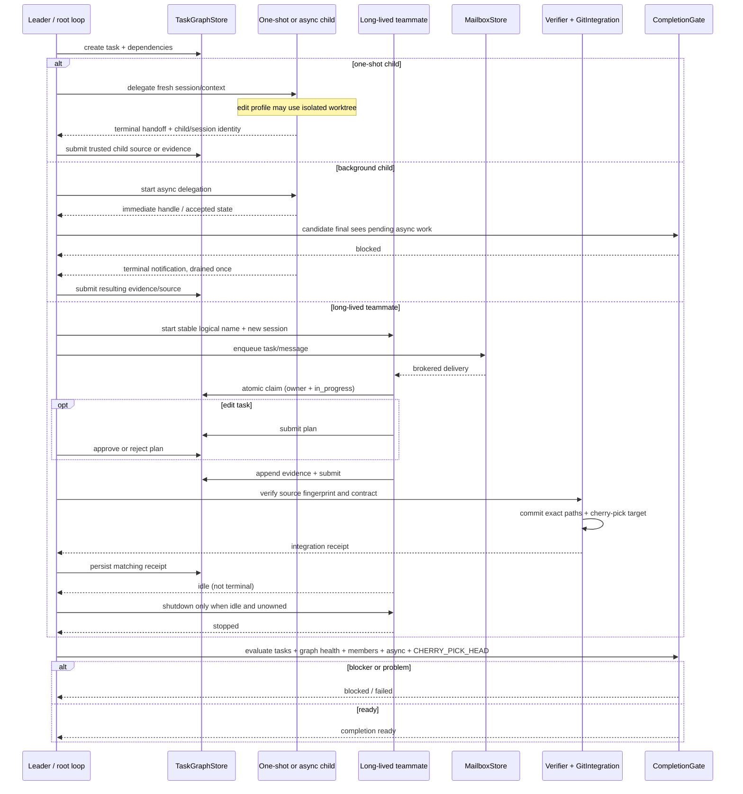

# Delegation 与 Coordination：从临时子任务到可验收团队协议

## 1. Research question

一次普通 tool call、一个 one-shot child、一个 background child、一个 long-lived teammate，以及一个带共享任务和验收规则的 team，表面上都像“让别的执行单元做事”，但它们解决的不是同一个问题。

普通 tool 只需要返回一次结果；one-shot child 还要隔离 context 与记录 lineage；background child 必须先返回 handle，随后异步交付终态，并阻止 root 过早结束；long-lived teammate 需要稳定身份、跨 turn 通信、idle/terminal 区分和显式 shutdown；team 再增加共享任务、所有权、依赖、证据、review、集成与全局 completion。[INF]

Forge 的具体痛点经历了三步：fresh child 能隔离上下文，却没有共享工作状态；named teammate 能跨 turn 收消息，却仍不能证明谁拥有任务；共享 graph 和 mailbox 又不能证明 edit 已通过验证并进入目标分支。[DOC][Forge@75714f2:docs/tutorial/c17c-coordination-completion-protocol.md:L42-L50] 因此本文问：不同 delegation form 的 context、identity、communication、shared state、ownership、workspace、permission、lifetime、failure、result、completion 与 resume 分别由谁负责；哪些异步事实必须进入 root completion gate；哪些 production recovery 问题仍属于 c18。

## 2. Scope and versions

本文使用 [SOURCES](SOURCES.md) 冻结的 snapshot，并遵循 [METHODOLOGY](METHODOLOGY.md) 的证据与 ownership 规则。

| 研究对象 | Snapshot | 协作范围 |
| --- | --- | --- |
| Forge Harness | `main@75714f2`，c17c 已集成。 | c15 one-shot/async child、c17 TaskGraph/teammate/mailbox/ownership/Git/completion；不把 c18 recovery 当成当前能力。 |
| Pi Agent | `main@977ec833`，packages `0.83.0`。 | core 与 shipped coding-agent 没有 native subagent/team protocol；只把 bundled subagent example 当作 extension reference。 |
| Claude local snapshot | repaired local copy `main@430502e`。[DOC][Claude@430502e:README.en.md:L1-L8] [DOC][Claude@430502e:README.en.md:L189-L200] | Agent tool、background agent、in-process teammate、task list 与 mailbox 的可见代码路径；不外推为当前官方 Claude Code 产品保证。 |

Pi 文档明确把 subagents 与 background bash 列为可由 extensions 或 tmux 提供、而非 built-in 的功能。[DOC][Pi@977ec833:packages/coding-agent/README.md:L491-L505] 因而本文不会把 `examples/extensions/subagent` 写成 Pi core architecture，也不会根据示例推断 durable mailbox、shared task graph 或 teammate resume。

本文同样不把 Git worktree 当作 security sandbox。worktree 隔离的是 branch/path 和变更集；capability registration、permission、OS process 与外部凭证才决定动作权限。[INF]

## 3. Terminology

| 执行形态 | 定义 | 最小终态 |
| --- | --- | --- |
| regular tool | 在当前 agent loop 内执行一次 handler，结果直接配对回当前 call；不拥有独立对话身份。 | 一个 normalized tool result。 |
| one-shot child | 以新 identity/context/session 执行一个委托，parent 等待终态 handoff；完成后 child 生命周期结束。 | completed/failed handoff 加 lineage。 |
| background child | 创建后立即把 handle/accepted state 交给 parent，工作继续异步进行；后续通过 notification/result 收敛。 | terminal notification 被 parent 消费，且 completion gate 不再看到 pending work。 |
| long-lived teammate | 具有稳定逻辑名字，可跨多个 turn 接收消息/任务；idle 表示可继续工作，不是 terminal。 | 显式 completed/failed/shutdown，或继续存活等待工作。 |
| team | teammate 加共享 task/ownership/communication/review/integration/completion protocol。 | 所有 actionable tasks 达到验收终态、异步工作已清空、成员满足 shutdown policy。 |

为了避免把文件和进程混成一种“状态”，本文还使用以下术语：

- `logical identity`：如 teammate name 或 task owner；应与每次运行生成的 session/process identity 分开。
- `lineage`：parent call/session 与 child session 的关系，不等于复制 parent transcript。
- `handoff`：执行单元返回的结果/证据；不自动等于 Leader acceptance 或 Git integration。
- `claim`：对共享任务取得排他 owner；selection、claim 和 status transition 若分开，就存在竞态窗口。
- `idle`：当前没有工作但仍可被唤醒；不能作为“团队已完成”的替代词。
- `completion gate`：只读汇总 authoritative task、async、runtime 和 integration state 后作出的 convergence decision；它不应暗中修复 owner state。
- `rejoin`：为同一 logical teammate 创建新运行 session；不意味着旧对话 history 或 in-flight effect 已恢复。

## 4. Observable behavior

先看用户/Leader 能观察到的差异：

| 维度 | Claude local snapshot | Pi Agent | Forge Harness |
| --- | --- | --- | --- |
| 普通 tool | 当前 query 内执行并配对 result；可被 streaming executor 并发调度。[CODE][Claude@430502e:src/services/tools/StreamingToolExecutor.ts:L23-L205] | core agent loop 的原生 primitive。[CODE][Pi@977ec833:packages/agent/src/agent-loop.ts:L586-L786] | governance 后由 ToolRuntime 串行执行。[CODE][Forge@75714f2:src/core/minimalLoop.ts:L589-L615] |
| one-shot child | `Agent` tool 可 foreground 运行 `runAgent`，具有独立 ID/subdirectory/sidechain 与 cleanup。[CODE][Claude@430502e:src/tools/AgentTool/runAgent.ts:L347-L859] | 只有 bundled example：普通 `subagent` tool 启动 `pi --mode json -p --no-session` 子进程。[CODE][Pi@977ec833:packages/coding-agent/examples/extensions/subagent/index.ts:L267-L472] | research/edit child 使用新 session/trace；edit child 使用隔离 worktree，profile 注册实际能力。[CODE][Forge@75714f2:src/extensions/childSessions.ts:L66-L225] |
| background child | async agent 使用 unlinked abort controller，创建后立即返回 notification，parent Escape 不自动终止它。[CODE][Claude@430502e:src/tools/AgentTool/AgentTool.tsx:L686-L858] | example extension 会等待 child process close；不是 background child protocol。[CODE][Pi@977ec833:packages/coding-agent/examples/extensions/subagent/index.ts:L340-L414] | async child manager 立即返回 handle，terminal notification 按创建顺序 drain once；final 前必须 settle。[CODE][Forge@75714f2:src/extensions/childSessions.ts:L350-L476] |
| long-lived teammate | in-process runner 跨 turn 保留 replacement state，idle 后可接新 mail/task；生命周期 abort 与 work abort 分开。[CODE][Claude@430502e:src/utils/swarm/inProcessRunner.ts:L972-L1277] [CODE][Claude@430502e:src/utils/swarm/inProcessRunner.ts:L1311-L1528] | 无 core 或 bundled teammate protocol。[DOC][Pi@977ec833:packages/coding-agent/README.md:L491-L505] | stable name + stable edit worktree；每次 start/rejoin 生成新 session，旧 IPC 被 fence。[CODE][Forge@75714f2:src/extensions/teammates.ts:L100-L160] |
| shared task ownership | file-backed task list 有 owner/status/blocker 和 locks；available selection、claim、status update 并非单一 transaction。[CODE][Claude@430502e:src/utils/tasks.ts:L69-L108] [CODE][Claude@430502e:src/utils/tasks.ts:L488-L612] [INF] | 无 native task ownership；example parent 只拥有其 tool invocation 和 child processes。[CODE][Pi@977ec833:packages/coding-agent/examples/extensions/subagent/index.ts:L530-L698] | TaskGraph 原子 acquisition 同时写 owner + `in_progress`，每 teammate 最多一个 unfinished task。[CODE][Forge@75714f2:src/runtime/teamTaskStore.ts:L450-L473] [TEST][Forge@75714f2:test/runtime/teamTaskProtocol.test.ts:L59-L85] |
| mailbox / sibling communication | name-keyed JSON mailboxes；direct、broadcast、shutdown request 带 sender/request ID。[CODE][Claude@430502e:src/utils/teammateMailbox.ts:L127-L271] [CODE][Claude@430502e:src/tools/SendMessageTool/SendMessageTool.ts:L155-L303] | example 只有 parent task input 与 child stdout/final output；chain 仅 `{previous}` 文本替换。[CODE][Pi@977ec833:packages/coding-agent/examples/extensions/subagent/index.ts:L530-L698] | per-address durable mailbox，由 Leader 作为 intended sole broker；cursor 在 dispatch 前原子 claim，语义是 at-most-once。[CODE][Forge@75714f2:src/runtime/teamMailbox.ts:L86-L108] [CODE][Forge@75714f2:src/runtime/teamMailbox.ts:L242-L317] |
| evidence / review | task status、mail与 hooks 可观测；本文未找到 Forge 式 evidence→review→Git receipt gate。[CODE][Claude@430502e:src/query/stopHooks.ts:L334-L455] [INF] | example 汇总 usage/final output；没有 team evidence/review protocol。[CODE][Pi@977ec833:packages/coding-agent/examples/extensions/subagent/index.ts:L340-L414] | research 先 evidence 再 Leader review；edit 先 plan approval，再 verify，最后 receipt 匹配才 completed。[CODE][Forge@75714f2:src/runtime/teamTaskStore.ts:L475-L630] [CODE][Forge@75714f2:src/runtime/teamTaskStore.ts:L739-L850] |
| completion | idle teammate 非 terminal；terminal notification once-guard。[CODE][Claude@430502e:src/utils/swarm/inProcessRunner.ts:L1311-L1528] | child process close + parsed final message使当前 tool settle。[CODE][Pi@977ec833:packages/coding-agent/examples/extensions/subagent/index.ts:L340-L414] | CompletionGate 读取 task status、TaskGraph projection health、teammate/unread 与 async counts，并检查进行中的 cherry-pick。[CODE][Forge@75714f2:src/runtime/completionGate.ts:L42-L139] |
| shutdown / resume | runAgent finally 清 MCP/hooks/cache/memory/shell；persistent teammate 有独立 lifecycle controls。[CODE][Claude@430502e:src/tools/AgentTool/runAgent.ts:L816-L859] [CODE][Claude@430502e:src/utils/swarm/inProcessRunner.ts:L1159-L1277] | abort 对 active child 发 `SIGTERM`，5 秒后尝试 `SIGKILL`；无 child resume。[CODE][Pi@977ec833:packages/coding-agent/examples/extensions/subagent/index.ts:L399-L409] | busy/owning unfinished work 拒绝 shutdown；failed teammate 可 rejoin 新 session，但 root restart 不会重载 team definitions。[CODE][Forge@75714f2:src/extensions/teammates.ts:L680-L739] [CODE][Forge@75714f2:src/extensions/teammates.ts:L806-L921] |

[INF] 这张表需要抓住“未完成事实由谁持有”。handle/notification 若没有 global convergence policy，root 可能把暂时安静误判为完成；task status 若没有 review/integration receipt，又可能把 worker 自报完成误判为已经交付。

## 5. Control flow

Forge c15–c17 提供了三项目中最显式的端到端 coordination topology，因此下面用它展示 creation、context、trace、async return、mailbox、claim、evidence、plan review、Git integration、completion gate 与 shutdown 的关系。它不是在声称 Claude 或 Pi 也实现了同一协议。

one-shot child 创建新 session/trace，edit profile 创建隔离 worktree，但不继承 parent Session History。[CODE][Forge@75714f2:src/extensions/childSessions.ts:L160-L225] async manager 先让 parent继续，再通过 terminal notification 收敛，`settleBeforeFinal()` 等待 activity edge 后 drain。[CODE][Forge@75714f2:src/extensions/childSessions.ts:L350-L476] task acquisition 在 store lock 内一次写 owner 与 `in_progress`；edit completion 需要 plan、verification 与 matching integration receipt。[CODE][Forge@75714f2:src/runtime/teamTaskStore.ts:L450-L592] [CODE][Forge@75714f2:src/runtime/teamTaskStore.ts:L739-L850]

[INF] 图中的关键异步不变量是：background child 可以让 foreground 继续，但不能从 completion accounting 中消失；teammate 可以 idle，但 idle 不能满足 terminal 条件；Git cherry-pick 可以成功，但在 receipt 写入 graph 之前，CompletionGate 仍不应宣布对应 edit task completed。

## 6. Data model and ownership

### Forge 的 owner-local facts

| 数据对象 | 创建/修改 owner | 持久化与消费者 | 最终决定权 |
| --- | --- | --- | --- |
| child session + terminal registry | child manager 创建；child loop 产出终态 | child 自有 trace；parent registry 保存完成 edit 的 provenance 和单次 source consumption。[CODE][Forge@75714f2:src/extensions/childSessions.ts:L350-L429] | Leader 决定是否把 handoff 提交到 task protocol。 |
| TaskGraph | Leader/teammate 通过 typed transition 修改 | v2 graph 在 root session 下，以 lock + temp + rename 持久化；CompletionGate、tools 与 verifier 读取。[CODE][Forge@75714f2:src/runtime/teamTaskStore.ts:L110-L174] [CODE][Forge@75714f2:src/runtime/teamTaskStore.ts:L1318-L1409] | store transition rules；Leader拥有 review/plan/integration transitions。 |
| teammate identity | manager 持有 stable name 与当前 session/process | definition/runtime 文件存在，但 active `members` map 在内存；old-session IPC 被忽略。[CODE][Forge@75714f2:src/extensions/teammates.ts:L100-L160] | manager 对 start/rejoin/shutdown 有最终权。 |
| mailbox | sender append；Leader broker claim cursor | append-only message bodies + per-address claimed cursor。[CODE][Forge@75714f2:src/runtime/teamMailbox.ts:L86-L108] [CODE][Forge@75714f2:src/runtime/teamMailbox.ts:L242-L317] | delivery policy是 at-most-once，不是 recipient effect 的 exactly-once。 |
| workspace/Git source | child/teammate 修改 source worktree；GitIntegration 捕获、验证、commit/cherry-pick | source/target Git truth 与 integration receipt 分属 Git 和 TaskGraph。[CODE][Forge@75714f2:src/runtime/gitIntegration.ts:L74-L140] | verifier/Leader 决定 acceptance，Git target state 决定是否真正集成。 |
| completion decision | CompletionGate 只读聚合 | 不单独持久化新 truth；读取 task status、TaskGraph projection health、teammate/unread、pending child/background，并检查 `CHERRY_PICK_HEAD`。[CODE][Forge@75714f2:src/runtime/completionGate.ts:L42-L139] | problems > blockers > ready；gate 不修改任务或进程。 |

### 跨项目 ownership 差异

| 责任 | Claude local snapshot | Pi example extension | Forge Harness |
| --- | --- | --- | --- |
| context | `runAgent` 选择 shared/isolated context，独立 sidechain、hooks、skills/MCP。[CODE][Claude@430502e:src/tools/AgentTool/runAgent.ts:L347-L859] | fresh `--no-session` process；task、cwd、optional prompt/model/tools 显式传入。[CODE][Pi@977ec833:packages/coding-agent/examples/extensions/subagent/index.ts:L267-L339] | fresh child session/context；root prompt assets可复用，但 parent history 不复制。[CODE][Forge@75714f2:src/extensions/childSessions.ts:L160-L225] |
| identity | task/agent IDs、parent/fork state；teammate mailbox以 name 定址。[CODE][Claude@430502e:src/Task.ts:L6-L124] [CODE][Claude@430502e:src/utils/teammateMailbox.ts:L1-L8] | Markdown agent config name + parent tool call/process；无 durable child identity protocol。[CODE][Pi@977ec833:packages/coding-agent/examples/extensions/subagent/agents.ts:L9-L19] | child session ID + parent call/session lineage；teammate stable name 与可变 session ID 分离。[CODE][Forge@75714f2:src/runtime/session.ts:L17-L30] [CODE][Forge@75714f2:src/extensions/teammates.ts:L100-L160] |
| permissions/capability | AgentTool filters inherited agents/tools；teammate runner使用 full tools + team essentials。[CODE][Claude@430502e:src/tools/AgentTool/AgentTool.tsx:L239-L408] [CODE][Claude@430502e:src/utils/swarm/inProcessRunner.ts:L972-L1116] | example 用 optional tool list 限定 child CLI；extension code仍有 host process权限。[CODE][Pi@977ec833:packages/coding-agent/examples/extensions/subagent/index.ts:L267-L339] | profile runtime registration是真实 capability boundary；prompt 只是说明。[CODE][Forge@75714f2:src/extensions/childSessions.ts:L66-L112] |
| lifetime / resume | sync foreground、async unlinked abort、persistent in-process teammate；本文证据不支持跨进程 durable team resume。[CODE][Claude@430502e:src/tools/AgentTool/AgentTool.tsx:L686-L858] [CODE][Claude@430502e:src/utils/swarm/inProcessRunner.ts:L1159-L1528] | parent tool 等全部 child close；abort kill；无 resume。[CODE][Pi@977ec833:packages/coding-agent/examples/extensions/subagent/index.ts:L340-L414] | async child无 cancel/resume；teammate可在同一 root manager 中 rejoin 新 session；root restart不重构 active team。[CODE][Forge@75714f2:src/extensions/teammates.ts:L704-L739] |

[INF] worktree 是 Workspace State 的 owner boundary，而不是权限 owner。Forge edit child 即使在独立 worktree 中，能否启动 shell、委托新 child 或调用 MCP 仍由 profile runtime 决定；Claude/Pi 中同样不能因存在 subdirectory/worktree/cwd 就推导出 OS sandbox。

## 7. Invariants

1. **普通 tool 与 child 必须是不同身份层级。** Forge child 有独立 session/trace/lineage；Pi example child 虽由普通 tool 包装，也在独立 `--no-session` process中运行。[CODE][Forge@75714f2:src/extensions/childSessions.ts:L160-L225] [CODE][Pi@977ec833:packages/coding-agent/examples/extensions/subagent/index.ts:L267-L414]
2. **background 创建成功不等于工作完成。** Claude async agent 创建后立即返回 notification；Forge async child 返回 handle，并在 final 前由 manager settle/notify。[CODE][Claude@430502e:src/tools/AgentTool/AgentTool.tsx:L686-L858] [CODE][Forge@75714f2:src/extensions/childSessions.ts:L350-L476]
3. **task owner acquisition 必须排他。** Forge 在单次 locked transition 中写 owner + `in_progress`，并发 claim 恰有一个 winner。[TEST][Forge@75714f2:test/runtime/teamTaskProtocol.test.ts:L59-L85] Claude locked claim 会让 loser 安全失败，但 selection→claim→后续 status 仍分开。[CODE][Claude@430502e:src/utils/tasks.ts:L488-L612] [INF]
4. **logical teammate name 与运行 session identity 必须分开。** Forge rejoin 保留 name、分配新 session，并忽略 old-session IPC。[CODE][Forge@75714f2:src/extensions/teammates.ts:L100-L160] [TEST][Forge@75714f2:test/extensions/teammates.test.ts:L176-L222]
5. **idle 不是 terminal。** Claude in-process teammate idle 后继续等 mail/task；terminal notification有 once-guard。[CODE][Claude@430502e:src/utils/swarm/inProcessRunner.ts:L1311-L1528] Forge completion 要求 task/async/member 状态共同收敛，不能只看 worker 当前无输出。[CODE][Forge@75714f2:src/runtime/completionGate.ts:L42-L139]
6. **handoff、自报完成、验收、集成是四个状态。** Forge research 需 evidence→submit→Leader review，edit 还需 plan→verify→matching integration receipt。[CODE][Forge@75714f2:src/runtime/teamTaskStore.ts:L475-L630] [CODE][Forge@75714f2:src/runtime/teamTaskStore.ts:L739-L850]
7. **completion gate 只能读 owner facts。** Forge gate 聚合 authoritative stores并按 problem > blocker > ready排序，本身不改 task、Git 或 teammate。[CODE][Forge@75714f2:src/runtime/completionGate.ts:L42-L139]
8. **mail delivery 与 mail effect 是两次提交。** Forge cursor 在 dispatch 前 claim，因此失败 turn 不 replay；这保证 at-most-once dispatch，而非 exactly-once处理。[CODE][Forge@75714f2:src/runtime/teamMailbox.ts:L242-L317] [TEST][Forge@75714f2:test/runtime/teamMailbox.test.ts:L74-L127]
9. **workspace isolation 不是 sandbox。** Forge capability靠 profile tool registration，worktree只绑定独立 Git cwd。[CODE][Forge@75714f2:src/extensions/childSessions.ts:L66-L225] 建议任何文档都分别说明 filesystem branch isolation 与 process/credential authority。
10. **shutdown 必须尊重 ownership。** Forge 拒绝关闭 busy/starting 或仍持有 unfinished task 的 teammate；异常 root cleanup 才终止全部。[CODE][Forge@75714f2:src/extensions/teammates.ts:L680-L707] [CODE][Forge@75714f2:src/extensions/teammates.ts:L806-L921]

## 8. Failure semantics

| 失败或竞态窗口 | 当前行为 | 不能越界声称的保证 |
| --- | --- | --- |
| available selection → claim | Claude teammate 先选择 available task，再做 locked claim；两者不是一个 transaction，竞争者可能选到同一项，但 claim loser安全失败。[CODE][Claude@430502e:src/utils/swarm/inProcessRunner.ts:L680-L920] [CODE][Claude@430502e:src/utils/tasks.ts:L488-L612] [INF] | 不能声称 selection 本身保留任务。 |
| claim → status update | Claude ownership claim 与 later status update 是分开的 locked writes。[CODE][Claude@430502e:src/utils/tasks.ts:L488-L612] [INF] | crash 可留下 owner/status 组合需要恢复策略；本文无 reconciliation 证据。 |
| async child pending when root proposes final | Forge 先 settle async sources，若仍 pending，CompletionGate 阻止 premature final；terminal handoff 后再注入下一轮。[TEST][Forge@75714f2:test/core/minimalLoop.test.ts:L1916-L2033] | pending work 不等于 failed；也不能被静默忽略。 |
| worker/process failure while owning work | Forge 将 owned `in_progress` task 标 blocked；若结果已 submitted则保留给 Leader review。[TEST][Forge@75714f2:test/extensions/teammates.test.ts:L224-L264] | 不能自动把最后一段 stdout 当作 accepted completion。 |
| stale teammate IPC | Forge 用 current session identity fence 掉旧 process 消息；rejoin投影显式 recovery 后再投递未读 mail。[CODE][Forge@75714f2:src/extensions/teammates.ts:L100-L160] [CODE][Forge@75714f2:src/extensions/teammates.ts:L709-L739] | stable name 不意味着所有历史 process 仍有写权限。 |
| mailbox cursor claimed before effect | Forge cursor先推进再 dispatch；worker turn失败不会重放该 batch。[CODE][Forge@75714f2:src/runtime/teamMailbox.ts:L242-L317] | at-most-once 可能丢 effect，不能描述为 exactly-once。 |
| teammate idle mistaken as done | Claude idle仅通知一次并继续接工作；Forge gate仍看 task/async/member状态。[CODE][Claude@430502e:src/utils/swarm/inProcessRunner.ts:L1311-L1528] [CODE][Forge@75714f2:src/runtime/completionGate.ts:L42-L139] | 没有输出或 UI 显示 idle 不等于团队交付。 |
| source drift before integration | Forge verification/source drift 清 submission/verdict，任务回 `in_progress`，保留 evidence/approved plan。[CODE][Forge@75714f2:src/runtime/teamTaskStore.ts:L739-L798] [TEST][Forge@75714f2:test/runtime/teamTaskProtocol.test.ts:L209-L252] | retry 是同一 task 的局部状态回退，不是 durable Attempt model。 |
| cherry-pick conflict | GitIntegration abort cherry-pick并保持 target clean；dirty target、fingerprint drift 都 fail closed。[CODE][Forge@75714f2:src/runtime/gitIntegration.ts:L74-L140] [TEST][Forge@75714f2:test/runtime/gitIntegration.test.ts:L23-L119] | worktree隔离不能消除 semantic conflict。 |
| Git integrated → receipt not persisted | Forge 先 source commit/cherry-pick，tool adapter稍后 `recordIntegration()`；crash 可让 Git 已变但 graph仍 stale。[CODE][Forge@75714f2:src/runtime/gitIntegration.ts:L131-L139] [DOC][Forge@75714f2:docs/tutorial/c17c-coordination-completion-protocol.md:L391-L407] | c17 没有 durable reconciliation，正是 c18 gap。 |
| store rename succeeds → lock cleanup fails | Forge error可携带 committed mutation，adapter报告 completed + degraded warning。[CODE][Forge@75714f2:src/runtime/teamTaskStore.ts:L135-L155] [CODE][Forge@75714f2:src/runtime/teamTaskStore.ts:L1390-L1402] | warning不是 WAL；后续仍需人工/未来 reconciliation。 |
| root process restart | Forge teammate definitions/runtime不会被 `initialize()` 重载，active members/async handles在内存；one-shot/async无 resume。[CODE][Forge@75714f2:src/extensions/teammates.ts:L704-L707] [DOC][Forge@75714f2:docs/tutorial/c15b-async-child-sessions-parallel-handoff.md:L333-L344] | c17只保证当前 root run，不保证跨 root恢复。 |
| Pi example child abort | parent signal发 `SIGTERM`，5秒后尝试 `SIGKILL`；parent仍等待 process close/解析结果。[CODE][Pi@977ec833:packages/coding-agent/examples/extensions/subagent/index.ts:L340-L414] | kill请求不证明 child workspace副作用已回滚。 |
| shutdown while owning task | Forge normal shutdown拒绝 busy/starting或unfinished owner。[CODE][Forge@75714f2:src/extensions/teammates.ts:L680-L707] | 强制异常 cleanup 会牺牲 graceful handoff；必须单独记录。 |

## 9. Claude Code

Claude local snapshot 同时展示了 foreground subagent、background agent 与 long-lived in-process teammate，但它们不是一个统一生命周期的不同开关。

**普通 tool 与 Agent tool。** regular tool 仍由当前 query 的 streaming executor 调度；Agent tool 则创建 task identity，检查 team mode、禁止 nested fork recursion、过滤可继承 agents，并为 async mode创建独立 worker tool pool。[CODE][Claude@430502e:src/services/tools/StreamingToolExecutor.ts:L23-L205] [CODE][Claude@430502e:src/tools/AgentTool/AgentTool.tsx:L239-L408] [CODE][Claude@430502e:src/tools/AgentTool/AgentTool.tsx:L548-L635] Child 的 capability/context 需要显式构造，不能把 parent 当前全部 runtime state 直接当作 child input。[INF]

**one-shot 与 background abort ownership。** sync agent 仍由 foreground call 等待；async agent 使用 unlinked controller，因此 parent 的 Escape 不自动杀死它，创建路径会立即返回 detached lifecycle notification。[CODE][Claude@430502e:src/tools/AgentTool/AgentTool.tsx:L686-L858] terminal completion/failure 在 worktree cleanup 与 notification 前先写入 task state，降低 observer 看到“已通知但状态未变”的窗口。[CODE][Claude@430502e:src/tools/AgentTool/AgentTool.tsx:L951-L1035] 但 unlinked abort 只说明 parent cancel ownership不同，不等于 background work可以跨进程 crash恢复。[INF]

**context、trace 与 cleanup。** `runAgent` 建立 agent ID、subdirectory、parent/fork state，区分 async/parent abort，运行 `SubagentStart`、注册 trusted frontmatter hooks、预载 skills、合并 MCP，并选择 shared 或 isolated context。[CODE][Claude@430502e:src/tools/AgentTool/runAgent.ts:L347-L714] child 的 sidechain/metadata 单独记录；`finally` 清 MCP、hooks、cache、memory 与 shell tasks。[CODE][Claude@430502e:src/tools/AgentTool/runAgent.ts:L732-L859] 这套 cleanup 较完整，但本文证据没有提供 crash 后重建 active subagent 的 durable protocol。

**shared tasks 的两段竞态。** task list用 file lock保护 create/update/claim，claim 会拒绝已有不同 owner、completed task 或未解除 blocker。[CODE][Claude@430502e:src/utils/tasks.ts:L284-L391] [CODE][Claude@430502e:src/utils/tasks.ts:L488-L612] in-process teammate 会先扫描 unclaimed available tasks，再调用 claim，并在后续 turn/status路径推进工作。[CODE][Claude@430502e:src/utils/swarm/inProcessRunner.ts:L680-L920] [INF] 因此这里至少有两个分离窗口：`selection → locked claim`，以及 `claim owner → later status update`。第一个窗口的 loser 会被 locked claim安全拒绝，但 selection 不是 reservation；第二个窗口若进程退出，可能留下 owner/status需要恢复策略。本文没有找到 transaction或reconciliation证据，不能把它写成已解决问题。

**mailbox、idle 与 team lifetime。** mailbox 以 teammate name 定址，send 与 read-marking 都在 lock 下重读文件；direct、broadcast 与 shutdown request 带 sender/request identity。[CODE][Claude@430502e:src/utils/teammateMailbox.ts:L127-L271] [CODE][Claude@430502e:src/tools/SendMessageTool/SendMessageTool.ts:L155-L303] persistent in-process teammate先处理 shutdown mail，再处理 Leader/peer mail，最后尝试 unclaimed task；它在多个 turn 间保留 replacement state，并把 lifecycle abort 与 per-turn work abort分开。[CODE][Claude@430502e:src/utils/swarm/inProcessRunner.ts:L680-L920] [CODE][Claude@430502e:src/utils/swarm/inProcessRunner.ts:L972-L1277] idle 只发一次通知并继续等工作，terminal completion/failure 才受 once-guard保护。[CODE][Claude@430502e:src/utils/swarm/inProcessRunner.ts:L1311-L1528]

**验收边界。** normal stop path 会对 teammate owned/in-progress tasks运行 `TaskCompleted` hooks，再运行 `TeammateIdle` hooks。[CODE][Claude@430502e:src/query/stopHooks.ts:L334-L455] [INF] “worker准备停下”仍可被 task/idle policy拦截。不过，本次可见证据没有 Forge 那种 source fingerprint → verifier → Git cherry-pick → persisted receipt → global CompletionGate 完整链；把 hook gate 等同于 integrated delivery 会越过证据。

## 10. Pi Agent

Pi 的结论必须先说清楚：当前 core 与 shipped coding-agent 没有 native subagent、background child、teammate 或 team protocol。[DOC][Pi@977ec833:packages/coding-agent/README.md:L491-L505] 下述机制全部来自 bundled **example extension**，只能作为“如何在普通 tool 后面实现 one-shot subprocess”的参考。

**creation 与 identity。** extension 注册一个普通 `subagent` tool；agent identity 来自 user/project Markdown config，`both` 模式按 name 让 project definition覆盖 user definition。[CODE][Pi@977ec833:packages/coding-agent/examples/extensions/subagent/index.ts:L460-L472] [CODE][Pi@977ec833:packages/coding-agent/examples/extensions/subagent/agents.ts:L9-L19] [CODE][Pi@977ec833:packages/coding-agent/examples/extensions/subagent/agents.ts:L97-L115] 这类 name 是 prompt/config选择，不是 durable teammate identity 或 mailbox address。

**context 与 workspace。** 每个 child 是 fresh foreground process：`pi --mode json -p --no-session`，显式传 task、cwd、optional model/tools 与 appended system-prompt file。[CODE][Pi@977ec833:packages/coding-agent/examples/extensions/subagent/index.ts:L267-L339] parent transcript 不会自动复制；child 会在同一 cwd 或显式 cwd 中重新发现它自己的 resources。[INF] 没有 worktree creation、shared task graph 或 capability sandbox protocol；可选 tool list 只限制 child CLI 暴露的 tools，不限制 extension host process本身的 OS authority。[INF]

**communication 与 result。** parent→child 是一次 task input；child→parent 是 JSON-line `message_end`/`tool_result_end` stream、stderr 与 process-close 后聚合的 usage/final output。[CODE][Pi@977ec833:packages/coding-agent/examples/extensions/subagent/index.ts:L340-L414] single、最多 8 tasks/并发 4、sequential-chain 都是 extension policy；chain sibling communication 只有把上一项文本插入 `{previous}`。[CODE][Pi@977ec833:packages/coding-agent/examples/extensions/subagent/index.ts:L530-L698] 没有 mailbox、peer message、shared ownership 或 Leader review。

**lifetime、abort 与 completion。** parent tool 等待 child process close；abort 发 `SIGTERM`，五秒后尝试 `SIGKILL`。[CODE][Pi@977ec833:packages/coding-agent/examples/extensions/subagent/index.ts:L399-L409] completion 是“process close + parsed final message/错误”后当前 regular tool settle，不是 immediate async handle，也不会在 parent下一轮之外持续存活。[INF] 该示例没有 cancel后effect reconciliation、child resume或root completion gate。

project-local agent prompts 是可执行的 trust input，示例默认优先 user agents，interactive use project agents前会提示。[DOC][Pi@977ec833:packages/coding-agent/examples/extensions/subagent/README.md:L55-L65] 这再度说明 extension reference 的安全政策不能被提升为 core guarantee。

## 11. Forge Harness

在这三个 snapshot 中，Forge 明确把 one-shot child、background child、long-lived teammate 与 team acceptance 拆成连续教学机制；它也明确把跨 root recovery 留在边界之外。

**c15 child。** research profile只注册 inspect/todo/allowed task tools；edit profile注册 file edit/write，但没有 bash、delegate、plugin、MCP 或 background surface。[CODE][Forge@75714f2:src/extensions/childSessions.ts:L66-L112] child 使用新 session/trace；edit child使用新 worktree。它可读取 root prompt assets，但不继承 parent Session History。[CODE][Forge@75714f2:src/extensions/childSessions.ts:L160-L225] capability来自实际 tool registration，不来自“请不要调用 shell”的 prompt。

**one-shot source authority。** child从不成为 TaskGraph owner。Leader只能用已注册 completed edit child的 `childSessionId` 提交 source；registry核对 delegated task、profile、terminal status、workspace与 single-task reuse。[CODE][Forge@75714f2:src/extensions/childSessions.ts:L393-L429] tests覆盖 cross-task/source reuse拒绝。[TEST][Forge@75714f2:test/extensions/childSessionRegistry.test.ts:L12-L72] 这让“执行者是谁”与“谁有权推进 shared task”保持分离。

**c15b async convergence。** async manager保存 in-memory handles/terminal records，创建后立即让 root继续；terminal notifications按创建顺序 drain once，`settleBeforeFinal()`等待一次 activity edge再 drain。[CODE][Forge@75714f2:src/extensions/childSessions.ts:L350-L476] pending child不会阻塞前台继续，但会阻止 premature final；终态 handoff只注入一次。[TEST][Forge@75714f2:test/core/minimalLoop.test.ts:L1916-L2033] 这就是 async completion gate 的最小形态：允许并发，但不允许未决事实从 accounting 消失。

**c17 TaskGraph ownership。** store 在 exclusive lock内对 ready/pending/unowned task原子写 owner + `in_progress`，同一 teammate最多持有一个 unfinished task。[CODE][Forge@75714f2:src/runtime/teamTaskStore.ts:L450-L473] 两个并发 claim恰有一个 winner。[TEST][Forge@75714f2:test/runtime/teamTaskProtocol.test.ts:L59-L85] 所有 mutation都会重读、revision +1、校验、写 unique temp再 rename；missing/malformed/invalid graph会 degraded，而 request-level transition denial仍可保持 healthy。[CODE][Forge@75714f2:src/runtime/teamTaskStore.ts:L1318-L1409]

**evidence、plan、review 与 integration。** research task先附 evidence再 submit，只有 Leader review-pass才 completed；reject回 `in_progress`。[CODE][Forge@75714f2:src/runtime/teamTaskStore.ts:L541-L630] teammate-owned edit必须先有 approved plan；successful verification仍只保持 submitted，matching source/fingerprint integration receipt 才 completed。[CODE][Forge@75714f2:src/runtime/teamTaskStore.ts:L475-L592] [CODE][Forge@75714f2:src/runtime/teamTaskStore.ts:L739-L850] GitIntegration重新检查 source fingerprint与target readiness，commit exact changed paths，cherry-pick，冲突时abort并返回 receipt。[CODE][Forge@75714f2:src/runtime/gitIntegration.ts:L74-L140]

**teammate 与 mailbox。** teammate name稳定、session可变，old-session IPC被fence；failed member保持 offline，rejoin创建新 session，并先投影 recovery，再投递尚未 claimed 的 unread mail。[CODE][Forge@75714f2:src/extensions/teammates.ts:L100-L160] [CODE][Forge@75714f2:src/extensions/teammates.ts:L709-L739] mailbox body append-only，cursor在 dispatch前claim，因此是 at-most-once；Leader是 intended sole broker，避免把 JSONL append当成任意多写者协议。[CODE][Forge@75714f2:src/runtime/teamMailbox.ts:L86-L108] [CODE][Forge@75714f2:src/runtime/teamMailbox.ts:L242-L317]

**completion 与 shutdown。** CompletionGate读 authoritative task store、TaskGraph projection health、teammate summaries和async counts；Git只检查 `CHERRY_PICK_HEAD`，integration receipt则先由 TaskGraph transition消化成task status。[CODE][Forge@75714f2:src/runtime/completionGate.ts:L42-L139] tests覆盖 actionable incomplete、verified but not integrated、degraded/blocked failure与all-complete/all-stopped ready。[TEST][Forge@75714f2:test/runtime/completionGate.test.ts:L17-L199] busy/starting或仍持有 unfinished task的teammate不能shutdown；normal cleanup先停idle process，所有member已 stopped 后 gate 才可能 ready，abnormal cleanup则终止全部。[CODE][Forge@75714f2:src/extensions/teammates.ts:L680-L707] [CODE][Forge@75714f2:src/extensions/teammates.ts:L806-L921] `git rev-parse`失败会被当成“没有进行中的 cherry-pick”，因此这里的 fail-closed 只适用于已观察到的 task/graph/teammate problems，不是通用Git探测保证。[CODE][Forge@75714f2:src/runtime/completionGate.ts:L180-L194]

**c18 gaps。** c17c明确不实现 Attempts、resume、idempotency、reconciliation、event replay与Git-effect/receipt crash recovery。[DOC][Forge@75714f2:docs/tutorial/c17c-coordination-completion-protocol.md:L391-L411] teammate definitions不会在root restart时reload，mailbox cursor/effect不是一个transaction，async child没有cancel/resume，Git cherry-pick与receipt persistence之间有已知窗口。[CODE][Forge@75714f2:src/extensions/teammates.ts:L704-L707] [DOC][Forge@75714f2:docs/tutorial/c15b-async-child-sessions-parallel-handoff.md:L333-L344] 当前正确表述是“c17在一次root run内有显式completion protocol”，不是“已经有durable workflow engine”。

## 12. Comparative analysis

| 维度 | Regular tool | Claude one-shot/background/team | Pi example subagent | Forge child/teammate/team |
| --- | --- | --- | --- | --- |
| 创建 | 当前 loop解析并执行call。 | AgentTool创建 task/runAgent；async另建unlinked lifecycle。[CODE][Claude@430502e:src/tools/AgentTool/AgentTool.tsx:L686-L858] | 一个extension tool spawn CLI process。[CODE][Pi@977ec833:packages/coding-agent/examples/extensions/subagent/index.ts:L267-L339] | child manager或teammate manager创建，TaskGraph另行创建/分配工作。[CODE][Forge@75714f2:src/extensions/childSessions.ts:L160-L225] |
| context | 当前agent context。 | runAgent选择shared/isolated，teammate跨turn保留state。[CODE][Claude@430502e:src/tools/AgentTool/runAgent.ts:L347-L714] | fresh `--no-session`，不复制parent transcript。 | fresh child；teammate仅在当前worker/session存活时保留history。[CODE][Forge@75714f2:src/cli/teammateWorker.ts:L239-L271] |
| identity/trace | call ID，没有独立agent identity。 | task/agent ID、sidechain、teammate name/mailbox。 | config name + OS process + parent call；无core lineage。 | child session/parent edge；stable teammate name + fenced session；root/child/worker各自trace。[CODE][Forge@75714f2:src/runtime/session.ts:L17-L30] |
| async return | handler settle前通常不返回final。 | background agent立即notification，继续异步。[CODE][Claude@430502e:src/tools/AgentTool/AgentTool.tsx:L686-L858] | 无；parent tool等process close。 | async child立即handle，terminal notification later。[CODE][Forge@75714f2:src/extensions/childSessions.ts:L350-L476] |
| sibling通信 | 无。 | name-keyed direct/broadcast mailbox。[CODE][Claude@430502e:src/tools/SendMessageTool/SendMessageTool.ts:L155-L303] | 无；chain仅previous text。 | per-address mailbox经Leader broker；one-shot child无peer protocol。 |
| shared state | 只通过workspace/external effect间接共享。 | locked task files + mailbox files。 | 仅共享cwd/文件的偶然状态，无coordination schema。 | TaskGraph、mailbox、teammate runtime、Git/worktrees各有owner。 |
| task claim | 不适用。 | selection后locked claim，status另写；loser fail safe。[CODE][Claude@430502e:src/utils/tasks.ts:L488-L612] [INF] | 不适用。 | owner + `in_progress`原子acquisition，capacity=1。[TEST][Forge@75714f2:test/runtime/teamTaskProtocol.test.ts:L59-L85] |
| evidence/review | tool result由caller消费。 | task/hooks提供policy点；无本文可证的Git receipt chain。 | aggregated output/usage即tool result。 | evidence→submit→Leader review；edit再plan→verify→receipt。 |
| workspace | 当前cwd。 | subdirectory/fork/worktree state可选；不是sandbox。[CODE][Claude@430502e:src/tools/AgentTool/runAgent.ts:L347-L714] | child接收cwd；无worktree protocol。 | edit child/teammate可绑定worktree；capability仍由profile/permission控制。 |
| permission | 当前tool policy。 | child tool pool/agent filters与product permission共同构造。 | optional child tool list；extension本身受host process权限。 | fixed profile runtime；plugins/MCP是Leader-only，不自动下放。[DOC][Forge@75714f2:docs/tutorial/c16b-plugin-loading-registration.md:L366-L379] |
| failure result | paired error result。 | task failed/notification；background abort owner独立；teammate terminal once。 | process exit/stderr/final parse映射为tool result。 | child handoff、blocked owner task、submitted preservation、gate报告已观察到的problem/blocker。 |
| completion | call settle。 | sync child settle；idle teammate仍可工作；本文无全局Git completion gate。 | 所有spawned process close后tool settle。 | async settle + task completed + member stopped + graph projection healthy + 无活动 cherry-pick。 |
| resume | call不可resume。 | 本文只证实process内persistent teammate，未证跨process team resume。 | 无。 | teammate可同root rejoin新session；root restart/async resume未实现。 |
| shutdown | call abort/timeout。 | runAgent finally cleanup；teammate lifecycle/work abort分开。 | TERM→5s→KILL。 | ownership-aware normal shutdown；abnormal force cleanup。 |

[INF] Claude local snapshot 同时包含 background 与 team 机制，但 visible source 仍有 selection/claim/status 分裂，也没有本文可证的 global integration receipt。Pi example 采用更小的形态：subagent 只是普通 tool 背后的 one-shot subprocess。Forge 则把 ownership、evidence、review、Git receipt 与 completion 拆成可测试协议。

## 13. Forge design decision

Forge 不应把四种执行形态压成一个万能 `AgentJob`。建议继续保留它们各自最小的 completion contract：

1. **regular tool**：一次call、一次governance、一次paired result。
2. **one-shot child**：fresh context/session/trace、有限capability、terminal handoff；child不直接拥有TaskGraph。
3. **background child**：immediate handle、terminal notification、pending count进入root final accounting。
4. **long-lived teammate**：stable logical name、fenced session、mailbox、idle/terminal区分、ownership-aware shutdown。
5. **team**：atomic claim、dependency、evidence、plan/review、verification、Git receipt与CompletionGate。

当前 c17 设计决定应保持：

- TaskGraph 继续作为task contract的authoritative store，RuntimeState只保留projection，不建立中央`src/state/`。
- Leader继续拥有one-shot source提交、research review、edit plan approval、verification/integration与最终completion决策；worker自报不能直接完成task。
- worktree继续用于变更隔离和可审阅Git source，不宣称security sandbox；实际capability仍由profile tool registration和governance决定。
- CompletionGate继续只读；对task read failure、blocked task、degraded graph projection和failed teammate返回`failed`。它不自动抢owner、重放mail或修Git，也不把Git探测失败当作通用fail-closed。
- async child继续进入candidate-final settlement；不要以“foreground现在可回答”为由丢弃pending handle。

若进入 c18，最小的新增机制顺序应是：

1. 为每次root/child/teammate执行建立 durable Attempt identity，并记录start/terminal/unknown，而不是先做通用scheduler。
2. 只对已知crash window增加 owner-local receipt/reconciliation：mailbox cursor↔worker effect、Git cherry-pick↔TaskGraph receipt、active member↔process loss。
3. 定义 retry safety：只自动重试纯research或明确idempotent动作；edit/integration状态unknown时先observe Git/workspace truth。
4. 从persisted definition/task/attempt恢复team topology，再决定哪些member可rejoin；不要伪造旧Session History。
5. 等实际规模迫使时才考虑heartbeat、leader failover、priority、attachment、group chat或distributed workers。

这条顺序保留“问题迫使机制出现”的课程规则：先补c17已知的continuity裂缝，不提前建设平台化team service。

## 14. Production implications

- **durable identity。** logical teammate、session、process、task、attempt与workspace fingerprint必须分别编号。只用一个name无法fence stale process，也无法判断重启后是哪次执行留下的副作用。
- **lease/claim recovery。** 原子claim解决同一时刻的双owner，不解决owner crash。production需要lease或显式orphan/unknown状态、reclaim policy与审计，而不是静默清空owner。
- **mailbox delivery。** at-most-once cursor避免重复turn，却可能在cursor推进后、effect前丢消息；at-least-once会反向引入重复effect。production要按消息类型选择dedupe key、ack和人工reconciliation，而不是宣称普遍exactly-once。
- **workspace security。** worktree、container、OS sandbox与credential scope是不同层。多个teammate可有独立Git tree却仍共享network、process table或secret；权限必须随child profile显式下放。
- **integration transaction。** Git commit/cherry-pick与TaskGraph receipt跨两个owner，不能成为单一原子写。production应在重启时观察target commit/trailer、source fingerprint与graph revision，补写或标unknown。
- **completion across async producers。** final gate需要稳定快照或revision check，避免检查完graph后又创建新child/claim task。大规模系统可能需要epoch/fence；Forge当前单root policy暂不需要提前引入。
- **shutdown。** graceful shutdown要先停止接新work、等待或转移owner、flush mailbox/trace，再终止process；forced shutdown必须留下unknown attempts，不能把kill成功当作work rollback。
- **observability。** parent、child、worker trace要用causal IDs连接，但trace仍是evidence，不是authoritative task/Git state。metrics中的idle count也不能代替completion gate。

[INF] 这些 production 要求说明 c17 protocol 的价值：它已经把owner和receipt边界画清楚，未来可在裂缝旁增加reconciliation；若现在把所有事实塞进一个共享state object，反而会掩盖跨文件、进程与Git的真实transaction boundary。

## 15. Evidence confidence and open questions

| 结论 | 置信度 | 证据边界 |
| --- | --- | --- |
| Pi subagent只是bundled example extension，不是core/shipped native protocol | Medium | README明确非built-in，代码位于examples extension并注册普通tool；本研究未fresh-run该示例。[DOC][Pi@977ec833:packages/coding-agent/README.md:L491-L505] [CODE][Pi@977ec833:packages/coding-agent/examples/extensions/subagent/index.ts:L460-L472] |
| Pi example是foreground one-shot process，无background/team/mailbox | Medium | spawn、wait-close、abort与mode代码直接支持，但没有focused test/run交叉验证。[CODE][Pi@977ec833:packages/coding-agent/examples/extensions/subagent/index.ts:L267-L414] [CODE][Pi@977ec833:packages/coding-agent/examples/extensions/subagent/index.ts:L530-L698] |
| Claude background agent与parent Escape有独立abort ownership | Medium | direct repaired-source path支持，无focused tests且provenance受限。[CODE][Claude@430502e:src/tools/AgentTool/AgentTool.tsx:L686-L858] |
| Claude teammate idle非terminal | Medium | direct runner code明确，仓库无常规tests。[CODE][Claude@430502e:src/utils/swarm/inProcessRunner.ts:L1311-L1528] |
| Claude task selection→claim→status存在分离窗口 | Medium | selection runner与locked claim/update路径可见；crash结果未实验。[CODE][Claude@430502e:src/utils/swarm/inProcessRunner.ts:L680-L920] [CODE][Claude@430502e:src/utils/tasks.ts:L488-L612] [INF] |
| Forge atomic claim只有一个winner | High | implementation与focused concurrent test一致。[CODE][Forge@75714f2:src/runtime/teamTaskStore.ts:L450-L473] [TEST][Forge@75714f2:test/runtime/teamTaskProtocol.test.ts:L59-L85] |
| Forge edit completion需要plan/verify/integration receipt | High | state transitions与tests直接覆盖。[CODE][Forge@75714f2:src/runtime/teamTaskStore.ts:L475-L592] [CODE][Forge@75714f2:src/runtime/teamTaskStore.ts:L739-L850] [TEST][Forge@75714f2:test/runtime/teamTaskProtocol.test.ts:L124-L207] |
| Forge CompletionGate阻止pending/未集成work过早final | High | gate code、focused tests与minimal-loop pending-child test交叉支持。[CODE][Forge@75714f2:src/runtime/completionGate.ts:L42-L139] [TEST][Forge@75714f2:test/runtime/completionGate.test.ts:L17-L199] [TEST][Forge@75714f2:test/core/minimalLoop.test.ts:L1916-L2033] |
| Forge能跨root crash恢复team/child/Git receipt | Unsupported | docs明确留给c18，manager不reload definitions，已知Git/receipt窗口仍在。[DOC][Forge@75714f2:docs/tutorial/c17c-coordination-completion-protocol.md:L391-L411] [CODE][Forge@75714f2:src/extensions/teammates.ts:L704-L707] |

可执行但本研究未运行的 open-question protocols：

1. Claude：两个in-process teammate同时选择同一available task，在selection后加barrier，再并发claim，记录loser如何返回；随后在claim与status update之间注入process exit，观察重启可恢复事实。
2. Pi example：用fake child executable输出反序JSON events，验证parallel结果数组顺序、无final message时的error、parent abort对所有active processes的终止行为。
3. Forge：分别在mailbox cursor claim后、Git cherry-pick后、TaskGraph receipt rename前注入crash，重启只读观察mail、Git、graph三方truth，形成c18 reconciliation matrix。
4. Forge：root candidate final与新async child创建并发时，验证是否需要revision/epoch fence；当前single-root loop的调用顺序可能已避免该race，但本文没有focused test证明。

## 16. Interview takeaway

### 30 秒回答

普通tool、one-shot child、background child、teammate和team由不同的状态 owner负责，运行时长只是表面差异。one-shot child需要fresh context和terminal handoff；background child还要把pending事实纳入final gate；teammate需要稳定名字、mailbox、idle/terminal区分和shutdown；team再增加原子claim、evidence、review、Git receipt与全局completion。Pi只有example extension式one-shot子进程，Claude有background/team机制但task selection、claim、status仍有分离窗口，Forge c17显式实现了验收闭环，同时把跨crash恢复留给c18。

### 3 分钟深挖

我先把 context、identity 和 workspace 分开。child 可以在新 session 和 worktree 里运行，但 worktree 不是 sandbox；capability 取决于实际注册的 tools、permission 和 credentials。随后再区分执行完成与工作交付：child final 只是 handoff，research 需要 evidence 和 Leader review，edit 还要 approved plan、verification、source fingerprint、cherry-pick 与 matching receipt。teammate idle 也不是 terminal，只表示它还能继续接 work。

异步系统最棘手的是中间窗口。Claude 的 available selection、locked claim 和 later status update 不是单一 transaction；Forge 把 owner + `in_progress` 做成原子 claim，但 mailbox cursor 仍先于 worker effect，Git cherry-pick 也先于 TaskGraph receipt。CompletionGate 只能读取配置给它的 task、graph projection、member与async事实，并对已观察到的问题收敛，不能替 owner 修复状态或完成Git reconciliation。production 下一步应补 Attempt identity、unknown 状态、idempotency 分类和 owner-local reconciliation；这是 Forge 在 c18 按具体痛点加入的最小机制。

### 追问

1. **为什么background child不能只返回一个job ID就算完成？** 因为root final必须知道job是否pending、terminal notification是否已消费、结果是否已提交；handle只证明创建成功。
2. **idle teammate为什么不能满足completion？** idle只表示当前没有turn，mailbox可能随后到达，task仍可能owned/submitted/未集成；terminal与global readiness是不同状态。
3. **原子claim解决了哪些问题，又没解决哪些？** 它防止两个owner同时取得同一task；它不处理owner crash、lease过期、side effect unknown或跨store receipt reconciliation。
4. **为什么worktree不是sandbox？** 它隔离Git branch/path，不限制process、network、credentials或可调用tools；安全边界要靠capability与OS isolation。
5. **Git已经cherry-pick成功，为什么TaskGraph还不能直接completed？** 因为crash可能发生在Git success与receipt write之间；必须用fingerprint/commit evidence补写或标unknown，不能凭stale graph重复集成。
