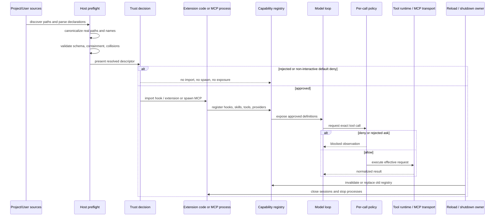

# Extensibility governance 与 trust：从发现到 shutdown 的完整边界

## 1. Research question

一个 extension 被“发现”时，还只是磁盘上的 data；一旦 host `import` 它、spawn 它声明的 process，或把它注册成 model-visible tool，它就获得了执行权。本文追踪这条完整链路：

```text
discover
-> parse
-> canonicalize
-> validate
-> trust
-> import / spawn
-> register
-> expose
-> per-call authorize
-> reload / unload
-> shutdown
```

迫使这套机制存在的痛点很直接：project-local plugin 可以带 hook code、skill prompt 和 MCP command。若 host 在 trust 前 import hook，恶意 repository 已经执行；若 startup trust 被误当成 per-call permission，一个“可信”server 后续暴露的 mutating tool 就会越过 action boundary；若 worktree 被误当 sandbox，plugin 仍然以 host user 的权限读取 credentials 或启动任意 process。

本文按 authority 分析每个阶段：谁能读取 declaration，谁能执行 code，谁能把 capability 暴露给模型，谁能批准一次真实调用，谁在 reload/shutdown 时撤销旧 authority。Feature 数量不参与比较。

## 2. Scope and versions

本文只使用 [SOURCES](SOURCES.md) 冻结的三个本地 snapshot。

| 研究对象 | Snapshot | 研究面 | 证据限制 |
| --- | --- | --- | --- |
| Claude Code repaired source | `430502e` | plugin startup/load/refresh、hooks、skills、MCP client/auth/cleanup | 仓库自述是 leaked source 的 repaired runnable copy，含 stub 与 generated/bundled code；不是 Anthropic 官方 public source。[DOC][Claude@430502e:README.en.md:L1-L8] [DOC][Claude@430502e:README.en.md:L189-L200] 没有 test script。[CODE][Claude@430502e:package.json:L1-L12] |
| Pi Agent | `977ec833` | project trust、extension loader/runner、resource reload、extension-owned MCP/permission/sandbox | Pi 把 extensibility 设为 product boundary，core 刻意不内建 MCP、permission popup 或 sandbox。 |
| Forge Harness | `75714f2` | c16b local plugin preflight/trust/activation、hooks、skills、MCP、per-call policy、shutdown | code 与 deterministic tests覆盖 startup pipeline；没有 hot reload、persistent trust 或 marketplace。 |

本文不运行第三方 plugin/MCP process，不读取 credentials，也不做 network discovery。Claude 与 Pi checkout 保持只读；本研究不修改 Forge runtime/tests，变更限定在 design-studies 文档与根 README 的简短入口。

## 3. Terminology

| 术语 | 定义 | Authority 含义 |
| --- | --- | --- |
| `plugin` | 带 manifest/descriptor 的扩展包，可组合 skills、hooks、MCP servers 等组件 | package identity 不自动等于执行许可 |
| `extension` | 可被 host `import` 并调用 factory/handlers 的 in-process module | 通常拥有与 host process 相同的 OS 权限，除非另有隔离 |
| `hook` | 在 lifecycle、tool、session 或 context boundary 被调用的 callback/command | 可能只观察，也可能 mutate/block；必须逐 host 说明 |
| `skill` | 交给模型的指令与渐进式知识资源 | 不一定直接执行 code，但可引导模型调用真实 tools |
| `MCP server` | 独立或 in-process transport endpoint，负责 discovery 与 tool call | 连接成功只证明 transport/capability 可用，不代表每个 tool 已获准 |
| `custom tool` | host 或 extension 注册给模型的 callable capability | 每次调用仍需经过参数 validation 与 authorization policy |
| `project scope` | 当前 repository/workspace 提供的配置或 code | 可能随 checkout 改变，风险最高 |
| `user/global scope` | 用户 agent directory、installed package 或 managed settings提供的扩展 | 不等于安全；只是 owner 与载入时机不同 |
| `startup trust` | 在 import/spawn 前，用户是否接受某一 canonical descriptor | 授权“加载这份 extension”，不是授权所有未来 action |
| `per-call authorization` | 针对 exact tool、effective arguments、risk 与当前 context 的 allow/ask/deny | 是 L2 Governance 的 action boundary |
| `transport trust` | 是否连接某个 MCP endpoint、采用何种 auth、是否相信其 discovery/result | 不替代 per-tool policy |
| `worktree` | 将文件修改放进独立 Git workspace/branch | 提供 review surface，不限制 process 读取 host 其他路径 |
| `sandbox` | OS、VM、container 或 policy runtime施加的 capability boundary | 与 prompt trust、permission decision 分层 |

Pi 的 security doc把这层区别写得最直接：project trust 是 input-loading guard，不是 sandbox；extensions 以 Pi process 的用户权限运行。[DOC][Pi@977ec833:packages/coding-agent/docs/security.md:L3-L37] Forge 也明确说 `--worktree` 提供 filesystem scope 与 review surface，不隔离恶意 code。[DOC][Forge@75714f2:docs/tutorial/c16b-plugin-loading-registration.md:L366-L379]

## 4. Observable behavior

### Extension capability matrix

| Capability | Claude Code repaired source | Pi Agent | Forge Harness |
| --- | --- | --- | --- |
| Plugin/extension code | marketplace、session、builtin 与 managed sources合并；enabled plugin可贡献 commands/agents/hooks/MCP/LSP | project、global、configured path 被 Jiti import，factory可注册 tools/commands/providers并调用 `exec` | local config 声明 skills/hooks/MCP；trust 前只 preflight，approved hook才 import |
| Hook | workspace-trust gate；可通过 exit `2` 阻塞，其他 nonzero 通常 noncritical | 多数 hook error隔离；`tool_call` 可 block，throw会 fail-close当前 call；context hook可变换 messages | source event先落 trace；plugin hook拿 deep-frozen clone，只观察；失败记录后继续 |
| Skill | managed/user/project/additional/legacy sources；remote MCP skill禁 inline shell | user/project/package resource；skill可提示模型执行任意 action | project skills优先，approved plugin skills按 config/local order合并；skill-only plugin也要 session trust |
| MCP | 内建 config merge、OAuth、transport cache、reconnect、per-call freshness与 cleanup | core 不内建；MCP由 extension/package自行定义 namespace、auth、permission与shutdown | host 预声明 exact tools/policies；spawn后 capability intersection；调用仍走统一 ToolRuntime/governance |
| Custom tool | plugin/agent/MCP mechanisms最终形成 model tools；permission pipeline保留 settings/safety authority | extension可直接 `registerTool`，第一个同名 registration生效 | local plugin没有任意 in-process tool factory；扩展 tool surface来自声明过的 MCP tools |
| Reload/unload | refresh清 cache、重建 registries、触发 MCP/LSP reconnect，清 stale server/timer | reload发 shutdown、重建 resource/runtime、发 start；旧 extension context失效 | 无 hot reload；live MCP close会移除 definitions，session shutdown反序 close |

`plugin enabled` 这个布尔值不够。运行时至少有四张清单：declared、trusted、registered、exposed。Forge 还把 MCP tools 细分为 `exposed/denied/missing/incompatible/extra`；`deny` 与 `extra` 是 host 有意缩权，不算 degraded，missing/incompatible 才表示声明能力没注册成功。[DOC][Forge@75714f2:docs/tutorial/c16b-plugin-loading-registration.md:L245-L271]

## 5. Control flow

下面的 sequence diagram表示一条安全的 host pipeline。Pi 的 user/global extension bootstrap 与 Claude 的 marketplace refresh有额外分支，后文单独说明。



Forge 的 concrete startup order是：读 project assets/config，整批 preflight，建立 session/worktree，resolve descriptors，收集所有 trust decisions，import approved hooks，start standalone 与 plugin MCP，合并 skills/runtimes/exact policies，再启动 Leader loop；`finally` 依 owner关闭 teammate、plugin MCP、standalone MCP。[CODE][Forge@75714f2:src/cli/index.ts:L95-L195] [CODE][Forge@75714f2:src/cli/index.ts:L197-L305] [CODE][Forge@75714f2:src/cli/index.ts:L346-L365]

注意 trust 与 authorize 的时间差。startup trust面对的是 canonical root、entry path、command、args、cwd、timeouts 与 declared policies；per-call policy面对的是模型刚提出的 exact tool request。把两者合并，会让 startup prompt变成无限期 capability grant。

## 6. Data model and ownership

| Data / fact | 创建者 | 修改者 | 消费者 | 最终 owner |
| --- | --- | --- | --- | --- |
| discovery path set | project/user settings、CLI、marketplace/package manager | loader按 scope/precedence dedup | preflight/importer | source loader |
| parsed manifest | plugin author提供 bytes，host parser构造 typed value | preflight只规范化，不执行 | trust UI、activation | host preflight |
| canonical descriptor | host以 `realpath`、namespace、token resolution构造 | activation不应再偷换 | trust UI、spawner、registry | host；Forge deep-freeze descriptor。[CODE][Forge@75714f2:src/extensions/pluginDescriptors.ts:L14-L56] |
| startup trust decision | user或managed policy | session policy可拒绝，不应由 plugin自批 | activation | host/operator |
| hook registry | approved extension factory/manifest贡献 | reload或session teardown替换 | lifecycle emitter | extension runner / host registry |
| skill catalog | project/user/plugin resource loader | reload时重建 | prompt assembly/model | prompt owner |
| MCP connection | host client根据 trusted config创建 | transport close、auth refresh、reload更新 | tool adapter | MCP connection manager |
| exposed tool catalog | discovery结果 ∩ host declarations ∩ compatibility rules | reconnect/reload可重建 | model provider | host registry |
| permission map | host/project policy | operator/managed settings | per-call action boundary | governance owner，不是 MCP server |
| cleanup handle | importer/spawner建立 | teardown只调用一次或幂等调用 | reload/shutdown | 创建该资源的 owner |

三个系统的 scope 也不同：

- Claude loader合并 marketplace、session-only、builtin 与 managed names；session plugin通常覆盖 installed同名项，但 managed lock有更高 authority。[CODE][Claude@430502e:src/utils/plugins/pluginLoader.ts:L3096-L3211]
- Pi 发现 project `.pi/extensions`、global agent extensions 与 explicit paths，按 resolved path去重。[CODE][Pi@977ec833:packages/coding-agent/src/core/extensions/loader.ts:L573-L713]
- Forge c16b 只有 project `.forge/plugins.json` 的有序 local paths和 host-owned MCP policies；missing/empty文件意味着零 plugins。[CODE][Forge@75714f2:src/extensions/pluginConfig.ts:L8-L76]

## 7. Invariants

1. **Trust-before-execution 必须是真 barrier。** Forge preflight读 manifest/registries但不 import hook code；所有 plugin trust decisions完成后才 import approved hooks，rejected plugin保持 inert。[TEST][Forge@75714f2:test/extensions/pluginPreflight.test.ts:L13-L108] [TEST][Forge@75714f2:test/extensions/pluginActivation.test.ts:L21-L58]
2. **Startup trust 不等于 per-call allow。** Forge 未配置的 plugin MCP tool默认 `ask/unknown`；Claude PreToolUse hook的 allow不能越过 settings deny/ask与 safety checks。[CODE][Forge@75714f2:src/extensions/pluginPreflight.ts:L347-L411] [CODE][Claude@430502e:src/services/tools/toolHooks.ts:L321-L433]
3. **Canonical path 与 namespace 在 import/spawn 前封闭。** Forge 对 component `realpath`做 root containment，拒绝 symlink escape，并在整批 preflight报告 plugin/server/final-tool collisions。[CODE][Forge@75714f2:src/extensions/pluginPreflight.ts:L195-L220] [CODE][Forge@75714f2:src/extensions/pluginPreflight.ts:L414-L500] [TEST][Forge@75714f2:test/extensions/pluginPreflight.test.ts:L130-L173] [TEST][Forge@75714f2:test/extensions/pluginPreflight.test.ts:L227-L320]
4. **Hook authority必须写进 contract。** Claude command hook exit `2`可阻塞；Pi `tool_call` handler可 block且 throw会阻止当前 call；Forge plugin hook只拿 frozen event clone，异常只形成 `hook_result`，不阻塞 source event或后续 hooks。[CODE][Claude@430502e:src/utils/hooks.ts:L2616-L2685] [CODE][Pi@977ec833:packages/coding-agent/src/core/extensions/runner.ts:L932-L953] [CODE][Forge@75714f2:src/extensions/lifecycle.ts:L23-L83]
5. **Transport liveness 与 permission是两张表。** MCP server连接成功，只决定有哪些 compatible definitions；模型每次调用仍需 exact policy。unexpected close要移除 definitions或让 stale call失败，不能继续展示 ghost tool。[CODE][Forge@75714f2:src/extensions/mcpSession.ts:L109-L236] [TEST][Forge@75714f2:test/extensions/mcpSession.test.ts:L92-L131]
6. **Reload 必须撤销旧 authority。** Pi reload先发 `session_shutdown`、重建 runtime/resources、再发 `session_start`；旧 captured context被 invalidated。Claude refresh清 cache、重建 command/agent/hook state并 bump MCP reconnect key，stale plugin server会被清掉。[CODE][Pi@977ec833:packages/coding-agent/src/core/agent-session.ts:L2602-L2625] [CODE][Pi@977ec833:packages/coding-agent/src/core/extensions/runner.ts:L543-L556] [CODE][Claude@430502e:src/utils/plugins/refresh.ts:L72-L190]
7. **Shutdown 由创建资源的 owner负责，并有确定顺序。** Forge plugin MCP按启动逆序 close，尝试关闭全部 sessions；CLI最后关闭 standalone MCP。[CODE][Forge@75714f2:src/extensions/pluginActivation.ts:L93-L143] [CODE][Forge@75714f2:src/extensions/pluginActivation.ts:L305-L312]

## 8. Failure semantics

### Trust 与运行 failure 场景

| 场景 | 风险 | Snapshot 中的处理 |
| --- | --- | --- |
| 1. project 未被 trust，却声明 plugin install/hook | trust prompt本身触发 code execution | Claude startup check在 workspace trust未接受时跳过 plugin installation；central hook runner也再次检查 trust。[CODE][Claude@430502e:src/utils/plugins/performStartupChecks.tsx:L9-L30] [CODE][Claude@430502e:src/utils/hooks.ts:L1952-L2016] |
| 2. Pi project 未 trust，但 user extension已存在 | 误以为“未 trust”表示进程里没有 extension code | Pi bootstrap明确先加载 user/global与CLI extensions，让它们参与 `project_trust`；project-local extension随后才进入 final set。[CODE][Pi@977ec833:packages/coding-agent/src/core/resource-loader.ts:L379-L455] [TEST][Pi@977ec833:packages/coding-agent/test/resource-loader.test.ts:L191-L235] |
| 3. plugin component通过 symlink逃出 root | trust UI显示的 root与实际 code不一致 | Forge用 `realpath` containment拒绝；focused test构造逃逸 symlink并期待 preflight failure。[CODE][Forge@75714f2:src/extensions/pluginPreflight.ts:L492-L500] [TEST][Forge@75714f2:test/extensions/pluginPreflight.test.ts:L130-L155] |
| 4. 两个 plugins声明同名 server/tool | last-wins隐藏 authority切换 | Forge整批报 collision并拒绝 activation；Pi runner对同名 custom tool采用 first registration wins。[TEST][Forge@75714f2:test/extensions/pluginPreflight.test.ts:L227-L241] [CODE][Pi@977ec833:packages/coding-agent/src/core/extensions/runner.ts:L450-L472] |
| 5. skill-only plugin没有 process | 误认为“不执行 server”就无需 trust | Forge non-TTY默认拒绝 skill-only plugin；skill仍能改变模型行动。[TEST][Forge@75714f2:test/cli/pluginTrust.test.ts:L63-L76] |
| 6. hook抛错、阻塞或修改输入 | 把所有 hook failure统一成 warning，或统一成 fatal | Claude exit `2` blocking、其他 nonzero noncritical；Pi普通 event errors隔离但 `tool_call` throw fail-close；Forge observe-only hook failure记录后继续。[CODE][Claude@430502e:src/utils/hooks.ts:L2616-L2685] [CODE][Pi@977ec833:packages/coding-agent/src/core/extensions/runner.ts:L801-L833] [CODE][Forge@75714f2:src/extensions/lifecycle.ts:L35-L49] |
| 7. startup trust已批准，但 exact MCP tool policy是 `deny`/`ask` | 把“信任 server”解释成所有 tools auto-allow | Forge capability catalog与 permission map分离；deny tool不暴露，ask tool仍走 runtime governance。[CODE][Forge@75714f2:src/extensions/pluginPreflight.ts:L347-L411] [DOC][Forge@75714f2:docs/tutorial/c16b-plugin-loading-registration.md:L245-L253] |
| 8. reload后旧 extension异步 callback继续调用 host | stale authority操作新 session | Pi runtime/runner将旧 context标记 stale并抛错；reload重新绑定新 registry。[CODE][Pi@977ec833:packages/coding-agent/src/core/extensions/loader.ts:L170-L227] [CODE][Pi@977ec833:packages/coding-agent/src/core/extensions/runner.ts:L543-L556] |
| 9. MCP transport unexpected close | model继续看到 ghost tool或 stale call挂起 | Forge把 `connected=false`、definitions变空，stale call返回 failed，并只发一次 stopped event。[CODE][Forge@75714f2:src/extensions/mcpSession.ts:L193-L236] [TEST][Forge@75714f2:test/extensions/mcpSession.test.ts:L92-L131] |
| 10. MCP process不响应 graceful close | shutdown永久挂住或泄露 child | Claude stdio cleanup有有界 SIGINT → SIGTERM → SIGKILL escalation；Forge本章只依赖 SDK client close，没有等价 process escalation contract。[CODE][Claude@430502e:src/services/mcp/client.ts:L1404-L1579] |
| 11. worktree被当成 sandbox | plugin从 worktree外读取 secrets或启动 host process | Pi明确没有 built-in sandbox；Forge也明确 worktree不隔离 plugin process authority。[DOC][Pi@977ec833:packages/coding-agent/docs/security.md:L31-L53] [DOC][Forge@75714f2:docs/tutorial/c16b-plugin-loading-registration.md:L366-L379] |
| 12. 一个 plugin MCP启动失败 | 全组失效或留下半开资源 | Forge按确定顺序继续启动后续 server，记录 partial activation；shutdown反序尝试关闭已启动 sessions。[TEST][Forge@75714f2:test/extensions/pluginActivation.test.ts:L60-L117] |

Pi 的 discovery code接受 symbolic-link file/directory entry，并在该段没有像 Forge `containedRealpath()` 那样的 root-containment check。[CODE][Pi@977ec833:packages/coding-agent/src/core/extensions/loader.ts:L618-L659] [INF] 这只说明两者的 policy不同；本文没有构造 Pi path-escape exploit，也不据此宣称 vulnerability。

## 9. Claude Code

Claude snapshot 有一套平台级 extension surface。startup plugin installation只在 folder trust已接受后执行，失败不阻塞 REPL startup；若 seed marketplace改变，代码清 cache并提示显式 reload。[CODE][Claude@430502e:src/utils/plugins/performStartupChecks.tsx:L9-L68]

Loader把 fresh full-load与 cache-only load分开：interactive startup可只读 installed cache，显式 refresh才拿 fresh source。marketplace与session-only sources并行加载，builtin随后加入；session plugin通常按 name覆盖 installed项，managed settings可以锁定更高优先级。[CODE][Claude@430502e:src/utils/plugins/pluginLoader.ts:L3096-L3211]

Trust 与 authority仍有多层：

- plugin-agent frontmatter不能自己设置 `permissionMode`、hooks或MCP servers；installed manifest被视作这一层 trust boundary。[CODE][Claude@430502e:src/utils/plugins/loadPluginAgents.ts:L153-L168]
- central hook runner在 interactive workspace trust未接受时跳过所有 hooks，按 session/agent查找，并给每个 hook独立 timeout。[CODE][Claude@430502e:src/utils/hooks.ts:L1952-L2016] [CODE][Claude@430502e:src/utils/hooks.ts:L2142-L2199]
- command hook exit `2`给 blocking feedback；其他 nonzero默认只报告 noncritical error。[CODE][Claude@430502e:src/utils/hooks.ts:L2616-L2685]
- plugin `.mcp.json`是低优先级，manifest config可覆盖，并对每个 server做 schema validation。[CODE][Claude@430502e:src/utils/plugins/mcpPluginIntegration.ts:L126-L266]

MCP call不会盲用旧 client。tool每次调用先 `ensureConnectedClient()`，session expiry最多重试一次，并发 progress；OAuth provider的 `tokens()`每次 request读取/刷新 token，refresh使用 single-flight promise。[CODE][Claude@430502e:src/services/mcp/client.ts:L1675-L1704] [CODE][Claude@430502e:src/services/mcp/client.ts:L1833-L1945] [CODE][Claude@430502e:src/services/mcp/auth.ts:L1540-L1702]

Reload清所有 plugin caches，先 full-load再让 cache-only consumers读取，交换 AppState中的 plugin/agent state，bump `pluginReconnectKey`，最后重载 hooks；stale plugin MCP timers与connections会被清理。[CODE][Claude@430502e:src/utils/plugins/refresh.ts:L72-L190] [CODE][Claude@430502e:src/services/mcp/useManageMCPConnections.ts:L765-L820]

这套机制覆盖 marketplace、OAuth、LSP、dynamic reconnect与多 transport，范围超过 Forge 当前教程的实际问题。本地 snapshot又缺少 tests，source provenance也较弱。研究只提取其中可迁移的 trust/cleanup boundary，不建议复制整套规模。

## 10. Pi Agent

Pi 把 extension当成主要扩展方式。Discovery接受 direct `.ts/.js`、一层 subdirectory `index` 或 package manifest entry，并合并 project、global与 explicit paths。[CODE][Pi@977ec833:packages/coding-agent/src/core/extensions/loader.ts:L573-L713] Jiti随后 import module，要求 default factory，创建 extension-local registries并 `await factory(api)`；每个 path失败被收集，不阻止其他 paths。[CODE][Pi@977ec833:packages/coding-agent/src/core/extensions/loader.ts:L412-L552]

Extension API能注册 tools、commands、shortcuts、renderers和 providers，也能调用 `exec()`。加载阶段 action methods暂时是 throwing stub，`bindCore()`后才取得 live runtime；这限制的是 timing，不是 OS capability。[CODE][Pi@977ec833:packages/coding-agent/src/core/extensions/loader.ts:L170-L227] [CODE][Pi@977ec833:packages/coding-agent/src/core/extensions/loader.ts:L229-L401]

Pi 的 project trust 有一处边界：它先强制 `projectTrusted=false`，加载 user/global 与 temporary CLI extensions，让这些 extensions 处理 `project_trust`；决策完成后才加载 project-local 资源。Focused test 确认 user extension 只执行一次，project extension 在 trust 后加入。[CODE][Pi@977ec833:packages/coding-agent/src/core/resource-loader.ts:L379-L455] [TEST][Pi@977ec833:packages/coding-agent/test/resource-loader.test.ts:L191-L235]

但 trust不是 sandbox。官方 local doc写明 extension是与 Pi process同权限的 TypeScript module，package有 full system access；若需要强隔离，要把整个 process或 tool execution放进 container/VM/policy sandbox。[DOC][Pi@977ec833:packages/coding-agent/docs/security.md:L31-L53] [DOC][Pi@977ec833:packages/coding-agent/README.md:L404-L408]

Hook authority由 event决定。普通 emit按 extension/registration order await handlers并隔离 error；`tool_call`不包 try/catch，可返回 `block`，throw会进入 core before-tool failure path；`context` handlers则串联修改 cloned messages。[CODE][Pi@977ec833:packages/coding-agent/src/core/extensions/runner.ts:L801-L833] [CODE][Pi@977ec833:packages/coding-agent/src/core/extensions/runner.ts:L932-L953] [CODE][Pi@977ec833:packages/coding-agent/src/core/extensions/runner.ts:L984-L1014]

Pi core没有 built-in MCP、permission popup、subagent或background bash；这些由 extension/package/host policy实现。[DOC][Pi@977ec833:packages/coding-agent/README.md:L491-L505] Reload会发 shutdown、reload resources、重建 runtime与tools、发 start并重新 discover resources；旧 context被 invalidated。[CODE][Pi@977ec833:packages/coding-agent/src/core/agent-session.ts:L2602-L2625]

## 11. Forge Harness

Forge 选择了更窄的 local plugin contract。`.forge/plugins.json`只列 ordered local path、enabled与可选 host-owned MCP policies；看见目录不会自动启用，也没有 install/download/marketplace。[CODE][Forge@75714f2:src/extensions/pluginConfig.ts:L8-L76] [DOC][Forge@75714f2:docs/tutorial/c16b-plugin-loading-registration.md:L41-L47]

### Startup preflight

`preflightPlugins()`按 config order读取 enabled targets，disabled target甚至不读；它聚合并排序所有 issue，整组无问题才返回 descriptors。[CODE][Forge@75714f2:src/extensions/pluginPreflight.ts:L168-L193] preflight做四类关闭：

- manifest与registry strict schema；
- component `realpath`必须留在 canonical plugin root；
- plugin name、effective server ID与final tool name不能碰撞；
- MCP policy不能引用 undeclared owner/tool，未配置 policy默认 `ask/unknown`。[CODE][Forge@75714f2:src/extensions/pluginPreflight.ts:L195-L220] [CODE][Forge@75714f2:src/extensions/pluginPreflight.ts:L347-L500]

这一步不 import hook code。测试用 global side effect证明 preflight结束后 module仍未执行。[TEST][Forge@75714f2:test/extensions/pluginPreflight.test.ts:L46-L73]

### Trust、registration 与 expose

Preflight以后，host把 `${pluginRoot}`/`${projectRoot}`解析进 immutable descriptor；MCP `cwd`是实际 execution project/worktree。[CODE][Forge@75714f2:src/extensions/pluginDescriptors.ts:L14-L56] 每个 plugin，包括 skill-only，都在 foreground session显示 canonical root、skills、hooks、resolved command/args/cwd/timeouts与exact tool policies；non-TTY默认拒绝。[CODE][Forge@75714f2:src/cli/pluginTrust.ts:L28-L109] [TEST][Forge@75714f2:test/cli/pluginTrust.test.ts:L10-L100]

所有 trust decisions完成后才 import approved hooks。Plugin MCP按 plugin config/server ID顺序启动；一个 server失败不拦后续项。Project skills保持在前，approved plugin skills随后按 config/local lexical order合并。[CODE][Forge@75714f2:src/extensions/pluginActivation.ts:L59-L143] [CODE][Forge@75714f2:src/extensions/pluginSkills.ts:L4-L18]

Forge plugin hook是 observe-only：source event先写 trace，plugin收到 deep-frozen clone，异常形成 `hook_result`，后续 hooks继续；它不能 mutate tool args、block completion或改写 ToolResult。[CODE][Forge@75714f2:src/extensions/lifecycle.ts:L23-L83] [TEST][Forge@75714f2:test/extensions/lifecycle.test.ts:L162-L263]

### Per-call permission 与 transport lifecycle

Startup trust后，MCP tool仍按 final exact name进入 `PermissionPolicy`。`deny`或被拒绝的 `ask`不会调用 runtime，model拿到 blocked observation；allow才执行原 request。[CODE][Forge@75714f2:src/core/minimalLoop.ts:L1059-L1138] Transport owner `McpSession`持有 connected state、catalog、policies与 idempotent close。unexpected close移除 definitions，call failure只影响当前 ToolResult。[CODE][Forge@75714f2:src/extensions/mcpSession.ts:L55-L107] [CODE][Forge@75714f2:src/extensions/mcpSession.ts:L109-L236]

### 明确边界

Forge 没有 hot reload/hot enable、persistent trust、signature/hash、publisher identity、upgrade diff、plugin env/secrets或 delegated child plugin loading。[DOC][Forge@75714f2:docs/tutorial/c16b-plugin-loading-registration.md:L366-L379] Live MCP意外关闭只缩小后续 tool definitions，不自动 reconnect/restart。[DOC][Forge@75714f2:docs/tutorial/c16a-mcp-tool-integration.md:L224-L239]

当前 hook contract 还有一处版本漂移。Trace union 已包含 `task_graph_mutated`、teammate、team mailbox 与 `completion_gate_failed` 等协调事件，[CODE][Forge@75714f2:src/runtime/trace.ts:L217-L223] [CODE][Forge@75714f2:src/runtime/trace.ts:L362-L430] 但 plugin manifest 的 event 字段必须非空且逐项通过固定 allowlist；该 allowlist 尚未列入这些事件。[CODE][Forge@75714f2:src/extensions/pluginPreflight.ts:L25-L60] [CODE][Forge@75714f2:src/extensions/pluginPreflight.ts:L144-L149] [CODE][Forge@75714f2:src/extensions/pluginPreflight.ts:L312-L336] 因而 plugin 目前不能订阅这批已进入 trace 的 c17 协调事件。这是直接源码负证据，尚无 focused test；它说明新增 runtime event 时，还需要同步维护 extension compatibility surface。

## 12. Comparative analysis

| 比较轴 | Claude Code repaired source | Pi Agent | Forge Harness |
| --- | --- | --- | --- |
| 核心扩展单位 | plugin platform + hooks/skills/agents/MCP/LSP | in-process extension factory；skills/packages并列 | local descriptor，组件限于 skills/hooks/MCP |
| Project/user scope | marketplace/session/builtin/managed 多来源 | project + global/user + CLI/configured；user ext参与 trust bootstrap | project `.forge/plugins.json`；无 user marketplace |
| Trust 时机 | workspace trust gate before install/hooks；plugin manifest是部分 capability boundary | project-local resources trust前不载入，但 user/global extension已经运行 | 全组 preflight后，逐 plugin session trust；所有 decision完成后才 import/spawn |
| Process authority | plugin hook/MCP process；具体 isolation不能从本仓库完整证明 | extension与 Pi process同权限，无 built-in sandbox | hook import与MCP child以当前用户权限运行；worktree不是 sandbox |
| Path containment | 本文未封闭验证统一 plugin containment policy | discovery接受 symlink；未见 Forge式 contained-realpath barrier | realpath + component containment，test覆盖 escape |
| Namespace collision | loader有 source precedence与managed lock | custom tool first registration wins | plugin/server/final-tool碰撞整批拒绝 |
| Hook mutate/block | command/tool/Stop hooks可 block或rewrite，failure policy按 hook type | context/tool-result可 mutate；tool_call可 block | plugin lifecycle hook只观察 frozen clone，fail-open继续 |
| Skill authority | 多 scope，remote MCP skill禁止 inline shell | instruction资源，可由 extension/package贡献 | project first，trusted plugin follow；无 auto execution |
| MCP ownership | built-in client/auth/cache/reconnect/cleanup | core无 MCP；extension全权定义 | host声明 tools/policies，统一 governance，session owner liveness |
| Per-call authorization | central permission pipeline，hook allow不能越过 settings/safety | core无统一 permission UI；extension/host hook实现 | exact final-name policy + ask/deny/allow；trust不替代 call gate |
| Reload | full refresh、registry swap、MCP reconnect key | shutdown → rebuild → start，旧 ctx invalid | 无 hot reload；只做 session close与live disappearance |
| Shutdown | multi-transport cleanup，stdio signal escalation | session/runtime replacement与extension shutdown event | deterministic reverse close，best-effort遍历已启动 sessions |

这里没有 feature score。Claude 的覆盖面大，代价是更多 cache、reconnect、auth与source-provenance不确定性；Pi 最开放，代价是 extension code拥有 process authority；Forge最窄，代价是没有 reload、persistent trust与第三方 distribution。三种选择解决的 pain point不同。

## 13. Forge design decision

Forge 继续采用“narrow local descriptor + trust-before-import + host-owned per-call policy”，不在当前课程阶段升级成 plugin platform。

具体决定：

1. **保留一次性 preflight。** discover/parse/canonicalize/validate阶段只能读 data，不能 import/spawn。任何 issue使整组 activation fail closed。
2. **Trust绑定 resolved descriptor。** prompt展示 canonical root、entry、command、args、cwd、timeout与exact policy；若未来内容改变，应视为新 descriptor，而不是复用模糊的“信任这个名字”。
3. **Startup trust与action authorization分离。** plugin approval只允许 import/spawn；每个 MCP call仍走 L2 Governance。
4. **Hook保持 observe-only。** c09/c16b hooks不是 control plane。若未来需要 blocking hook，应新增独立 type、timeout、failure policy与trace，不偷偷改变现有 hook语义。
5. **Namespace冲突不做 first/last wins。** tutorial harness优先可解释性；collision必须在 execution前聚合报告。
6. **Worktree不冒充 sandbox。** 它服务 edit isolation和review；运行不可信 plugin需要 OS/container boundary，这不是 c16b 的小机制。
7. **暂不实现 reload与persistent trust。** 当前 session frozen descriptor最容易讲清。等真实 pain point出现，再增加 digest-bound trust、generation fencing和reverse teardown。

研究对照中可迁移的是 connection freshness、明确 cleanup owner、extension/runtime 分层和 stale-context invalidation；marketplace、OAuth矩阵与 unrestricted in-process tool API 不符合当前教程边界。[INF] 这是本文对三套 snapshot 的设计综合，不是 Forge 作者在 history 中声明的直接来源。

## 14. Production implications

若 Forge 的 local plugin要进入 production，还需要以下机制：

- **内容绑定的 identity。** canonical path不够；需要 manifest/component digest、publisher/signature、version与upgrade diff，让 trust decision绑定实际 bytes。
- **Persistent trust 的撤销模型。** 保存 trust前要定义 scope、expiry、parent-directory继承、non-TTY policy、版本变化与 operator revoke。
- **Process isolation。** untrusted extension code应放到 container/worker sandbox，限制 filesystem、network、environment、credentials与child-process capability；worktree只能解决 source isolation。
- **Secrets broker。** plugin不应直接继承完整 host env。MCP/auth需要最小 scope、短期 token、per-request refresh与审计。
- **Reload generation。** registry、hooks、tool definitions、MCP clients与callbacks需要同一 generation；旧 callbacks必须 fence，new generation完成后再切流量，失败要 rollback或明确 degraded。
- **Capability revocation。** transport close、policy change或plugin disable后，provider catalog、permission map与runtime routing必须一起撤销，避免 stale tool call。
- **Hook budget。** 每种 hook是否可 mutate/block、timeout多久、异常 fail-open还是 fail-closed，应在 type-level contract和trace中可见。
- **Shutdown receipt。** close要有 deadline、attempt-all与残留进程报告；不能只吞 error然后把 session标成 clean。
- **Supply-chain provenance。** marketplace/package下载、dependency install与native module需要独立 trust和verification，不能沿用 local path approval。

这些要求会增加平台复杂度。Forge 只有在课程出现相应 failure pressure 时才应逐个引入。

## 15. Evidence confidence and open questions

| 结论 | Confidence | 理由 |
| --- | --- | --- |
| Forge preflight不执行 code、拒绝 symlink escape/collision | High | implementation + focused deterministic tests |
| Forge trust-before-import、non-TTY拒绝、reverse cleanup | High | code + activation/trust tests |
| Forge hook observe-only与 MCP liveness | High | code + lifecycle/MCP tests |
| Forge plugin 尚不能订阅 c17 协调 trace events | Medium | trace union 与 preflight allowlist 的直接负向对照；未做 focused test |
| Pi project-trust bootstrap与 extension full process authority | High | code/test + project security doc |
| Pi symlink discovery缺少 Forge式 containment | Medium | 直接 code的 negative comparison；未做 exploit experiment |
| Claude plugin/hook/MCP visible paths | Medium | 直接 code，但 repaired leaked provenance、generated files、missing conventional tests |
| 当前官方 Claude Code 的完整 trust、sandbox与reload contract | Unknown | 本地 snapshot不能证明 |

开放问题：

1. Forge future persistent trust应绑定 path、Git commit、content digest还是 publisher identity？
2. 一个 plugin同时有 safe skill和危险 MCP command时，trust应整包批准还是 component-level批准？
3. Reload中若新 MCP连接成功、hook import失败，registry应 rollback还是进入 degraded generation？
4. Blocking hook的 timeout是 deny、allow还是交给 operator，如何避免 deadlock？
5. Transport已信任但 server discovery发生漂移时，新增 tool应该隐藏、ask还是触发新 startup trust？
6. 新增 trace event 时，如何用 type-level check或测试防止 plugin event allowlist再次落后？

## 16. Interview takeaway

### 30 秒回答

Extension governance要把两道门分开。第一道是 startup trust：host先 discover、parse、canonicalize和validate，向用户展示将要 import/spawn 的 exact descriptor，批准后才加载。第二道是 per-call authorization：模型每次调用 exact tool仍要经过 allow/ask/deny。MCP连接、worktree和sandbox又是不同边界。Forge当前只做 local plugin、trust-before-import、exact tool policy与确定 shutdown，不做 marketplace、persistent trust或hot reload。

### 3 分钟深挖

我会从 authority flow讲起。磁盘上的 manifest不是 code authority，所以 discover和preflight不能 import。Forge用 `realpath`封闭 plugin root，验证 manifest、tool schema、template和namespace，聚合所有错误后才产生 deep-frozen descriptor。Trust UI显示 canonical root、hooks、skills、resolved MCP command/args/cwd/timeouts以及每个 tool policy；所有 decisions结束后，approved hook才 import，approved MCP才 spawn。

接着必须重新过 action boundary。Startup trust只说明“允许这份组件进入进程”，不说明“模型以后可以无条件调用所有工具”。Forge把 server discovery与host declaration取交集，再按 final exact name查 permission。`deny`不暴露，`ask`每次确认，allow才进入统一 ToolRuntime。Transport close会撤掉 definitions，但不会把 server trust变成 tool permission。

对比能看出 trade-off。Pi 的 project trust确实挡住 project-local extension pre-load，但 user/global extensions会先运行以参与 trust decision，而且所有 extensions都拥有 Pi process权限；它没有内建 sandbox或permission UI。Claude snapshot有更完整的 marketplace、hook、OAuth、reload与stdio cleanup，却是 repaired leaked source且没有 tests。Forge不该复制这些平台机制。它现在的合理边界是一次性 local descriptor、session trust、observe-only hooks、host-owned MCP policy和reverse close。Production才需要 digest identity、persistent revoke、generation reload、secrets broker与OS isolation。

### 追问

1. 为什么 project trust不能替代 per-call tool approval？
2. 如何证明 preflight没有执行 plugin code，包括 getter、dynamic import与package resolution？
3. `realpath` containment能防什么，不能防什么？
4. Reload时如何防止旧 callback在新 session继续使用 authority？
5. MCP transport auth、tool permission和sandbox分别由谁拥有，失败时如何收敛？
