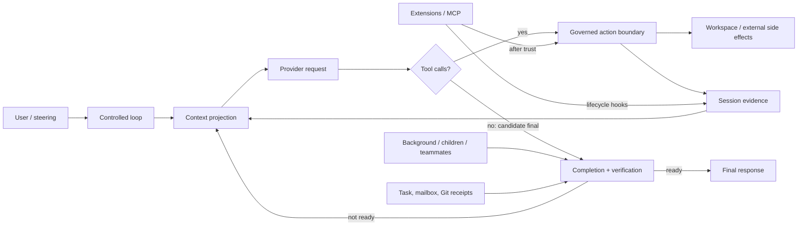

# Agent Runtime Design Synthesis

这份综合报告建立在三个冻结源码快照之上：Forge `75714f2`、Pi `977ec833`，以及 provenance 受限的 Claude 本地修复副本 `430502e`。版本绑定见 [SOURCES](SOURCES.md)，证据规则见 [METHODOLOGY](METHODOLOGY.md)。文中的统一框架是研究结论，不是任何一个项目的官方定义。

## 1. Agent Runtime Essential

### 1.1 一个可检验的定义

模型能生成下一段文本，不等于系统能安全、连续地完成任务。真正迫使 runtime 存在的痛点是：模型输出可能要求副作用，旧上下文会超预算，后台工作会晚到，进程会失败，扩展会执行用户权限代码，而“没有更多 tool call”仍不等于工作已经验收。

[INF] 基于六项专题研究，可以把 Agent Runtime 表达为：

```text
Agent Runtime
= controlled agent loop
+ governed action boundary
+ explicit context projection
+ persistent session evidence
+ delegation and coordination protocol
+ completion and verification semantics
+ extension and trust governance
```

这不是功能清单。每一项都必须有明确 owner、输入、状态转换、失败语义和可观察证据，否则能力只存在于 prompt 约定中。



Claude 本地快照用 `tool_use` 是否存在来决定主循环是否继续，而不是只信 `stop_reason`；普通 Stop hooks 只在正常结束路径形成额外 gate。`[CODE][Claude@430502e:src/query.ts:L551-L568]` `[CODE][Claude@430502e:src/query/stopHooks.ts:L175-L327]` Pi core 在 assistant turn 和整批 tool result 之后排空 steering，只有本来要结束时才读取 follow-up。`[CODE][Pi@977ec833:packages/agent/src/agent-loop.ts:L155-L275]` Forge 则把 no-tool 文本视作 candidate，先收敛 background、child、teammate 状态，再经过 CompletionGate 和可选 verifier。`[CODE][Forge@75714f2:src/core/minimalLoop.ts:L453-L586]`

三种实现的共同点是：[INF] runtime 会结合消息、异步工作、治理结果与验收状态决定是否结束，不能只看 provider stop reason。差别在于判断权归产品级集成、host policy，还是课程中显式可讲解的最小协议。

### 1.2 四类状态不能合并

| 状态 | 主要用途 | 典型 owner | 不能替代什么 |
| --- | --- | --- | --- |
| Session History | 回答过去发生过什么 | JSONL/session manager、history manager | 不能证明副作用仍存在，也不能自动恢复 in-flight work |
| Runtime State | 回答当前 run 如何决策 | loop、reducer、task/worker manager | 不是完整 transcript，也不一定 durable |
| Model Context | 决定下一次 provider request 能看到什么 | prompt/context projector | 不是所有历史和所有 runtime truth 的拼接 |
| Workspace State | 文件、Git、进程、远端系统的当前事实 | filesystem/Git/process/external service | 不能由一条 tool result 或 final 文本替代 |

Forge 当前实现把这四者拆开：prompt assembly 和 `InputHistoryManager` 产生下一轮输入，`RuntimeState` 只是事件 projection，TaskGraph/mailbox/Git 各自由模块持有。`[CODE][Forge@75714f2:src/context/promptAssembly.ts:L131-L188]` `[CODE][Forge@75714f2:src/context/compaction.ts:L138-L196]` `[CODE][Forge@75714f2:src/runtime/state.ts:L626-L668]` Pi 的 plain custom session entry 可以 durable 却不进入 LLM context，也直接证明“持久化”与“模型可见”是两条轴。`[CODE][Pi@977ec833:packages/coding-agent/src/core/session-manager.ts:L94-L140]` `[CODE][Pi@977ec833:packages/coding-agent/src/core/session-manager.ts:L379-L407]`

### 1.3 三类保证也不能混用

- `Mechanism`：代码提供什么原语，例如 lock、abort signal、append、projection。
- `Policy`：系统选择何时允许、阻止、重试或结束。
- `Product behavior`：用户在特定 host、UI 和配置下看到什么。

Pi core 没有内建 permission popup、MCP 或 subagent，不表示 extension ecosystem 做不到；Pi 明确把它们留给扩展。`[DOC][Pi@977ec833:packages/coding-agent/README.md:L491-L505]` 相反，Claude 本地副本中可见的 workspace trust、Stop hooks 或 teammate 行为，也不能自动归因于一个通用 loop primitive。其 provenance 又限制了这些代码对当前官方产品的代表性。`[DOC][Claude@430502e:README.en.md:L1-L8]` `[DOC][Claude@430502e:README.en.md:L189-L200]`

## 2. Responsibility map

下表比较的是最终 responsibility owner，不是项目“有没有某功能”。`Claude` 一列始终只指本地修复快照。

| Responsibility | Claude owner | Pi owner | Forge owner |
| --- | --- | --- | --- |
| Loop continuation | `query()` mutable state 与 transition；normal Stop hooks 可反馈续跑 | `pi-agent-core` inner loop；coding-agent host 叠加 retry/compaction | `MinimalLoopSession`，受 round cap、async settle、CompletionGate、verifier 约束 |
| Steering / follow-up | agent-scoped steering queue与 UI queue processor | core 在 turn-safe point 排空 steering；would-stop 才读 follow-up | 当前主要通过 tool result、mailbox/child notification 和 verifier feedback 进入下一轮，无通用用户 steering queue |
| Tool lookup / validation | tool contract、streaming executor、`toolExecution` | core lookup、schema validation/coercion、before/after hook | registry/composite runtime 路由；具体 handler 或 MCP adapter 持有语义校验 |
| Permission | settings、安全检查、hooks 与 interaction policy 的组合 | core 不持有；host/extension 可用 hook 实现 | loop 在 runtime execution 前调用 `PermissionPolicy`，`ask` 由 approval handler 决定 |
| Argument transformation | PreToolUse/permission 可改 input；可见路径未找到统一二次 schema parse | `beforeToolCall` 可改已验证 args，core 明确不二次校验 | 当前无 rewrite contract，policy 与 runtime 收到同一 raw arguments |
| Parallel execution order | streaming executor 并发安全工具，final results 保留输入顺序 | 默认并行；若任一 tool 标 sequential 则整批串行；result source-order | provider request 禁止 parallel calls，返回的 calls 逐个 await |
| Abort / cancellation | query、tool child controller、agent lifecycle、process cleanup 分层持有 | cooperative `AbortSignal`；不合作的 tool 可拖延 settlement | Bash/background/MCP/child/teammate 各自机制；无统一 ToolRuntime abort contract |
| Context projection | query context、system prompt、attachments、provider conversion | core `transformContext`/`convertToLlm`；coding-agent resource loader/prompt builder | prompt assembly、Observation projection、`InputHistoryManager` |
| Compaction | compact services总结后重新挂载 operational attachments | coding-agent 持久化 compaction checkpoint + retained tail；host 决定 retry | history manager 以整轮为单位替换旧段，保留 state anchor 和 recent raw rounds |
| Session persistence | UUID/`parentUuid` JSONL chain、buffered per-file writer | shipped coding-agent `SessionManager` v3 JSONL tree | `session.json` + `trace.jsonl` 是 audit evidence，不是 resume loader |
| Branch / fork | 新 session/path 并重写 identity/parent chain | same-file tree leaf 与 new-file fork 是两种操作 | Git worktree/child lineage，不是 model-history fork |
| Child lifecycle | Agent tool、`runAgent`、task registry；foreground/background abort ownership分离 | core 无原生 child；示例 extension 用前台 `pi --no-session` 子进程 | one-shot fresh child、async child、long-lived teammate 分别由专有 manager 持有 |
| Shared work ownership | locked task files、owner/status、mailbox | core 无团队协议；示例 child 只是一个 tool | root-scoped TaskGraph、atomic claim、owner-scoped transitions、mailbox cursor |
| Verification / integration | visible task/team mechanisms；完整 coordinator source 有缺口 | 由 host/extension/workflow policy决定 | research review、edit plan、source verification、Git receipt 与 task transition 显式分离 |
| Completion gate | normal Stop/TaskCompleted/TeammateIdle hooks；error path 另有语义 | core stop boundary + host policy，没有内建 team completion gate | 读取 task status、TaskGraph projection health、teammate/unread、async counts，并检查 `CHERRY_PICK_HEAD` |
| Extension trust | workspace trust、plugin manifest/loader、hook/MCP lifecycle | project trust 是 pre-load guard；extension 随后拥有进程权限 | strict preflight → resolved descriptor → per-session trust → import/spawn |
| MCP lifecycle | integrated plugin config、auth、connection cache、retry、transport cleanup | core 不持有，全部属于 extension/package | standalone/plugin MCP 适配成同一 Tool Runtime；配置白名单与 exact permission |
| Persistent audit | session chain、checkpoints/event logs，完整事务性未知 | completed messages/session entries；typed event stream 本身不 durable | typed trace + domain-owned snapshots/receipts；没有 replay contract |
| Crash recovery | append/replay 与局部 chain repair；无通用 transaction/reconciliation 证据 | completed boundaries 可恢复；in-flight journal 仍是设计方向 | c17c 不恢复 root run；attempt、idempotency、reconciliation 明确留给 c18 |

关键责任的代码锚点如下：

- `[CODE][Claude@430502e:src/services/tools/StreamingToolExecutor.ts:L407-L440]` 保证并发执行下 final result 的输入顺序；`[CODE][Claude@430502e:src/services/tools/toolExecution.ts:L754-L861]` 与 `[CODE][Claude@430502e:src/services/tools/toolExecution.ts:L1128-L1222]` 暴露 rewrite 后二次验证的研究缺口。
- `[CODE][Pi@977ec833:packages/agent/src/agent-loop.ts:L489-L554]` 区分 completion-order event 与 source-order result；`[TEST][Pi@977ec833:packages/agent/test/agent-loop.test.ts:L586-L679]` 固化该行为。
- `[CODE][Forge@75714f2:src/core/minimalLoop.ts:L1059-L1154]` 把 permission、execution、Observation 和 next-turn projection 串成一个动作边界；`[TEST][Forge@75714f2:test/core/minimalLoop.test.ts:L1539-L1605]` 证明 deny 不执行 runtime。
- `[CODE][Pi@977ec833:packages/coding-agent/src/core/session-manager.ts:L30-L172]` 定义 shipped session tree；`[CODE][Forge@75714f2:src/runtime/completionGate.ts:L42-L139]` 定义 c17c completion ownership。
- `[CODE][Forge@75714f2:src/extensions/pluginActivation.ts:L59-L143]` 将 trust 与 import/spawn 分开；`[CODE][Pi@977ec833:packages/coding-agent/src/core/extensions/loader.ts:L412-L509]` 表明 Pi extension factory 一旦 import 就在 host 进程内执行。

## 3. Core design tensions

### 3.1 Minimal core vs integrated product runtime

Pi 把 `pi-agent-core` 限定在 loop、typed events、tool execution 和 provider seam，把 permission、MCP、subagent、background process 交给 host 或 extension。`[DOC][Pi@977ec833:CONTRIBUTING.md:L5-L19]` `[DOC][Pi@977ec833:packages/coding-agent/README.md:L491-L505]` Claude 本地快照则把 hooks、teams、plugin、MCP auth 和 UI queue 连接成集成 runtime。Forge 介于两者之间：它不是通用极小 core，却只在章节痛点出现时加入一个可解释机制。

[INF] 最小 core 优化可组合性和 ownership 清晰度，但可能让关键安全 policy 在不同 host 中漂移；集成 runtime 能提供统一产品语义，却扩大状态空间、启动面和回归矩阵。Forge 的课程约束要求先证明痛点，再选择最小机制，而不是预先复制平台能力。

### 3.2 Transcript vs projected context

Claude provider path 会规范化消息、修复 pairing，并按 provider capability 重建 tools/messages。`[CODE][Claude@430502e:src/services/api/claude.ts:L1118-L1320]` Pi 先执行 `transformContext` 再 `convertToLlm`，而 custom durable entry 可以不进入 context。`[CODE][Pi@977ec833:packages/agent/src/agent-loop.ts:L281-L312]` Forge 把统一 `ToolResult` 转成 `Observation` 再投影成有界文本。`[CODE][Forge@75714f2:src/context/observation.ts:L3-L29]` `[CODE][Forge@75714f2:src/context/projection.ts:L3-L24]`

[INF] Transcript 是证据，context 是一次请求的选择结果。直接把 transcript 当 context 会丢失预算治理；直接把 context 当 history 会丢失被裁剪、压缩或隐藏的事实。评测也必须声明检查的是最终输出、model-visible trajectory，还是 runtime invariant。

### 3.3 Append-only evidence vs mutable state

Pi session entry 通过 `id`/`parentId` 构成树，active context 只走当前 root-to-leaf path。`[CODE][Pi@977ec833:packages/coding-agent/src/core/session-manager.ts:L325-L470]` Forge TaskGraph 通过 lock、revision、temp file 和 rename 更新当前 authoritative snapshot，而 trace 追加 mutation evidence。`[CODE][Forge@75714f2:src/runtime/teamTaskStore.ts:L110-L174]` `[CODE][Forge@75714f2:src/runtime/teamTaskStore.ts:L1318-L1366]`

[INF] append-only log 擅长审计和分支，mutable snapshot 擅长读取当前 truth。二者同时存在时，必须定义哪个是 authority、如何检测 divergence，以及 crash 后由 replay 还是 reconciliation 恢复。把所有状态塞进一个全局 reducer，只会隐藏 owner，不会自动提供事务性。

### 3.4 Autonomous execution vs deterministic governance

Claude permission 顺序包含 abort、deny、ask、tool-specific safety 与 passthrough；hook allow 不能覆盖更高优先级 deny/safety。`[CODE][Claude@430502e:src/utils/permissions/permissions.ts:L1158-L1318]` `[CODE][Claude@430502e:src/services/tools/toolHooks.ts:L321-L433]` Pi core 则提供 hook seam，但不规定 permission policy。Forge 用 `allow | ask | deny` 在执行前给出确定性决定，deny 作为 model-visible blocked observation 回流。

[INF] 自主执行允许已获准的调用不经人工介入。真正的约束来自执行 owner：它在 side effect 前作出不可绕过的决定，并为 deny、rewrite、approval 和 effective arguments 留下相互一致的证据。Prompt 中的一句“谨慎操作”承担不了这个责任。

### 3.5 Fresh child context vs inherited context

Claude `runAgent` 可以选择 shared 或 isolated context，并分离 sync/background abort ownership。`[CODE][Claude@430502e:src/tools/AgentTool/runAgent.ts:L347-L714]` Pi 示例 extension 启动 `pi --mode json -p --no-session`，只传任务、cwd 和可选 prompt/model/tools。`[CODE][Pi@977ec833:packages/coding-agent/examples/extensions/subagent/index.ts:L267-L414]` Forge one-shot child 创建 fresh session/trace，edit profile 另有 worktree，并不复制 parent Session History。`[CODE][Forge@75714f2:src/extensions/childSessions.ts:L160-L225]`

[INF] Fresh context 降低污染、权限继承和 token 成本，但 parent 必须显式传递目标、约束和验收标准。Inherited context 减少重新发现，却扩大隐式依赖。是否继承应由 delegated work contract 决定，不能由“subagent”这个名称默认决定。

### 3.6 Extension flexibility vs trust boundary

Pi project trust 是 import 前的选择，不是 sandbox；加载后的 extension 以 Pi 进程权限执行。`[DOC][Pi@977ec833:packages/coding-agent/docs/security.md:L31-L53]` Forge preflight 只把 manifest/descriptor 当 data，先做 canonical containment、schema 和 collision 检查，完成 per-session trust 后才 import hooks 或 spawn MCP。`[CODE][Forge@75714f2:src/extensions/pluginPreflight.ts:L168-L210]` `[CODE][Forge@75714f2:src/extensions/pluginActivation.ts:L59-L85]` Claude 本地快照则覆盖 marketplace、plugin reload、hook 和 MCP auth 等更广表面。

[INF] 扩展发现、扩展信任、每次 tool permission 和 OS sandbox 是四个边界。前一个边界通过，不代表后面三个自动成立。worktree 也只隔离 Git workspace，不限制网络、进程或主机文件权限。

### 3.7 Parallelism vs completion correctness

Claude 和 Pi 都允许并发执行，却把 final tool results 恢复为 model source order。Pi 测试进一步证明 `tool_execution_end` 可按真实完成顺序出现。`[TEST][Pi@977ec833:packages/agent/test/agent-loop.test.ts:L586-L679]` Forge 当前直接 tool call 串行，并通过异步 child/background/teammate 引入显式并发。`[CODE][Forge@75714f2:src/core/minimalLoop.ts:L589-L615]`

[INF] “并行”至少需要分别定义 preflight 顺序、approval 顺序、开始顺序、progress 顺序、结果插入顺序、sibling cancellation 和 final gate。只把 `Promise.all` 加进 executor 不能回答这些问题。Forge 暂不并行 direct calls，换来的是更窄、更容易教学和验证的 semantics。

### 3.8 Resume vs actual crash recovery

Claude JSONL parent chain 支持 resume/fork 和局部 repair，但 writer 是 buffered append，当前证据没有通用 fsync transaction 或 reconciliation worker。`[CODE][Claude@430502e:src/utils/sessionStorage.ts:L606-L686]` `[CODE][Claude@430502e:src/utils/sessionStorage.ts:L1823-L2243]` Pi shipped coding-agent 在 completed `message_end` 边界持久化；它的 durable-harness 文档把 in-flight operation journal 仍列为设计方向。`[CODE][Pi@977ec833:packages/coding-agent/src/core/agent-session.ts:L618-L665]` `[DOC][Pi@977ec833:packages/agent/docs/durable-harness.md:L83-L203]` Forge c17c 根本不从 trace 重建 run。

[INF] Resume 是重新构造一段可用 history/context；recovery 还必须解释未完成 provider stream、可能已成功的 tool side effect、丢失的 worker process、mailbox cursor 和 Git receipt。没有 attempt identity、idempotency metadata 与 reconciliation 时，不应使用“exactly once”描述恢复。

### 3.9 Worktree isolation vs security sandbox

Forge worktree binding 让 edit child 和 target 在不同 Git workspace 中工作，Git integration 再验证 fingerprint、target cleanliness 和 cherry-pick。`[CODE][Forge@75714f2:src/runtime/workspace.ts:L76-L159]` `[CODE][Forge@75714f2:src/runtime/gitIntegration.ts:L74-L140]` Pi security 文档同样明确 project trust 不等于 sandbox。`[DOC][Pi@977ec833:packages/coding-agent/docs/security.md:L5-L37]`

[INF] Worktree 解决并行编辑和可审阅 integration；sandbox 解决 capability confinement。前者不会阻止读取其他目录、访问网络或启动进程。把两者混写会高估安全保证，也会让 permission 和 process isolation 的 owner 消失。

### 3.10 Model judgment vs deterministic verification

模型可以判断任务似乎完成，却不能单独证明 tests、TaskGraph owner、Git source fingerprint 或 teammate shutdown。Forge 因此先让 CompletionGate 读取task、graph projection、member与async的明确输入，再在 ready 后执行 root verifier；edit receipt先通过TaskGraph status间接进入判断，gate不直接验证Git history或fingerprint。`[CODE][Forge@75714f2:src/runtime/completionGate.ts:L42-L139]` `[TEST][Forge@75714f2:test/runtime/completionGate.test.ts:L17-L199]` `[TEST][Forge@75714f2:test/core/minimalLoop.test.ts:L2156-L2263]`

[INF] Model judgment适合解释和选择下一步；deterministic verification 适合判定机器可检查的 acceptance criteria。两者都不是万能 gate：检查可能不完整，verifier 也可能失败，所以失败是否可恢复、最多重试多少次、谁能 override 必须写成 policy。

### 3.11 Provider normalization vs capability leakage

Pi 将 `StreamFn` 放在 core seam 下，并由 `pi-ai` provider registry 持有 auth、catalog 和 stream behavior。`[CODE][Pi@977ec833:packages/ai/src/models.ts:L66-L187]` Claude provider conversion 既统一 message/tool forms，又保留 Bedrock 和 strict-schema 等分支。`[CODE][Claude@430502e:src/utils/messages.ts:L1989-L2110]` Forge 的 production path 仍直接使用 OpenAI Responses request shape，虽然 tests 可以注入 `ResponseCreate`。`[CODE][Forge@75714f2:src/core/minimalLoop.ts:L93-L114]`

[INF] Provider abstraction 应统一 loop 所需的事件和 tool-call contract，但不应把 thinking、media、prompt caching 或 parallel-tool capability 强行压成最低公分母。Forge 目前没有被第二个 provider 的具体痛点逼迫，因此 callable seam 已足够；宣称 provider-neutral 会超过证据。

### 3.12 Observability vs backpressure

Pi core listeners 是 awaited typed event stream，listener latency 因此可能进入主执行路径；它不是 durable trace。`[CODE][Pi@977ec833:packages/agent/src/agent.ts:L233-L246]` `[CODE][Pi@977ec833:packages/agent/src/agent.ts:L522-L576]` Forge 先记录 source lifecycle event，再顺序调用 failure-isolated plugin hooks。`[CODE][Forge@75714f2:src/extensions/lifecycle.ts:L23-L83]` Claude 本地 query 则在 model/tool/terminal 阶段发 checkpoints 和 logs。`[CODE][Claude@430502e:src/query.ts:L560-L580]` `[CODE][Claude@430502e:src/query.ts:L1523-L1545]`

Forge 的 trace surface 已经走在 plugin subscription surface 前面：c17 协调事件存在于 trace union，plugin preflight 的固定 event allowlist却尚未接入它们。`[CODE][Forge@75714f2:src/runtime/trace.ts:L362-L430]` `[CODE][Forge@75714f2:src/extensions/pluginPreflight.ts:L25-L60]` 这不是 telemetry 丢失，但会让外部 lifecycle observer 看不到一部分 host 已记录的事实。

[INF] 可观察性必须区分 model-visible messages、user transcript、runtime event、debug log、persistent audit 和 evaluation dataset。awaited listener 提供确定性顺序，却可能形成 backpressure；fire-and-forget 降低延迟，却需要容量、drop policy 和 shutdown flush。没有稳定 causal ID 和 replay contract 的 trace 不能直接宣称可重放。

## 4. Forge design lineage

这里的 `lineage` 指可以由 Forge commit/tutorial sequence 与当前机制证明的演进，不声称作者历史上直接复制了 Claude 或 Pi。跨项目相似性只写作“研究对照发现”。

### 4.1 Forge 观察到的共同问题

[INF] 三套实现都在处理同一组 runtime pressure：tool call 必须配对、context 必须投影、async work 必须收敛、session evidence 必须可定位、extension code 必须有 trust boundary。它们的共同问题不代表共同实现来源。

Forge 自己的演进从一个真实 loop 开始，依次加入 Tool Runtime、Permission Governance、Context Projection、Session/Trace、RuntimeState、Verification、Compaction、background、worktree、children、MCP/plugins，再到 c17 的 TaskGraph、mailbox 和 completion protocol。`[DOC][Forge@75714f2:README.md:L3-L15]` `[DOC][Forge@75714f2:README.md:L55-L77]`

### 4.2 已采用的机制

| 被具体痛点逼出的责任 | Forge 选择 | 研究对照中的相似原则 |
| --- | --- | --- |
| tool routing 不能留在 loop 中无限分支 | 小型 registry + uniform `ToolResult` | Pi/Claude 同样把 unknown/error 规范化成 tool result |
| 模型不能直接越过副作用边界 | execution 前的 `allow/ask/deny` | Claude 有更宽的 layered permission；Pi 把 policy 留给 host |
| 历史不能无限增长 | round-aware compaction + state anchor | Claude/Pi 都把 summary 与 operational context 重建分开 |
| parent final 不能忽略后台工作 | async notification + settle-before-final | Claude/Pi 都区分 active work 与 terminal assistant text |
| 多 worker 的“做完”不能只靠消息 | atomic claim、evidence/review、verification、Git receipt、CompletionGate | Claude task/mailbox 说明 owner/idle 概念；Pi core 不提供 team protocol |
| local plugin discovery 不应立即执行代码 | data-only preflight + resolved descriptor + trust barrier | Pi/Claude 的 extension surface 显示 import 后 authority 很大 |

上表只是机制层对照。Forge 自身的 code/test 才是它采用这些机制的证据，例如 exact raw argument boundary。`[TEST][Forge@75714f2:test/core/minimalLoop.test.ts:L1488-L1537]` task claim 的单一赢家与 review/integration protocol。`[TEST][Forge@75714f2:test/runtime/teamTaskProtocol.test.ts:L59-L207]` trust-before-import 与 deterministic cleanup。`[TEST][Forge@75714f2:test/extensions/pluginActivation.test.ts:L21-L117]`

### 4.3 Forge 的不同选择

- Direct tool calls 保持串行，不提前引入并发 executor、progress stream 与统一 sibling cancellation。
- `PermissionDecision` 不提供 argument rewrite，避免在当前章节同时引入 original/effective request、二次 validation 和 approval evidence 一致性问题。
- Session/trace 只用于 audit，不提供 resume/fork conversation tree。
- Plugin 只支持已经存在的 local directory，不实现 marketplace、download、signature、persistent trust 或 hot reload。
- Child、teammate、TaskGraph 和 Git integration 是分开的 owner modules；CompletionGate 只读收敛状态，不成为 state god-module 或 recovery engine。

这些边界可由当前实现和明确 non-goals 交叉验证。`[CODE][Forge@75714f2:src/governance/types.ts:L3-L28]` `[DOC][Forge@75714f2:docs/tutorial/c16b-plugin-loading-registration.md:L366-L379]` `[DOC][Forge@75714f2:docs/tutorial/c17c-coordination-completion-protocol.md:L391-L411]`

### 4.4 独立形成的课程表达

Forge 的课程表达重在机制拆解：每个 checkpoint 都遵循 `问题 -> 解决方案 -> 最小实现 -> 运行验证 -> 下一步缺口`，五层架构 lens 则用来描述跨章节责任。`[DOC][Forge@75714f2:docs/01-project-architecture.md:L72-L98]` c17c 把 owner、plan approval、evidence、verification、Git integration、shutdown 和 final gate 串成可测试协议；这里的 multi-agent 指协作协议，不只是多个模型同时运行。

[INF] 这种分解方式优化的是教学顺序、failure semantics 可见性和技术沟通，不证明吞吐量或平台规模优于集成 runtime。

### 4.5 有意未实现的 production problems

当前 Forge 不承诺：

- model/tool execution Attempt 的 durable identity；
- side effect 的通用 idempotency key；
- trace replay 重建 RuntimeState；
- crash 后重新附着 child/teammate/process；
- mailbox cursor 与 worker effect 的 exactly-once delivery；
- Git side effect 与 TaskGraph receipt 的 transaction；
- reconciliation loop、leader failover 或高可用 team；
- secure sandbox、多租户隔离或 extension supply-chain identity。

目前最危险的已知窗口位于 source commit/cherry-pick 成功之后、integration receipt 写入之前。c17c 文档把 attempts、resume、idempotency、reconciliation 与 event replay 留给 c18。`[DOC][Forge@75714f2:docs/tutorial/c17c-coordination-completion-protocol.md:L391-L411]` [INF] 下一步应先定义 Attempt、operation intent、idempotency class 和各 owner 的 reconciliation record，不能先声称 exactly-once。

## 5. Job-seeking interpretation

### 5.1 这套项目与研究可以证明什么

| 能力 | 可审阅证据 |
| --- | --- |
| Agent Runtime design | 从 loop 到 completion 的 22 个 runnable checkpoint，以及六篇按 ownership/invariant/failure 比较的研究 |
| Context Engineering | prompt precedence、skill/memory projection、Observation boundary、round-aware compaction |
| Tool governance | lookup/validation/permission/execution/result 的动作链，deny 与 external MCP 复用同一 boundary |
| Session / Trace modeling | 清楚区分 History、RuntimeState、Model Context、Workspace State，并承认 audit 与 recovery 的差别 |
| Failure semantics | abort、deny、timeout、partial success、async convergence、Git/receipt crash window 的显式分析 |
| Subagent coordination | fresh child、async child、long-lived teammate、TaskGraph、mailbox、verification 和 integration 的责任拆分 |
| MCP / plugin trust boundary | preflight、canonical path、resolved descriptor、per-session trust、import/spawn、cleanup |
| Source-code research | 三个冻结 commit 的本地 code/test/doc 交叉引用，并对 Claude provenance 与未运行实验降级 |
| Technical communication | 中文 tutorial 与 Design Study 将调用链转成 invariant、trade-off 和 interview answer |
| Production boundary awareness | 明确 c17c 能保证的 current-run protocol，以及 c18 才能讨论的 recovery/idempotency/reconciliation |

### 5.2 这套材料不能证明什么

- 大规模线上流量、长时间 soak 或真实 p99 latency；
- 多租户平台运营、billing、quota 或组织级 RBAC；
- 模型训练、微调、alignment 或 provider 本身质量；
- 真实用户留存、任务成功率或商业指标；
- 完整 secure sandbox、恶意插件隔离或 supply-chain security；
- 完整 durable workflow engine、exactly-once effect 或跨进程高可用；
- 当前官方 Claude Code 的精确实现，因为 Claude 证据来自 provenance 受限的本地修复副本。

这些限制就是材料的证据边界，也让 prototype evidence、deterministic contract 与 production claim 的区别保持可审查。

## 6. Resume bullets

以下 bullet 可以按目标职位调整，但不应删除版本和边界语义：

- 以 TypeScript 从零构建 tutorial-driven coding-agent harness，迭代 22 个 runnable checkpoints，覆盖 tool governance、context compaction、session trace、background/child execution、MCP/plugin 与 c17c completion protocol。
- 设计 root-scoped multi-agent coordination protocol：atomic task claim、evidence/review、edit plan approval、source verification、Git integration receipt、ownership-aware teammate shutdown，以及对task/graph/member失败显式收敛的 CompletionGate，并用 deterministic tests 固化关键 invariant。
- 对 Forge、Pi 与 provenance 受限的 Claude 本地源码快照开展 evidence-grounded runtime study，以 commit/line 级引用比较 loop、action boundary、context、session、delegation 与 extension trust，明确 mechanism、policy 和 product behavior 的边界。
- 系统分析 tool/Git/mailbox 的 partial-success 与 crash windows，明确区分 resume、recovery、idempotency 和 reconciliation，并将 cross-run hardening 限定为后续 c18 设计范围。

## 7. Interview introduction

### 7.1 30 秒项目介绍

> Forge Harness 是一个用 TypeScript 从真实 LLM-tool loop 逐章构建 coding-agent runtime 的项目。它不先引入 orchestration framework，而是让每个痛点只增加一个最小机制：permission、context projection、trace、verification、background/child、MCP/plugin，到 c17c 的 task ownership、Git integration 和 CompletionGate。我又用冻结源码对照 Pi 和一个 provenance 受限的 Claude 本地副本，重点研究 owner、invariant 和 failure semantics，而不是比较功能数量。

### 7.2 2 分钟项目介绍

> 我把 coding agent 看成受控 runtime。Prompt 和工具只是输入面；最内层 loop 在模型返回 tool call 时继续，没有 tool call 时也只得到 candidate final。所有由模型请求的 tool side effects 都经过确定性 action boundary，包括 lookup、validation、permission、execution 和统一 result projection；plugin import、MCP process startup和cleanup等host lifecycle effects另有owner与governance路径。Context 也不会原样累积 transcript，而是 system prompt、memory/skills、recent rounds、compaction summary 和 runtime anchor 的一次投影。
>
> 随着任务变长，单一 session 不够，所以项目逐步加入 background tool、fresh child、async child 和 long-lived teammate。c17 再补上共享 TaskGraph、atomic claim、mailbox、evidence/review、edit plan、source verification 和 Git integration receipt。edit task只有写入matching receipt后才会变成completed；CompletionGate随后检查task status、graph projection health、异步计数、teammate停止状态与活动cherry-pick，ready后还可以跑deterministic verifier。它不直接检查Git history或完整integration truth。
>
> 我没有把这描述成 durable workflow engine。当前 trace 是 audit，不会重建 run；Git cherry-pick 与 receipt persistence 之间仍有 crash window。attempt identity、idempotency 和 reconciliation 被明确留给 c18。这种边界意识也是源码研究的重点：Pi 的很多 policy 属于 host/extension，Claude 证据又有本地修复副本的 provenance 限制，所以所有结论都按 code/test/run/doc 和 confidence 标注。

### 7.3 5 分钟 architecture deep dive 路线

1. **从 forced pain point 开始（30 秒）**：说明为什么 no-tool 文本、后台 quiet 和已验收完成是三个不同事实。
2. **画四类 state（45 秒）**：Session History、Runtime State、Model Context、Workspace State；解释各自 owner 和 durability。
3. **追一条 tool call（60 秒）**：model output → lookup/validation → permission → execution → `ToolResult`/Observation → trace/context；强调 deny 不执行及 current no-rewrite boundary。
4. **解释 context lifecycle（45 秒）**：prompt assets、projection、whole-round compaction、state anchor 与 recent raw rounds。
5. **解释 coordination protocol（75 秒）**：fresh child 与 teammate 的差别，TaskGraph atomic claim，research review/edit plan，verification、Git receipt、shutdown 与 CompletionGate。
6. **解释 trust boundary（35 秒）**：plugin descriptor 在 trust 前只是 data；import/spawn、per-call permission、worktree 与 sandbox 是不同边界。
7. **以 failure window 收尾（50 秒）**：cherry-pick 成功但 receipt 未持久化、mailbox claim-before-effect、进程丢失；说明 c17c 保证 current-run convergence，c18 才讨论 Attempt、idempotency 和 reconciliation。

面试中如果被问“为什么不直接用成熟 framework”，可以回答：课程先把 responsibility owner 和 failure semantics 摊开。等具体痛点超过现有小机制的承载能力，再引入更大的 orchestration abstraction；框架本身并不是非目标。
