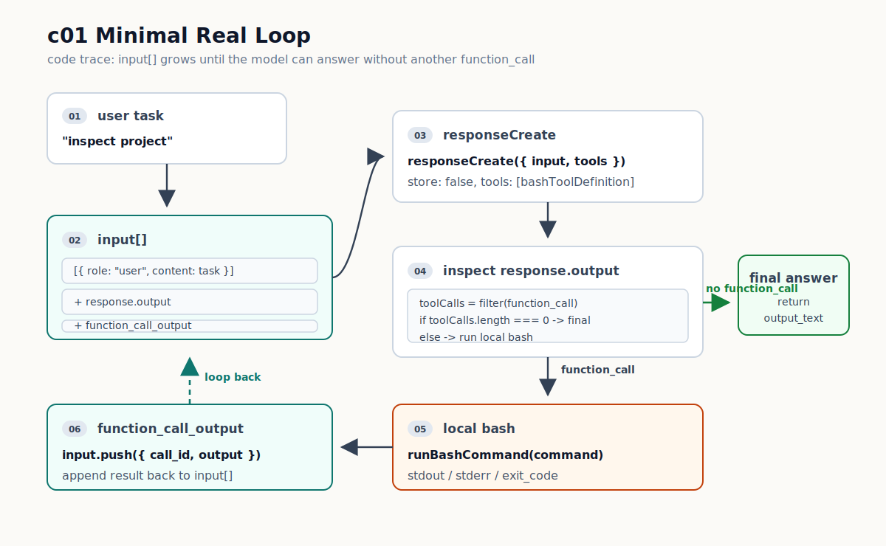

# c01 Minimal Real Loop

你让大模型做一件很普通的事：读取当前目录，看看项目里有哪些文件，然后继续判断下一步该看什么。

模型可能会给你一条命令，比如 `ls -la`。问题是，它输出完命令就停了。命令不会自动跑在你的机器上，stdout/stderr 也不会自己回到下一轮对话。

你当然可以手动复制命令，打开终端运行，再把输出粘贴回去。下一条命令出来，你再跑一次、再贴一次，直到任务完成。

c01 要做的事，就是把这段手动过程写成一个最小的 real loop。

## 问题

LLM 可以读懂任务，也可以在 Responses API 里请求一次 `function_call`。但它不能直接执行本地命令，也不能把命令结果自动塞回下一轮 request。

所以真正缺的是这段 harness：

```text
模型请求命令 -> 本地执行命令 -> 收集结果 -> 把结果交回模型
```

如果这段还靠人手动做，就不是一个 coding agent loop，只是一段带复制粘贴的对话。

## 解决方案

c01 只补一条最小路径：模型请求 tool，harness 在本地执行，再把结果作为 `function_call_output` 回填给模型。



这张图按一次 loop 来读：

1. 用户任务先进入本地 `input[]`。
2. harness 把 `input[]` 和 tool definition 一起发给 LLM API。
3. 如果模型没有请求 tool，`response.output_text` 就是 final answer。
4. 如果模型返回 `function_call`，harness 调用本地 `bash`。
5. `bash` 的结果会变成 `function_call_output`，追加回 `input[]`，然后进入下一轮。

这一章还不做完整的 approval flow、长期 session、trace、context projection，也没有 `Tool Runtime`。现在只让这条真实回路先跑起来。

## 最小实现

核心入口是 `src/core/minimalLoop.ts` 里的 `runMinimalLoop`。代码可以按上面那张图拆开看。

第一步，用户任务进入本地消息历史：

```ts
// src/core/minimalLoop.ts / runMinimalLoop
const input: ResponseInputItem[] = [{ role: "user", content: options.task }];
```

这里的 `input` 不是一次性参数。它会在后面不断追加模型 output 和 tool result，变成这一轮 agent 的本地 history。

第二步，把 `input` 和当前可用的 tool 一起发给 LLM：

```ts
// src/core/minimalLoop.ts / runMinimalLoop
const response = await responseCreate({
  input,
  model,
  store: false,
  parallel_tool_calls: false,
  tools: [bashToolDefinition],
  // include / instructions / reasoning / text 省略
});

input.push(...response.output);
```

`store: false` 表示不使用 OpenAI stored conversation。历史保存在本地 `input` 数组里。`tools: [bashToolDefinition]` 表示 c01 只暴露一个本地 `bash` tool。

第三步，看模型有没有请求 tool：

```ts
// src/core/minimalLoop.ts / runMinimalLoop
const toolCalls = response.output.filter(isFunctionToolCall);

if (toolCalls.length === 0) {
  const finalAnswer = response.output_text.trim();
  return { finalAnswer, rounds: round };
}
```

没有 `function_call` 时，loop 结束。这里对应图里的 `final answer`。

第四步，有 `function_call` 时，harness 执行本地 tool，并把结果回填：

```ts
// src/core/minimalLoop.ts / runMinimalLoop
for (const toolCall of toolCalls) {
  const resultText = await executeToolCall(
    toolCall,
    options.cwd,
    round,
    options.transcript,
  );

  input.push({
    type: "function_call_output",
    call_id: toolCall.call_id,
    output: resultText,
  });
}
```

这段代码对应图里的 `local bash -> function_call_output -> input[]`。`call_id` 用来告诉 Responses API：这份 output 是哪一次 function call 的结果。

最后，把这些步骤放进外层轮次里：

```ts
// src/core/minimalLoop.ts / runMinimalLoop
for (let round = 1; round <= maxToolRounds; round += 1) {
  // 1. request: input + tools -> LLM
  // 2. inspect: response.output 里有没有 function_call
  // 3. done: 没有 tool call 就返回 final answer
  // 4. act: 有 tool call 就执行本地 tool
  // 5. feed back: function_call_output push 回 input
}
```

这就是 c01 的 real loop。它不靠人复制命令，也不靠模型自己执行命令。模型只提出调用；harness 负责本地执行和结果回填。

## 运行验证

开始前，先按 [README](../../README.md#setup) 的 `Setup` 完成依赖安装和 `.env` 配置。

先 build：

```bash
npm run build
```

再跑一次真实 CLI：

```bash
npm run start -- "inspect this project scaffold and summarize what is implemented"
```

你会看到类似这样的输出：

```text
[round 1] model=gpt-5.4-mini
[round 1] function_call: bash {"command":"ls -la"}
[round 1] tool_result:
status: completed
command: ls -la
exit_code: 0
duration_ms: ...
stdout:
...
stderr:
(empty)

[final]
...
```

具体命令和 final answer 可能不同。模型可能先跑 `ls -la`，也可能先看 `package.json`。这里先看 transcript 里的三条证据，不纠结它选了哪条命令。

`function_call` 这一行说明模型请求了 tool。它来自 `src/core/minimalLoop.ts`：`runMinimalLoop` 从 `response.output` 里筛出 `type === "function_call"` 的项，然后通过 CLI transcript callback 打印出来。

`tool_result` 这一段说明本地命令已经执行过。它来自 `src/core/bashTool.ts`：`runBashCommand` 返回 stdout/stderr/exit code，再由 `formatBashResultForModel` 整理成文本。

`[final]` 说明下一轮模型没有再请求 tool。`runMinimalLoop` 走到 `toolCalls.length === 0` 的分支，使用 `response.output_text` 结束。

这些 transcript 标记是 harness 自己打印的，不是 OpenAI raw JSON。它们只是为了让你看清回路：模型请求 tool，本地执行，结果回填，模型给最终回答。

## 补充：bash 的最小保护

`bash` 的细节先放到这里。它不是 c01 的核心概念，但它决定了本地命令怎么被执行。

`src/core/minimalLoop.ts` 里的 `executeToolCall` 目前只认识一个 tool：

```ts
// src/core/minimalLoop.ts / executeToolCall
if (toolCall.name !== BASH_TOOL_NAME) {
  return `status: blocked\nblocked_reason: unknown tool "${toolCall.name}"`;
}

const args = parseBashToolArguments(toolCall.arguments);
const result = await runBashCommand(args.command, { cwd });
const resultText = formatBashResultForModel(result);
```

本地执行发生在 `src/core/bashTool.ts` 的 `runBashCommand`。它先挡掉明显危险的命令：

```ts
// src/core/bashTool.ts / runBashCommand
const blockedReason = findDangerousCommandReason(command);

if (blockedReason) {
  return {
    command,
    durationMs: Date.now() - startedAt,
    status: "blocked",
    exitCode: null,
    stdout: "",
    stderr: blockedReason,
    blockedReason,
  };
}
```

比如模型请求 `sudo whoami`，这里会直接返回 `status: blocked`，不会真的执行。

如果没有被挡掉，才会启动子进程：

```ts
// src/core/bashTool.ts / runBashCommand
const child = spawn("bash", ["-lc", command], {
  cwd: options.cwd,
  detached: true,
  env: createBashEnvironment(),
  stdio: ["ignore", "pipe", "pipe"],
});
```

这几个参数对应 c01 的最小保护：

- `cwd: options.cwd`：命令固定跑在 CLI 启动目录。
- `env: createBashEnvironment()`：传给子进程的 env 会过滤掉名字像 secret/token/key 的变量。
- `stdio: ["ignore", "pipe", "pipe"]`：harness 接住 stdout/stderr，再整理给模型。

`runBashCommand` 默认 20 秒 timeout，stdout/stderr 各最多保留 20,000 个字符。结果最后会变成 plain text：

```text
status: completed
command: ls -la
exit_code: 0
duration_ms: 123
stdout:
...
stderr:
(empty)
```

c01 先用这种文本结果。等多个 tools 出现，再统一 result protocol。

## 下一步缺口

c01 的问题也很明显：`runMinimalLoop` 直接负责 tool routing。

如果下一章要在 `bash` 旁边加一个 `read_file`，最容易写成这样：

```ts
for (const toolCall of toolCalls) {
  if (toolCall.name === "bash") {
    return runBashTool(toolCall);
  }

  if (toolCall.name === "read_file") {
    return runReadFileTool(toolCall);
  }
}
```

再加第三个、第四个 tool，`minimalLoop.ts` 就会继续长出新的 `if (toolCall.name === ...)`。它本来只该控制 request/response 的轮转，却开始负责工具定义、参数解析、分发和结果格式。

这就是 c02 要引入 `Tool Runtime` 的原因：把 tool definition、registry、dispatcher 和 result protocol 从 `runMinimalLoop` 里移出去。
