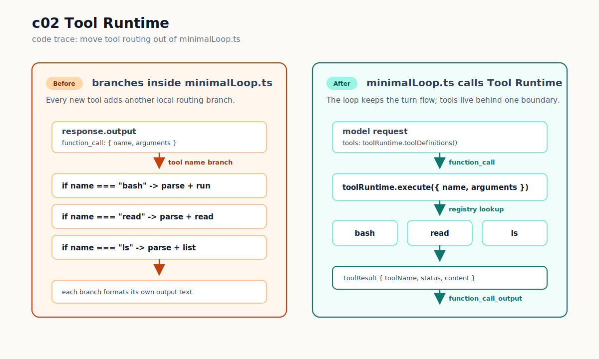
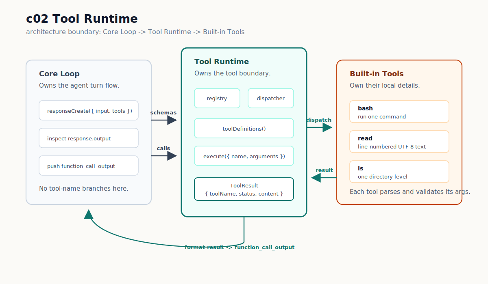

# c02 Tool Runtime

c01 已经能跑一条真实回路：模型请求 `bash`，harness 在本地执行，再把结果交回模型。

只有一个 tool 时，这样写还可以接受。问题从第二个 tool 开始出现。比如你想让模型少用 shell 读文件，改成先用 `ls` 看目录，再用 `read` 读文本文件。最直接的写法会把 loop 写成这样：

```ts
// bad shape inside src/core/minimalLoop.ts
if (toolCall.name === "bash") {
  return runBashTool(toolCall);
}

if (toolCall.name === "read") {
  return runReadTool(toolCall);
}
```

再加 `ls`、`grep`、`find`、`write`、`edit`，`minimalLoop.ts` 里的分支会越来越多。它本来只该控制 LLM request、tool result 回填和停止条件，却开始负责 tool schema、参数解析、分发和错误格式。

c02 要解决的就是这件事：把 tool routing 移出 loop，变成 `Tool Runtime`。

## 问题

`runMinimalLoop` 的职责应该是：

```text
model request -> inspect output -> execute requested tool -> append function_call_output
```

它不该知道每个 tool 的参数怎么解析，也不该知道 `read` 和 `ls` 的路径边界怎么处理。

继续这样写，core loop 会变成一个不断扩张的 `if (toolCall.name === ...)` 列表。这个列表短期能跑，但后面的章节很难继续保持边界清楚：Permission Governance、Reviewable File Editing、Context Projection 都需要稳定的 tool 接入边界。

## 解决方案

把 tool routing 移出 loop 后，数据流变成这样：



左边是 c02 前的问题：`minimalLoop.ts` 里按 tool name 逐个判断。右边是 c02 后的路径：loop 从 runtime 取得 tool definitions，再把 function call 交给 runtime 执行。工具执行完后，runtime 返回统一的 `ToolResult`，loop 再把它格式化成 `function_call_output`。

c02 新增 `src/tools/`，让它负责四件事：

- `ToolDefinition`：暴露给 Responses API 的 function tool schema。
- registry：保存当前 runtime 注册了哪些 tools。
- dispatcher：按 `toolCall.name` 找到对应 handler。
- `ToolResult`：每个 tool 都返回同一种内部结果，再统一格式化给模型。

这一章实际注册三个 built-in tools：

```text
bash  -> 保留 c01 的本地命令执行能力
ls    -> 只列当前工作目录内的一层目录
read  -> 只读当前工作目录内的 UTF-8 文本文件
```

`edit` 和 `write` 先不进 c02。文件修改需要 reviewable result 和 permission boundary，会在 c04 处理。

`grep` 和 `find` 也先不进 c02。搜索工具的麻烦在于输出很快变多、变噪；它们会在 c05 和 `Context Projection` 一起出现。

## 最小实现

先用图看代码边界：



左边的 `Core Loop` 继续负责 request/response 轮转。中间的 `Tool Runtime` 负责 registry、dispatcher 和 `ToolResult`。右边的 built-in tools 只包含这一章真正实现的 `bash`、`read`、`ls`。

先看 runtime 的接口。`src/tools/types.ts` 里定义了 tool 层的共同语言：

```ts
export type ToolStatus = "completed" | "failed" | "blocked" | "timed_out";

export interface ToolResult {
  toolName: string;
  status: ToolStatus;
  content: string;
  metadata?: Record<string, unknown>;
}

export interface ToolRuntime {
  toolDefinitions(): ToolDefinition[];
  execute(toolCall: ToolCallRequest): Promise<ToolResult>;
}
```

这两个方法把模型入口和执行入口分开。

`toolDefinitions()` 给模型看，返回 OpenAI function tools 需要的 schema。

`execute()` 给 loop 用。loop 只传 `{ name, arguments }`，不再自己判断 `bash`、`read` 或 `ls`。

实际分发在 `src/tools/runtime.ts`：

```ts
export function createToolRuntime(tools: RegisteredTool[]): ToolRuntime {
  const registry = new Map(tools.map((tool) => [tool.definition.name, tool]));

  return {
    toolDefinitions() {
      return tools.map((tool) => tool.definition);
    },
    async execute(toolCall) {
      const tool = registry.get(toolCall.name);

      if (!tool) {
        return {
          content: `blocked_reason: unknown tool "${toolCall.name}"`,
          status: "blocked",
          toolName: toolCall.name,
        };
      }

      return tool.handler({ rawArguments: toolCall.arguments });
    },
  };
}
```

unknown tool 不再由 `minimalLoop.ts` 处理。它会变成一个 `ToolResult`，再回填给模型。这样模型能看到问题并调整下一步，而不是让 harness 直接失败。

默认 runtime 在 `src/tools/defaultRuntime.ts` 注册三个 built-ins：

```ts
export function createDefaultToolRuntime(options: DefaultToolRuntimeOptions): ToolRuntime {
  return createToolRuntime([
    createBashTool(options.cwd),
    createReadTool(options.cwd),
    createLsTool(options.cwd),
  ]);
}
```

`bash` 的执行逻辑从 `src/core/` 移到 `src/tools/bashTool.ts`。行为保持 c01 的最小保护：危险命令 deny list、20 秒 timeout、stdout/stderr 截断、secret-like env 过滤。

`read` 和 `ls` 多了一个共同边界：路径必须留在 `cwd` 内。这个边界只防止只读工具越过当前项目目录，不是完整的 Permission Governance。c03 会继续处理动作风险和审批。

`read` 的输出带行号：

```text
tool: read
status: completed
path: package.json
content:
1 | {
2 |   "name": "forge-harness",
...
```

`ls` 只列一层目录：

```text
tool: ls
status: completed
path: src
entries:
[dir] cli
[dir] core
[dir] tools
```

最后看 `src/core/minimalLoop.ts` 的变化。loop 现在只依赖 runtime：

```ts
const toolRuntime = options.toolRuntime ?? createDefaultToolRuntime({ cwd: options.cwd });

const response = await responseCreate({
  input,
  model,
  parallel_tool_calls: false,
  tools: toolRuntime.toolDefinitions(),
  // include / instructions / reasoning / text 省略
});
```

执行 tool 时也不再有 tool-name 分支：

```ts
const result = await toolRuntime.execute({
  arguments: toolCall.arguments,
  name: toolCall.name,
});

const resultText = formatToolResultForModel(result);
```

`runMinimalLoop` 还允许测试注入 fake runtime。真实 CLI 不需要关心这件事；它仍然走默认 built-in runtime。

## 运行验证

开始前，先按 [README](../../README.md#setup) 完成依赖安装和 `.env` 配置。

先 build：

```bash
npm run build
```

再跑一次 CLI，让模型优先使用 `ls` 和 `read`：

```bash
npm run start -- "Use ls to inspect the project root, then use read to inspect package.json. Summarize what the tool runtime now exposes."
```

你会看到类似这样的 transcript：

```text
[round 1] model=gpt-5.4-mini
[round 1] function_call: ls {"path":"."}
[round 1] tool_result:
tool: ls
status: completed
path: .
entries:
[dir] docs
[dir] src
...

[round 2] function_call: read {"path":"package.json"}
[round 2] tool_result:
tool: read
status: completed
path: package.json
content:
1 | {
...

[final]
...
```

具体 round 数和模型措辞可能不同。这里看三件事：

- `function_call: ls` 说明模型看到了新增的 `ls` tool definition。
- `function_call: read` 说明第二个结构化 tool 也能走同一条 runtime path。
- `tool_result` 统一以 `tool:` 和 `status:` 开头，说明结果已经经过 `ToolResult` protocol，而不是每个 tool 自己随便返回文本。

维护者可以再跑完整检查：

```bash
npm run test
npm run typecheck
npm run build
```

## 下一步缺口

c02 只把多个 tools 接到同一条 runtime path。它还没有判断哪些动作能执行。

现在 `bash` 仍然能跑很多有 side effect 的命令，只是保留了 c01 的危险命令 deny list。下一章 c03 会引入 `Permission Governance`，把 tool call 执行前的 allow、deny 和 approval 抽成单独机制。

这一章也没有实现文件修改。`edit` 和 `write` 会在 c04 作为 reviewable file editing 进入。

`grep` 和 `find` 会等到 c05。搜索结果会制造 context pressure，正好引出 `Observation` 和 `Context Projection`。
