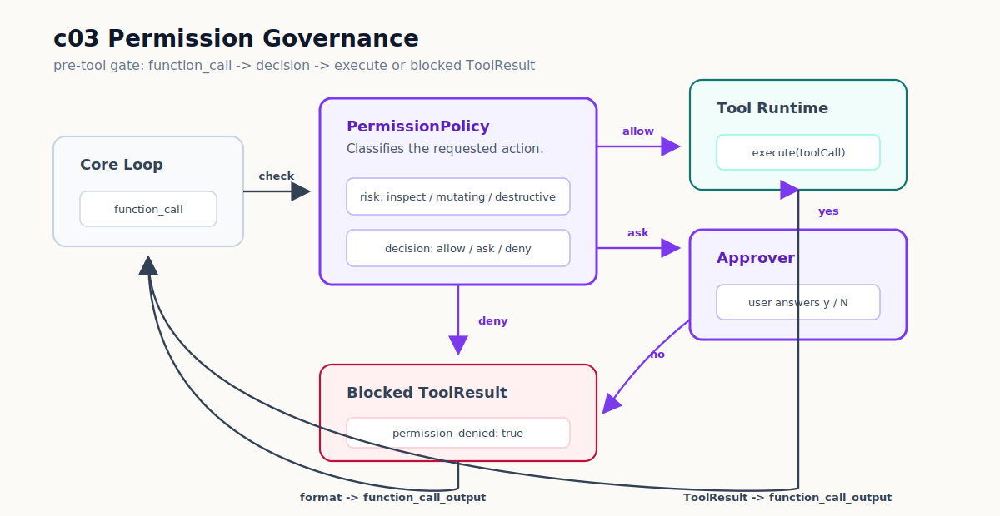

# c03 Permission Governance

c02 之后，模型已经能在同一条 `Tool Runtime` 路径里调用 `bash`、`read` 和 `ls`。

这解决了 tool routing 膨胀的问题，但也暴露出新的边界：`read` 和 `ls` 基本只做 inspect，`bash` 却可能写文件、安装依赖、提交代码，甚至执行破坏性命令。只靠 system prompt 里一句“优先 inspect-only commands”不够。模型只要请求了 tool，harness 就会执行。

所以 c03 要补一层 `Permission Governance`：tool 执行前，先判断这个动作能不能直接执行。

## 问题

现在的 loop 已经不再写 `if (toolCall.name === "bash")`，但它仍然会直接执行 runtime：

```ts
// c02 shape inside src/core/minimalLoop.ts
const result = await toolRuntime.execute({
  arguments: toolCall.arguments,
  name: toolCall.name,
});
```

这段代码的 routing 已经干净了，缺的是 action boundary。比如模型请求：

```json
{"command":"touch c03-permission-demo.txt"}
```

这不是危险命令，但它会修改工作区。`bashTool` 里的 deny list 可以挡掉 `sudo`、`rm -rf`、`git reset --hard` 这类明显破坏性命令，却不能回答另一个问题：普通写入动作要不要先问用户？

这就是 c03 的痛点：同一个 `bash` tool 里，不同 command 的风险不同。tool name 不够做权限判断。

## 解决方案

先把 permission 这件事拆小一点。完整的 permission system 至少会碰到这些层：

| Layer | 它问的问题 | c03 怎么处理 |
| --- | --- | --- |
| `Action` | 模型到底想执行什么？ | 把 `{ name, arguments }` 当成 action request。 |
| `Risk` | 这个动作是什么风险？ | 分类成 `inspect`、`mutating`、`destructive`、`unknown`。 |
| `Decision` | harness 应该怎么处理？ | 返回 `allow`、`ask` 或 `deny`。 |
| `Approval` | 需要问人时，谁来回答？ | CLI 里出现一次真实 `[y/N]` prompt。 |
| `Enforcement` | 决定在哪里生效？ | 在 `ToolRuntime.execute()` 前生效。 |
| `Boundary` | 允许后还有没有硬边界？ | 复用 tool-local guard，比如 `read`/`ls` 的 `cwd` 边界。 |
| `Evidence` | 之后能不能查到原因？ | c03 只打印 transcript；持久 trace 留到 c06。 |

c03 只实现中间这段 runnable path：



主执行路径变成：

```text
model function_call
  -> PermissionPolicy.decide(toolCall)
  -> allow: ToolRuntime.execute(toolCall)
  -> ask: PermissionApprover.approve(...)
        -> yes: ToolRuntime.execute(toolCall)
        -> no / non-TTY: blocked ToolResult
  -> deny: blocked ToolResult
  -> function_call_output
```

注意这里没有做 sandbox，也没有做 project-level policy file。c03 只加一层 pre-tool gate，让高风险动作不能静默穿过 loop。

## 最小实现

新增的类型在 `src/governance/types.ts`。它们是 c03 的共同语言：

```ts
export type PermissionDecisionAction = "allow" | "deny" | "ask";
export type PermissionRisk = "inspect" | "mutating" | "destructive" | "unknown";

export interface PermissionDecision {
  action: PermissionDecisionAction;
  risk: PermissionRisk;
  reason: string;
}

export interface PermissionPolicy {
  decide(toolCall: ToolCallRequest): PermissionDecision;
}
```

`PermissionPolicy` 不执行 tool。它只回答：这次 action 要 `allow`、`ask` 还是 `deny`。

默认规则在 `src/governance/defaultPolicy.ts`。这一章不读配置文件，规则先写死：

```ts
if (toolCall.name === "read" || toolCall.name === "ls") {
  return allow("inspect-only tool");
}

if (toolCall.name !== "bash") {
  return deny("unknown", `no permission rule for tool "${toolCall.name}"`);
}
```

`read` 和 `ls` 被视为 inspect-only tool。它们自己的 path boundary 仍然留在 tool 内部：路径越过 `cwd` 时，`readTool` / `lsTool` 自己返回 `blocked`。

`bash` 需要看 command。默认 policy 先解析参数，再按风险分流：

```ts
const destructiveReason = findDangerousCommandReason(args.command);

if (destructiveReason) {
  return deny("destructive", destructiveReason);
}

if (hasComplexShellShape(args.command)) {
  return ask("unknown", "bash command uses shell composition that requires approval");
}

if (isSimpleInspectCommand(args.command)) {
  return allow("inspect command");
}

return ask("mutating", "bash command may modify files or external state");
```

这里有两个边界要分清：

- `PermissionPolicy` 是 c03 新增的治理入口，决定 tool call 能不能往下走。
- `bashTool` 里的危险命令 deny list 仍然保留，它是 executor 的最后一层硬保护。

这两层解决的问题不一样。前者让 loop 在执行前有决策；后者避免某条调用路径绕过 governance 后直接执行明显危险命令。

`src/core/minimalLoop.ts` 现在多了两个可注入依赖：

```ts
const permissionPolicy = options.permissionPolicy ?? createDefaultPermissionPolicy();
const approver = options.approver ?? createRejectingApprover();
```

测试可以注入 fake policy 和 fake approver，不需要真的等用户输入。CLI 则传入真实 approver。

执行 tool call 前，loop 先拿 decision：

```ts
const decision = permissionPolicy.decide(request);
transcript?.permissionDecision?.(round, decision);

if (decision.action === "deny") {
  const resultText = formatToolResultForModel(createPermissionBlockedResult(request, decision));
  transcript?.toolResult(round, resultText);
  return resultText;
}
```

`deny` 不会调用 `ToolRuntime.execute()`。它直接变成一个 `blocked` result，回填给模型：

```text
tool: bash
status: blocked
permission_denied: true
decision: deny
risk: destructive
reason: ...
```

`ask` 会调用 approver。CLI approver 在 `src/cli/approval.ts`：

```ts
const answer = await readline.question("[y/N]: ");
const approved = /^(?:y|yes)$/i.test(answer.trim());
```

只有 `y` 或 `yes` 会批准。直接回车或其他输入都拒绝。如果当前不是交互式 terminal，approver 不会挂起等待输入，而是返回：

```text
approval requires an interactive terminal
```

CLI transcript 现在会多打一行 permission decision：

```text
[round 1] permission: ask risk=mutating reason=bash command may modify files or external state
```

这行只是观察点。真正回给模型的仍然是 `function_call_output`。

## 运行验证

开始前，先按 [README](../../README.md#setup) 完成依赖安装和 `.env` 配置。

先 build：

```bash
npm run build
```

先看 inspect tool 的路径。让模型用 `ls` 和 `read`：

```bash
npm run start -- "Use ls to inspect the project root, then use read to inspect package.json. Summarize what you found."
```

你会看到类似输出：

```text
[round 1] function_call: ls {"path":"."}
[round 1] permission: allow risk=inspect reason=inspect-only tool
[round 1] tool_result:
tool: ls
status: completed
...

[round 2] function_call: read {"path":"package.json"}
[round 2] permission: allow risk=inspect reason=inspect-only tool
```

这说明 inspect-only tool 通过了 governance gate，而且还是走原来的 `ToolRuntime.execute()`。

再看需要 approval 的路径：

```bash
npm run start -- "Run this exact shell command with bash: touch c03-permission-demo.txt"
```

当 CLI 问：

```text
Approve bash command?
command: touch c03-permission-demo.txt
[y/N]:
```

输入 `n`。你会看到 blocked result：

```text
[round 1] permission: ask risk=mutating reason=bash command may modify files or external state
[round 1] tool_result:
tool: bash
status: blocked
permission_denied: true
decision: ask
risk: mutating
reason: approval rejected by user
```

这里要看两点：

- `permission: ask` 出现在 `tool_result` 前，说明 governance 在 tool execution 前发生。
- `status: blocked` 回到了模型，说明拒绝不是 harness crash，而是 loop 可以继续处理的一次 tool result。

维护者可以再跑完整检查：

```bash
npm run test
npm run typecheck
npm run build
```

## 下一步缺口

c03 只实现 pre-tool execution gate。它还不是完整 permission system。

这一章没有做 sandbox。批准一个 `bash` command 之后，command 仍然跑在当前工作区里。后面讲 `Worktree Isolation` 时，才会把 workspace boundary 单独拿出来处理。

这一章也没有 policy file。默认规则写在 `src/governance/defaultPolicy.ts`，没有 `.forge/permissions.json`，也没有 project/user policy composition。等外部 tools 进入后，才有足够压力引出配置化 policy。

这一章没有 approval cache。每次 `ask` 都是一次独立决策；“批准一次能不能代表一类未来动作”留到有 session 和 trace 之后再讲。

这一章没有持久 audit。permission decision 只出现在 CLI transcript 和 tool result 里，真正的 `TraceEvent` 会在 c06 进入。

最后，c03 仍然没有 `edit` / `write`。现在如果用户批准，模型可以通过 `bash` 改文件，但结果还不是 reviewable file edit。下一章 c04 会把文件修改变成可 review 的 tool result，而不是继续依赖任意 shell command。
