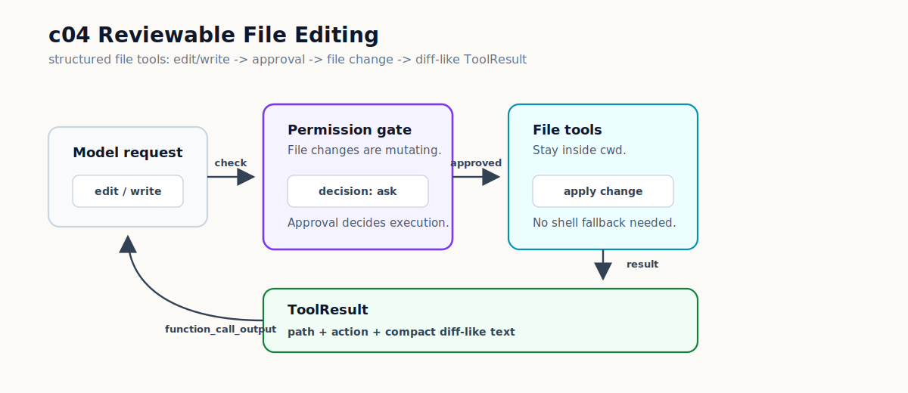

# c04 Reviewable File Editing

c03 之后，tool call 已经会先过 `PermissionPolicy`。模型想执行 `touch c03-permission-demo.txt` 这种 mutating command 时，CLI 会先问你。

这个边界有用，但它还没有解决 coding agent 最常见的问题：改文件。

现在如果模型要改一行文本，它只能申请跑 `bash`。你批准以后，harness 看到的仍然只是 shell output。`bash` 的范围太大：同一个 tool call 可以跑脚本、重定向输出、改多个文件，甚至做和本次编辑无关的动作。对 c04 来说，`bash` 能写文件并不够；改动还要带着明确的 path、action 和可 review 的变化内容回到 loop 里。

c04 的做法是把文件修改从 shell command 里拿出来，变成结构化的 file editing tool call。

## 问题

如果继续只靠 `bash` 改文件，loop 会变成这样：

```text
model -> bash {"command":"python - <<'PY' ..."}
      -> approval
      -> shell output
      -> model
```

approval 确实发生了，可是结果不够具体。模型下一轮只能看到命令 stdout/stderr，看不到这次文件修改的 review 信息。

这就是 c04 的痛点：coding agent 需要改文件，但文件修改不能只表现成一条 shell command。

## 解决方案

c04 不做 patch engine，也不做两阶段 preview。先加最小可跑的 file editing path。

这条路径里，模型不再申请 `bash`，而是调用两个新增的 built-in tools：`edit` 用于唯一 exact replacement，`write` 用于创建或覆盖完整 UTF-8 text file。

```text
model function_call: edit / write
  -> PermissionPolicy.decide(...)
  -> ask approval
  -> ToolRuntime.execute(...)
  -> file tool applies one change
  -> ToolResult includes path, action, and diff-like text
```

这条路径仍然复用 c03 的 gate：



`edit` 和 `write` 都是 mutating tools。默认 policy 不会直接放行，会返回 `ask`。用户批准后，工具才会写文件。

## 最小实现

实现上，这两个 tools 分别落在两个文件里：

- `src/tools/editTool.ts` 提供 `edit`。
- `src/tools/writeTool.ts` 提供 `write`。

`createEditTool()` 创建的 tool definition 名字是 `edit`，`createWriteTool()` 创建的 tool definition 名字是 `write`。`ToolRuntime.toolDefinitions()` 会把这些 definition 交给模型，所以后面 transcript 里会看到 `function_call: edit` 或 `function_call: write`。

默认 runtime 多注册这两个 tool：

```ts
// src/tools/defaultRuntime.ts
return createToolRuntime([
  createBashTool(options.cwd),
  createReadTool(options.cwd),
  createLsTool(options.cwd),
  createEditTool(options.cwd),
  createWriteTool(options.cwd),
]);
```

`edit` 的参数是：

```json
{
  "path": "c04-reviewable-edit-demo.txt",
  "oldText": "status: draft",
  "newText": "status: reviewed"
}
```

后面的动手部分会改 `c04-reviewable-edit-demo.txt` 的第一行：把 `status: draft` 改成 `status: reviewed`。

`path` 定位要修改的文件。`oldText` 是要找的原文，而且必须在文件里恰好出现一次。`newText` 是替换后的文本。没有匹配，或者匹配多次，都会返回 `failed`。这比“替换第一个匹配”更啰嗦一点，但它能避免模型在重复文本里改错位置。

`write` 的参数是：

```json
{
  "path": "c04-note.txt",
  "content": "full file content\n"
}
```

这个例子只说明 `write` 的 API shape；本章的 smoke run 会用 `edit`，因为它更容易观察一行文本的变化。`write` 写完整文件。文件不存在时创建，存在时覆盖。它不会隐式创建 parent directory，所以 `c04-note.txt` 这种当前目录文件可以写，带目录但 parent directory 不存在的路径会失败。

两个工具都复用 `resolvePathInsideCwd()`：

```ts
const boundedPath = resolvePathInsideCwd(cwd, args.path);

if (!boundedPath) {
  return {
    content: `blocked_reason: path "${args.path}" is outside the current working directory`,
    status: "blocked",
    toolName: "edit",
  };
}
```

这个边界和 `read` / `ls` 一样，只允许工具碰当前工作目录里的路径。

成功后，工具不会把整份文件塞回模型。`edit` / `write` 会把修改前后的文本交给 `formatFileChangeResult()`，由它生成 compact diff-like text，并用现有截断逻辑控制输出长度。

一次成功的 `edit` 会返回这种结果：

```text
tool: edit
status: completed
path: c04-reviewable-edit-demo.txt
action: edited
before_lines: 2
after_lines: 2
diff:
-status: draft
+status: reviewed
 note: c04 edits this file with the structured edit tool.
```

这不是完整 `git diff`。它只是给下一轮模型和用户一个清楚的 review point：哪个文件、什么动作、文本怎样变了。

治理层也要认识新工具。`src/governance/defaultPolicy.ts` 里，合法的 `edit` / `write` 会返回 `ask`：

```ts
if (toolCall.name === "edit") {
  const args = parseEditArguments(toolCall.arguments);

  if (!args) {
    return deny(
      "unknown",
      "edit arguments must be JSON with non-empty string path and oldText fields, and a string newText field",
    );
  }

  return ask("mutating", "file edit may modify project files");
}
```

参数格式不符合要求时，policy 直接 `deny`。参数有效时，仍然要等 user approval。

`src/cli/approval.ts` 负责终端里的 CLI approval prompt。它在 `ask` 决策真正执行 tool 前显示给用户。`bash` 继续显示 command：

```text
Approve bash command?
command: touch demo.txt
```

非 `bash` tool 显示原始 arguments：

```text
Approve edit tool call?
arguments: {"path":"sample.txt","oldText":"old","newText":"new"}
```

这样你在输入 `y` 前能看到具体 tool call。

## 运行验证

开始前，先按 [README](../../README.md#setup) 完成依赖安装和 `.env` 配置。

先 build：

```bash
npm run build
```

仓库里有一个专门给 c04 用的 demo file：`c04-reviewable-edit-demo.txt`。先让模型用 `edit` 修改它：

```bash
npm run start -- "Use edit to replace exactly 'status: draft' with 'status: reviewed' in c04-reviewable-edit-demo.txt. Do not use bash."
```

这条 task prompt 要求模型做一件很具体的事：调用 `edit`，把 demo file 的第一行从 `status: draft` 改成 `status: reviewed`。它也明确说了不要用 `bash`，因为这一章要验证文件修改已经进入结构化 tool path。

你会看到类似 transcript：

```text
[round 1] function_call: edit {"path":"c04-reviewable-edit-demo.txt","oldText":"status: draft","newText":"status: reviewed"}
[round 1] permission: ask risk=mutating reason=file edit may modify project files
Approve edit tool call?
arguments: {"path":"c04-reviewable-edit-demo.txt","oldText":"status: draft","newText":"status: reviewed"}
[y/N]:
```

输入 `y`。接着看 `tool_result`：

```text
[round 1] tool_result:
tool: edit
status: completed
path: c04-reviewable-edit-demo.txt
action: edited
before_lines: 2
after_lines: 2
diff:
-status: draft
+status: reviewed
 note: c04 edits this file with the structured edit tool.
```

这里要看三点：

- `function_call: edit` 说明模型没有退回 `bash`。
- `permission: ask` 出现在 `tool_result` 前，说明 c03 的 gate 仍然生效。
- `diff:` 让这次文件修改变成可 review 的 tool result。

如果想把 demo file 改回去，可以再跑：

```bash
npm run start -- "Use edit to replace exactly 'status: reviewed' with 'status: draft' in c04-reviewable-edit-demo.txt. Do not use bash."
```

## 下一步缺口

下一章 c05 会先处理另一个问题：模型需要找文件和片段时，`grep` / `find` 的输出会变多，下一轮 input 不能继续塞 raw output。那会引出 `Observation` 和 `Context Projection`。

### `edit` / `write` 的边界

c04 解决的是“让文件修改走结构化 tool path”。它还没有解决所有编辑体验。

如果你想在输入 `y` 之前先看到 diff，就会发现现在的流程还不够。c04 是先 approval、再执行、再返回 diff-like result。真正的 pre-apply review 需要把 preview 和 apply 拆成两步，或者让 approval prompt 带上待应用的 change set。这会让 loop 多一个状态，本章先不引入。

如果一次任务要改很多位置，`edit` 的 exact replacement 也会显得吃力。它一次只处理一个唯一匹配，适合教学里最小的安全编辑。批量修改、patch apply、fuzzy match 和冲突提示要等以后有更强的 file editing protocol 再处理。

还有一个更实际的问题：`edit` / `write` 现在直接写当前工作区。小实验没问题，但如果 agent 要重构多个文件，你可能希望先把改动放到隔离目录里，再决定要不要合回主工作区。这个压力会在 `c14 Worktree Isolation` 里出现。

最后，c04 的证据只在 CLI transcript 和 `ToolResult` 里。运行结束后，如果你想查“当时为什么允许这个 edit、改了什么、模型下一步看到了什么”，就需要持久化事件。`TraceEvent` 会在 c06 进入。
