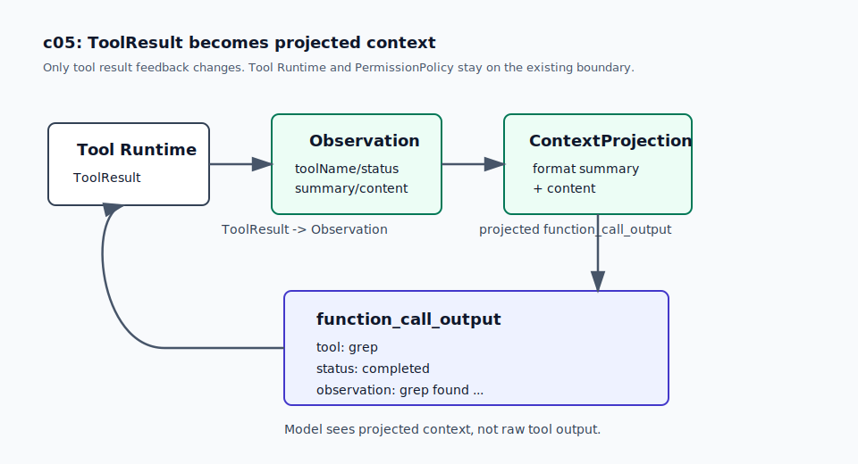

# c05 Context Projection

c04 之后，coding agent 已经能用 `edit` / `write` 产生可 review 的文件修改。`ToolResult` 里有 path、action 和 diff-like text，模型下一轮也能看到这些结果。

现在轮到 inspect path 出问题。模型找文件和片段时，`ls` / `read` 不够用，迟早会需要 `find` 和 `grep`。搜索结果一多，下一轮 input 如果继续塞 raw output，模型看到的就会变成一串噪声：很多路径、很多行号、很多重复片段。c05 不做完整 context window 管理，先把“工具结果怎样回到模型上下文”这件事单独拎出来。

## 问题

c04 的 loop 里，工具执行结束后会直接把格式化后的 `ToolResult` 放回 Responses input：

```text
ToolResult -> function_call_output -> next model request
```

这对短输出没问题。比如 `read package.json` 返回几行内容，模型可以继续判断下一步。

但搜索输出的形态不同。先不通过 harness，直接在当前项目里跑两条命令：

```bash
grep -R -n "Context Projection" docs
find docs/tutorial -type f -name '*c0*' -print
```

你会看到类似这样的 raw output：

```text
docs/02-tutorial-roadmap.md:93:| [`c05` Context Projection](tutorial/c05-context-projection.md) | ...
docs/tutorial/c05-context-projection.md:1:# c05 Context Projection
docs/tutorial/c04-reviewable-file-editing.md:222:下一章 c05 会先处理另一个问题...
docs/tutorial/c01-minimal-real-loop.md
docs/tutorial/c05-context-projection.md
docs/tutorial/c03-permission-governance.md
...
```

这类输出给人临时扫一眼没问题。可是如果每次工具调用后都把这些原文塞进下一轮 input，模型看到的就会混着路径、行号、表格片段和重复章节名。它真正需要的通常不是完整 raw output，而是一次 observation：

```text
这次 grep 在 docs/ 里找到了 8 个匹配，先展示 8 个。
其中 docs/tutorial/c05-context-projection.md 看起来最相关。
```

c05 的痛点是：tool output 开始变多以后，loop 需要一个小机制决定“下一轮模型应该看到什么”。

## 解决方案

c05 加两个 inspect-only tools：`grep` 和 `find`。它们会产生足够多的候选结果，这就是本章需要 `ContextProjection` 的原因。

新的工具结果回填路径是：

```text
ToolRuntime.execute(...)
  -> ToolResult
  -> Observation
  -> ContextProjection
  -> function_call_output
```



`Observation` 是内存里的小对象，只描述一次工具观察。它不是持久日志，也不维护任务状态。

`ContextProjection` 做的事也很小：把 observation 按几行固定字段输出。CLI transcript 打印的就是这份 projected output，模型下一轮收到的也是这份 output。

这不是在减少 context window 消耗。投影后的 `grep` 结果仍然会进入下一轮 input，照样占 token。c05 只处理单次工具结果的回填形状：最多展示多少条、有没有摘要、有没有 `omitted_matches` 等信息，以及模型能不能稳定读懂这些字段。跨多轮的历史裁剪、token budget 和 context compaction 不在这一章做。

一次成功的 `grep`，投影后会在 transcript 里显示成这种形状：

```text
tool: grep
status: completed
observation: grep found 3 matches for "Context Projection"
query: "Context Projection"
path: docs
matches_returned: 3
matches_total: 3
omitted_matches: 0
skipped_binary_files: 0
matches:
docs/tutorial/c05-context-projection.md:1 | # c05 Context Projection
...
```

## 最小实现

实现过程先看大图：

```text
tool returns ToolResult
  -> loop calls createToolObservation(result)
  -> ContextProjection.projectObservation(...)
  -> push projected text as function_call_output.output
```

这里没有调整 Responses API 的 input item shape。`function_call_output` 仍然有 `type`、`call_id` 和 `output`，c05 只改变 `output` 里的文本。

新增的 context 边界在 `src/context/`。`Observation` 先保留很少的字段：

```ts
// src/context/observation.ts
export interface Observation {
  content: string;
  metadata?: Record<string, unknown>;
  status: ToolStatus;
  summary: string;
  toolName: string;
}
```

转换动作发生在 loop 回填工具结果之前，不发生在 LLM API 层。`createToolObservation(result)` 会把 `ToolResult` 拆成 `toolName`、`status`、`content` 和 `summary`。如果工具在 `metadata.observationSummary` 里提供了摘要，就用它；否则使用稳定 fallback，比如 `read completed` 或 `write blocked`。

```ts
// src/core/minimalLoop.ts
function projectToolResult(
  result: ToolResult,
  contextProjection: ContextProjection,
): string {
  return contextProjection.projectObservation(createToolObservation(result));
}
```

`ContextProjection` 再把 observation 变成模型下一轮要看的文本：

```ts
// src/context/projection.ts
return [
  `tool: ${observation.toolName}`,
  `status: ${observation.status}`,
  `observation: ${observation.summary}`,
  content,
].join("\n");
```

这个 projection 没有改变 `read` 的正文策略。`read` 仍然返回 line-numbered content，也仍然使用已有的截断规则。c05 只是把它包进 observation。

`grep` 和 `find` 仍然是普通 built-in tools，在 `createDefaultToolRuntime()` 里通过 `createGrepTool(options.cwd)` 和 `createFindTool(options.cwd)` 注册。它们的参数很窄：

```json
{
  "query": "Context Projection",
  "path": "docs"
}
```

`query` 是 literal substring，默认 case-sensitive。`grep` 可以查文件或目录；`find` 查目录里的文件名。两者最多展示 20 条结果，超过时用 `omitted_matches` 说明省略数量。

治理层把 `grep` / `find` 当成 inspect-only tools：

```ts
if (
  toolCall.name === "read" ||
  toolCall.name === "ls" ||
  toolCall.name === "grep" ||
  toolCall.name === "find"
) {
  return allow("inspect-only tool");
}
```

这两个工具仍然受 cwd path boundary 限制。路径越界时返回 `blocked` observation；参数错误、路径不存在、`find` 的 root 不是目录时返回 `failed` observation。

## 运行验证

开始前，先按 [README](../../README.md#setup) 完成依赖安装和 `.env` 配置。

先 build：

```bash
npm run build
```

然后让模型按固定顺序走一次 `find -> grep -> read`：

```bash
npm run start -- "First use find to locate files in docs/tutorial whose filename contains 'c05'. Then use grep to search for 'Context Projection' in docs/tutorial/c05-context-projection.md. Then read docs/tutorial/c05-context-projection.md and briefly explain what c05 adds. Do not use bash."
```

你会看到类似 transcript：

```text
[round 1] function_call: find {"path":"docs/tutorial","query":"c05"}
[round 1] permission: allow risk=inspect reason=inspect-only tool
[round 1] tool_result:
tool: find
status: completed
observation: find found 1 file for "c05"
query: "c05"
path: docs/tutorial
matches_returned: 1
matches_total: 1
omitted_matches: 0
files:
docs/tutorial/c05-context-projection.md
```

接着会看到 `grep`：

```text
[round 2] function_call: grep {"path":"docs/tutorial/c05-context-projection.md","query":"Context Projection"}
[round 2] tool_result:
tool: grep
status: completed
observation: grep found ... matches for "Context Projection"
query: "Context Projection"
path: docs/tutorial/c05-context-projection.md
matches_returned: ...
matches_total: ...
omitted_matches: ...
matches:
...
```

最后 `read` 也会带上 observation line：

```text
[round 3] tool_result:
tool: read
status: completed
observation: read completed
path: docs/tutorial/c05-context-projection.md
content:
1 | # c05 Context Projection
...
```

这里要看三点：

- `find` / `grep` 是独立 tool call，不是 `bash` 里的 shell command。
- `permission: allow` 说明搜索工具走 inspect-only policy。
- 每个 `tool_result` 都有 `observation:`，说明下一轮模型看到的是 projected observation。

## 下一步缺口

c05 只处理“下一轮模型看什么”。它没有记录“这次 run 发生了什么”。

现在 CLI transcript 会显示 projected observation，但运行结束后没有持久文件可以检查。下一章会把一次 run 里的 task、tool call、permission decision 和 tool result 留成可检查的 trace。
