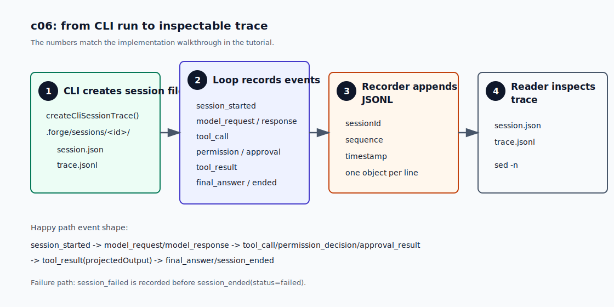

# c06 Session / Trace

c05 之后，模型下一轮看到的 tool feedback 已经变成了 `Observation` 投影。CLI transcript 里也能看到每一轮的 `function_call`、permission decision 和 projected `tool_result`。

这对正在运行的命令够用。问题是命令结束后，证据就散了：stdout 一关，你就很难回答“这次 run 当时收到了什么 task、模型调用了哪个 tool、permission 为什么允许、下一轮模型实际看到了什么”。

c06 不做 resume，也不做 replay。它先把一次 run 留成一个本地 session，并把主要事件写成 JSONL trace。

## 问题

c05 的数据流是：

```text
ToolResult -> Observation -> ContextProjection -> function_call_output
```

这说明模型下一轮看到了什么，但它没有持久化。运行结束后，如果你想复盘一次任务，只能希望终端输出还在。

这会引出两个具体问题。

第一，CLI transcript 是给人看的，不是稳定事件协议。比如这一行：

```text
[round 1] permission: allow risk=inspect reason=inspect-only tool
```

人能读懂，但它还是一段打印给终端看的文本。运行结束后，harness 没有一份稳定的事件记录可以打开检查。

第二，直接保存所有 model input 又太重。c06 需要的是一份能复盘主干流程的记录，而不是把每轮请求完整复制一遍。

c06 先处理这一个问题：运行结束后，要有一份可检查的证据，能说明这次 run 的主干流程。

## 解决方案

c06 加一个 `src/runtime/` 边界。这个边界先放三类对象：

- `SessionMetadata` 描述一次 run。
- `TraceEventPayload` 描述 loop 里发生的事件。
- `TraceRecorder` 把事件写成 JSONL。

CLI 每次启动任务时，会创建：

```text
.forge/sessions/<session-id>/session.json
.forge/sessions/<session-id>/trace.jsonl
```

`session-id` 使用时间加随机后缀，比如：

```text
20260625-160102-a1b2c3d4
```

CLI 会在第一轮前打印 trace path：

```text
[session] id=20260625-160102-a1b2c3d4 trace=.forge/sessions/20260625-160102-a1b2c3d4/trace.jsonl
```

`session.json` 是元数据。`trace.jsonl` 是事件账本，每一行都是一个 JSON object。它不是完整上下文 dump，而是 hybrid ledger：记录 task、model request 摘要、model response 摘要、tool call、permission decision、approval result、projected tool result 和 final answer。

这份 trace 足够复盘主干输入，但不会保存完整 `request.input` 快照、encrypted reasoning 或完整 tool schema。

## 最小实现

实现过程先看大图。图里的 4 个编号和下面的小节一一对应：



### 1. 创建 session 文件

CLI 启动时先调用 `createCliSessionTrace()`，在 `.forge/sessions/<session-id>/` 下准备两个文件：`session.json` 保存 metadata，`trace.jsonl` 等待后续事件追加。

```ts
// src/cli/index.ts
const sessionTrace = await createCliSessionTrace({
  cwd,
  maxToolRounds,
  model,
  task,
});
```

`.forge/` 是本地运行状态，所以放进 `.gitignore`。如果 session 目录创建或 trace 写入失败，run 直接失败。c06 的核心能力就是留下证据，不能静默降级。

### 2. 在 loop 里记录事件

CLI 创建完 session 后，把 `sessionTrace.recorder` 传给 `runMinimalLoop()`：

```ts
// src/cli/index.ts
await runMinimalLoop({
  cwd,
  maxToolRounds,
  model,
  task,
  traceRecorder: sessionTrace.recorder,
});
```

loop 不直接写文件。它只依赖一个很小的 runtime 边界：

```ts
// src/runtime/trace.ts
export interface TraceRecorder {
  record(event: TraceEventPayload): Promise<void>;
}
```

`TraceEventPayload` 只描述事件本身。loop 在模型调用、tool 调用、permission 判断和最终回答时调用 `record()`。一次正常 run 的事件顺序可以先看成这样：

```text
session_started
  ↓
model_request / model_response
  ↓
tool_call / permission_decision / approval_result
  ↓
tool_result(projectedOutput)
  ↓
final_answer / session_ended
```

如果 run 失败，会多写：

```text
session_failed
session_ended(status=failed)
```

`MinimalLoopTranscript` 继续只负责 stdout，它不参与 JSONL 格式。这样人读的 transcript 和机器读的 trace 不会绑在同一个字符串协议上。

### 3. 追加 JSONL

`JsonlTraceRecorder` 写入时补上 `sessionId`、`sequence` 和 `timestamp`，再把事件追加到 `trace.jsonl`：

```ts
// src/runtime/traceRecorder.ts
const recordedEvent = {
  ...event,
  sequence,
  sessionId,
  timestamp: now().toISOString(),
};
```

真实文件仍然是一行一个 JSON object。下面为了说明字段，把 `tool_result` 展开成多行：

```json
{
  "type": "tool_result",
  "round": 1,
  "callId": "call_read",
  "toolName": "read",
  "status": "completed",
  "projectedOutput": "tool: read\nstatus: completed\nobservation: read completed\n..."
}
```

这里故意不保存完整 `ToolResult.metadata`。c06 关心“下一轮模型看到了什么”。更细的 state projection 留给 c07。

### 4. 查看 trace

CLI 会在第一轮开始前打印 session line，告诉读者本次 run 的 trace 写在哪里。运行验证时，可以先打开 `session.json` 看 metadata，再打开 `trace.jsonl` 看事件账本。

## 运行验证

开始前，先按 [README](../../README.md#setup) 完成依赖安装和 `.env` 配置。

先 build：

```bash
npm run build
```

然后跑一个只读任务，让模型用 c05 的 search path：

```bash
npm run start -- "Use find to locate the c05 tutorial file, then grep it for 'Context Projection', then answer with one sentence. Do not use bash."
```

一开始会看到 session line：

```text
[session] id=20260625-160102-a1b2c3d4 trace=.forge/sessions/20260625-160102-a1b2c3d4/trace.jsonl
```

后面仍然会看到熟悉的 round transcript：

```text
[round 1] function_call: find {"path":"docs/tutorial","query":"c05"}
[round 1] permission: allow risk=inspect reason=inspect-only tool
[round 1] tool_result:
tool: find
status: completed
observation: find found 1 file for "c05"
...
```

把 `<session-id>` 换成你终端里打印的 id，先看 metadata：

```bash
cat .forge/sessions/<session-id>/session.json
```

你会看到这次 run 的 task、cwd、model、maxToolRounds 和 tracePath。

再看 trace。这条命令只打印 trace 的第 1 到第 12 行，方便先看开头几条事件：

```bash
sed -n '1,12p' .forge/sessions/<session-id>/trace.jsonl
```

`trace.jsonl` 实际上是一行一个 JSON object。下面为了阅读，把几个关键事件 pretty 成多行。

共同字段来自 `JsonlTraceRecorder`：

- `type`：事件种类。
- `sessionId`：这条事件属于哪次 run。
- `sequence`：recorder 分配的递增序号。
- `timestamp`：recorder 写入事件的时间。

有些字段来自 loop 或 tool event：

- `round`：第几轮模型调用。
- `callId`：哪一次 function call。
- `projectedOutput`：tool 执行后，下一轮模型实际收到的反馈文本。

先看 `session_started`。它标记 run 的开始，也把 task、cwd、model 和 maxToolRounds 写进事件流：

```json
{
  "type": "session_started",
  "task": "...",
  "cwd": "...",
  "model": "gpt-5.4-mini",
  "maxToolRounds": 8,
  "sequence": 1,
  "sessionId": "...",
  "timestamp": "..."
}
```

再看 `model_request`。它只记录模型调用摘要，不保存完整 input snapshot：

```json
{
  "type": "model_request",
  "round": 1,
  "model": "gpt-5.4-mini",
  "inputItemCount": 1,
  "toolNames": ["bash", "read", "ls", "grep", "find", "edit", "write"],
  "sequence": 2,
  "sessionId": "...",
  "timestamp": "..."
}
```

最后看 `tool_result`。这里的 `projectedOutput` 是模型下一轮真正看到的 tool feedback：

```json
{
  "type": "tool_result",
  "round": 1,
  "callId": "...",
  "toolName": "find",
  "status": "completed",
  "projectedOutput": "tool: find\nstatus: completed\nobservation: ...",
  "sequence": 6,
  "sessionId": "...",
  "timestamp": "..."
}
```

注意：

- `trace.jsonl` 记录的是结构化事件，不是 CLI transcript 字符串。
- `tool_result.projectedOutput` 和 transcript 里的 projected result 对得上。

## 下一步缺口

c06 只回答“这次 run 发生了什么”。它还没有回答“当前 run 处在什么状态”。

现在你可以打开 `trace.jsonl` 手工复盘，但 harness 自己还不会把事件投影成当前视图。比如最后一个 tool 是什么、最近一次失败是什么、run 是否已经结束、后续是否需要 repair，这些都还要靠人读 JSONL。

下一章 c07 会在 trace 之上加 `RuntimeState` projection。Trace 记录过去；RuntimeState 给 loop 和 CLI 一个当前决策视图。
