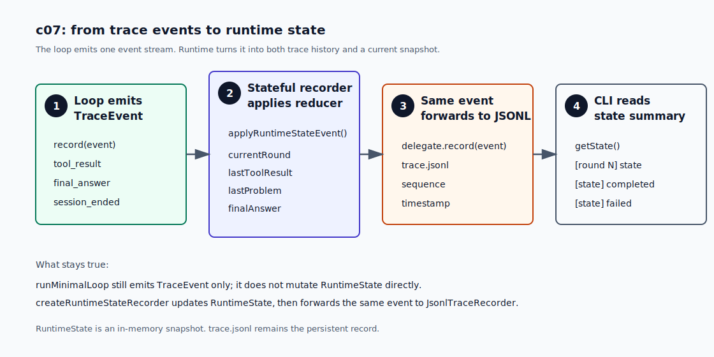

# c07 Runtime State Model

c06 之后，harness 已经有一份持久化 `Trace`。每次 run 会把主要事件写进 `.forge/sessions/<session-id>/trace.jsonl`。

这份 trace 适合事后复盘，但运行中的 loop 还缺一个当前视图：现在第几轮？最后一个 tool 是什么？有没有失败？run 已经结束了吗？

可以把 `trace.jsonl` 想成行车记录仪，把 `RuntimeState` 想成仪表盘。行车记录仪记录过去，仪表盘告诉你现在在哪。

c07 加的就是这个当前视图。Trace 继续记录过去，`RuntimeState` 给 loop 和 CLI 一份内存里的快照。

## 问题

c06 以后，loop 里的主要动作都会写一条 `TraceEvent`：

```text
session_started
model_request
model_response
tool_call
permission_decision
tool_result
final_answer
session_ended
```

这些事件适合事后检查。可是运行中的判断还靠零散变量。现在最明显的是 `lastRound`：

```ts
// src/core/minimalLoop.ts
let lastRound = 0;
```

`lastRound` 记录 loop 最近进入过的 round number。正常结束时，代码还在当前 round 里；一旦异常进入 `catch`，循环已经跳出，`catch` 只能靠 `lastRound` 写出 `session_ended(rounds=...)`。

一个变量还不算麻烦。下一章 c08 会加入 `Verification / Recovery`，到时 loop 会继续需要：

```text
最后一次 tool result 是什么？
最后的问题是不是 tool failed？
final answer 后还有没有 check 要跑？
失败后是不是还能 repair？
```

如果继续把这些都放在局部变量里，`runMinimalLoop()` 会同时做两件事：推进 loop，以及维护“当前 round、最后一个 tool、最后一个问题”这些当前事实。

c07 把第二件事移到 `src/runtime/`。loop 继续发事件；runtime 层根据事件更新当前状态。

## 解决方案

c07 的方案是保留 c06 的事件流，不改 `TraceEvent`。`runMinimalLoop()` 每发生一件事，仍然只调用 `record(event)`。

新增的 `createRuntimeStateRecorder(delegate)` 会包住原来的 `JsonlTraceRecorder`。这个 wrapper 收到同一条 event 后，先用 reducer 更新内存里的 `RuntimeState`，再把 event 转发给 JSONL recorder。CLI 需要打印 `[state] ...` 时，只读取 `getState()`。

流程先看成这样：

```text
runMinimalLoop
  -> record(TraceEvent)
  -> createRuntimeStateRecorder(...)
       -> applyRuntimeStateEvent(...) updates RuntimeState
       -> JsonlTraceRecorder writes trace.jsonl
  -> CLI reads getState() for state summary
```

这里没有新增持久化 state 文件。`RuntimeState` 不是历史记录，也不会写成 `state.json`。

`TraceEvent` 适合保存事实，但直接拿它做当前判断有两个不方便的地方。

第一，它是一条一条发生的事件。你能看到第 1 轮发生了 `tool_result`，也能看到第 2 轮发生了 `model_request`。但如果要回答“现在最后一个 tool 是什么”，就得从前面的事件里扫出来。

第二，它记录的是动作，不直接给出当前视图。`tool_result(status=failed)` 只说明某个 tool 失败过；当前 run 是否已经 failed，还要看后面有没有 `session_failed`、`session_ended`，以及 loop 现在走到哪里。

`RuntimeState` 做的事就是把这些事件折叠成当前快照：

```text
session_started              -> status=running
model_request(round=2)       -> currentRound=2, lastModelRequest=...
tool_result(status=completed)-> lastToolResult=...
tool_result(status=failed)   -> lastToolResult=..., lastProblem=...
final_answer                 -> finalAnswer=...
session_ended(status=failed) -> status=failed, ended=true
```

图里的 4 步对应下面的实现小节：



分工就变成这样：

- `TraceEvent` 是事实。
- `trace.jsonl` 是事后账本。
- `RuntimeState` 是当前快照。

c07 故意不做 replay、resume、verification、retry limit，也不写 `state.json`。这些机制需要更多约束，先不塞进这一章。

## 最小实现

实现顺序很短：

```text
1. 定义 RuntimeState 快照
2. 写 applyRuntimeStateEvent() reducer
3. 用 createRuntimeStateRecorder(delegate) 包住 trace recorder
4. CLI 在 round / final 边界打印 compact state summary
```

### 1. 定义 RuntimeState 快照

`RuntimeState` 放在 `src/runtime/state.ts`。它保存当前 run 的最新视图，不保存历史数组。

```ts
// src/runtime/state.ts
export interface RuntimeState {
  currentRound: number;
  status: RuntimeStatus;
  ended: boolean;
  lastToolCall?: RuntimeToolCallState;
  lastToolResult?: RuntimeToolResultState;
  lastProblem?: RuntimeProblem;
  finalAnswer?: RuntimeFinalAnswerState;
}
```

真实类型还包括 session 基本信息、最近一次 model request / response、permission decision 和 approval result。它们都是 `last...` 字段。历史仍然在 `trace.jsonl` 里。

`blocked` 需要单独说清楚。permission deny 产生的 tool result 会是 `blocked`，但这不是 harness 崩了。c07 只把 `failed`、`timed_out` 和 `session_failed` 放进 `lastProblem`：

```text
tool_result(status=blocked) -> lastToolResult
tool_result(status=failed)  -> lastToolResult + lastProblem
session_failed             -> lastProblem
```

这样 c08 做 repair 时，不会把正常的 governance 拦截误判成 runtime failure。

### 2. 用 reducer 投影事件

reducer 接收旧 state 和新 event，返回新 state：

```ts
// src/runtime/state.ts
export function applyRuntimeStateEvent(
  state: RuntimeState,
  event: TraceEventPayload,
): RuntimeState {
  // switch event.type ...
}
```

例如 `tool_result` 会更新当前轮次、最后一次 tool result，并在失败时更新 `lastProblem`：

```ts
case "tool_result":
  return {
    ...state,
    currentRound: event.round,
    lastProblem: createToolProblem(event) ?? state.lastProblem,
    lastToolResult: {
      callId: event.callId,
      projectedOutput: event.projectedOutput,
      round: event.round,
      status: event.status,
      toolName: event.toolName,
    },
  };
```

这个函数不写文件，也不调用 CLI。它只回答一个问题：这条事件发生后，仪表盘应该显示什么？

### 3. 包一层 recorder

c06 已经有 `TraceRecorder`：

```ts
// src/runtime/trace.ts
export interface TraceRecorder {
  record(event: TraceEventPayload): Promise<void>;
}
```

c07 不改这个接口，而是加一个 wrapper：

```ts
// src/runtime/state.ts
export function createRuntimeStateRecorder(delegate: TraceRecorder) {
  let state = createInitialRuntimeState();

  return {
    getState() {
      return state;
    },
    recorder: {
      async record(event) {
        state = applyRuntimeStateEvent(state, event);
        await delegate.record(event);
      },
    },
  };
}
```

CLI 创建 session 后，把 c06 的 JSONL recorder 包起来：

```ts
// src/cli/index.ts
const runtimeStateTrace = createRuntimeStateRecorder(sessionTrace.recorder);
```

然后传给 loop：

```ts
await runMinimalLoop({
  traceRecorder: runtimeStateTrace.recorder,
  runtimeState: runtimeStateTrace.getState,
  // ...
});
```

loop 仍然只发 `TraceEvent`。它只在要打印 state summary 时读取 `runtimeState()`。

### 4. 在 transcript 里看见 state

c07 的 CLI 不打印完整 state JSON，只打印一行摘要。

有 tool call 的 round 结束后会看到：

```text
[round 1] state: status=running lastTool=find lastToolStatus=completed
```

最终回答后会看到：

```text
[state] status=completed rounds=3 lastTool=grep lastToolStatus=completed
```

如果 run 失败，CLI 会先打印最后的 state，再打印原来的错误行：

```text
[state] status=failed rounds=1 problem=session_failed
forge-harness failed: Minimal loop stopped after 1 tool rounds without a final answer.
```

这行 state summary 是读者能直接看见的变化。`trace.jsonl` 仍然是完整事件账本。

## 运行验证

开始前，先按 [README](../../README.md#setup) 完成依赖安装和 `.env` 配置。

先 build：

```bash
npm run build
```

然后跑一个只读任务，让模型用 `find` 和 `grep`：

```bash
npm run start -- "Use find to locate the c06 tutorial file, then grep it for 'RuntimeState', then answer with one sentence. Do not use bash."
```

开头仍然会先看到 session line：

```text
[session] id=20260625-160102-a1b2c3d4 trace=.forge/sessions/20260625-160102-a1b2c3d4/trace.jsonl
```

每个执行了 tool 的 round 后，会多一行 state summary：

```text
[round 1] function_call: find {"path":"docs/tutorial","query":"c06"}
[round 1] permission: allow risk=inspect reason=inspect-only tool
[round 1] tool_result:
tool: find
status: completed
observation: find found 1 file for "c06"
...
[round 1] state: status=running lastTool=find lastToolStatus=completed
```

最终回答后，会看到最终 state：

```text
[final]
...
[state] status=completed rounds=3 lastTool=grep lastToolStatus=completed
```

跑完以后可以确认两条路径：

- trace path 还在写 `.forge/sessions/<session-id>/trace.jsonl`
- `RuntimeState` 会随同一批事件更新，并在 CLI transcript 里显示当前快照

## 下一步缺口

c07 只知道当前 run 的状态。它还不会判断任务是否真的完成。

现在模型给出 final answer 后，harness 仍然会结束。它不会运行 check，也不会在 check 失败后把 failure summary 交回模型。

下一章 c08 会在这个仪表盘上继续加 `Verification / Recovery`：final answer 之后先验证，失败后进入 repair，超过 retry limit 再停下来。
