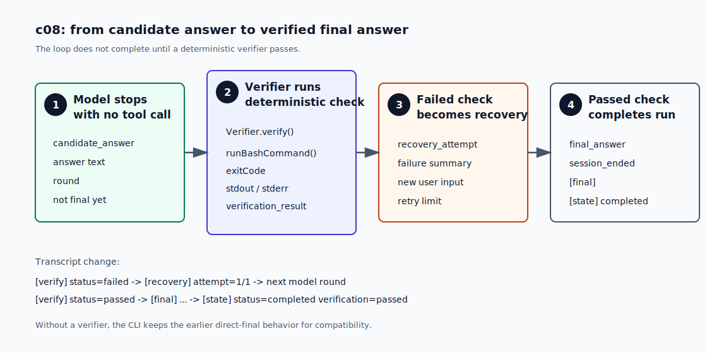

# c08 Verification / Recovery

c07 之后，harness 已经有了当前 run 的 `RuntimeState`。它知道最后一个 tool 是什么、有没有问题、run 是否结束。

但它还不会判断任务是不是真的完成。

现在的 loop 只看一个信号：模型这一轮没有再发 tool call。只要没有 tool call，CLI 就打印 `[final]`，trace 写 `final_answer`，session 结束。

对 coding agent 来说，这个信号太弱。模型可能说“done”，但代码没有通过 build；也可能给了一个听起来合理的总结，但文件没有改对。c08 处理这个痛点：`final answer` 先变成 candidate，只有 deterministic check 通过后，harness 才把它当成真正的 final answer。

## 问题

c07以及之前的章节判断“完成”的方式很简单：只要模型这一轮没有 tool call，就当作完成。

```text
model_response(functionCallCount=0)
  -> final_answer
  -> session_ended(status=completed)
```

这个规则能让最小 loop 跑起来，但它没有检查结果做支撑。模型说 done，不代表代码真的能 build。

如果用户让 agent 修一个 build failure，模型可能在修完一半时回答“已修复”。c07 不会在最后运行 `npm run build`。如果 build 还失败，用户只能自己发现，然后重新开一轮。

c08 要加的机制不是“让模型再想一想”。模型自评仍然是模型判断。这里需要的是外部确定性检查：

```text
model says done
  -> run verifier
  -> verifier passed: complete
  -> verifier failed: feed failure summary back to model
```

## 解决方案

c08 新增一个 `Verifier` 接口。core loop 不知道 check 是 `npm run build`、HTTP health check，还是以后章节里的 task acceptance。它只调用 `verify()`，读取结果。

```ts
// src/runtime/verification.ts
export interface Verifier {
  verify(context: VerificationContext): Promise<VerificationResult>;
}
```

CLI 先实现一个 command verifier：

```bash
npm run start -- --verify "npm run build" "fix the build"
```

开启 `--verify` 后，transcript 的意思也会变：没有通过 verifier 的回答只是 candidate，不会打印成 `[final]`；`[final]` 只出现在 verification passed 之后。

`createCommandVerifier()` 复用 c02 以来的 `runBashCommand()`。所以 verifier command 也有 timeout、输出截断、secret env 清理和危险命令拦截。

结果只有三类：

```text
passed  -> exitCode=0
failed  -> command ran but exitCode!=0, or timed out
blocked -> command was rejected by bash safety checks
```

`failed` 可以 recovery。`blocked` 不进入 recovery，因为这是 verifier command 本身不允许执行，模型修代码也解决不了。

图里的 4 步对应下面的实现小节：



## 最小实现

c08 的实现顺序是：

```text
1. 定义 Verifier / VerificationResult
2. 把 no-tool answer 记录成 candidate_answer
3. verifier failed 时追加 recovery user input
4. verifier passed 后才记录 final_answer
5. transcript 显示 [verify] 和 [recovery]
```

### 1. Verifier 决定能不能结束 run

`src/runtime/verification.ts` 定义通用接口，再提供 CLI 用的 command adapter：

```ts
export function createCommandVerifier(
  options: CommandVerifierOptions,
): Verifier {
  return {
    async verify() {
      const result = await runBashCommand(options.command, {
        cwd: options.cwd,
      });
      // exitCode === 0 -> passed
      // non-zero / timeout -> failed
      // blocked command -> blocked
    },
  };
}
```

这段代码先只接 command verifier。`Verifier` 接口保留了以后接入其他检查方式的空间；本章先把完成判断放在确定性命令结果上。

### 2. final answer 先变成 candidate

有 verifier 时，loop 看到 `functionCallCount=0` 不再马上完成。它先写一条新事件：

```text
candidate_answer(round, answer)
```

然后运行 verifier：

```text
candidate_answer
  -> verification_result(status=passed | failed | blocked)
```

只有 `verification_result(status=passed)` 之后，loop 才记录：

```text
final_answer
session_ended(status=completed)
```

没有配置 verifier 时，CLI 保持旧行为：no-tool answer 仍然直接变成 `[final]`。这样前面章节的命令不需要改。

### 3. recovery 是一条新的 user input

如果 verifier 返回 recoverable failure，loop 会把失败摘要追加到下一轮 input：

```text
Verification failed for the previous candidate answer.

status: completed
command: npm run build
exit_code: 1
stderr:
...

Continue fixing the task. Use tools if needed, then provide a new final answer.
```

同时 trace 写：

```text
recovery_attempt(round, attempt, maxAttempts, summary)
```

c08 默认只给 1 次 recovery。这个限制避免 verifier 一直失败时 loop 无限跑下去。recovery 继续使用同一个 `maxToolRounds`，不会单独开一套 round 计数。

### 4. RuntimeState 增加当前验证视图

c07 的原则不变：`RuntimeState` 是当前快照，不保存历史数组。

c08 只加当前字段：

```ts
candidateAnswer?: RuntimeCandidateAnswerState;
lastVerificationResult?: RuntimeVerificationResultState;
recoveryAttempts?: number;
```

历史仍然在 `trace.jsonl` 里。CLI 的 state summary 会多显示 verification 状态：

```text
[state] status=completed rounds=2 verification=passed recoveryAttempts=1
```

### 5. transcript 的语义变化

这是 c08 读者最容易看见的变化。

没有 `--verify` 时，输出和 c07 一样：

```text
[final]
...
[state] status=completed rounds=1
```

有 `--verify` 时，先看 verifier：

```text
[verify] status=passed command="npm run build" exitCode=0

[final]
...
[state] status=completed rounds=1 verification=passed
```

如果第一次检查失败，会先看到 recovery：

```text
[verify] status=failed command="..." exitCode=1
[recovery] attempt=1/1
```

注意这里没有先打印 `[final]`。candidate answer 没通过检查，就不是最终答案。

## 运行验证

开始前，先按 [README](../../README.md#setup) 完成依赖安装和 `.env` 配置。

先 build 一次，让 `npm run start` 使用最新的 `dist/`：

```bash
npm run build
```

### 1. 看到 verifier passed

运行一个直接回答的任务，用 `npm run build` 做 verifier：

```bash
npm run start -- --verify "npm run build" "Answer in one sentence: say the project is ready after the verifier passes. Do not use tools."
```

你应该先看到 session line：

```text
[session] id=20260626-120102-a1b2c3d4 trace=.forge/sessions/20260626-120102-a1b2c3d4/trace.jsonl
```

然后会看到 verifier 先于 final 出现：

```text
[verify] status=passed command="npm run build" exitCode=0

[final]
...
[state] status=completed rounds=1 verification=passed
```

这说明模型的 no-tool answer 先通过了 command verifier，之后才变成 `[final]`。

### 2. 看到 recovery

下面这个 smoke command 用 `.forge/c08-recovery-marker` 人为制造一次稳定失败：第一次 verifier 会创建 marker 并返回 `exit 1`，第二次看到 marker 后通过。它演示的是 recovery 控制流。

如果你之前跑过这条命令，先清掉 marker：

```bash
rm -f .forge/c08-recovery-marker
```

然后运行：

```bash
npm run start -- --verify "test -f .forge/c08-recovery-marker || (mkdir -p .forge && touch .forge/c08-recovery-marker && echo first verification fails >&2 && exit 1)" "Answer in one sentence after the verifier passes. Do not use tools."
```

第一次 candidate answer 后，会看到：

```text
[verify] status=failed command="test -f .forge/c08-recovery-marker || (...)" exitCode=1
[recovery] attempt=1/1
```

下一轮模型会收到 failure summary。模型可能直接回答，也可能先用 tool 检查现场；这些都继续消耗同一个 `maxToolRounds`。等后面某一轮再次给出 no-tool answer，verifier 会通过：

```text
[verify] status=passed command="test -f .forge/c08-recovery-marker || (...)" exitCode=0

[final]
...
[state] status=completed rounds=N verification=passed recoveryAttempts=1
```

这条 smoke run 的重点不是让模型真的修代码，而是确认 harness 会把 verifier failure 转成 recovery round。真实项目里，`--verify` 通常会是 `npm run build`、`npm run test`，或某个更窄的 smoke command。

## 下一步缺口

c08 只做完成前验证和一次 recovery。

它还没有 hooks。`verification_result` 现在只进 trace 和 state，不会触发 notification、metrics 或外部 callback。下一章 c09 会把这种生命周期扩展点从 core loop 里拆出来。

c08 也没有 task/todo acceptance。现在 verifier command 由 CLI 显式传入；复杂任务里，验收条件应该属于任务状态本身。这个问题会在 c10 继续处理。

还有一种场景，普通 command check 回答不了。比如 summary 有没有覆盖用户要求，修改说明是不是足够清楚，这些问题很难靠 `exitCode=0` 判断。以后可以把这类检查做成另一个 `Verifier`，用 LLM 或 prompt review 来返回 `VerificationResult`。c08 先不走这条路，本章先让读者看到外部命令检查怎样决定 run 能不能结束。

c08 也不写 persistent `state.json`，不做 resume 或 replay。这些都需要更明确的恢复语义，先留到后面的章节。
