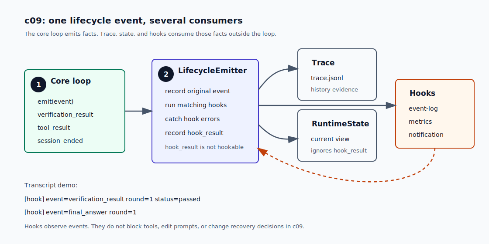

# c09 Hooks

c08 之后，harness 已经会在完成前运行 `Verifier`。模型给出 candidate answer 后，loop 会记录 `verification_result`，`RuntimeState` 也能看到当前验证状态。

但这条事件现在只服务于 trace 和 state。如果 verification failed 时还想做通知，或者以后想给 tool usage 记 metrics，`runMinimalLoop` 还没有一个合适的位置放这些逻辑。

c09 给 lifecycle events 加上 observe-only hooks。core loop 继续只描述主流程；通知、metrics、debug log 这类横切行为挂在 loop 外侧。

## 问题

先看一个具体场景。

c08 已经能判断 verifier failed。现在我们想在失败时额外打印一条通知。最直接的写法是在 `runMinimalLoop` 记录 `verification_result` 后继续加代码：

```ts
await traceRecorder.record({
  type: "verification_result",
  status: verification.status,
  // ...
});

if (verification.status === "failed") {
  notifyVerificationFailure(verification);
}
```

这能解决眼前问题，但下一次需求还会来。比如：

```text
tool_result          -> 记一次 tool metrics
session_ended        -> 发 session finished 通知
verification_result  -> 写 debug event log
```

如果这些逻辑都直接写进 `runMinimalLoop`，loop 就会同时做两件事：推进 agent turn，以及顺手处理 notification、metrics、debug log。第二件事不属于主流程。

c07 的接线只有 trace 和 state：

```text
runMinimalLoop
  -> record(event)
  -> createRuntimeStateRecorder(...)
       -> RuntimeState
       -> trace.jsonl
```

到了 c09，同一条 `verification_result` 至少有三类处理方：

```text
verification_result -> trace 保存历史
verification_result -> RuntimeState 更新当前验证状态
verification_result -> hooks 做通知或日志
```

问题不是缺一个 `notifyVerificationFailure()` 函数，而是缺一个统一的位置来分发这些 lifecycle events。

## 解决方案

c09 把“事件交给谁处理”收束到 `LifecycleEmitter`。

core loop 不再直接调用 `TraceRecorder`。它只把事件交给 emitter：

```ts
await lifecycleEmitter.emit({
  type: "verification_result",
  round,
  status: verification.status,
  // ...
});
```

`LifecycleEmitter` 收到 event 后按固定顺序处理：

```text
1. 先把原始 event 交给 trace/state
2. 再把同一条 event 交给匹配的 hooks
3. 最后把每个 hook 的执行结果写成 hook_result
```

图里绿色框是 core loop，蓝色框是 `LifecycleEmitter`，右侧三个框是 event 的处理方。橙色虚线表示 hook 执行完后会把 `hook_result` 写回 trace。



hook 是一个带名字的 observer：

```ts
export interface LifecycleHook {
  name: string;
  events?: HookableTraceEventType[];
  handle(event: HookableTraceEvent): Promise<void> | void;
}
```

`events` 省略时，hook 订阅全部 hookable lifecycle events。指定数组时，它只接收这些 event。

c09 的 hooks 只观察事件。它们不能阻止 tool call，不能修改 prompt，不能替换 tool result，也不能决定 recovery。现在能改变主流程的机制仍然是 `PermissionPolicy`、`Verifier` 和 recovery limit。

## 最小实现

c09 的实现顺序是：

```text
1. 定义 LifecycleEmitter / LifecycleHook
2. 让 core loop 改用 lifecycleEmitter.emit(event)
3. emitter 先记录原始 event，再运行 hooks
4. hook success / failure 写成 hook_result
5. CLI 用 --hook-log 安装一个 event-log hook
```

### 1. 定义 LifecycleEmitter

`LifecycleEmitter` 放在 `src/extensions/lifecycle.ts`。它是 core loop 和 event 处理方之间的边界。

```ts
export interface LifecycleEmitter {
  emit(event: TraceEventPayload): Promise<void>;
}
```

`TraceRecorder` 还在，只是不再被 `runMinimalLoop` 直接调用。它变成 emitter 后面的一个 sink。

CLI 接线里，原始 lifecycle event 先走 `runtimeStateTrace.recorder`：

```ts
const lifecycleEmitter = createLifecycleEmitter({
  recorder: runtimeStateTrace.recorder,
  hookResultRecorder: sessionTrace.recorder,
  hooks,
});
```

所以原始 event 仍然会更新 `RuntimeState`，也会写入 `trace.jsonl`。`hook_result` 直接写 JSONL trace，不进入 `RuntimeState`。

### 2. core loop 只 emit event

`runMinimalLoop` 原来这样记录 event：

```ts
await traceRecorder.record({
  type: "model_request",
  round,
  // ...
});
```

c09 改成：

```ts
await lifecycleEmitter.emit({
  type: "model_request",
  round,
  // ...
});
```

core loop 仍然产生同一组 `TraceEventPayload`。变化是：它不再关心 event 后面要交给 trace、state，还是 hooks。

### 3. hook 按 event type 订阅

一个 hook 可以只订阅某些 event：

```ts
const hook: LifecycleHook = {
  name: "event-log",
  events: ["verification_result"],
  handle(event) {
    console.log(event.type);
  },
};
```

也可以省略 `events`，接收全部 hookable lifecycle events。

`hook_result` 不会再触发 hooks。hook 运行后会写 `hook_result`，如果这条 event 继续触发 hooks，就会递归。

### 4. hook failure 只进入 trace

hooks 按注册顺序运行。某个 hook 抛错时，emitter 会记录失败，然后继续运行后面的 hooks。

失败结果长这样：

```ts
{
  type: "hook_result",
  hookName: "event-log",
  sourceEventType: "verification_result",
  status: "failed",
  round: 1,
  error: "hook exploded",
}
```

`RuntimeState` 不投影 `hook_result`。state 继续描述主流程，hook 成败留在 trace 里排查。

### 5. CLI 的 --hook-log

CLI 新增 `--hook-log`，用于本章 smoke run。

开启后，CLI 安装一个 `event-log` hook。它不打印完整 event JSON，只打印紧凑摘要：

```text
[hook] event=verification_result round=1 status=passed
```

这条日志说明 hook 收到了 lifecycle event。它不会重复打印 answer、tool output 或 verifier summary。

## 运行验证

开始前，先按 [README](../../README.md#setup) 完成依赖安装和 `.env` 配置。

先 build 一次，让 `npm run start` 使用最新的 `dist/`：

```bash
npm run build
```

然后用 c08 的 verifier 场景，加上 `--hook-log`：

```bash
npm run start -- --hook-log --verify "npm run build" "Answer in one sentence after verification passes. Do not use tools."
```

你应该先看到 session line：

```text
[session] id=${session_id} trace=.forge/sessions/${session_id}/trace.jsonl
```

然后会看到 hook 日志穿插在正常 transcript 里：

```text
[hook] event=session_started
[hook] event=model_request round=1
[hook] event=model_response round=1
[hook] event=candidate_answer round=1
[verify] status=passed command="npm run build" exitCode=0
[hook] event=verification_result round=1 status=passed

[final]
...
[hook] event=final_answer round=1
[hook] event=session_ended status=completed
```

这说明 `runMinimalLoop` 没有直接调用 event-log 逻辑。它只是 emit lifecycle event，hook 在 loop 外侧观察到了这些 event。

如果打开 trace 文件，还能看到 `hook_result`：

```text
{"type":"verification_result",...}
{"type":"hook_result","hookName":"event-log","sourceEventType":"verification_result","status":"completed",...}
```

`session_ended` 后面也可能还有 `hook_result`。这不代表 session 又继续执行了。`session_ended` 是最后一个 core event，后面的 `hook_result` 只是 hook 收尾证据。

## 下一步缺口

c09 只做 observe-only hooks。

如果以后想在 tool 执行前拦截危险动作，不能靠 c09 的 hook。那是 control hook 或 permission policy 的问题，会和 `PermissionPolicy`、后续 plugin routing 放在一起处理。

如果以后想让 hook 给模型补充上下文，也不该把返回值塞进 c09 的 hook。影响 model input 的机制应该走 prompt assembly、skills、memory 和 context compaction。

如果以后要接外部 command、webhook 或 plugin host，hook 还需要 timeout、隔离和更明确的 failure policy。c09 先只接可信的 in-process hooks。

下一章 c10 会处理另一个问题：任务变长后，计划、todo 和 acceptance 不能只藏在模型回答里。它们需要进入 trace、state 和 context projection。
