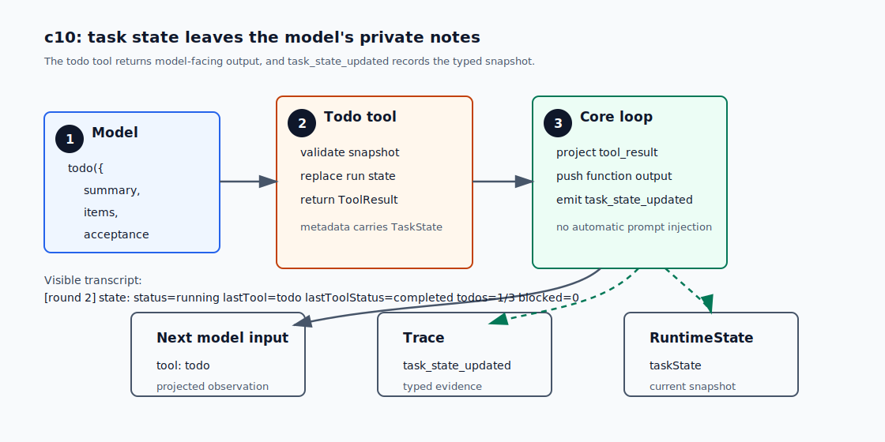

# c10 Task / Todo

c09 之后，`runMinimalLoop` 已经不直接写 trace。它 emit lifecycle event，`LifecycleEmitter` 再把事件交给 trace、`RuntimeState` 和 hooks。

现在还有一个更贴近日常 coding agent 的缺口：对于较长的任务，模型通常会在回答里写一个计划，但 harness 看不到这个计划。trace 只知道 tool call，`RuntimeState` 只知道最后一个 tool，context projection 只回填工具结果。模型的那份 todo 没有进入系统。

c10 加一个很小的 `todo` tool。模型用它提交当前任务 snapshot：summary、todo items 和 acceptance criteria。这个 snapshot 会进入 trace、state 和下一轮模型上下文。

## 问题

先看一个多步骤任务。

用户说：

```text
修复当前 build failure，并在最终回答里说明验证结果。
```

模型可能先这样回答：

```text
我会先检查错误，再修改代码，最后运行 build。
```

c09 的事件流会记录后面发生的 tool call 和 verification：

```text
tool_call(read)
tool_result(read)
tool_call(edit)
tool_result(edit)
verification_result(passed)
final_answer
```

如果中途失败，`RuntimeState` 可以告诉我们最后一个 tool 是什么、verification 有没有失败，却回答不了几个更实际的问题：

```text
当前计划是什么？
哪一步正在做？
还有哪些 acceptance 没被看见？
这个计划有没有进入 trace，之后能不能 replay？
```

把计划继续留在模型自然语言里，会带来两个问题。

第一，计划没有证据。trace 里没有结构化事件，之后要复盘只能读模型原话。

第二，计划不会回到模型的工具上下文。c05 已经让 tool result 通过 `ContextProjection` 回到下一轮 input，但 task state 还没有同样的路径。

c10 先把计划、进度和 acceptance 变成结构化 task state，让它们进入 trace、`RuntimeState` 和下一轮模型上下文。

## 解决方案

c10 新增内置 `todo` tool。它只做一件事：替换当前 run 的 task snapshot。

模型调用时提交完整当前视图：

```json
{
  "summary": "检查 c09 文档并总结 c10 的下一个缺口。",
  "items": [
    {
      "id": "plan",
      "title": "Create a visible task plan",
      "status": "completed"
    },
    {
      "id": "inspect",
      "title": "Read the c09 tutorial",
      "status": "in_progress"
    }
  ],
  "acceptance": [
    "The final answer mentions what c09 leaves for c10",
    "npm run build exits with code 0"
  ]
}
```

`todo` 成功后会返回普通 `ToolResult`。模型下一轮看到的仍然是 c05 那条路径：

```text
ToolResult -> Observation -> ContextProjection -> function_call_output
```

投影后的内容大概是：

```text
tool: todo
status: completed
observation: task plan updated: 2 items, 1 in_progress, 1 completed, 0 blocked
summary: 检查 c09 文档并总结 c10 的下一个缺口。
todos:
- completed plan: Create a visible task plan
- in_progress inspect: Read the c09 tutorial
acceptance:
- The final answer mentions what c09 leaves for c10
- npm run build exits with code 0
```

同一次 tool result 还会带上 typed metadata。core loop 看到 metadata 里的 task snapshot 后，再 emit 一条新事件：

```ts
{
  type: "task_state_updated",
  round,
  callId,
  taskState,
}
```

图里有两条路径。实线是模型看到的普通 tool output；虚线是 harness 记录的结构化 task state。



`RuntimeState` 只从 `task_state_updated` 更新 `taskState`。它不会解析 tool output 文本。

c10 里的 `acceptance: string[]` 是“完成时应该满足的可观察条件”，不是 verifier 结果。确定性检查仍然走 c08 的 `Verifier`，比如 `--verify "npm run build"`。如果以后要做 LLM judge 或人工 review verifier，可以读取这份 acceptance，但那不是本章要做的事。

## 最小实现

c10 的实现顺序是：

```text
1. 定义 TaskState 和 run 内 store
2. 新增 todo tool，提交完整 snapshot
3. 成功的 todo result 触发 task_state_updated
4. RuntimeState 投影当前 taskState
5. CLI state summary 显示 compact todo counters
```

### 1. TaskState 是 run 内状态

`TaskState` 放在 `src/runtime/task.ts`。

```ts
export type TaskTodoStatus =
  | "pending"
  | "in_progress"
  | "completed"
  | "blocked";

export interface TaskState {
  summary: string;
  items: TaskTodoItem[];
  acceptance: string[];
}
```

store 只存在于当前 run。它不是 database，也不会写成单独的 `task.json`。持久证据仍然是 trace 里的 `task_state_updated`。

### 2. todo tool 提交完整 snapshot

`todo` 的参数是完整 snapshot，不是 patch：

```ts
{
  summary: string;
  items: TaskTodoItem[];
  acceptance: string[];
}
```

这会重复一些 token，但 c10 先换来一个好处：每次 update 都能独立解释当前计划。patch 协议需要处理 id 不存在、重复 patch、局部失败和合并顺序。那些问题会把本章带成 todo CRUD。

c10 只加几条限制：

```text
items 至少 1 项，最多 12 项
acceptance 至少 1 条，最多 8 条
status 只能是 pending / in_progress / completed / blocked
同一份 snapshot 最多一个 in_progress
id 不能重复
```

参数不合法时，tool 返回 failed result，不更新 store，也不 emit `task_state_updated`。

### 3. task_state_updated 是结构化事实

core loop 仍然先记录普通 tool result：

```ts
await lifecycleEmitter.emit({
  type: "tool_result",
  toolName: "todo",
  projectedOutput,
  // ...
});
```

如果 result 是成功的 `todo`，并且 metadata 里有 valid task snapshot，loop 再 emit：

```ts
await lifecycleEmitter.emit({
  type: "task_state_updated",
  round,
  callId,
  taskState,
});
```

这样分工比较干净：

- `tool_result` 说明模型看到了什么。
- `task_state_updated` 说明当前 task state 变成了什么。

这条事件也是 hookable event。`--hook-log` 开启时，你会看到：

```text
[hook] event=task_state_updated round=1
```

### 4. RuntimeState 保存最新 snapshot

`RuntimeState` 不保存 todo 历史。它只保存最新的 `taskState`：

```ts
taskState?: {
  summary: string;
  items: TaskTodoItem[];
  acceptance: string[];
  updatedAtRound: number;
  updatedByCallId: string;
}
```

历史仍然在 trace。之后 c12 做 compaction 时，可以只保留“最新 task state”，丢掉旧 snapshot 里的冗余原文。

### 5. transcript 只打印 compact counters

完整 todo list 已经在 tool result 里出现过。state line 只需要告诉读者当前有没有投影到 `RuntimeState`：

```text
[round 2] state: status=running lastTool=todo lastToolStatus=completed todos=1/3 blocked=0
```

这里的 `todos=1/3` 表示还有 1 个未完成 item，总共 3 个 item。`blocked=0` 单独列出来，是因为 blocked 往往需要用户或后续机制处理。

## 运行验证

开始前，先按 [README](../../README.md#setup) 完成依赖安装和 `.env` 配置。

先 build 一次，让 `npm run start` 使用最新的 `dist/`：

```bash
npm run build
```

### 1. read-only multi-step run

这条命令给模型一个普通多步骤 read-only 任务：定位 c09 教程、阅读内容、提炼 c09 留给 c10 的缺口，最后在 verifier 通过后用一句话回答。用户 prompt 没有点名 `todo`；c10 的 system instruction 会要求模型在多步骤任务里主动维护 task state。

```bash
npm run start -- --hook-log --verify "npm run build" "Do a read-only chapter handoff check: locate the c09 tutorial, read it, identify the concrete gap c09 leaves for c10, and answer in one sentence after verification passes. Do not edit files."
```

你应该先看到 session line：

```text
[session] id=${session_id} trace=.forge/sessions/${session_id}/trace.jsonl
```

接着应该看到模型先调用 `todo`。它像其他工具一样走 permission 和 tool result：

```text
[round 1] function_call: todo {...}
[round 1] permission: allow risk=mutating reason=runtime task state update
[round 1] tool_result:
tool: todo
status: completed
observation: task plan updated: ...
```

如果开了 `--hook-log`，还会看到新事件：

```text
[hook] event=task_state_updated round=1
```

后面的 state line 会出现 compact counters：

```text
[round 1] state: status=running lastTool=todo lastToolStatus=completed todos=2/3 blocked=0
```

这说明三件事：

- 计划作为 `todo` tool result 回到了模型上下文。
- `task_state_updated` 进入了 lifecycle event 流。
- `RuntimeState` 能看到当前 task snapshot。

如果这里没有出现 `function_call: todo`，这次 smoke 没有验证到 c10 的 task-state path。应回到 system instruction 或模型行为排查，不要把用户 prompt 改成点名工具。

最后 verifier 仍然按 c08 的规则工作：

```text
[verify] status=passed command="npm run build" exitCode=0

[final]
...
[state] status=completed rounds=N verification=passed todos=${open}/${total} blocked=0
```

这里的 todo counters 来自模型最后一次提交的 snapshot；verifier 的结论看 `[verify] status=passed`。

### 2. optional edit scenario

如果想看真实编辑任务，可以跑一个短场景。它会触发 c04 的 edit approval，并会修改 `c04-reviewable-edit-demo.txt`。

```bash
npm run start -- --hook-log --verify "npm run build" "Make a small approved edit: update c04-reviewable-edit-demo.txt by replacing 'status: draft' with 'status: c10-demo', run through verification, and finish by naming the edited file. Ask for approval if required."
```

这里重点看同一份 task state 包住更真实的 coding-agent workflow：

```text
todo -> edit -> todo -> verifier -> final
```

如果拒绝 edit approval，模型应该能把对应 item 标成 `blocked`，然后说明任务没有完成。

## 下一步缺口

c10 只做 snapshot v1。

它没有 patch-style todo protocol。每次 `todo` 调用都提交完整 snapshot。任务很长时，这会消耗 token。后面 c12 做 context compaction 时，需要保留最新 task state，并丢掉旧 snapshot 的冗余文本。

它没有 reminder。模型长期不更新 todo 时，c10 不会自动插入提醒。这个能力应该等 c11 的 prompt assembly 或 c13 的 background run 出现后再做。

它也没有 durable task database。run 结束后，当前 task state 不会单独保存成数据库记录。要复盘，读 trace。

最后，acceptance 不做语义 judge。c10 只把验收条件放进 task state。确定性检查继续走 `Verifier`；需要 LLM review 或人工确认时，应该新增 verifier。`todo` 只记录 acceptance 文本。
