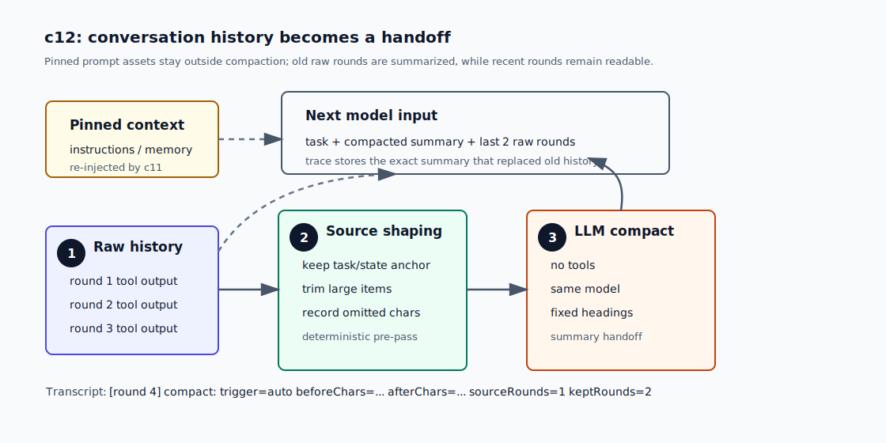
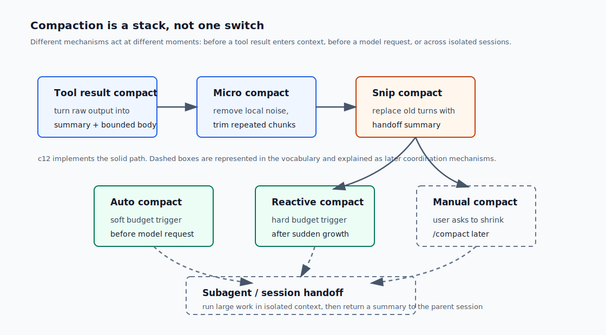

# c12 Context Compaction

c11 之后，模型的 instructions 已经不再写死在 loop 里。`PromptAssembly` 会把 base rules、tool rules、project memory、skill catalog 和 selected skill body 组装成每轮 request 的 `instructions`。

但 `input` 还有一个旧问题。`runMinimalLoop` 会把 user task、model output、tool output 和 recovery message 一直追加到同一个 history 里。短任务看不出来；一旦模型连续读几个教程章节，下一轮 request 就会带着一长串旧工具结果。

c12 加一个最小的 context compaction core。它不会压缩 system prompt、project memory 或 skill catalog；这些仍然由 c11 每轮重新注入。它只处理 conversation history：旧 rounds 被 LLM 总结成一份 handoff summary，最近两个 rounds 继续保留原文。

## 问题

c05 已经把单次 tool result 变成 `Observation`：

```text
ToolResult -> Observation -> ContextProjection -> function_call_output
```

这解决的是“下一轮应该怎样看一次工具结果”。它没有解决“很多轮工具结果加起来太大”。

到了 c12，比较容易复现这个压力。让模型连续读取 c09、c10、c11 三个教程文件，每个 `read` 都可能带回几千到上万字符。旧实现的 history 会变成这样：

```text
user task
round 1 function_call(read c09)
round 1 function_call_output(...)
round 2 function_call(read c10)
round 2 function_call_output(...)
round 3 function_call(read c11)
round 3 function_call_output(...)
```

模型在 round 4 真正需要的是：

```text
任务是什么？
前面已经读过什么？
哪些证据还要保留？
下一步该做什么？
最近两轮的原始输出是什么？
```

它不一定需要 round 1 的完整原文。trace 要保存完整证据，model input 要适合继续工作。这就是 c12 的痛点：长 session 里，trace 和 context 需要分工。

## 解决方案

c12 把 conversation history 放进一个小的 input history manager。

每轮主模型 request 前，harness 先估算当前 input 的字符数。这里用 approximate chars，不做 tokenizer。它不是精确 token accounting，只是一个稳定的 budget signal。

当 history 超过 soft budget 时，harness 执行 `auto` compaction：

```text
old raw rounds
  -> source shaping
  -> LLM compact call(no tools)
  -> compacted summary
  -> next model input
```



compaction call 复用当前 run 的 model 和 `responseCreate`，但不传 tools。它不是隐藏的 agent turn，只负责总结已经提供给它的 history 和当前 `RuntimeState` snapshot。

summary 使用固定标题：

```md
# Compacted Context

## Task
...

## Progress
...

## Evidence
...

## Open Questions
...

## Next Step
...
```

harness 只硬性要求 summary 非空。如果缺少某个标题，会把 missing headings 写进 trace metadata，但不会再发一次 repair call。c12 的目标是先把 compaction path 跑通，不把章节变成 summary validator。

压缩后，下一轮 input 是：

```text
user task
compacted summary
last 2 raw rounds
```

`user task` 是 pinned item，不压缩。c11 的 instructions、project memory 和 skills 也不在 conversation history 里，所以不交给 summary 覆盖。

如果某次工具结果突然很大，history 在 round 中途超过 hard budget，harness 会执行 `reactive` compaction。reactive compaction 只做一次。压完仍然超过 hard budget，就记录 `context_compaction_failed` 并停止。这比静默丢旧消息更容易复盘。

## 最小实现

c12 的实现顺序是：

```text
1. 新增 context compaction module
2. 用 input history manager 管理 model input
3. 在主 request 前执行 auto compact
4. 在新 context 追加后执行 reactive compact
5. 把 compaction 写进 trace、RuntimeState 和 transcript
```

### 1. compaction module 只做 context 维护

核心类型放在 `src/context/compaction.ts`。

```ts
export type ContextCompactionTrigger =
  | "auto"
  | "reactive"
  | "manual";
```

c12 实际触发 `auto` 和 `reactive`。`manual` 先进入类型和 trace vocabulary，等后面有可恢复 session 或交互式命令时再接用户 `/compact`。

默认 budget 是：

```ts
softCharBudget: 24_000
hardCharBudget: 36_000
recentRoundsToKeep: 2
sourceItemCharLimit: 4_000
```

`sourceItemCharLimit` 用在 compaction source builder。旧 history 进入 LLM summary 前，会先被本地整理：过大的 item 截断，并记录 omitted chars。这里就是 c12 里的 `tool result compact` / `micro compact` 位置。

source 里还会带一个很小的 recent-history index。它只列最近 rounds 的 round number、tool name 和参数摘要，不放完整输出。这样 LLM 知道这些 rounds 会原样保留，不会把“没有出现在旧 history source 里”误判成“证据缺失”。

### 2. history manager 替代无限追加数组

旧 loop 里有一个不断增长的数组：

```ts
input.push(...response.output);
input.push({
  type: "function_call_output",
  call_id: toolCall.call_id,
  output: resultText,
});
```

c12 后，loop 不再直接持有这个 flat array。它把每轮输出交给 history manager：

```ts
inputHistory.appendRoundItems(round, response.output);
inputHistory.appendRoundItems(round, [{
  type: "function_call_output",
  call_id: toolCall.call_id,
  output: resultText,
}]);
```

每次要发主模型 request 时，再取当前 projection：

```ts
const input = inputHistory.modelInput();
```

这样 compaction 可以替换旧 rounds，同时保留最近 rounds 的原始结构。它不会留下孤立的 `function_call_output`。

### 3. auto compact 发生在主 request 前

每轮开始时，loop 先算当前 input char count。如果超过 soft budget，并且已经有可压缩的旧 rounds，就先跑一次 compaction。

compaction request 的要点是：

```ts
tools: []
model: same model
input: [{ role: "user", content: compactionSource }]
```

这条内部 request 不会写普通 `model_request` event。它写的是 `context_compacted`：

```json
{
  "type": "context_compacted",
  "round": 4,
  "trigger": "auto",
  "beforeCharCount": 25200,
  "afterCharCount": 9200,
  "sourceRoundCount": 1,
  "keptRecentRoundCount": 2,
  "summary": "# Compacted Context\n\n## Task\n..."
}
```

trace 保存完整 summary，因为它就是替代旧 history 后模型实际会看到的内容。`RuntimeState` 只保存轻量 metadata：compaction 次数、最后一次 trigger、字符数和 missing headings。

### 4. reactive compact 是应急路径

auto compact 在主 request 前运行。它处理的是正常增长。

reactive compact 在追加新 context 后检查 hard budget。常见触发点是一个很大的 `read` output 或 recovery message。流程是：

```text
append tool output
  -> estimate input chars
  -> if over hard budget, compact old rounds
  -> estimate again
  -> still over hard budget, fail explicitly
```

失败时会写 `context_compaction_failed`：

```json
{
  "type": "context_compaction_failed",
  "round": 3,
  "trigger": "reactive",
  "beforeCharCount": 48000,
  "afterCharCount": 37500,
  "hardCharBudget": 36000,
  "reason": "reactive compaction still exceeded hard budget 36000"
}
```

这条事件说明 harness 尝试过保留 handoff，但最近 context 本身仍然太大。此时继续运行只会靠静默丢证据换进度，c12 不这么做。

### 5. transcript 只打印统计

CLI 不打印完整 summary。终端里只出现一行：

```text
[round 4] compact: trigger=auto beforeChars=... afterChars=... sourceRounds=1 keptRounds=2 sourceItems=... summaryChars=... missingHeadings=none reason=...
```

完整 summary 在 trace 里。读者需要复盘时，直接打开 `trace.jsonl`。

`RuntimeState` 的 compact 摘要也很短：

```text
[round 4] state: status=running compacted=1 lastCompact=auto
```

## 运行验证

开始前，先按 [README](../../README.md#setup) 完成依赖安装和 `.env` 配置。

先 build 一次，让 `npm run start` 使用最新的 `dist/`：

```bash
npm run build
```

然后让模型连续读取三个较长章节：

```bash
npm run start -- "Read docs/tutorial/c09-hooks.md, then read docs/tutorial/c10-task-todo.md, then read docs/tutorial/c11-system-prompt-skills-memory.md. After those reads, explain in two sentences what c12 adds. Do not use bash."
```

你会先看到 session line：

```text
[session] id=${session_id} trace=.forge/sessions/${session_id}/trace.jsonl
```

前几轮会是普通 `read`：

```text
[round 1] function_call: read {"path":"docs/tutorial/c09-hooks.md"}
[round 1] tool_result:
tool: read
status: completed
observation: read completed
...
```

当 history 超过 soft budget 后，后续 round 开始前会出现 compact line：

```text
[round 4] compact: trigger=auto beforeChars=... afterChars=... sourceRounds=1 keptRounds=2 sourceItems=... summaryChars=...
```

这里看三点：

- `trigger=auto` 说明这是主 request 前的正常维护。
- `sourceRounds=1` 说明旧 round 被拿去总结。
- `keptRounds=2` 说明最近两轮仍然保留原文。

再看 trace：

```bash
grep '"context_compacted"' .forge/sessions/${session_id}/trace.jsonl
```

你会看到 `summary` 字段。它不是 transcript 摘要，而是下一轮 model input 里实际替代旧 history 的 handoff。

如果要看 hard budget 失败路径，可以在单元测试里调低 budget；读者 smoke run 不强行制造失败。真实 CLI 默认值更适合正常演示。

## 其他 compaction 机制

正式的 coding agent 通常不会只有一个“压缩开关”。更实用的做法是一组机制叠在一起，每层处理不同位置的上下文压力。



`tool result compact` 发生在工具输出进入上下文之前。比如 `grep` 返回很多匹配时，tool result 应该先给出 summary、返回数量、总数量和 omitted count。Forge 在 c05 已经有这个雏形：`Observation` 和 `ContextProjection` 让工具结果变成稳定的模型观察。

`micro compact` 更小。它通常不需要 LLM，只做局部清理：截断超长 item、去掉重复片段、保留 header 和关键字段。c12 的 compaction source builder 就承担这部分职责。

`snip compact` 是本章的主机制。它把较旧的一段 raw history 替换成 handoff summary，同时保留最近 raw rounds。这样模型不会失去当前局部连续性。

`auto compact` 是常规维护。接近 soft budget 时主动压缩，避免每次都等到 context 快爆。

`reactive compact` 是应急路径。某个工具结果突然很大，增长速度超过 auto compact 的节奏时，它会立刻尝试压缩。如果压完仍然超过 hard budget，harness 要停下来并留下失败证据。

`manual compact` 是用户显式要求压缩。它适合交互式或可恢复 session：用户已经看见上下文变满，于是输入 `/compact`。当前 Forge CLI 还是一次性 task，所以 c12 先保留 trigger vocabulary，后续有 session resume 或 foreground/background 协作时再接命令。

`subagent/session handoff` 用在更大的任务里。主 session 不直接读取所有大文件，而是把独立子任务交给隔离 session；子 session 完成后只把 summary 和证据带回主 session。c15 会在 child sessions / subagents 里继续这条线。

这些机制的共同点是：不要把所有东西都交给一个 summary。能在 tool result 层整理的，就先整理；能用本地规则清掉的噪声，不必发给 LLM；真正需要语义 handoff 的旧 history，再交给 snip compact。

## 下一步缺口

c12 不做精确 token accounting。字符数足够解释 budget pressure，也便于测试；真正的 context window 管理以后需要按 model 选择 tokenizer 和窗口策略。

c12 也不做用户 `/compact` 命令。没有可恢复或交互式 session 时，task 开头的 `/compact` 没有旧 history 可压。后续章节引入 background、worktree 和 child session 后，manual compaction 才有稳定的用户入口。

c13 会处理 foreground turn 之外的工作。到那时，compaction summary 不只是下一轮 input 的内部片段，也可以成为 session 唤醒或后台任务继续执行时的 handoff。
