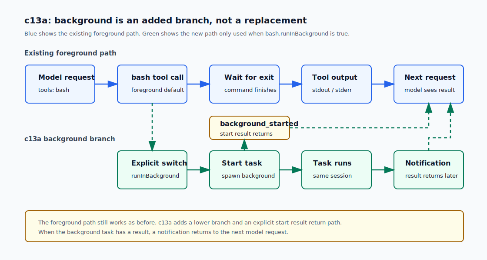
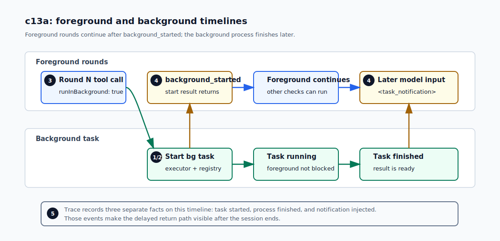

# c13a Background Tool Tasks

c12 解决的是长 session 里的 context pressure：旧 rounds 可以被压缩成 handoff summary。

c13 开始处理另一类“长”：命令本身可能很慢。旧 loop 里的 `bash` 是 foreground tool。模型一旦调用 `sleep 10 && echo done` 等类似的可能耗时很长的命令，harness 就会等到命令结束，期间不能继续读文件、不能发下一轮 request，也不能在 final 前意识到还有工作没回流。

c13 拆成两步。c13a 只做当前 foreground session 内的 background bash task。c13b 再讲 scheduled jobs / cron、durable jobs 和 worker session。

## 问题

到 c12 为止，tool call path 仍然是同步的：

```text
model tool_call
  -> toolRuntime.execute()
  -> wait until command exits
  -> function_call_output
  -> next model request
```

这对 `ls`、`read`、`grep` 很合适。它们本来就应该快速返回。

但 coding agent 经常会遇到另一种命令：启动 server、等待日志、跑长测试、或者先发起一个后台观察再继续做别的检查。它们不一定应该阻塞当前 foreground loop。

这里真正的问题不是“命令慢”，而是：模型明确想让某个命令在后台跑，同时 foreground loop 还要继续推进，并且命令完成后结果必须回到模型上下文。

所以 c13a 要补的是针对后台命令的最小返回流程：

```text
start background command
  -> tool call immediately returns
  -> command completes later
  -> harness injects task notification
  -> model sees result and continues
```

## 解决方案

先回顾 [c02 Tool Runtime](c02-tool-runtime.md) 的边界。当时我们把 built-in tools 放进 default runtime，同时允许 `runMinimalLoop` 接收自定义 `toolRuntime`。这个边界在 c13a 仍然保留：

- default runtime 可以被本章增强。
- 自定义 `toolRuntime` 按调用方传入的样子使用，harness 不偷偷给它加 background 能力。

因此，background 能力只增强 default runtime 里的 `bash`。自定义 runtime 不会被偷偷改写。

模型启动 background task 的方式是显式 tool argument：

```json
{
  "command": "sleep 2 && echo done",
  "runInBackground": true
}
```

这里的“显式”指的是：模型必须在 `bash` tool call 里把 `runInBackground` 设为 `true`。只写 `command: "sleep 2 && echo done"`、省略 `runInBackground`，或者把它设为 `false`，都还是 foreground 执行。

没有关键词启发式。`sleep`、`npm run dev`、`pytest` 这些字符串本身不会自动变成后台。



这张图里，上轨是 c13a 之前已经存在的 foreground path：模型调用 `bash`，harness 等命令结束，再把结果交回下一轮模型。下轨是本章新增的 background branch：只有当 `runInBackground: true` 出现时，命令才从 foreground path 分叉出去。

分叉以后，启动 background task 这件事会马上回到 foreground loop，所以模型可以继续做别的检查。图里的 `background_started` 是“任务已启动”的结果，不是后台命令的 stdout/stderr。后台命令完成后，结果不会丢掉；harness 会在后续 round 把一条 task notification 放回模型上下文。

如果模型在后台结果还没回流时准备结束，harness 会先提醒模型：还有 background task 没有完成或还没被看见。这个提醒只是让模型知情，不把 background task 变成必须等待的完成屏障。

## 最小实现

c13a 的实现分成五块。这里先讲每一块为什么存在，再进入具体代码。

| 小节                                                | 要解决的问题                                                                           | 机制                                                                                                  |
| --------------------------------------------------- | -------------------------------------------------------------------------------------- | ----------------------------------------------------------------------------------------------------- |
| 1. bash executor 支持 cancel                        | 后台命令不能只是一个不可控制的 Promise；timeout 和 session cleanup 都要能收束它。      | 抽出可取消 executor，旧的 foreground API 继续复用它。                                                 |
| 2. BackgroundTaskManager 是 session-scoped registry | tool call 已经返回后，还需要一个地方记住 task id、状态和完成结果。                     | 在当前 session 内登记 background task，并按创建顺序 drain notification。                              |
| 3. bash tool 只在 default runtime 增强              | 模型需要一个明确开关；自定义 `toolRuntime` 不能被 harness 偷偷改写。                   | default `bash` 有条件暴露 optional `runInBackground`。                                                |
| 4. loop 在两处 drain notification                   | 后台结果晚于原 tool call，需要回到后续模型上下文；final 前也要提醒模型还有未回流任务。 | round start 注入 terminal notification，candidate final 前注入 terminal 或一次 running notification。 |
| 5. trace 记录三类事件                               | task started、process finished、notification injected 是三件事，复盘时不能混在一起。   | 写入 `background_task_started`、`background_task_finished`、`background_task_notification`。          |

把这五块串起来，时间线是这样的：



> 图中序号与小节一一对应。

### 1. bash executor 支持 cancel

旧的 `runBashCommand()` 直接返回 `Promise<BashExecutionResult>`。c13a 抽出一个底层 handle：

```ts
export interface BashCommandHandle {
  cancel(): void;
  promise: Promise<BashExecutionResult>;
}

export function startBashCommand(
  command: string,
  options: BashExecutionOptions,
): BashCommandHandle;
```

`runBashCommand()` 仍然保留旧 API：

```ts
export async function runBashCommand(
  command: string,
  options: BashExecutionOptions,
) {
  return startBashCommand(command, options).promise;
}
```

timeout 和 cancel 走同一条结束路径：先 `SIGTERM`，再给一个 grace period，最后 `SIGKILL`。timeout 的 result status 是 `timed_out`；cleanup cancel 的 result status 是 `canceled`。

foreground `bash` 的默认 timeout 仍是 `20_000ms`。background bash 的默认 timeout 是 `120_000ms`。

### 2. BackgroundTaskManager 是 session-scoped registry

`src/runtime/backgroundTasks.ts` 只管理当前 session 里的 background tasks：

```ts
export interface BackgroundTaskManager {
  startBash(input: StartBackgroundBashInput): BackgroundTaskStart;
  drainNotifications(): BackgroundTaskNotification[];
  drainRunningNotifications(): BackgroundTaskNotification[];
  cancelRunning(): Promise<void>;
  flushEvents(): Promise<void>;
}
```

task id 是递增的本地 id：

```text
bg_001
bg_002
bg_003
```

它不是 OS PID，也不是 durable job id。session 结束后，这些 id 就没有恢复语义。

manager 维护的状态很少：

```ts
export type BackgroundTaskStatus =
  | "running"
  | "completed"
  | "timed_out"
  | "failed"
  | "canceled";
```

`completed`、`timed_out`、`failed` 会产生模型通知。`canceled` 只在 session cleanup 中写 trace，不注入模型；c13a 还没有 manual cancel 或 status query。

### 3. bash tool 只在 default runtime 增强

`createDefaultToolRuntime()` 现在可以接收 `backgroundTasks`：

```ts
createDefaultToolRuntime({
  cwd,
  backgroundTasks,
});
```

有 manager 时，`bash` schema 多一个 optional property：

```ts
runInBackground: {
  type: "boolean",
  description: "Set to true only when the command should keep running while the foreground loop continues.",
}
```

`required` 仍然只有 `command`。

这里有一个 API 细节：OpenAI 的 strict function schema 要求 `required` 覆盖所有 properties。为了让 `runInBackground` 保持真正可省略，background-enabled `bash` definition 使用非 strict schema；foreground-only `bash` 仍然是 strict schema。

当 `runInBackground: true` 时，`bash` 不等待命令结束。它先做危险命令检查；如果命令被 block，就不会创建 task。通过检查后，tool result 立刻返回：

```text
tool: bash
status: completed
observation: bash background task started
status: background_started
background_task_id: bg_001
kind: bash
command: sleep 2 && echo done
```

这里 tool result 的 `status` 是 `completed`，因为“启动后台任务”这个 tool call 已经完成了。后台命令本身的结果会通过后续 notification 回来。

### 4. loop 在两处 drain notification

第一处是每轮开始：

```ts
await appendBackgroundTaskNotifications({
  backgroundTasks,
  inputHistory,
  lifecycleEmitter,
  round,
  running: false,
});

await maybeAutoCompactInputHistory(...);
```

顺序很重要：已经完成的后台结果应该先进入 conversation history，然后 c12 的 compaction 再决定下一轮模型能看到什么。

具体注入的 notification 是一个普通 input item，不复用原 tool call 的 `call_id`：

```text
<task_notification>
background_task_id: bg_001
kind: bash
status: completed
command: sleep 2 && echo done
exit_code: 0
duration_ms: 2008
stdout:
done
stderr:
(empty)
</task_notification>
```

第二处是 candidate final 前：

```ts
const backgroundGateInjected = await appendBackgroundTaskNotifications({
  backgroundTasks,
  inputHistory,
  lifecycleEmitter,
  round,
  running: true,
});

if (backgroundGateInjected > 0) {
  await maybeReactiveCompactInputHistory(...);
  continue;
}
```

这条 gate 在 verification 之前。否则可能出现一个奇怪路径：模型给了 final answer，verifier 开始跑，但后台任务其实刚完成，只是结果还没注入模型上下文。

session 结束时 cleanup 顺序是：

```text
flush finished callbacks
cancel running tasks
flush canceled callbacks
emit session_ended
```

这样 `background_task_finished` 的 canceled trace 会出现在 `session_ended` 前。

### 5. trace 记录三类事件

c13a 新增三类 trace event：

```text
background_task_started
background_task_finished
background_task_notification
```

`background_task_started` 来自 tool result metadata。`background_task_finished` 来自 manager 的 `onTaskFinished` callback。`background_task_notification` 在 notification 真正 append 到 input history 时记录。

这三类事件回答的是三个不同问题：

- `started`：模型什么时候请求启动了后台任务？
- `finished`：进程什么时候结束，结束状态是什么？
- `notification`：结果什么时候被注入给模型看见？

`RuntimeState` 没有扩展。c13a 先把 evidence 留在 trace 里，避免把 state 做成一个混合所有机制的全局对象。

## 运行验证

开始前，先按 [README](../../README.md#setup) 完成依赖安装和 `.env` 配置。

先 build 一次，让 `npm run start` 使用最新的 `dist/`：

```bash
npm run build
```

然后运行一个明确要求 background 的 prompt。这里用 inspect-only 命令，避免 smoke run 卡在交互式 approval 上：

```bash
npm run start -- "Use bash to start two background tasks with runInBackground true: first run 'pwd', then run 'ls docs/tutorial/c13a-background-tool-tasks.md'. While they are background tasks, use ls to inspect the project root. After the background notifications arrive, report the working directory and whether the tutorial file was listed."
```

你应该看到前几轮出现类似输出：

```text
[round 1] tool_result:
tool: bash
status: completed
observation: bash background task started
status: background_started
background_task_id: bg_001
```

第二个 background task 会拿到 `bg_002`。如果模型按 prompt 继续调用 `ls`，说明 foreground loop 没有被后台命令阻塞。

最终答案应该提到当前工作目录，并确认这个文件被列出：

```text
docs/tutorial/c13a-background-tool-tasks.md
```

再看 trace：

```bash
grep '"background_task_' .forge/sessions/${session_id}/trace.jsonl
```

你会看到 started、finished 和 notification 三类事件。`finished` 说明进程结束；`notification` 说明这个结果已经进入下一轮 model input。

## 下一步缺口

c13a 不实现 durable jobs。进程和 registry 都绑在当前 foreground session 上；session 结束时还在 running 的任务会被 cleanup cancel。

c13a 不实现 cron。没有 schedule、没有 worker wakeup、没有跨 session 的 job store。那些属于 c13b。

c13a 也不实现 job verification。带 verification 的 background job 会复用 c08 的验证思路，但需要回答“谁触发 verify、verify 失败后谁 recovery、结果如何通知 foreground session”。这些问题放到后续章节更清楚。

### 易混淆的点

`background_task_id` 不是 PID。它只是当前 session 里的递增 id，用来把 tool result、trace 和 notification 对上。

`backgroundTasks` 不是线程池。它不调度 CPU worker，只登记由 bash executor 启动的进程 handle。

慢命令不等于后台命令。c13a 不做 command 关键词启发式，只有 `runInBackground: true` 才会后台执行。

启动 background 的 tool result 是 `completed`，因为“启动”已经完成。后台命令的完成状态在 `<task_notification>` 里。

running notification 只是知情提醒，不是完成屏障。它每个 task 只注入一次，模型看到后可以选择等待、继续检查，或者说明还有任务未回流。

拿不到 background 结果不会自动让 session 失败。如果任务还在 running 而模型坚持 final，c13a 只提醒一次；session 结束 cleanup 会 cancel 并写 trace。

`onTaskFinished` 不是 notification。它只是 manager 给 loop 的 callback，loop 再用它写 `background_task_finished` trace。notification 只有 drain 到 input history 时才发生。

自定义 `toolRuntime` 不会自动支持 background。调用方要自己决定 schema、executor 和回流方式；c13a 只增强 default runtime。
