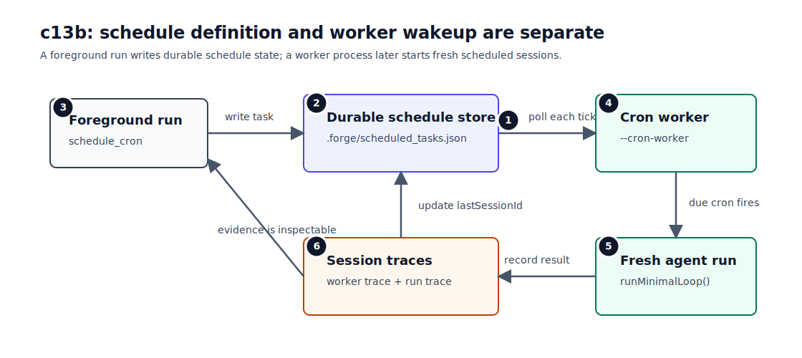
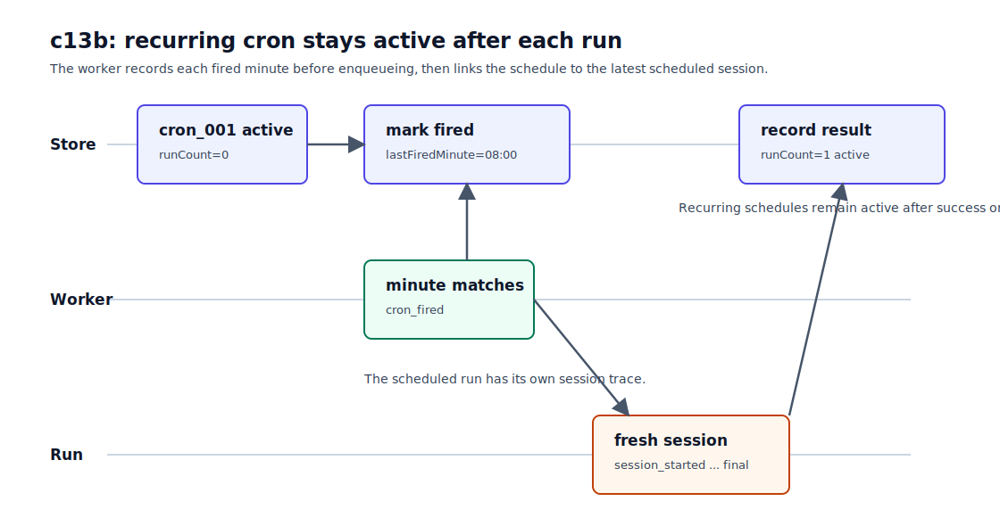

# c13b Scheduled Jobs / Cron

c13a 解决的是当前 session 里的“慢”命令：模型可以把一个 `bash` tool call 放到后台，foreground loop 继续走，后台结果再通过 notification 回来。

c13b 处理另一类后台工作：在某个 cron 时间启动一次 fresh agent run。这类任务不能只放在 prompt 里让模型记住。它需要持久化到本地文件的 schedule、持续运行的 worker，以及能复盘的 trace。

## 问题

c13a 的 `BackgroundTaskManager` 是 session-scoped。它的 id 是 `bg_001` 这样的本地 id，只在当前 session registry 里有效。session 结束后，没有 worker 能重新加载这个 id、继续追踪它，或者把结果再注入到模型上下文里。这里说的“没有恢复语义”，就是指这个 id 不能跨 session 被恢复和继续执行。

cron 面临的问题不同。用户可能让 agent：

```text
每天早上检查一次项目状态。
每分钟读一次某个文件，直到我停掉这个 schedule。
下一次匹配 cron 后执行一次，然后不要再跑。
```

这些工作不应该绑在当前 foreground session 上。当前 session 可以结束，但 schedule 定义不能丢。问题变成了三件事：未来的工作定义放在哪里，谁在 cron 时间把它唤醒，以及触发后如何证明 worker 和 fresh run 分别做了什么。

## 解决方案

c13b 加一个最小 cron scheduler。它的主流程是：

```text
durable schedule definition
  -> worker wakeup
  -> fresh agent run
  -> trace / store update
```

这里的 durable 只表示 schedule definition 写进了 `.forge/scheduled_tasks.json`。没有 worker 在运行时，它只是本地文件里的一条定义，不会自己触发。

实现上，这条流程分成两条路径。

第一条是 foreground run。模型通过普通 tools 创建、查看、取消 cron：

```text
schedule_cron
list_crons
cancel_cron
```

`schedule_cron` 不直接执行 prompt。它只把 schedule 写入：

```text
.forge/scheduled_tasks.json
```

第二条是 worker run。用户显式启动 worker：

```bash
npm run start -- --cron-worker
```

这条命令启动的就是本章的 cron worker。它不运行时，schedule 不会被唤醒。

worker 每秒读取 `.forge/scheduled_tasks.json`，用本机 local time 检查 active schedule 是否匹配当前分钟。匹配后，worker 先写 `lastFiredMinute`，再把 work item 放进 FIFO queue。queue 一次只跑一个 item。每个 item 会在同一个 Node process 里启动一次 fresh `runMinimalLoop()`，并创建独立 session trace。



这张图按运行路径画：foreground run 只负责创建 schedule，worker run 才负责轮询、触发和启动 fresh run。图里的编号对应后面“最小实现”的 1-6 小节，但执行顺序要按箭头看：`schedule_cron` 先写 store，worker 每秒读取 store，匹配到 due minute 后再启动 scheduled run。

图里还有三类可检查的记录，分别回答不同问题：

- `.forge/scheduled_tasks.json` 保存 schedule 当前状态。
- worker session trace 记录 `cron_fired` 和 `cron_run_finished`。
- scheduled run session trace 记录那次 agent run 具体做了什么。

## 最小实现

c13b 的实现分成六块。表格里的编号和上图一致，方便把图里的运行路径对应到具体代码。

| 小节                      | 痛点                                              | 机制                                                              |
| ------------------------- | ------------------------------------------------- | ----------------------------------------------------------------- |
| 1. 自写小 cron matcher    | 不想引入 scheduler 框架，但需要稳定匹配当前分钟。 | 5-field cron，支持 `*`、`*/N`、`N`、`N-M`、`N,M`。                |
| 2. Durable schedule store | schedule 不能随着 foreground session 结束而丢。   | `.forge/scheduled_tasks.json` 单文件快照。                        |
| 3. Cron management tools  | 模型需要通过 tool 创建、查看、取消 schedule。     | `schedule_cron` / `list_crons` / `cancel_cron`。                  |
| 4. Worker process         | cron 需要一个明确的 wakeup 入口。                 | `--cron-worker` 长期运行，`--cron-worker-once` 方便验证。         |
| 5. Fresh scheduled run    | 被触发的工作应该有独立 session 和 trace。         | worker 内部调用 `runMinimalLoop("[Scheduled cron_id=...] ...")`。 |
| 6. Trace evidence         | schedule 触发和 agent 执行不能混在一条日志里。    | worker trace 记录调度，scheduled run trace 记录执行。             |

### 1. 自写小 cron matcher

c13b 不引入 `cron-parser`、`node-cron` 或队列系统。cron matcher 只支持常见的 5-field 子集：

```text
minute hour day-of-month month day-of-week
```

每个字段支持：

```text
*
*/N
N
N-M
N,M
```

`month` 只支持 `1-12`，不支持 `JAN` 这类英文别名。`day-of-week` 支持 `0` 和 `7` 都表示 Sunday，但不支持 `MON` 这类别名。

DOM 和 DOW 同时受限时，c13b 使用常见 cron 的 OR 语义：

```text
0 9 1 * 1
```

这表示：

```text
每月 1 号 9 点
或
每周一 9 点
```

不是“每月 1 号且刚好是周一”。

### 2. Durable schedule store

每个 schedule 保存成一个对象：

```ts
{
  id: "cron_001",
  title: "Package check",
  cron: "* * * * *",
  prompt: "Read package.json and answer with the package name.",
  recurring: true,
  status: "active",
  createdAt: "...",
  updatedAt: "...",
  lastFiredMinute: "2026-07-10T08:04",
  runCount: 1,
  lastRunStatus: "completed",
  lastSessionId: "20260710-080401-a1b2c3d4"
}
```

对象后面重点看几个字段：

- `status` 表示 schedule 本身还会不会继续触发。
  - `active`: 还会继续触发。
  - `canceled`: 用户取消，不再触发。
  - `completed`: one-shot 成功执行一次，不再触发。
  - `failed`: one-shot 执行失败，不再触发。
- `lastRunStatus` 表示最近一次 scheduled run 的结果，不等同于 schedule lifecycle。
- `recurring` 决定 run 结束后如何更新 lifecycle。recurring schedule 某次失败后仍然保持 `status: "active"`，只更新 `lastRunStatus: "failed"` 和 `lastError`。
- `lastSessionId` 指向最近一次 scheduled run 的 session trace。

store 解析失败时直接 fail fast，不会自动覆盖坏文件。这个选择保守一些，但不会把用户手动修复 schedule 的机会抹掉。

### 3. Cron management tools

`schedule_cron` 的参数很小：

```json
{
  "title": "Package check",
  "cron": "* * * * *",
  "prompt": "Read package.json and answer with the package name.",
  "recurring": false
}
```

`recurring` 默认是 `true`。传 `false` 时，下一次 cron 匹配后只执行一次。成功后 `status` 变成 `completed`，失败后变成 `failed`。

权限边界也很明确：

- `list_crons` 是 inspect tool，默认 allow。
- `schedule_cron` 和 `cancel_cron` 会改变未来的 agent runs，默认 ask。

worker 启动的 scheduled run 不暴露这些 mutating cron tools。它可以做普通检查，也可以复用 c13a 的 background bash，但不能自己创建更多 cron。

### 4. Worker process

普通 run 和 worker run 是两个入口。

普通 run：

```bash
npm run start -- "Create a one-shot cron named package once with cron '* * * * *'. Its prompt should read package.json and answer with the package name. Use schedule_cron and set recurring false."
```

这条命令创建 schedule，然后结束。

worker run：

```bash
npm run start -- --cron-worker
```

worker 会一直运行，直到用户按 `Ctrl-C`。为了教程和测试，c13b 还提供一次性 worker：

```bash
npm run start -- --cron-worker-once
```

`--cron-worker-once` 只扫描当前分钟一次，执行 queue 后退出。它和真实 worker 用同一套 store、matcher 和 runner，只是退出策略不同。

### 5. Fresh scheduled run

worker 触发 schedule 后，不会恢复创建 schedule 的 foreground session。它会启动一次 fresh scheduled run：

```text
[Scheduled cron_id=cron_001] Read package.json and answer with the package name.
```

这次 run 有自己的 session：

```text
.forge/sessions/<scheduled-session-id>/session.json
.forge/sessions/<scheduled-session-id>/trace.jsonl
```

worker 自己也有 session trace：

```text
.forge/sessions/<worker-session-id>/trace.jsonl
```



这张时间线分成三条 lane。Store lane 展示 `cron_001` 从 `runCount=0` 到记录结果；Worker lane 展示当前分钟匹配后写入 `cron_fired`；Run lane 展示被触发的工作会进入一个 fresh session，而不是回到创建 schedule 的 foreground session。

worker 在 enqueue 前先写 `lastFiredMinute`。这样 1 秒 poll 不会在同一分钟重复触发同一条 schedule。run 结束后，store 再更新 `runCount`、`lastRunStatus` 和 `lastSessionId`。代价是：如果 worker 写完后立刻崩了，本次触发可能丢失。c13b 不做 crash recovery。

### 6. Trace evidence

foreground run 会记录：

```text
cron_scheduled
cron_canceled
```

worker trace 会记录：

```text
cron_worker_started
cron_fired
cron_run_finished
cron_worker_stopped
```

scheduled run trace 仍然是普通 agent trace：

```text
session_started
model_request
tool_call
tool_result
final_answer
session_ended
```

这三类记录各管一件事：谁创建了 schedule、worker 为什么触发它、触发后的 agent 到底做了什么。

## 运行验证

开始前，先按 [README](../../README.md#setup) 完成依赖安装和 `.env` 配置。

先 build：

```bash
npm run build
```

创建一个 one-shot cron：

```bash
npm run start -- "Create a one-shot cron named package once with cron '* * * * *'. Its prompt should read package.json and answer with the package name. Use schedule_cron and set recurring false. Do not use bash."
```

因为 `schedule_cron` 会写入本地 schedule store，CLI 会要求 approval。批准后，打开 store：

```bash
cat .forge/scheduled_tasks.json
```

你会看到 `cron_001`，状态还是 `active`，`runCount` 是 `0`。

接着跑一次性 worker：

```bash
npm run start -- --cron-worker-once
```

终端会打印 worker session，并在 schedule 触发后打印 scheduled session：

```text
[session] id=... trace=.forge/sessions/.../trace.jsonl
[cron-worker] loaded 1 schedule
[cron-worker] fired cron_001 package once
[cron-worker] scheduled session=... trace=.forge/sessions/.../trace.jsonl
[cron-worker] session=... status=completed
```

再看 store：

```bash
cat .forge/scheduled_tasks.json
```

这次应该看到：

```text
status: completed
runCount: 1
lastSessionId: ...
```

把 `lastSessionId` 对应的 trace 打开，就能看到这次 scheduled run 的完整事件：

```bash
sed -n '1,20p' .forge/sessions/<lastSessionId>/trace.jsonl
```

如果要看长期 worker，创建一条 recurring cron，然后启动：

```bash
npm run start -- --cron-worker
```

等待一到两分钟，`runCount` 会继续增长。最后按 `Ctrl-C` 停掉 worker。

## 下一步缺口

先看 c14 会接住的问题。假设你创建了一条 recurring cron，让 scheduled run 每晚整理 README 或更新某个报告文件。c13b 会直接在当前 cwd 里执行这次 run。只要它改了很多文件，foreground session 和 scheduled run 的修改就会混在同一个工作区里。小实验还能接受，真实任务就需要 worktree isolation，把每条工作线放进独立 filesystem boundary。这个压力会在 `c14 Worktree Isolation` 里处理。

再看 missed runs。比如 worker 周末没有启动，周一再打开时，c13b 不会补跑错过的那些分钟。它只检查当前分钟是否匹配 cron。补跑需要记录每个 schedule 的 expected fire time 和 catch-up policy，本章先不做。

如果你在两个 terminal 同时启动 `--cron-worker`，它们都会读同一个 `.forge/scheduled_tasks.json`。c13b 没有 lock 或 claim 机制，所以多个 worker 可能重复触发同一条 schedule。本章默认只有一个 worker 在跑。

如果你把同一个 repo 从上海机器移到 UTC 服务器，cron 匹配时间也会变。c13b 用本机 local time，不支持 per-schedule timezone。

如果你想让某条 scheduled job 必须通过 `npm test` 才算成功，现在也没有 per-job verifier。scheduled run 能自己调用 tools 和报告结果，但确定性 job verification 还没有进入 schedule schema。

最后，c13b 只实现教学用的 cron 子集。如果你从真实 crontab 复制了 `L`、`W`、`#`、英文月份或星期别名，parser 会直接拒绝。
