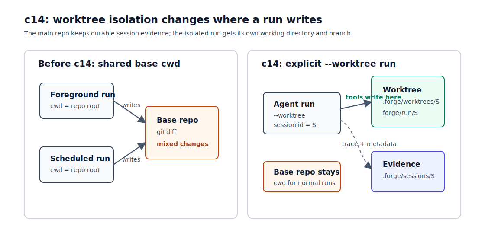

# c14 Worktree Isolation

c13b 之后，foreground run 和 scheduled run 已经可以分开。问题是它们还是写同一个工作区。

假设你让 worker 每晚更新一份报告，同时自己在同一个 repo 里改教程正文。只要 scheduled run 也开始写文件，两条工作线的 diff 就会混在一起。`Permission Governance` 只能回答“这个动作能不能执行”，不能回答“批准后应该写在哪里”。

c14 加的就是这个边界：用户在 run 入口显式传 `--worktree`，Forge 为这次 agent run 创建一个 git worktree。工具、文件编辑、bash 和 verification 都在这个 worktree 里运行。主工作区保持不变，用户最后再看 diff，决定合并回主工作区还是丢掉。

## 问题

c04 已经让文件修改走 `edit` / `write`，并把变化整理成 reviewable result。c13b 又让 worker 可以稍后启动 fresh scheduled run。两者接在一起后，会出现一个更实际的场景：

```text
foreground run 正在改 docs/tutorial/c14-worktree-isolation.md
scheduled run 同时改 README.md 或某个报告文件
```

如果两条 run 都直接用 repo root 作为 `cwd`，它们共享同一个 filesystem boundary。最后你看到的 `git diff` 只能说明“这个工作区变了”，但很难分清哪条工作线改了什么。

这个问题不能靠多问一次 approval 解决。approval 发生在 tool 执行前，它判断这次 action 是否允许。worktree isolation 发生在 session 启动时，它决定这次 run 的 action 落在哪个工作区。

## 解决方案

c14 选择让用户显式开启这条边界：

```bash
npm run start -- --worktree "edit one file in isolation"
```

这里的 `git worktree` 可以先按一个实用定义理解：它是在同一个 git repo 历史上 checkout 出另一个工作目录，并把这个目录绑到一条独立 branch。Forge 不在本章展开它的内部结构，只借用这个工作目录边界，让一次 run 的文件修改落在另一个地方。



普通 run 不变。只有传 `--worktree` 时，Forge 才会从当前 clean `HEAD` 创建：

```text
.forge/worktrees/<session-id>
```

同时创建一个 runtime branch：

```text
forge/run/<session-id>
```

这条 session 之后看到的 `cwd` 就是 worktree path。`read`、`grep`、`edit`、`write`、`bash` 和 `--verify` 都在这个目录里运行。

session evidence 仍然写在 base repo：

```text
.forge/sessions/<session-id>/session.json
.forge/sessions/<session-id>/trace.jsonl
```

这样即使以后清理 worktree，trace 还在。`session.json` 会记录两层路径：`baseCwd` 是原始 repo，`cwd` 是实际执行目录。

cron worker 的语义也保持 run-level。worker 本身只是调度器，它读 `.forge/scheduled_tasks.json`，判断哪些 schedule 到期，然后启动 scheduled run。真正会读写项目文件的是 scheduled run。所以：

```bash
npm run start -- --cron-worker-once --worktree
```

表示 worker 触发的每次 scheduled run 都创建自己的 worktree。worker session 自己仍然留在 base cwd。

## 最小实现

c14 的实现分成五块：

| 小节 | 痛点 | 机制 |
| --- | --- | --- |
| 1. CLI 显式开关 | 隔离不应该悄悄发生。 | `--worktree` 在 run 入口显式打开 worktree isolation。 |
| 2. Workspace binding | tools 需要统一执行目录。 | `WorkspaceBinding` 创建 git worktree 和 `forge/run/<session-id>` branch。 |
| 3. Session evidence | workspace 不能只出现在终端输出里。 | `session.json` 记录 `baseCwd`、`cwd` 和 `workspace`。 |
| 4. Trace events | 成功和失败都要能复盘。 | `workspace_created` / `workspace_setup_failed`。 |
| 5. Worker handoff | scheduled run 才是真正工作线。 | worker 带 `--worktree` 时，只把 isolation 传给 scheduled run。 |

### 1. CLI 显式开关

`src/cli/args.ts` 只多解析一个 boolean：

```ts
if (arg === "--worktree") {
  worktree = true;
  continue;
}
```

这个 flag 不改变 task 文本。它只告诉 CLI：这次 run 在创建 session 后，还要准备一个 worktree。

### 2. Workspace binding

`src/runtime/workspace.ts` 负责 git 相关动作。它先检查当前目录是不是 git repo root，再要求 base repo 是 clean 状态。

这里故意要求 clean base。原因很简单：c14 要让 diff review 变清楚。如果 base 里已经有未提交改动，Forge 就要回答“这些改动要不要复制进 worktree、staged 和 unstaged 怎么处理、untracked 文件怎么算”。那是 dirty snapshot 或 handoff 机制，不是本章要讲的 workspace boundary。

创建成功后，binding 只包含必要信息：

```ts
{
  mode: "git_worktree",
  baseCwd,
  path,
  branch,
  baseBranch,
  baseCommit
}
```

后面的 tool runtime 不需要知道 git 命令细节。它只拿到新的 execution cwd。

### 3. Session evidence

`src/runtime/session.ts` 让 metadata 支持可选的 `baseCwd` 和 `workspace`。

worktree run 的 `session.json` 大致长这样：

```json
{
  "cwd": "/repo/.forge/worktrees/20260713-101500-a1b2c3d4",
  "baseCwd": "/repo",
  "workspace": {
    "mode": "git_worktree",
    "path": "/repo/.forge/worktrees/20260713-101500-a1b2c3d4",
    "branch": "forge/run/20260713-101500-a1b2c3d4",
    "baseBranch": "main",
    "baseCommit": "..."
  }
}
```

这里的 `cwd` 始终表示实际执行目录。普通 run 里它还是 repo root；worktree run 里它就是 isolated workspace。

### 4. Trace events

workspace setup 成功后，trace 里会出现：

```text
workspace_created
```

如果 base repo 不是 git repo、不是 clean 状态，或者 branch/path 已经存在，会记录：

```text
workspace_setup_failed
```

失败时 Forge 不会 fallback 到当前 cwd。用户要求了隔离，就不能在隔离失败后悄悄回到主工作区继续写。

### 5. Worker handoff

`src/cli/index.ts` 里，worker session 和 scheduled run 分开处理。

worker session 仍然这样创建：

```text
cwd = base repo
```

它触发 scheduled run 时，如果 worker 带了 `--worktree`，才给 scheduled run 创建 workspace：

```text
worker session: .forge/sessions/<worker-session-id>
scheduled run: .forge/worktrees/<scheduled-session-id>
```

`.forge/scheduled_tasks.json` 不需要新增字段。它继续通过 `lastSessionId` 指向最近一次 scheduled run。要看 worktree 信息，就打开那个 session 的 `session.json` 或 `trace.jsonl`。

## 运行验证

开始前，先按 [README](../../README.md#setup) 完成依赖安装和 `.env` 配置。

先 build：

```bash
npm run build
```

确认当前 repo 是 clean 的：

```bash
git status --short
```

没有输出时，再跑一个 worktree run。这个 prompt 让模型只改 demo file：

```bash
npm run start -- --worktree "Use edit to change c14-worktree-demo.txt from 'status: base' to 'status: isolated'. Do not use bash."
```

终端会先打印 session，再打印 workspace：

```text
[session] id=... trace=.forge/sessions/.../trace.jsonl
[workspace] mode=git_worktree path=.forge/worktrees/... branch=forge/run/... base=main@...
```

批准 `edit` 后，主工作区里的 demo file 应该还是原样：

```bash
cat c14-worktree-demo.txt
```

你应该看到：

```text
status: base
note: c14 worktree isolation demo
```

再去 workspace 看 diff：

```bash
git -C .forge/worktrees/<session-id> diff
```

这次应该看到 `status: isolated` 的变化。这个 diff 属于 `forge/run/<session-id>` 这条工作线，不会混进主工作区。

然后打开 session metadata：

```bash
cat .forge/sessions/<session-id>/session.json
```

重点看三项：

```text
baseCwd
cwd
workspace.branch
```

最后看 trace：

```bash
rg "workspace_created|workspace_setup_failed" .forge/sessions/<session-id>/trace.jsonl
```

成功 run 应该能看到 `workspace_created`。

再验证 worker 场景。先创建一个 one-shot cron，让它修改 demo file：

```bash
npm run start -- "Create a one-shot cron named c14 demo with cron '* * * * *'. Its prompt should use edit to change c14-worktree-demo.txt from 'status: base' to 'status: scheduled'. Set recurring false. Do not use bash."
```

批准 `schedule_cron` 后，启动一次性 worker，并打开 worktree isolation：

```bash
npm run start -- --cron-worker-once --worktree
```

worker 终端会打印 worker session，也会打印 scheduled session 和 workspace。跑完后看 schedule store：

```bash
cat .forge/scheduled_tasks.json
```

找到 `lastSessionId`，再打开对应 session：

```bash
cat .forge/sessions/<lastSessionId>/session.json
```

这里应该能看到 `workspace`。这说明 schedule schema 没变，workspace evidence 通过 scheduled run 的 session 保存。

## 下一步缺口

下一章会把这个边界用到 child session / subagent 上。主任务把文档、代码、测试拆给不同子任务并行跑时，独立工作区只是第一步。c14 已经能给某一次 run 准备工作区，但还没有 child session 生命周期、独立上下文，也没有把子任务结果交回主任务的 summary handoff。这会留给 c15。

另一种容易混淆的情况是 agent 在 worktree 里跑 `bash`。文件改动会落在 worktree，但命令仍可能访问网络、环境变量或系统路径。worktree 不是安全 sandbox；安全边界还是 permission、sandbox 或容器机制要解决的问题。

如果主工作区已经有未提交改动，还想打开 `--worktree`，c14 也会拒绝。问题不只是把文件复制过去。staged、unstaged、untracked、ignored 文件该怎么带入，带入后 diff 又如何 review，已经是 dirty snapshot / handoff 机制。本章先要求 base repo clean，让 `baseCommit -> worktree diff` 这条路径保持清楚。

教程默认保留 worktree，是为了让读者用标准 git 命令检查 diff。真实系统不会无限留。worker 每天跑十几次，几周后 `.forge/worktrees` 和 `forge/run/*` branch 会堆起来。那时需要 cleanup / retention policy，比如按数量、时间、成功状态清理。

最后是 scheduled jobs 和 verifier。一个 job 可能依赖本地安装好的包，或者某条 schedule 需要固定 verifier。问题是 c14 不安装依赖，也不 symlink `node_modules`；它也不把 per-schedule workspace policy 写进 schedule schema。环境准备、run history、cleanup、per-job verifier 都属于后续 job system。
