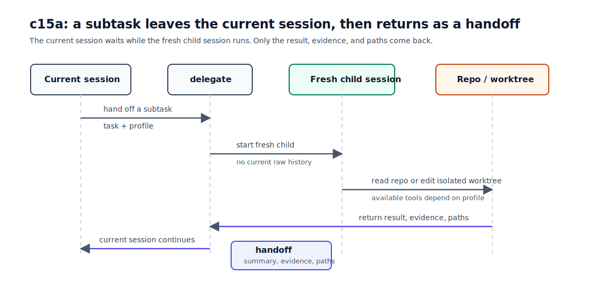
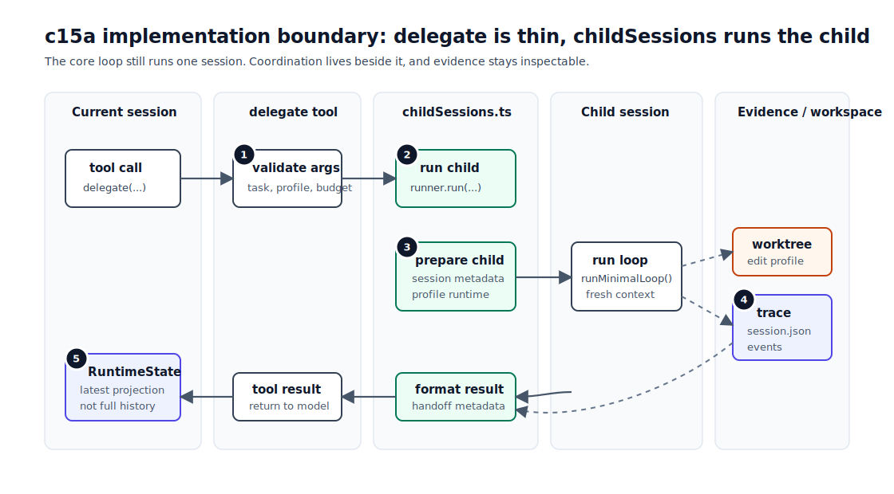

# c15a Child Sessions / Handoff

c14 解决的是 workspace boundary：一次 run 可以被绑到独立 git worktree，避免高风险修改污染主工作区。

c15a 处理的是另一种压力：当前 session 的 `context window` 会被子任务过程占满。比如你正在规划一章教程，只需要有人读一遍 c14 留下的缺口，或者在隔离 worktree 里改一个小文件。当前 session 真正需要的是结论、证据和必要路径，不一定需要背上完整的阅读过程、搜索结果和试错记录。

这一章引入一个最小 sub-agent 机制。当前 session 把一段子任务交给一个 fresh child session。child 独立运行，结束后只把可继续决策的信息交回来。后文把这份交接结果叫 handoff。

## 问题

c12 的 compaction 能把旧 history 压成 summary，但它仍然发生在同一个 session 里。模型读过的大量文件、试过的工具、失败过的路径，都会先进入当前 session 的 history，然后再等 compaction 处理。

c14 的 worktree isolation 又只回答“写在哪里”。它没有回答：

```text
这个子任务能不能放到独立上下文里完成？
完成后当前 session 应该看到全部过程，还是只看到结论和证据？
如果 child 能写文件，它的写权限和 worktree 边界在哪里？
```

c15a 不做完整多 agent 平台。它只补一条同步路径：当前 session 交出一个子任务，child session 跑完，再把结果交回来。

## 解决方案

这一章给 loop 增加一个同步 sub-agent 分支。当前 session 继续负责决策；当模型判断某段工作适合拆出去时，它调用 `delegate`。`delegate` 启动一个 fresh child session，child 用自己的上下文完成任务。任务结束后，`delegate` 把 child 的结论、证据和必要路径作为 handoff 放回当前 session。



图里的重点是顺序。当前 session 在 `delegate` 这里等待；child 完成后，当前 session 才继续下一轮。c15a 先接受这个同步等待的限制，换来一个更容易解释的 handoff 机制。

我们实现的 child 引入了两类最简单实用的 profile：

| profile    | 可用工具                                              | 用途                                        |
| ---------- | ----------------------------------------------------- | ------------------------------------------- |
| `research` | `read`, `ls`, `grep`, `find`, `todo`                  | 只读调查，整理 evidence 和 open questions。 |
| `edit`     | `read`, `ls`, `grep`, `find`, `edit`, `write`, `todo` | 在 child 自己的 worktree 里做小范围修改。   |

可用工具是真正的边界，不是 prompt 里的建议。child 没有 `bash`，也没有 `delegate`。如果模型尝试调用未注册工具，Tool Runtime 会按未知 tool 处理。

fresh child 的意思也很具体：

- child 不继承当前 session 的 raw history。
- child 不继承当前 session 已选中的 selected skills。
- child task 如果自己以 `/skill` 开头，仍然会走 c11 的 prompt assembly。
- child model 继承当前 session 的 model，不做 model routing。

`delegate(profile="research")` 默认允许，因为它只能用只读工具。`delegate(profile="edit")` 会先 ask，因为它启动的是 write-capable child session。这个 approval 只批准“启动 edit child”，不预批准 child 之后的每个 `edit` / `write` tool call。

## 最小实现

c15a 分成五块：

| 小节                | 痛点                                                 | 机制                                                                        |
| ------------------- | ---------------------------------------------------- | --------------------------------------------------------------------------- |
| 1. `delegate` tool  | 当前 session 需要一个交出子任务的入口。              | `delegate({ task, profile, maxToolRounds? })`。                             |
| 2. Child runner     | child lifecycle 不是普通文件工具逻辑。               | `src/extensions/childSessions.ts` 编排 session、runtime、worktree 和 loop。 |
| 3. Profile runtime  | 能力边界不能只靠 prompt。                            | research/edit 注册不同可用工具。                                            |
| 4. Evidence         | 当前 session 必须能复盘 child 从哪里来、交回了什么。 | child metadata + 当前 session 的 child events + child trace。               |
| 5. State projection | 当前状态不能变成历史数据库。                         | `RuntimeState` 只保留 latest child handoff/failure 和计数。                 |



这张图讲模块分工，图中的 1-5 对应上表五个小节。`delegate` 只处理参数和 tool result；`childSessions.ts` 负责编排 child lifecycle；child 仍然复用 `runMinimalLoop()`。Trace、session metadata、worktree 和 `RuntimeState` 只记录必要 evidence，不复制 child 的完整过程。

### 1. `delegate` tool

`delegate` 是普通 tool definition，但它的 handler 不直接执行文件操作。它解析参数、校验 profile 和 round budget，然后调用 child runner。

```ts
delegate({
  task,
  profile,
  maxToolRounds,
});
```

`maxToolRounds` 可选。省略时继承当前 session 的 `maxToolRounds`；提供时必须在 `1..parentMaxToolRounds` 之间。child 不能通过 tool argument 提高自己的预算。

tool result 给当前 session 的内容是小型 handoff：

```text
child_session_id: ...
profile: research
status: completed
trace_path: .forge/sessions/.../trace.jsonl
handoff:
...
```

`edit` child 还会返回：

```text
workspace_path: .forge/worktrees/...
workspace_branch: forge/run/...
changed_files:
- docs/...
```

这里不内联 full diff。完整 diff 留在 child worktree / branch 里 review。

### 2. Child runner

`childSessions.ts` 是 L5 coordination，不放进 `minimalLoop.ts`。

```text
delegate tool
  -> childSessionRunner.run(...)
  -> create child session trace
  -> create child profile runtime
  -> runMinimalLoop(...)
  -> return handoff metadata
```

`runMinimalLoop()` 仍然只负责跑一个 session。child runner 复用它，而不是复制一个 `minimalLoop`。

这条边界很重要：c15a 新增的是“如何组织另一个 session”，不是把 core loop 改成 orchestrator。

### 3. Profile runtime

child profile runtime 直接决定模型能看到哪些 tools。

```ts
research: (read, ls, grep, find, todo);
edit: (read, ls, grep, find, edit, write, todo);
```

所以 child 没有 `bash`，也没有 `delegate`。这比在 prompt 里写“不要用 bash”更可靠。

profile prompt 只是一段说明，不是安全边界。`research` prompt 要求最终回复覆盖 findings、evidence、open questions 和 next step。`edit` prompt 要求说明改了什么、检查了什么、接下来如何 review 或 merge。

### 4. Evidence

child 自己有一份 session：

```text
.forge/sessions/<child-session-id>/session.json
.forge/sessions/<child-session-id>/trace.jsonl
```

`session.json` 会记录来源：

```json
{
  "child": {
    "role": "child",
    "parentSessionId": "...",
    "parentCallId": "call_...",
    "profile": "research"
  }
}
```

当前 session 的 trace 只记录 child lifecycle 和 handoff：

```text
child_session_started
child_session_finished
child_session_handoff
```

这些事件都带 `parentCallId`，所以可以从 `tool_call(delegate)` 追到对应 child session。child 内部的 `model_request`、`tool_call`、`tool_result` 不会转写进当前 session 的 trace；完整过程留在 child trace。

### 5. RuntimeState projection

c07 里 `RuntimeState` 的定位是当前视图，不是历史存储。c15a 继续遵守这个原则：当前上下文和状态只放决策需要的投影，不放全部材料。

所以 RuntimeState 只投影：

```text
childSessionCount
childHandoffCount
lastChildHandoff
lastProblem(kind=child_session_failed)
```

如果要看所有 child 的完整历史，读 trace。不要把 `RuntimeState` 变成另一份 child session index。

## 运行验证

先 build：

```bash
npm run build
```

### 只读 child

运行一个只读子任务：

```bash
npm run start -- "Use a sub-agent to inspect docs/tutorial/c14-worktree-isolation.md and answer what concrete gap it leaves for c15a. Do not edit files."
```

你应该能看到：

- 当前 session 的 model request 里包含 `delegate`。
- `research` profile 的 delegation 被允许。
- tool result 里有 `child_session_id`、`profile: research`、`trace_path` 和 handoff。
- 当前 session trace 里有 `child_session_started`、`child_session_finished`、`child_session_handoff`。
- child session 有自己的 `session.json` 和 `trace.jsonl`。

可以用 trace 检查：

```bash
rg "child_session_started|child_session_finished|child_session_handoff" .forge/sessions/<current-session-id>/trace.jsonl
```

再打开 child metadata：

```bash
cat .forge/sessions/<child-session-id>/session.json
```

应该能看到 `child.role`、`parentSessionId`、`parentCallId` 和 `profile`。

### 可写 child

`edit` child 会创建自己的 worktree。base repo 仍然需要 clean，这是 c14 的边界。

```bash
npm run start -- "Use a sub-agent to create c15a-child-demo.txt with one line: status: child worktree. Keep the change isolated."
```

你应该先看到 write-capable delegation 需要 approval。批准后，child 内部如果调用 `write`，仍然会再次请求 approval。

完成后，`delegate` result 会给出：

```text
workspace_path: ...
workspace_branch: ...
changed_files:
- c15a-child-demo.txt
```

主工作区不应该直接出现这个文件。需要 review 时，到 child worktree 或 branch 查看 diff。

## 下一步缺口

c15a 只有同步 child。当前 session 会等 child 跑完，才继续下一轮。读一个小文件还好；如果 research 子任务要扫很多文件、等长命令或查多个方向，同步等待会卡住当前 session。

c15b 要处理的就是这个问题：child 可以异步运行，完成后用 notification 把 handoff 回流；当前 session 在 final 前还需要一个 gate，确认该等的 child 结果已经回来。

其他场景也还没进这一章：

- fork-child：如果 child 需要继承完整 history，需要单独设计 fork 语义，而不是叫 fresh child。
- shared task graph：parent、sync child 和 async child 还没有共同的 dependency、owner 和 acceptance/evidence 视图；`c17a` 会补这层共享工作状态。
- long-lived teammate：child 完成 handoff 就退出，不能持续收发消息或等待新任务；`c17b` 会引入独立 teammate process 和 mailbox。
- review / integration：edit child 的改动仍留在独立 worktree；`c17c` 会加入 Leader review 和显式 integration，不引入 shared worktree，也不自动解决冲突。
- model routing：如果不同 profile 要选不同 model，需要单独的 model policy 和 trace evidence。
- coordination / completion：当 one-shot child、long-lived teammate、external tools 和 verification 同时存在时，`c17c` 会决定怎样分配任务、验收证据和结束团队。

c15a 先把一条同步 child handoff 跑清楚：fresh context、可用工具、可写 worktree、handoff evidence。
