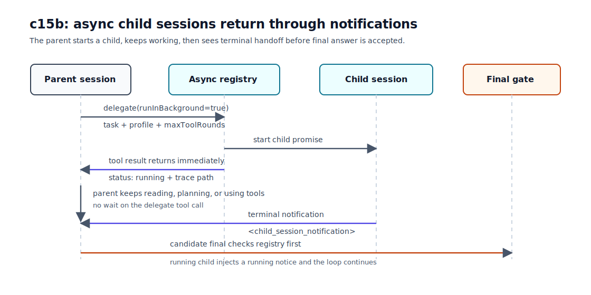
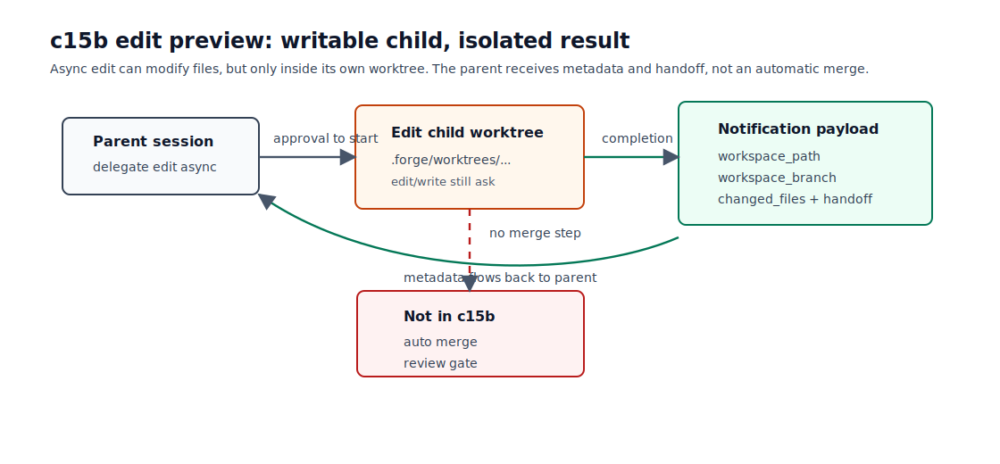

# c15b Async Child Sessions / Parallel Handoff With Edit Preview

c15a 已经把子任务从当前 session 的 raw history 里拆出去：parent 调用 `delegate`，fresh child session 独立完成工作，再把 handoff 交回来。

上下文隔离有了，但 c15a 的 `delegate` 仍然是同步 tool。parent 一旦把任务交出去，就会等 child 完成。一个 child 还好；两个独立 research，或者一个 research 加一个 edit preview，就会被串行等待拖住。

c15b 补这条异步路径：`delegate` 可以启动 background child session。child 完成后不通过原来的 function call output 回来，而是像 c13a 的 background task 一样，通过 notification 注入后续 round。parent 给 final answer 前，要先看见所有 async child 的 terminal notification。

## 问题

c15a 的同步路径长这样：

```text
parent tool_call(delegate)
  -> start child session
  -> wait until child final
  -> delegate tool_result contains handoff
  -> parent continues
```

这条路径简单，也适合必须马上拿到结论的子任务。但它不适合独立并行工作：

```text
research A: inspect c14 worktree boundary
research B: inspect c13a notification gate
edit preview: draft a small isolated change
```

这三件事互不依赖。同步 `delegate` 会让 parent 先等 A，再等 B，再等 edit preview。parent 期间不能继续读当前文件、整理计划，也不能先根据已有信息推进。

c13a 已经处理过相似的问题：后台命令启动后，foreground loop 要继续；后台结果完成后，再用 notification 回到模型上下文。c15b 把同一类机制用在 child session 上，但 final gate 更严格：background bash 只是提醒仍有任务在跑，async child handoff 则是 parent 决策的一部分，final 前必须回流。

## 解决方案

`delegate` 增加一个参数：

```json
{
  "task": "Inspect c13a final gate.",
  "profile": "research",
  "maxToolRounds": null,
  "runInBackground": true
}
```

`runInBackground` 是 `boolean | null`。`true` 启动异步 child；`false`、`null` 或旧调用里省略这个字段，都走 c15a 的同步路径。



异步路径分成四步：

| 步骤         | 做什么                                                                                    | parent 看到什么                                              |
| ------------ | ----------------------------------------------------------------------------------------- | ------------------------------------------------------------ |
| start        | `delegate(runInBackground=true)` 调用 child runner 的 `start()`。                         | tool result 立即返回 `status: running` 和 child trace path。 |
| registry     | async manager 登记 child handle 和 promise。                                              | parent 可以继续下一轮模型请求。                              |
| notification | child 完成或失败后，manager 在 round start 或 final gate 前 drain terminal notification。 | `<child_session_notification>` 进入 input history。          |
| final gate   | 模型准备 final 时，如果还有 running child，loop 注入 running notice 并继续。              | final 只有在没有 pending async child 时才会被接受。          |

`research` 和 `edit` 都支持异步。`edit` 是 preview：child 仍然使用 c15a 的 `edit` profile 和 c14 的 isolated worktree。完成后只回流 `workspace_path`、`workspace_branch`、`changed_files` 和 handoff。



c15b 不自动 merge，也不要求 parent 在本章完成 review gate。parent 只会拿到 edit child 的 worktree/branch、changed files 和 handoff。

权限边界保持不变：

- `delegate(profile="research", runInBackground=true)` 是 inspect-only，默认 allow。
- `delegate(profile="edit", runInBackground=true)` 会 ask，因为它启动 write-capable child。
- child 内部每一次 `edit` / `write` 仍然逐次 ask。启动 edit child 不是预授权所有文件写入。

## 最小实现

c15b 增加五个小机制。
| 小节 | 痛点 | 机制 |
| --- | --- | --- |
| 1. `delegate` 参数 | parent 要能显式选择同步或异步 child。 | `runInBackground: boolean \| null`，默认同步。 |
| 2. async child registry | 原 tool call 已经返回，harness 仍要知道 child 是否完成。 | `AsyncChildSessionManager` 保存 running/completed/failed 和 drain 状态。 |
| 3. loop notification | child handoff 晚于原 tool call，需要进入后续模型上下文。 | round start drain terminal；candidate final 前 drain terminal + running notice。 |
| 4. edit preview | 可写 child 也要能并行，但不能污染 parent workspace。 | edit child 继续创建独立 worktree，只回流 metadata。 |
| 5. trace/state evidence | 当前状态要知道 pending 数量，但不能变成完整 child index。 | trace 记录 async lifecycle；`RuntimeState` 投影 pending count 和 latest handoff/failure。 |

### 1. `delegate` 参数

`src/tools/delegateTool.ts` 里，child request 多了 `runInBackground`：

```ts
export interface ChildSessionRunRequest {
  maxToolRounds: number;
  parentCallId: string;
  parentRound: number;
  profile: ChildSessionProfile;
  runInBackground: boolean;
  task: string;
}
```

handler 里保留 c15a 的同步 `run()`，只在 `runInBackground` 为 `true` 时走 `start()`：

```ts
if (args.runInBackground) {
  const handle = await options.runner.start({
    ...request,
    runInBackground: true,
  });

  return {
    content: formatDelegateStartResult(handle),
    status: "completed",
    toolName: "delegate",
  };
}

const result = await options.runner.run({
  ...request,
  runInBackground: false,
});
```

异步 start result 不包含 handoff，因为 child 还没完成：

```text
child_session_id: ...
profile: research
status: running
trace_path: .forge/sessions/.../trace.jsonl
handoff:
(child session is running in background)
```

### 2. async child registry

同步 child 可以直接 `await runner.run()`。异步 child 不行：tool call 已经返回，后面还需要一个 session-scoped registry 记住它。

`src/extensions/childSessions.ts` 里新增 `createAsyncChildSessionManager()`。它包住真实 child runner：

```ts
export interface AsyncChildSessionManager extends ChildSessionRunner {
  drainNotifications(): AsyncChildSessionNotification[];
  pendingCount(): number;
  runningNotifications(): AsyncChildSessionNotification[];
}
```

`start()` 会登记 handle，并把 `handle.promise` 的结果投影成 terminal notification。`drainNotifications()` 只返回一次 terminal notification；`runningNotifications()` 只看当前还没完成的 child，不消费 terminal result。

顺序按 start order，而不是 completion order。这样 parent 看到的多个 child notification 更稳定。

### 3. loop notification 和 final gate

`src/core/minimalLoop.ts` 在 default runtime 里创建 async manager，然后把它传给 `delegate` tool：

```ts
const childSessions =
  !options.toolRuntime && options.childSessionRunner
    ? createAsyncChildSessionManager({ runner: options.childSessionRunner })
    : undefined;
```

每轮开始，先 drain 已经完成的 child notification，再做 auto compaction：

```ts
await appendChildSessionNotifications({
  childSessions,
  inputHistory,
  lifecycleEmitter,
  round,
  running: false,
});
```

candidate final 前，再 drain 一次。这次也包含 running notice：

```ts
const childGateInjected = await appendChildSessionNotifications({
  childSessions,
  inputHistory,
  lifecycleEmitter,
  round,
  running: true,
});

if (childGateInjected > 0) {
  await maybeReactiveCompactInputHistory(...);
  continue;
}
```

terminal notification 的内容是普通 user input item：

```text
<child_session_notification>
child_session_id: ...
profile: edit
status: completed
trace_path: .forge/sessions/.../trace.jsonl
workspace_path: .forge/worktrees/...
workspace_branch: forge/run/...
changed_files:
- docs/tutorial/c15b-async-child-sessions-parallel-handoff.md
handoff:
...
</child_session_notification>
```

running notice 也用同一个 envelope，只是 `status: running`，handoff 文本是“child session is still running”。这样模型能明确知道 final 还不能收束。

### 4. edit preview

async edit 没有新 profile。它复用 c15a 的 edit runtime：

```text
read, ls, grep, find, edit, write, todo
```

child runner 仍然在 `profile === "edit"` 时创建 worktree：

```ts
if (request.profile === "edit") {
  workspace = await prepareWorktreeSession(...);
  executionCwd = workspace.path;
}
```

child 完成后，runner 用 git porcelain status 列出 changed files：

```ts
const changedFiles = workspace
  ? await listChangedFiles(workspace.path)
  : undefined;
```

parent 收到的是 preview metadata，不是 merge 操作：

```text
workspace_path: ...
workspace_branch: ...
changed_files:
- ...
handoff:
...
```

多个 async edit child 可以并发启动，因为每个 child 都有自己的 worktree。冲突处理、shared worktree、merge 和 review gate 留到后续协议。

### 5. trace 和 RuntimeState

c15b trace 新增两类信息。

第一类是在既有 child lifecycle 上标记 async：

```text
child_session_started  runInBackground=true
child_session_finished runInBackground=true
child_session_handoff
```

第二类记录 notification 注入本身：

```text
child_session_notification status=running
child_session_notification status=completed
```

这和 c13a 的 `background_task_finished` / `background_task_notification` 分工一致：child 完成是一件事，把完成结果放进 parent 的下一轮 input 是另一件事。

`RuntimeState` 继续保持投影视图，不保存完整 child index：

```text
asyncChildPendingCount
childSessionCount
childHandoffCount
lastChildHandoff
lastProblem(kind=child_session_failed)
```

如果要看每个 child 的完整过程，读 child 自己的 trace。`RuntimeState` 只回答“现在还有几个 async child 没回流、最近一次 handoff 或 failure 是什么”。

## 运行验证

先 build：

```bash
npm run build
```

### async research 并行

运行一个要求 parent 启动两个 async research child 的任务：

```bash
npm run start -- "Use delegate with runInBackground=true to start two research child sessions: one inspects docs/tutorial/c13a-background-tool-tasks.md for notification mechanics, and one inspects docs/tutorial/c15a-child-sessions-handoff.md for child handoff mechanics. While they run, read README.md, then answer only after both child handoffs return."
```

你应该能看到：

- `delegate` tool result 很快返回 `status: running`。
- 两个 child 都有自己的 `child_session_id` 和 `trace_path`。
- parent 继续执行后续动作，而不是在第一个 child 上同步等待。
- 后续 round 出现 `<child_session_notification>`。
- 如果模型过早 final，loop 会先注入 `status: running` 的 child notification，并继续下一轮。

可以在 parent trace 里检查：

```bash
rg "child_session_started|child_session_notification|child_session_handoff" .forge/sessions/<parent-session-id>/trace.jsonl
```

你应该能看到 `child_session_started` 带 `runInBackground:true`，并且 terminal handoff 之前有 notification 注入记录。

### async edit preview

base repo 仍然要 clean。然后运行一个小的 edit preview：

```bash
npm run start -- "Use delegate with profile=edit and runInBackground=true to create c15b-edit-preview-demo.txt with one line: status: async edit preview. Keep the change isolated and do not merge it."
```

预期现象：

- 启动 edit child 前会请求 approval。
- child 内部调用 `write` 或 `edit` 时仍会再次请求 approval。
- parent 收到的完成 notification 包含 `workspace_path`、`workspace_branch` 和 `changed_files`。
- 主工作区不应该直接出现 `c15b-edit-preview-demo.txt`。

检查 changed files：

```bash
git -C <workspace_path> status --short
```

你应该在 child worktree 里看到 demo 文件，而不是在 parent cwd 里看到它。

## 下一步缺口

c15b 之后，parent 已经可以同时启动多个 research child，也可以把一个 edit preview 放到独立 worktree 里。一个真实任务可能会这样跑：先查 GitHub issue，读外部设计文档，让 edit child 起草改动，然后等所有 handoff 回来。到这一步，并行和 final gate 已经够用。

接下来卡在 tool 边界。GitHub、issue tracker 和外部文档等系统都不是现在这些 built-in tools。如果它们提供 MCP server，Forge 仍要决定怎样启动连接、暴露 tools，并让调用复用 permission、tool result 和 trace。[c16a MCP Tool Integration](c16a-mcp-tool-integration.md) 先完成这条 MCP runtime path；plugin 的 loading 与组件注册留到 c16b。

回到 c15b 本身，这一章还留着几个明确缺口：

- edit child 只给 preview metadata。它不会自动 merge worktree，也没有 review gate。
- async child 如果跑偏或卡住，现在没有 cancel / resume。
- 多个 edit child 可以并发，但每个 child 都有自己的 worktree。shared worktree、同文件冲突和合并协议还没设计。
- research 和 edit 现在继承 parent model。不同 profile 选不同 model 的 routing policy 还没进入。
- 当 sync child、async child、external tools 和 verification 都在同一个任务里出现时，还需要更高层的 team protocol 来决定何时委托、何时等待、何时收束证据。

所以这一章的边界仍然很窄：parent 可以并行启动独立 child，继续 foreground 工作，并在 final 前收到所有 async child 的 terminal handoff 或 failure。edit preview 只是把可写 child 的结果安全地放在独立 worktree 里；review、merge 和更大的协作协议，留给后面的章节。
