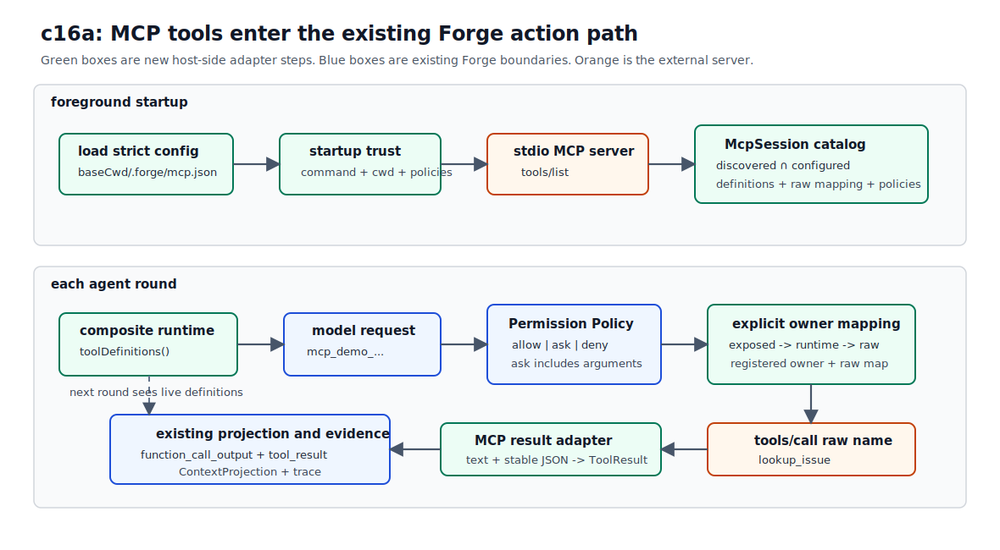

# c16a MCP Tool Integration

Forge 目前能调用 `read`、`grep`、`bash` 等 built-in tools，也能把工作交给 child session。这些能力都由仓库自己实现。但许多开发过程中所依赖的外界系统，比如 issue tracker、团队文档和数据库，则在 Forge 之外；如果每接一个系统就写一套专用 client，连接方式、tool schema 和返回格式都会一路渗进 agent loop。

MCP（Model Context Protocol）给 host 和外部提供服务的 server 约定了一套通用协议。server 声明自己有哪些能力，host 通过同一组协议方法发现并调用它们。Forge 不必知道 issue tracker 的 SDK 怎样初始化，只需要知道怎样使用 MCP。

协议只解决双方如何通信。哪些 server 可以启动、哪些 tools 能交给模型、一次写操作是否需要批准，仍然由 Forge 决定。c16a 把 MCP tools 接进已有的 `Tool Runtime`、`Permission Governance`、`ToolResult` 和 trace 路径。

本章使用仓库里的 [Minimal MCP Server Fixture](../appendix/minimal-mcp-server.md)。这个 server 自报名称为 `forge-mcp-demo`，提供两个 tools：查询固定 issue `FH-16`，以及把 note 写入本地 demo store。server 的实现已经准备好，本章只处理 Forge 这一侧。

## MCP 怎样工作

先把协议中的角色对应到本章代码：

| MCP 角色        | c16a 中的对象                         | 负责什么                                                                  |
| --------------- | ------------------------------------- | ------------------------------------------------------------------------- |
| Host            | Forge foreground CLI 和 agent session | 管理模型、权限、tool exposure 和运行生命周期。                            |
| Client          | `McpSession` 内的 SDK `Client`        | 与一个 MCP server 建立连接并发送协议请求。                                |
| Server          | `forge-mcp-demo`                      | 声明 tools，接收调用并返回结果。                                          |
| External system | demo issue 数据和 notes store         | server 背后的业务数据；真实环境里可以是 issue tracker、文档系统或数据库。 |

一次 MCP tool 调用大致经过六步：

1. Forge 根据配置启动 stdio server，SDK client 与它建立连接，并通过 `initialize` 协商协议能力。
2. client 发送 `tools/list`，获得 server 当前声明的 tool names、descriptions 和 input schemas。
3. Forge 从 discovery result 中选择允许暴露的 tools，转换成模型能接收的 function definitions。
4. 模型请求调用其中一个 tool。Forge 先做 permission decision，必要时向用户请求 approval。
5. permission 通过后，client 使用 server 的 raw tool name 发送 `tools/call`。
6. server 返回 MCP result。Forge 把它映射成 `ToolResult`，写入 trace，再作为 function call output 交给模型。

MCP 还定义了 resources 和 prompts 等能力，对应 `resources/list`、`prompts/list` 等协议方法。c16a 只展开 `tools/list` 和 `tools/call`，不会把 resources 或 prompts 接进 Forge。

`forge-mcp-demo` 是 server 在 MCP initialization 中报告的名称。`.forge/mcp.json` 里的 `demo` 则是 Forge 为这条连接设置的 config id，exposed tool name 中的 `demo` 前缀来自这个 id。两者用途不同，不要求相同。

### MCP 与 Plugin 的关系

MCP 是 host 与 server 之间的运行时协议。Plugin 是某个 host 定义的分发和注册方式，通常负责安装、启用、读取 manifest，再把 plugin 内的组件交给对应子系统。Plugin 能携带 MCP 配置，但 MCP 本身不依赖 Plugin。

| 组合            | 配置从哪里来                                  | 后续路径                                           |
| --------------- | --------------------------------------------- | -------------------------------------------------- |
| 只有 MCP        | 项目或用户直接配置 MCP server。               | host 连接 server，完成 discovery 和调用。          |
| 只有 Plugin     | plugin manifest 声明 host 支持的非 MCP 组件。 | host 把组件注册到自己的 skills、hooks 或其他系统。 |
| Plugin 携带 MCP | plugin manifest 指向或内嵌 MCP server 配置。  | loader 提取配置，再交给普通 MCP loading path。     |

可以把两种 MCP 来源理解成同一个入口：

```text
direct MCP config ------------------+
                                    +--> MCP loading path --> initialize --> tools/list --> tools/call
plugin manifest --> MCP config -----+

plugin manifest --> non-MCP components --> host component registries
```

c16a 只实现第一条：tracked `.forge/mcp.json` 直接声明 MCP server。`c16b Plugin Loading / Registration` 再处理 plugin manifest、非 MCP 组件注册，以及 plugin-provided MCP config 怎样进入同一条 loading path。

## 问题

MCP 给出了 wire protocol，但不会替 host 做产品和安全决策。沿着刚才的调用过程看，Forge 还缺这些边界：

| MCP 阶段            | 协议提供什么                                           | Forge 仍需决定什么                                                  |
| ------------------- | ------------------------------------------------------ | ------------------------------------------------------------------- |
| 启动和 initialize   | client/server 的连接与能力协商。                       | 项目声明的本机 command 是否可信，server 应在哪个 cwd 运行。         |
| `tools/list`        | server 当前声明的 tools 和 schemas。                   | 哪些 tools 在 allowlist 中，名称和 schema 是否兼容模型 provider。   |
| 模型请求 tool       | function name 和 arguments。                           | 调用是 `allow`、`ask` 还是 `deny`，由哪个 runtime 执行。            |
| `tools/call` result | MCP content blocks、`structuredContent` 和 `isError`。 | 怎样变成统一 `ToolResult`，哪些 rich content 可以进入模型与 trace。 |
| timeout 或连接关闭  | protocol/transport error。                             | 只让本次调用失败、移除 capability，还是结束整个 agent session。     |

这些边界的严格程度也不同。`.forge/mcp.json` 是项目主动声明的执行与权限策略，字段拼错应该在 spawn 前失败。`tools/list` 是外部 server 的运行时状态；一个 tool 临时缺失或 schema 不兼容时，Forge 应缩小当前 capability set，同时保留其他合法 tools。这里的 tolerant discovery 不会扩大权限，最终集合仍然是 `discovered ∩ configured`。

## 解决方案

c16a 把一个 MCP connection 包装成有生命周期的动态 `ToolRuntime`：

1. foreground CLI 从 `baseCwd/.forge/mcp.json` 读取严格配置，在 spawn 前请求 startup trust。
2. `McpSession` 连接 stdio server，执行 discovery，只注册配置与 server 同时声明的 tools。
3. built-in runtime 与 `McpSession` 组合成一个 runtime。每轮重新读取 definitions，让连接状态影响模型下一轮看到的 tools。
4. tool call 先走组合 permission policy，再根据 ownership map 路由到 `McpSession`，由 session 查出 raw MCP name。
5. MCP result 转成普通 `ToolResult`，继续进入 `ContextProjection` 和 trace。



图的上半段发生在 foreground session 启动时；下半段复用现有 tool call path。绿色框是 c16a 新增的 host-side adapter，蓝色框是 Forge 已有边界，橙色框是外部 server。

startup trust 和 tool approval 解决的是两件事。前者批准本次 session 启动哪条 command；后者在每次 `action: "ask"` 的调用发生时，带上具体 arguments 再问一次。批准 server 启动，不会预先批准它之后的写操作。

## 最小实现

这次改动涉及 config、runtime、governance、result 和 lifecycle。进入代码前，先看每一块接住哪一步：

| 小节                       | 要解决的问题                             | 机制                                                                   |
| -------------------------- | ---------------------------------------- | ---------------------------------------------------------------------- |
| 1. config 与 startup trust | 项目配置会启动本机进程。                 | strict Zod schema + foreground trust prompt。                          |
| 2. discovery catalog       | server discovery 不能直接变成模型权限。  | `discovered ∩ configured` tolerant filter。                            |
| 3. runtime composition     | definitions 会随连接状态变化。           | dynamic `ToolRuntime` + ownership map。                                |
| 4. permission composition  | MCP 调用要复用 allow / ask / deny。      | exposed name 对应配置 policy；arguments 必须是 JSON object。           |
| 5. result adapter          | MCP content shape 比 `ToolResult` 更宽。 | text / stable JSON projection、rich content omission、20k truncation。 |
| 6. lifecycle               | 外部进程会 timeout 或断开。              | MCP trace events、capability removal、幂等 `close()`。                 |

### 1. config 与 startup trust

tracked config 放在 `.forge/mcp.json`。当前 schema 只允许一个 `server`，也没有 `env`：

```json
{
  "server": {
    "id": "demo",
    "command": "node",
    "args": ["dist/extensions/mcpDemoServer.js"],
    "connectTimeoutMs": 5000,
    "toolCallTimeoutMs": 30000,
    "tools": {
      "lookup_issue": {
        "action": "allow",
        "risk": "inspect",
        "reason": "Reads deterministic issue data from the local MCP demo fixture."
      },
      "create_note": {
        "action": "ask",
        "risk": "mutating",
        "reason": "Appends a note to .forge/mcp-demo-notes.json in the project root."
      }
    }
  }
}
```

`src/extensions/mcpConfig.ts` 用 strict Zod schema 解析文件。`args` 默认 `[]`，两个 timeout 分别默认 `5000` 和 `30000`。非法 JSON、未知字段、空 reason 或非正整数 timeout 都会在 spawn 前报错。tool 不配置就不暴露，因此 schema 不需要静态 `deny`。

foreground CLI 在连接前显示 command、cwd、timeouts 和 tool policies：

```text
Start project MCP server for this session?
config: .../.forge/mcp.json
server: demo
command: "node" "dist/extensions/mcpDemoServer.js"
cwd: .../forge-harness
connect_timeout_ms: 5000
tool_call_timeout_ms: 30000
tools:
  create_note: ask risk=mutating reason=...
  lookup_issue: allow risk=inspect reason=...
[y/N]:
```

只有 `y` 或 `yes` 会启动 server。默认拒绝和 non-TTY 都会禁用 MCP，然后继续运行 built-ins。child session 和 cron worker 不读取这份配置。

配置路径和 server cwd 始终使用 `baseCwd`。即使 CLI 带 `--worktree`，built-in file tools 会进入 isolated worktree，`create_note` 仍然写到 base project 的 `.forge/mcp-demo-notes.json`。

### 2. discovery catalog

连接成功后，`src/extensions/mcpToolAdapter.ts` 不会把 `tools/list` 原样交给模型。catalog 遍历配置里的 raw names，再查对应 discovery item：

```ts
for (const rawToolName of configuredToolNames) {
  const discovered = discoveredByName.get(rawToolName);

  if (!discovered) {
    continue;
  }

  // validate schema and exposed name, then register
}
```

extra discovered tool 会被隐藏，configured-but-missing tool 会产生 warning。单个 tool 的 schema 或 name 不兼容时，只隐藏这个 tool，其他合法 tools 继续注册。

MCP `inputSchema` 必须以 object 为根。adapter 把 raw schema 放进 `ToolDefinition.parameters`，并将 provider definition 的 `strict` 设为 `false`，不做递归 sanitizer。

exposed name 固定为 `mcp_<serverId>_<rawToolName>`。最终名称必须匹配 OpenAI function name 字符规则，且不超过 64 字符。adapter 不清洗或截断；不合法就隐藏并记录诊断，避免 config 与模型实际看到的名称分叉。

### 3. runtime composition

startup 时生成一份静态 definitions array 不够。server 如果在 round 2 断开，round 3 就不该继续发送旧 definitions。

`src/tools/types.ts` 给 `ToolRuntime` 增加可选、幂等的 `close()`。`src/tools/compositeRuntime.ts` 在每次 `toolDefinitions()` 时重新合并各 runtime。`MinimalLoopOptions.additionalToolRuntimes` 让 CLI 把已连接的 `McpSession` 交给 loop：

```ts
const toolRuntime = options.additionalToolRuntimes?.length
  ? composeToolRuntimes([primaryToolRuntime, ...options.additionalToolRuntimes])
  : primaryToolRuntime;
```

composition 在收集 definitions 时保存 `tool name -> owner runtime`。`McpSession` 的 catalog 另有 `exposed name -> raw MCP name` mapping。模型收到 definition 后，server 可能在执行前断开。这个 stale call 仍会交给原 owner，并得到 failed result；下一轮重新取 definitions 时，tool 已经消失。

### 4. permission composition

`src/governance/mcpPolicy.ts` 只识别 discovery catalog 实际注册过的 exposed names。已注册调用还要先通过 arguments shape 检查：

```ts
const decision = mcpPolicies.get(toolCall.name);

if (!decision) {
  return fallback.decide(toolCall);
}

if (!hasObjectArguments(toolCall)) {
  return {
    action: "deny",
    reason: `MCP tool "${toolCall.name}" arguments must be a JSON object`,
    risk: "unknown",
  };
}

return { ...decision };
```

`lookup_issue` 使用配置里的 `allow / inspect`。`create_note` 使用 `ask / mutating`，所以每次调用都会显示具体 arguments 并等待 approval。server 提供的 tool annotations 只能描述能力，不能代替 host authorization；Forge 的 decision 只来自 `.forge/mcp.json`。

### 5. result adapter

`tools/call` 返回后，adapter 把 SDK result 收窄成 Forge 的 `ToolResult`：

- 所有 text blocks 按原顺序连接。
- `structuredContent` 递归排序 object keys，再序列化成稳定 JSON。
- text 与 structured JSON 同时存在时，两者都保留。
- mixed image/audio/resource 保留可用 text/JSON，并在 content 和 metadata 中列出 omitted types。
- 只有 unsupported blocks 时返回 `failed`。
- `isError: true` 返回 `failed`，但 server 提供的 text 仍会交给模型。
- 最终 content 复用现有 20,000 字符截断。

image、audio、blob 和 base64 不写入 trace，也不进入模型上下文。SDK `RequestTimeout` 映射成 `timed_out`；transport exception、protocol exception 和 unsupported task result 映射成 `failed`。结果仍会进入下一轮 function call output，模型可以继续使用 built-ins。

### 6. lifecycle 与 health

`McpSession` 持有 SDK client、连接状态、name mappings、permission policies 和 close lifecycle。trace 新增四类 event：

```text
mcp_server_trust_decided
mcp_server_connected
mcp_server_failed
mcp_server_stopped
```

`mcp_server_connected` 中的 discovered、exposed、extra、missing 和 incompatible 名单都稳定排序。hooks 能看到这些 lifecycle events；通用 `RuntimeState` 不投影 MCP health，live connection state 仍由 `McpSession` 管理。

`isError: true`、timeout 和 call exception 只影响当前 tool call。unexpected close 会让 pending call 失败，并把 `connected` 设为 false。下一轮 `toolDefinitions()` 返回空 array。agent session 不会因此终止，server 也不会自动 retry 或 restart。

正常收尾时，loop 在 `session_ended` 前调用 runtime `close()`。CLI 的 `finally` 再调用一次作为兜底；`McpSession.close()` 和 composite runtime 的 `close()` 都是幂等的。

## 运行验证

先完成 [README Setup](../../README.md#setup)。其中的 build 会生成 `.forge/mcp.json` 引用的 `dist/extensions/mcpDemoServer.js`。

### Smoke 1：正常调用与写操作审批

运行一个同时包含 inspect 和 mutation 的 foreground task：

```bash
npm run start -- "Use mcp_demo_lookup_issue to read FH-16. Then use mcp_demo_create_note to add exactly: c16a integration smoke. Report both tool results."
```

第一次 prompt 是 server startup trust。输入 `y` 后，应该看到：

```text
[mcp] connected server=demo tools=mcp_demo_create_note,mcp_demo_lookup_issue ...
```

`lookup_issue` 是 `allow`，不会再次询问。模型调用 `create_note` 时会出现第二次 approval，其中 arguments 应包含 `issueId: "FH-16"` 和 `body: "c16a integration smoke"`。输入 `y` 后，tool result 应包含：

```text
note_created: note-N
issue_id: FH-16
```

检查 server 写下的状态：

```bash
cat .forge/mcp-demo-notes.json
```

最后一项应包含 `issueId`、刚才的 body、递增的 note id 和 `createdAt`。如果使用 `--worktree`，仍然在 base project 的这个路径检查。

CLI 开头会打印 session id 和 trace path。用它检查 MCP、permission 和 tool result 是否走了同一条 trace：

```bash
rg 'mcp_server_|mcp_demo_|permission_decision|approval_result|tool_result' .forge/sessions/<session-id>/trace.jsonl
```

trace 中应有 startup trust、connected discovery、两个 MCP tool calls、`create_note` 的 `ask` decision、approval result、普通 `tool_result`，以及 `session_ended` 之前的 `mcp_server_stopped`。

### Smoke 2：拒绝 startup trust

运行一个只需要 built-in `read` 的任务：

```bash
npm run start -- "Use the read tool to inspect package.json and report only the package name."
```

在 startup prompt 直接按 Enter。CLI 会打印类似：

```text
[mcp] disabled server=demo reason=MCP server startup rejected by user
```

随后模型仍能调用 `read`，最终回答 `forge-harness`。这条 smoke 说明拒绝启动外部 server 只会禁用 MCP，built-ins 和 agent session 仍然可用。

### Smoke 3：MCP 业务失败后继续

运行一个先触发 not-found、再读取本地文件的任务：

```bash
npm run start -- "Use mcp_demo_lookup_issue to look up FH-404. After that result, use the read tool to inspect package.json. Report the lookup result and package name."
```

输入 `y` 批准 server startup。`lookup_issue` 的 result 会包含：

```text
tool: mcp_demo_lookup_issue
status: failed
observation: MCP lookup_issue failed
issue_not_found: FH-404
known_issues: FH-16
```

接下来应该还能看到 `read` tool call，final answer 同时报告 not-found 和 package name。对应 trace 中，`mcp_demo_lookup_issue` 的 `tool_result.status` 是 `failed`，但 session 最后仍以 `completed` 结束。

## 下一步缺口

c16a 只支持 foreground session 中由 `.forge/mcp.json` 直接声明的单个 stdio server。它还没有实现：

- multi-server registry 和跨 server 名称冲突策略。
- remote HTTP transport、OAuth 和 token refresh。
- 显式 env / secrets 注入；当前只沿用 SDK 对 `HOME`、`PATH` 等基础变量的安全继承。
- `list_changed`、reconnect、retry 或 process restart。
- 完整 rich media projection 和递归 JSON Schema sanitizer。
- child/cron MCP loading。

下一章 `c16b Plugin Loading / Registration` 会换一个问题：怎样安装或启用一个 plugin，读取它的 manifest，再把不同组件注册到 Forge 已有子系统。plugin 携带的 MCP config 继续复用 c16a 的 loading 和 execution path。manifest schema、component types、namespace 和 multi-server policy 都留到那一章再确定。
