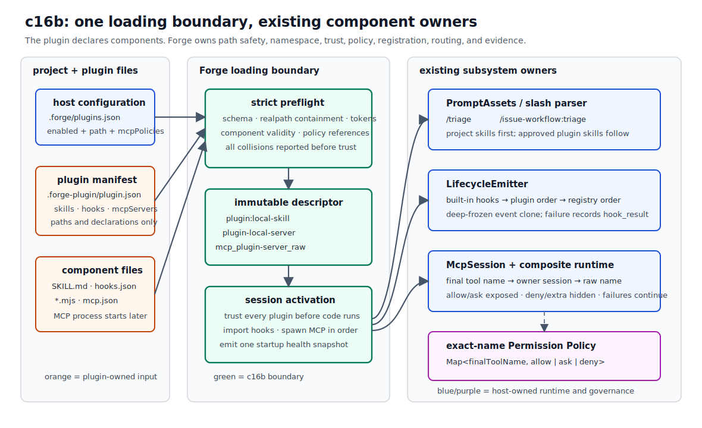
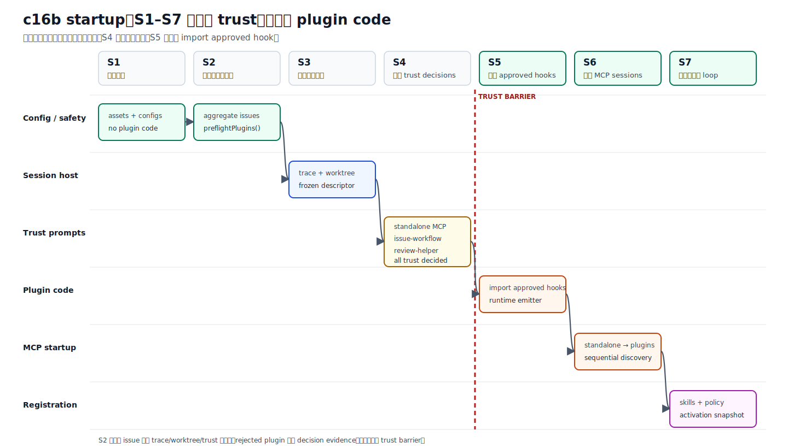

# c16b Plugin Loading / Registration

c16a 已经能把一个项目级 MCP server 接进 `Tool Runtime`，但那份 `.forge/mcp.json` 只能描述一条连接。真正可复用的扩展往往还带着 skill、hook 和多条 MCP 配置。若三种组件各自寻找目录、各自处理权限，Forge 很快会出现三套加载顺序、三种命名规则和互相覆盖的 registry。

c16b 增加一个本地 plugin loading boundary：foreground CLI 从 `.forge/plugins.json` 找到已配置好的目录，先做全量 preflight，再按 plugin 请求本次 session 的 trust。通过后，loader 不长期持有组件，而是把 skills、hooks 和 MCP descriptors 交回已有子系统。

本章使用两个 tracked fixtures。`issue-workflow` 带 skill、hook 和双 tool MCP；`review-helper` 只有一个 skill。它们的文件结构见 [Minimal Plugin Fixtures](../appendix/minimal-plugin-fixtures.md)。

## 问题

Plugin 和 MCP 不是同一个东西。MCP 规定 host 与 server 怎样做 `tools/list`、`tools/call`；plugin 则是 host 自己定义的打包和注册单元。一份 plugin 可以只有 skill，也可以同时携带 hook 和 MCP server。

```text
plugin directory
├── reusable instructions  ──> PromptAssets
├── lifecycle handlers     ──> LifecycleEmitter
└── MCP server configs     ──> McpSession / Tool Runtime
```

现在的具体痛点不是“怎样下载 plugin”，而是：一个项目已经指向若干本地 plugin 目录后，Forge 怎样在不执行未知代码的前提下检查整个集合，并把获批组件注册到正确的 owner。

这里有四个容易混在一起的边界。

| 边界 | 如果省略会怎样 |
| --- | --- |
| 配置与路径 | manifest 拼错、symlink 逃出 root，直到 import 或 spawn 才暴露。 |
| trust 与执行 | 读取 registry 时顺手 import hook，用户看到 prompt 前代码已经运行。 |
| namespace 与 routing | 两个 plugin 或 server 重名时，后加载者悄悄覆盖前一个 owner。 |
| declaration 与 authority | plugin 自己声明的 MCP tool 被误当成 host 已授权的 tool。 |

`.forge/plugins.json` 在本章代表 installer 已经完成后的结果：目录已经存在，项目只记录路径、是否启用，以及 host-owned MCP policy。成熟 agent 往往在 install/enable 流程里自动写入这类配置；c16b 不实现 downloader、marketplace 或 dependency installation，也不会因为看见一个目录就自动启用它。

## 解决方案

Forge 使用一次性 pipeline，而不是新增长期 `PluginManager`：

1. 读取 project assets、standalone MCP config 和 `.forge/plugins.json`。
2. 对所有 enabled plugins 做全量 preflight；有任何 issue 就整批退出。
3. 创建 trace，可选地建立 worktree，再把 token 解析成 immutable descriptors。
4. 收齐 standalone MCP 与所有 plugin 的 session trust decisions。
5. 只 import approved hooks，建立 runtime emitter。
6. 先启动 standalone MCP，再按 plugin 配置顺序启动 plugin MCP servers。
7. 合并 skills 与 exact-name policies，写 `plugin_activation_result`，进入 agent loop。



图中的绿色部分是 c16b 新增的 loading boundary。右侧仍是 c09、c11 和 c16a 已有的 owner：loader 不执行 skill、不调度 hook，也不直接处理 MCP tool call。

### 为什么 trust 必须是屏障

manifest 和 JSON registry 是 data；`.mjs` import 与 MCP command 才是 code execution。c16b 在 trust 前可以读取前者，但不能触碰后者。



“每个 prompt 展示”指 CLI 终端里的 plugin session-trust prompt。它会逐个列出 canonical root、版本、description、namespaced skills/hooks、hook events/entries、解析后的 MCP command/args/cwd、timeouts、tools 和 effective policies。prompt 与后续 spawn 引用同一个 deep-frozen descriptor，避免用户批准 A、进程却启动 B。

description、路径、command/args 和 policy reason 都可能来自 plugin 或项目配置。CLI 会把这些字符串按 JSON 形式转义后再显示，换行和 terminal control character 不能伪造新的 prompt 行。

默认回答和 non-TTY 都是拒绝。skill-only plugin 也要问，因为 skill body 会进入 model instructions；它没有子进程，不等于没有信任边界。

### 其他 coding agents 给出的取舍

这次实现参考了其他 coding agent 的边界，但没有照搬整套平台能力。

| Agent | 可观察到的机制 | c16b 采用或暂缓什么 |
| --- | --- | --- |
| Claude Code | Plugin 能打包 skills、hooks 和 MCP；plugin skill 使用 `/plugin-name:skill`。hook registry 支持 host-side exact/regex matcher，并且 permission 有 allow/ask/deny 与 managed precedence。见 [Plugins](https://code.claude.com/docs/en/plugins)、[Hooks reference](https://code.claude.com/docs/en/hooks) 和 [Permissions](https://code.claude.com/docs/en/permissions)。 | 采用 skill namespace、host-owned policy 和 deny-first 思路；不引入 marketplace、managed settings、control hooks。 |
| Gemini CLI | Extension 能携带 skills、hooks、MCP；`${extensionPath}` / `${workspacePath}` 由 host 解析。command hook 有 regex matcher、timeout 和 project trust，command identity 改变后会重新提示。见 [Extensions reference](https://github.com/google-gemini/gemini-cli/blob/main/docs/extensions/reference.md)、[Hooks reference](https://geminicli.com/docs/hooks/reference/) 和 [Hook security](https://geminicli.com/docs/hooks/best-practices/)。 | 采用两个受控 path tokens 和“配置变化应重新审视 authority”的方向；本章只做每 session trust，不保存 identity/hash。 |
| Codex | 当前 hook runtime 使用 `hooks.json`、tool matcher 和 hook trust；其 source repo 也把 plugin hook discovery 与 trust 作为独立边界。见 [Codex hook trust discussion](https://github.com/openai/codex/issues/21615) 和 [hook matcher proposal/history](https://github.com/openai/codex/issues/14882)。 | 采用 host 先审查再执行的边界；不追求跨 CLI/IDE/App 的完整 plugin platform。 |
| Pi | TypeScript extension 直接订阅 event，在 handler 里用 `event.toolName` 检查目标，还能注册 tools 或拦截调用。见 [Pi Extensions](https://pi.dev/docs/latest/extensions)。 | c16b 的 hooks 是 trusted in-process ESM 且 observe-only，因此先采用 handler 内过滤。 |

Claude Code、Gemini CLI 和 Codex 的声明式 matcher 对 external command hook 很重要：host 可以在无关事件上避免启动进程，也能在执行前做统一匹配。c16b 的 handler 已在进程内，fixture 只需：

```js
export default function audit(event) {
  if (!event.toolName?.startsWith("mcp_issue-workflow-")) return;
  // audit
}
```

所以 exact/regex matcher 暂缓。等 hook 变成 external command、需要 timeout，或开始参与权限拦截时，再把 matcher 放回 host registry 才有实际收益。

Install、enable、persistent trust 和升级检查通常连在一起，所以用户未必每次都察觉“plugin 升级改变了权限”。例如 Gemini CLI 会把 command 改动视为新的 hook identity；Codex 的 hook trust 也围绕 event、command、matcher 等内容识别待审批项。Forge 目前更简单：每次 foreground session 都重新显示最终 descriptor 与 policies。它没有版本 diff 或持久授权，因此不会静默继承上一次批准。

## 最小实现

### 1. 项目配置只指向本地目录

tracked `.forge/plugins.json` 如下：

```json
{
  "plugins": [
    {
      "path": "./examples/plugins/issue-workflow",
      "enabled": true,
      "mcpPolicies": {
        "demo": {
          "lookup_issue": {
            "action": "allow",
            "risk": "inspect",
            "reason": "Read the fixture issue catalog without changing project files."
          },
          "create_note": {
            "action": "ask",
            "risk": "mutating",
            "reason": "Write a demo note under the active project workspace."
          }
        }
      }
    },
    {
      "path": "./examples/plugins/review-helper",
      "enabled": true
    }
  ]
}
```

relative path 以原项目 `baseCwd` 为准，absolute path 也允许。`enabled: false` 的 entry 本身仍要符合 schema，但 loader 不读取目标目录；这样一个暂时离线或已移走的 disabled plugin 不会破坏启动。

`mcpPolicies` 不属于 plugin manifest。它代表 host 对 plugin 声明能力的最终授权：plugin 可以说“我有 `create_note`”，不能自己决定“这个写操作永远 allow”。引用不存在的 server/tool 会在 preflight 失败。

没有显式 host policy 时，Forge 合成：

```json
{
  "action": "ask",
  "risk": "unknown",
  "reason": "No host policy configured for plugin MCP tool ..."
}
```

这不等于“tool 完全不暴露”。只要 declaration、discovery 和 schema 都合法，它仍可进入模型 tool catalog，但每次调用都必须审批；它绝不会因为 plugin 自报而变成 allow。

### 2. manifest 只声明 component registry

每个 plugin 固定使用 `.forge-plugin/plugin.json`：

```json
{
  "name": "issue-workflow",
  "version": "0.1.0",
  "description": "Small issue workflow plugin used by the c16b tutorial.",
  "skills": "./skills",
  "hooks": "./hooks/hooks.json",
  "mcpServers": "./mcp/mcp.json"
}
```

`name` 只允许 lowercase、digit、hyphen；`version` 做基础 SemVer 检查。三个 optional component 至少出现一个，所有 component path 必须以 `./` 开头。loader 对目标调用 `realpath`，canonical path 必须仍在 canonical plugin root 内，因此 `./skills` 指向 root 外的 symlink 也会失败。

MCP command 与 args 只支持 `${pluginRoot}` 和 `${projectRoot}`：

- `${pluginRoot}` 始终是原 plugin 目录；
- `${projectRoot}` 与 MCP `cwd` 是当前 execution workspace；
- 带 `--worktree` 时，`${projectRoot}` 指 worktree；
- `env` 字段、`${env:HOME}` 和未知 token 一律拒绝。

c16a standalone `.forge/mcp.json` 仍使用 `baseCwd` 作为 command cwd。这是旧 checkpoint 的兼容限制，不会被 c16b 偷偷改写。

### 3. preflight 是整批检查，不是逐个试运行

`preflightPlugins()` 读取所有 enabled manifests 和 JSON registries，但不 import `.mjs`，也不 spawn MCP。它收集 path、schema、component、policy 与 namespace issues，按 plugin index、field、message 稳定排序后抛出 `PluginPreflightError`。

```ts
const pluginConfig = await loadPluginProjectConfig(baseCwd);
const result = await preflightPlugins({
  baseCwd,
  config: pluginConfig,
  standaloneMcpConfig: mcpConfig,
});
```

全量检查必须发生在 trace、worktree 和 trust 之前。否则 plugin A 的 manifest 合法就先创建 worktree，读到 plugin B 才失败，startup 会留下半套 side effects。

### 4. namespace 同时解决重名与 routing

“重名时拒绝注册”检查的是 effective identity，不是所有 raw names 都全局唯一。

| Component | Local declaration | Effective identity | Routing owner |
| --- | --- | --- | --- |
| project skill | `triage` | `triage` | project `PromptAssets` |
| plugin skill | plugin `issue-workflow`, local `triage` | `issue-workflow:triage` | approved plugin skill |
| plugin hook | local `audit` | `issue-workflow:audit` | lifecycle hook record |
| MCP server | plugin `issue-workflow`, local `demo` | `issue-workflow-demo` | one `McpSession` |
| MCP tool | server above, raw `lookup_issue` | `mcp_issue-workflow-demo_lookup_issue` | exact final-name map → session → raw name |

不同 server 可以都声明 raw `lookup`，因为它们会得到不同 final names。拒绝的是 enabled plugin name、effective server ID 或 final tool name 冲突，包括与 standalone c16a MCP 的冲突；不使用 last-wins。

final tool name 还会在 trust 前检查 OpenAI function-name 字符规则与 64 字符上限。loader 不做截断或清洗，因为那会让配置名、policy key 和模型看到的名字分叉。

### 5. skills 复用 c11 prompt pipeline

project skills 仍由 `loadRepoPromptAssets()` 按 local ID 排序。approved plugins 再按 `.forge/plugins.json` 顺序合并，每个 plugin 的 skills 按 local ID 排序。

slash parser 现在接受零个或一个 colon：

```text
/triage
/issue-workflow:triage
/review-helper:review
```

plugin skill 没有 `/triage` 短别名，因此仓库里的 project `/triage` 与 plugin `/issue-workflow:triage` 可以同时存在。leading-only、unknown-stop 和 dedup 语义都沿用 c11；`/a:b:c` 不是合法 invocation。

### 6. hooks registry 映射 name、events 与 ESM entry

manifest 的 `hooks` 指向一个 JSON registry，不是直接指向 JavaScript：

```json
{
  "hooks": [
    {
      "name": "audit",
      "events": ["permission_decision"],
      "entry": "./hooks/audit.mjs"
    }
  ]
}
```

这里的 `entry` 相对 plugin root，指向 trust 通过后由 host `import()` 的 `.mjs` 文件，文件必须提供 default function。多个 hook records 可以分别指向多个 files；registry 才是“一条 hook subscription 对应哪个 module”的 map，而不是要求 manifest 为每个 hook 增加字段。

plugin hook 订阅全局 session events，执行顺序固定为 built-in hooks → plugin config order → registry order。handler 收到 deep-frozen event clone，不能修改后续 hook 看到的 trace data。handler throw 只产生 `hook_result: failed`，后续 hook 与 agent loop 继续。

plugin registry 不能订阅 trust decisions、`workspace_setup_failed` 或 `hook_result`。这些事件要么发生在 plugin 获批前，要么会造成递归。c16b hook 仍是 trusted in-process code，没有 timeout 或 sandbox；它以当前用户权限运行，worktree 只限制文件工作范围，不是安全沙箱。

### 7. plugin MCP 复用 c16a session 与 adapter

plugin MCP registry 是 multi-server map；每个 server 有 command、args、timeouts 和非空 tools allowlist。preflight 将模板解析成 deep-frozen descriptor，trust prompt 和 `startMcpSession()` 共享其中的 `server` object。

c16a 的 permission policy 仍是最小边界：按 exact tool name 给出 `allow`、`ask` 或 `deny`，并在 `ask` 时请求一次调用审批。c16b 只是把多条 server policy 汇总到这张 map，没有加入 managed precedence、argument-aware rule、publisher identity 或升级 diff；这些属于更完整的 policy system。

discovery 后，最终状态由 declaration、server discovery 与 host policy 一起决定：

| Declared | Discovered / compatible | Effective policy | 结果 |
| --- | --- | --- | --- |
| yes | yes | `allow` | 暴露；调用直接通过 permission。 |
| yes | yes | `ask` | 暴露；每次调用显示 arguments 后审批。 |
| yes | yes/no | `deny` | 不暴露，保留 exact deny policy，记入 `denied`。 |
| yes | no | `allow` / `ask` | 不注册，记入 `missing`。 |
| yes | incompatible name/schema | `allow` / `ask` | 不注册，记入 `incompatible`。 |
| no | yes | 无 | 视为 server `extra`，隐藏。 |

`deny` 与 `extra` 都不会让 plugin 降级：前者是 host 有意缩小能力，后者从未进入 allowlist。`missing` 与 `incompatible` 会降级，因为 host 声明想要的能力没有成功注册。

所有已启动 sessions 的 policies 合并成一张 `Map<finalToolName, PermissionDecision>`。permission adapter 只做 exact lookup，不根据 `mcp_` prefix 猜 ownership 或权限。standalone 先启动；plugins 按 config order、server ID lexical order逐个启动。某个 server 失败不会阻止后续 server。

### 8. activation snapshot 记录启动结果

新增两个 trace events：

- `plugin_trust_decided`：canonical root、version、approved 与 reason；
- `plugin_activation_result`：components 与 tools 的 declared/active/failed 或 exposed/denied/missing/incompatible/extra 清单。

状态只描述 startup snapshot：

| Status | 判定 |
| --- | --- |
| `active` | 所有声明组件都激活，且没有 non-denied missing/incompatible tools。 |
| `degraded` | 至少一个组件激活，但另有 component/tool 问题。 |
| `failed` | 所有声明组件均未激活，包括整 plugin 被拒绝。 |

一个正常连接、tools 全部 `deny` 的 MCP server 仍是 `active`。hook 或 MCP 在 session 中途失败会写普通 lifecycle event，但不会回写这份启动快照。通用 `RuntimeState` 也不投影 plugin health；component owner 继续持有 live state。

loop 正常结束时 composite runtime 按启动逆序关闭 sessions；CLI `finally` 再逐个调用幂等 `close()` 兜底。后启动的 plugin MCP 因而先关，standalone 最后关。

## 运行验证

先完成 [README Setup](../../README.md#setup)。本章只保留两条 reader-visible smoke；rejection、deny、degradation、collision 和 cleanup 等边界由自动化测试覆盖。

### Smoke 1：同时激活两个 plugins

运行：

```bash
npm run start -- "/issue-workflow:triage /review-helper:review Use mcp_issue-workflow-demo_lookup_issue to read FH-16, then use mcp_issue-workflow-demo_create_note to add exactly: c16b full plugin smoke. Report the issue and note result."
```

CLI 依次询问：

1. standalone c16a MCP；本 smoke 可按 Enter 拒绝，避免混淆两套 issue tools；
2. `issue-workflow@0.1.0`；输入 `y`；
3. `review-helper@0.1.0`；输入 `y`。

随后应该看到：

```text
[mcp] connected server=issue-workflow-demo tools=mcp_issue-workflow-demo_create_note,mcp_issue-workflow-demo_lookup_issue ...
[plugin] activation issue-workflow@0.1.0 status=active
[plugin] activation review-helper@0.1.0 status=active
```

首轮 prompt transcript 应包含：

```text
selectedSkills=issue-workflow:triage,review-helper:review
```

`create_note` 的 policy 是 `ask`，模型调用时再输入一次 `y`。结果应包含 `note_created: note-N` 与 `issue_id: FH-16`。检查 base workspace：

```bash
cat .forge/plugin-demo-notes.json
```

最后一项应包含 `c16b full plugin smoke`。从 CLI 开头取得 session trace path，再检查：

```bash
rg 'plugin_trust_decided|plugin_activation_result|issue-workflow|review-helper|hook_result' .forge/sessions/<session-id>/trace.jsonl
```

可以看到两个 plugin 的 trust/activation、MCP diagnostics，以及 `issue-workflow:audit` 对 matching permission event 的 `hook_result`。

### Smoke 2：worktree 绑定

确认当前 repository 没有未提交修改，再运行：

```bash
npm run start -- --worktree "/issue-workflow:triage Use mcp_issue-workflow-demo_create_note to add exactly: c16b worktree binding smoke. Report the note result."
```

仍然拒绝 standalone c16a MCP，批准 `issue-workflow`，`review-helper` 可拒绝；tool approval 再输入 `y`。CLI 的 plugin trust prompt 中：

- `canonical_root` 仍指 base checkout 下的 `examples/plugins/issue-workflow`；
- server `cwd` 和解析后的 `${projectRoot}` 指 `[workspace]` 行显示的 worktree。

从 `[workspace] path=...` 取得路径，检查：

```bash
cat <workspace-path>/.forge/plugin-demo-notes.json
```

note 应写在 worktree，不是 base project 的 `.forge/plugin-demo-notes.json`。这条 smoke 同时验证 `${pluginRoot}` 与 `${projectRoot}` 没有被混为同一个 root。

## 下一步缺口

c16b 完成的是已配置 local plugin 的 foreground loading/registration，不是完整 plugin platform。以下能力仍未实现：

- install/download、marketplace、dependency resolution 和自动更新；
- signature/hash、publisher identity、upgrade permission diff 和 persistent trust；
- hot reload、restart、parallel MCP startup 与 remote transport；
- plugin env/secrets；
- declarative hook matcher、external command hook、timeout、sandbox 与 control hook；
- child session 或 cron worker 的 plugin loading。

Plugin code 以当前用户权限运行。`--worktree` 提供 filesystem scope 与 review surface，不提供恶意代码隔离。

下一章 c17 会回到完整 agent turn：当 tools、permission、context、trace、child handoff、MCP 和 plugins 都存在时，用一组 team protocols 决定何时同步、何时异步，以及完成前怎样收束证据。
