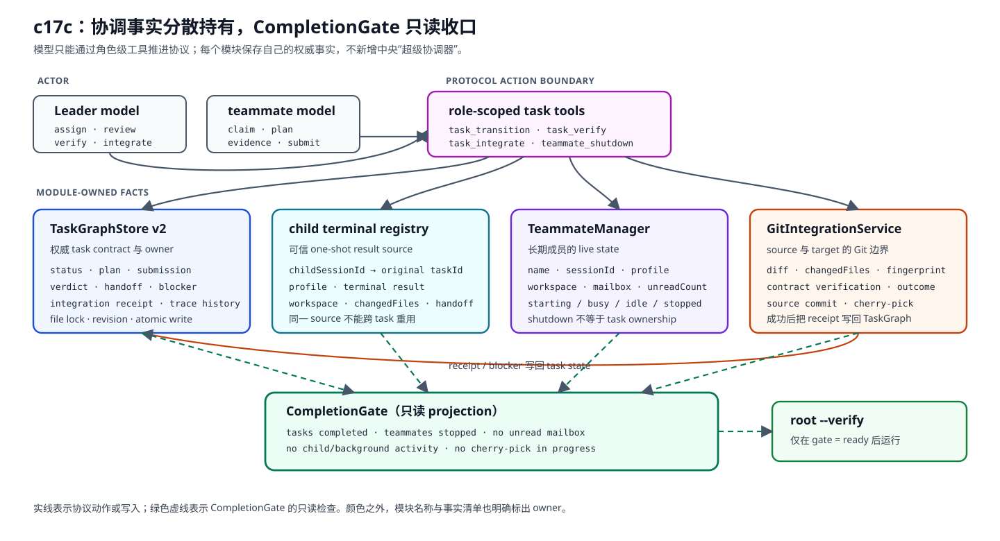
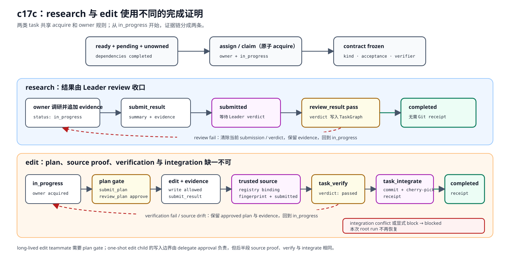
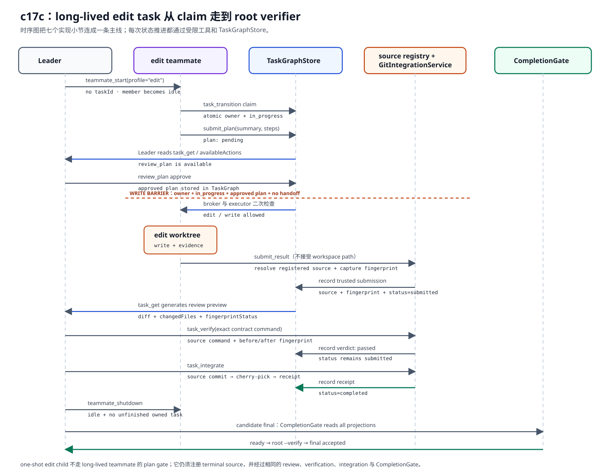
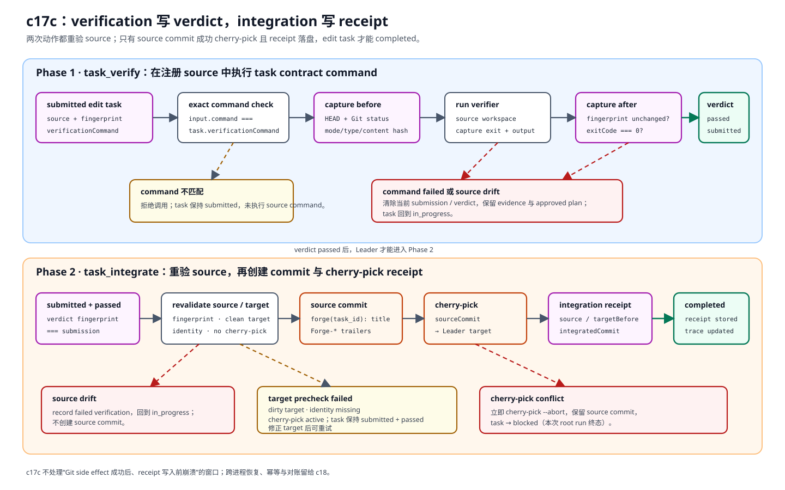

# c17c Coordination / Completion Protocol

c17a 让 root、child 共享一份 TaskGraph，c17b 又让长期成员可以收发消息。两章合在一起，团队已经“看得见彼此”，但还不能回答四个决定性问题：

- 这项工作现在归谁？
- 什么结果算通过？
- edit worktree 里的修改怎样进入 Leader workspace？
- 模型说“完成”时，整个团队真的收尾了吗？

如果这些问题仍由 prompt 临时约定，TaskGraph 和 mailbox 只是在记录热闹。c17c 给它们补上一条很窄的协调协议：一个 task 有明确 owner；research 要经过 review；edit 要经过 plan、verification 和 Git integration；长期成员必须显式 shutdown；root final 之前还有最后一道 CompletionGate。

这里参考的做法都很具体：[Pi sub-agent](https://pi.dev/packages/pi-sub-agent) 由 parent agent 协调，[Codex subagents](https://learn.chatgpt.com/docs/agent-configuration/subagents) 和 [Claude Code agent teams](https://code.claude.com/docs/en/agent-teams) 使用共享任务与明确分工，[Aider Git](https://aider.chat/docs/git.html) 则把 Git commit 作为可检查的修改边界。Forge 只取本章需要的部分：Leader 协调、共享 task list、隔离 workspace，以及完成前的验证和整合。

## 问题

### 共享状态不等于任务归属

c17a 的 task 有 dependency、status、acceptance 和 evidence，却没有 owner。两个长期成员同时看到一个 ready task 时，都可能认为自己该做；Leader 也无法区分“我交给 one-shot child 的任务”和“某个 teammate 自己领取的任务”。

仅靠 mailbox 消息写一句“这个归你”也不够。消息可以延迟、重复阅读或被后续对话覆盖，不能作为当前所有权的权威事实。

### edit handoff 不是可集成结果

c15b 和 c17b 会返回 workspace、changedFiles 和文字说明。这些信息适合 preview，却没有回答：

- 文件在 handoff 后有没有继续变化？
- 验证命令是否就是 task contract 里那一条？
- source commit 是什么？
- Leader target 在 cherry-pick 前是否干净？
- 冲突后有没有留下半截 cherry-pick？

所以“child 说测试通过”不能直接把 edit task 标成 completed。

### final answer 不是 team completion

root loop 原本只等待 background、child handoff 和 teammate IPC settle。即使这些异步活动暂时安静，仍可能存在 pending task、submitted-but-unverified edit、idle-but-not-stopped teammate，或者已经 blocked 的 owner。

若这时直接运行根级 `--verify`，验证通过也只能说明当前文件状态没问题，不能证明团队协议已经闭环。

把三段问题放在一起看，c17c 需要一条能落到运行时的协议：owner 要写进 TaskGraph；验收结果要留下 verdict；edit 修改要绑定可信 source 和 Git receipt；所有 task、进程与异步活动都收尾后，root 才能进入最终验证。后面的实现分别补上这四块。

## 解决方案

Leader 仍是唯一协调者。TaskGraph 保存权威当前事实，TeammateManager 管进程和 mailbox，GitIntegrationService 只处理 Git，CompletionGate 只读这些模块的 projection。它们没有被塞进一个新的中央“超级协调器”。

先看模块之间怎样传递事实。箭头表示工具动作、状态写入或 CompletionGate 的只读检查：



TaskGraphStore 保存 task contract 和当前协议状态；child registry、TeammateManager 分别证明结果来自哪个 child 或长期成员；GitIntegrationService 生成 diff、fingerprint，执行 verifier 和 Git 操作，再把 outcome 或 receipt 交回 TaskGraphStore。CompletionGate 不替这些模块改状态，它只判断当前 projection 能否进入 root verifier。

TaskGraph v2 只有五个状态：

```text
pending -> in_progress -> submitted -> completed
              ^              |
              +--------------+  review / verification failed

pending | in_progress | submitted -> blocked
```

`blocked` 和 `completed` 都是本次 root run 的终态。没有 `task_complete`、`task_unblock` 或自动 failover。

research 与 edit 的完成条件不同：

| kind | 提交前 | 通过后 |
| --- | --- | --- |
| `research` | owner 添加 evidence，再提交 result | Leader `review_result pass` 后自动 `completed` |
| `edit` | 长期 teammate 还要先提交并获批 plan | `task_verify` 通过仍保持 `submitted`；`task_integrate` 写入 receipt 后才 `completed` |

同样是从 `in_progress` 走到 `completed`，两类 task 需要的证据不同：



上半条 research 路径停在 Leader review；下半条 edit 路径还要经过 plan gate、source fingerprint、verification 和 integration receipt。review 或 verification 失败会回到 `in_progress`，而 `blocked` 是本次 root run 的终态。

one-shot child 从不成为 owner。Leader 先持有 task，再用 `taskId` delegate；child 只追加 evidence。child 结束后，Leader 用 registry 中的 `childSessionId` 提交结果。模型不能传 workspace path。

## 最小实现

c17c 的最小实现分成七节。先用这张表找到每一节在修哪一个缺口：

| 实现小节 | 要解决的问题 | 本章机制 |
| --- | --- | --- |
| 1. contract 与 owner | 两个成员可能同时认为 ready task 属于自己，acquire 后还可能改验收条件。 | schema v2、稳定 owner、文件锁内 acquire、contract freeze。 |
| 2. 协议动作 | 通用 update 可以绕过状态机，模型也不知道当前允许做什么。 | role-scoped `task_transition` 与 `availableActions`。 |
| 3. edit 写入门禁 | 长期 edit teammate 可能在 plan approval 前或 handoff 后继续写。 | plan review 加执行前二次检查。 |
| 4. result source | 模型传入的 workspace path 不能证明结果属于原 task。 | child terminal registry 与受信 teammate workspace binding。 |
| 5. verification / integration | handoff 文字无法证明 source 未漂移，也没有可审计的集成结果。 | fingerprint、contract verification、source commit、cherry-pick、receipt。 |
| 6. teammate 生命周期 | idle 只表示当前没跑 turn，不代表进程已经退出。 | 显式 `shutdown` / `retire` 与 owner 检查。 |
| 7. root completion | candidate final 可能早于 task、进程和异步活动收尾。 | `CompletionGate` 的 `incomplete`、`failed`、`ready` 三路结果。 |

下面的时序图把七节串成一条 long-lived edit teammate 路径：



图里的 TaskGraphStore 是协议主线。teammate 的 plan 获批后才能写；result source 被 registry 固定后，Leader 才能 review、verify 和 integrate。receipt 写入、成员 shutdown、CompletionGate ready 依次发生，root verifier 不会越过其中任何一步。

### 1. TaskGraph contract 在 acquire 时冻结

新 task 必须声明 `kind`。edit 还必须声明 `verificationCommand`：

```ts
interface CreateTeamTaskInput {
  title: string;
  description: string;
  acceptance: string[];
  dependencies?: string[];
  kind: "research" | "edit";
  verificationCommand?: string;
}
```

只有 ready、pending、unowned task 可以 acquire。`assign` 和 `claim` 在同一个文件锁内写入 owner 与 `in_progress`，所以并发 claim 只有一个赢家。

owner 只保存稳定身份：

```ts
type TeamTaskOwner =
  | { role: "leader" }
  | { role: "teammate"; name: string };
```

child session ID 是 result source，不是 owner。长期 teammate 同时最多持有一个未完成 task；Leader 可以持有多个 task，再分别交给 one-shot children。

`task_update` 现在只修改尚未 acquire 的 pending contract，或删除满足同样条件的 task。status、owner、plan、submission、verdict、receipt 和 blocker 都不能从这个工具写入。

### 2. 所有协议动作经过 `task_transition`

角色拿到的是静态工具分面，动作本身仍会再次校验：

```text
Leader:
  assign, review_plan, review_result,
  submit_result, submit_handoff, transfer, block

teammate:
  claim, submit_plan, submit_result, submit_handoff

child:
  task_list, task_get,
  task_add_evidence（仅 linked Leader-owned task）
```

常见调用如下：

```json
{"action":"assign","id":"task_001","assignee":"repo-researcher"}
{"action":"claim","id":"task_002"}
{"action":"submit_plan","id":"task_002","summary":"只创建一个文件","steps":["创建文件","运行 contract verifier"]}
{"action":"review_plan","id":"task_002","decision":"approve","reason":"范围足够小"}
{"action":"submit_result","id":"task_002","summary":"文件已创建"}
```

`submit_result` 没有 `workspace`、`fingerprint` 或 `changedFiles` 参数。handler 从受信 registry 解析 source，再由 GitIntegrationService 生成后两项。

`task_list` 和 `task_get` 会返回当前 actor 的 `availableActions`。Leader 读取 submitted edit task 时，还会即时得到 diff preview、changedFiles 和 `fingerprintStatus`。

### 3. edit teammate 有两道写入门禁

长期 edit teammate acquire task 后，先提交 plan。Leader approval 写入 TaskGraph 后，broker 才可能批准 `edit` / `write`。

检查发生两次：

1. 模型请求工具时，Leader approval broker 读取当前 TaskGraph；
2. 真正执行 `edit` / `write` 前，再确认 task 仍属于该 teammate、仍是 `in_progress`、plan 仍为 `approved`，并且尚未 handoff。

因此 acquire 前、plan approval 前、submitted 后和 handoff 后都不能继续写。transfer 会保留 evidence 与 handoff，但重置新 owner 的 edit plan。

每个 task 最多 transfer 一次，而且必须先由旧 owner cooperative handoff。Leader 执行 transfer 时，旧 owner 与新 owner 都要 idle；新 owner 使用自己的稳定 worktree。

### 4. child terminal registry 固定 result source

sync 与 async child 都会登记：

```text
childSessionId
original taskId
profile
terminal status
workspace branch/path
changedFiles
final handoff
```

Leader 提交 one-shot edit result 时只传 `childSessionId`。registry 会核对原始 task、profile、terminal status 和 workspace；同一个 child source 不能被另一个 task 重用。

### 5. verification 与 integration 是两个动作边界

submitted edit task 还不是可集成结果。下面这张图单独展开 `task_verify` 和 `task_integrate`，包括 source drift、验证失败和 cherry-pick 冲突三条失败路径：



从上往下读，verification 只写 verdict，task 仍是 `submitted`；integration 成功并写入 receipt 后才变成 `completed`。验证失败或 source drift 会回到 `in_progress`，冲突则 abort cherry-pick 并进入 `blocked`。

`task_verify` 必须复制 task contract 中的 command：

```json
{"id":"task_002","command":"grep -Fx 'status: integrated' result.txt"}
```

permission layer 因而能在执行前展示准确命令。GitIntegrationService 在 source worktree 中运行它，并在前后重算 fingerprint。verification command 若产生未忽略文件，source 就发生 drift，本次 submission 被清除，task 回到 `in_progress`。

fingerprint 输入包括：

- source `HEAD`；
- 排序后的 Git status；
- 每个 changed path 的 mode、类型与 content hash；
- deleted path 的 index mode 与删除标记。

通过 verification 只会写 verdict。随后 `task_integrate` 再检查：

- submission 与 verdict fingerprint 一致；
- Leader target clean；
- 没有进行中的 cherry-pick；
- Git author / committer identity 可用；
- source branch、path 与注册 source 一致。

服务先在 source 创建 commit：

```text
forge(task_002): Create result

Forge-Task: task_002
Forge-Owner: teammate:docs-editor
Forge-Source: teammate:docs-editor:<session-id>
```

然后把 source commit cherry-pick 到 Leader target。成功 receipt 保存：

```ts
interface TeamTaskIntegrationReceipt {
  sourceCommit: string;
  targetBefore: string;
  integratedCommit: string;
  source: TeamTaskResultSource;
  fingerprint: string;
  integratedAt: string;
}
```

若 cherry-pick 冲突，服务立即执行 `cherry-pick --abort`，保留 source commit，并把 task 标成 `blocked`。它不尝试自动解决冲突。

### 6. teammate 生命周期必须显式结束

`teammate_start` 不再接受 `taskId`。启动成员只是建立 capacity 和 mailbox，不等于分配任务。

```json
{
  "name": "docs-editor",
  "profile": "edit",
  "instructions": "只处理明确分配的 edit task。",
  "message": "先待命，收到 task ID 后再 claim。",
  "maxToolRounds": 4
}
```

成员完成工作并回到 idle 后，Leader 调用：

```json
{"name":"docs-editor","mode":"shutdown"}
```

`retire` 也会停止成员。busy、starting，或仍持有未完成 task 的成员都会被拒绝；先完成 task，或 handoff 后 transfer，再关闭进程。

### 7. CompletionGate 决定能否进入根级 verifier

模型给出 candidate final 后，loop 先 event-driven settle background、child 和 teammate IPC，再读取 CompletionGate。等待期间不会反复调用模型；任一异步活动结束后，结果先回到下一轮 context。

结果有三种：

- `incomplete`：把可执行 blocker 注入下一轮；edit 尚未验证时提示 `task_verify`，验证通过后只提示 `task_integrate`；
- `failed`：blocked task、degraded graph、owner failure 或未清理 cherry-pick 变成 structured runtime problem，root run 失败；
- `ready`：所有 task completed、所有 teammate stopped、异步活动与 unread mailbox 都清空，才运行根级 `--verify`。

没有 task、child 或 teammate 的普通单 agent run 仍可直接通过 gate。

## 运行验证

先完成 [README Setup](../../README.md#setup)。本章有两层验证，它们回答的问题不同：

| 命令 | 调用 LLM API | 经过公开 tool runtime | 真实副作用 | 验证重点 |
| --- | --- | --- | --- | --- |
| `npm run smoke:c17c-capstone` | 否 | 否 | 临时文件、verification command、commit、cherry-pick | TaskGraph、Git integration、root verifier 与 CompletionGate 能闭环 |
| `npm run smoke:c17c-child` | 否 | 否 | 临时 child worktree、verification command、commit、cherry-pick | one-shot edit source 能进入 integration |
| `npm run start -- ...` | 是 | 是 | session worktree、child session、teammate process、MCP、Git integration | 模型能否通过受限工具面走完协议 |

前两条是 deterministic protocol integration tests。它们直接调用 domain store 和 runtime services，适合快速重放状态机与 Git 证据链，但不能证明模型会选择正确工具，也不会经过 tool schema、permission policy 或 tool result projection。第三条才是 live LLM API demo。

### 1. deterministic protocol integration tests

#### 完整协议与 CompletionGate

运行：

```bash
npm run smoke:c17c-capstone
```

这个 test 不启动 root、child 或 teammate model。测试代码会：

1. 建立 base、Leader 和 editor 三个临时 worktree；
2. 直接调用 `lookupDemoIssue("FH-16")` 读取本地 fixture，而不是通过 MCP transport 发起 tool call；
3. 直接调用 TaskGraphStore 写入 assign、claim、plan、submission 和 review，并用 stub 提供 stopped teammate projection；
4. 通过 GitIntegrationService 运行 verification、创建 source commit，再 cherry-pick 到 Leader worktree；
5. 运行 root verifier，并要求 CompletionGate 返回 `ready`。

预期看到 1 个 test 通过，Leader worktree 中的 artifact 是：

```text
issue: FH-16
status: integrated by c17c
```

#### one-shot edit source

运行：

```bash
npm run smoke:c17c-child
```

这个 test 同样不启动模型，也不创建真实 child session。测试代码先在临时 child worktree 写入 artifact，再构造受信的 child source，随后直接执行 capture、submit、verify 和 integrate。它验证的是 source binding 与 Git integration，不是 `delegate` tool 的调用过程。

预期看到 1 个 test 通过，target 中的文件内容是：

```text
status: one-shot integrated
```

### 2. live LLM API demo：完整团队闭环

下面这条命令会读取 `.env` 中的 `OPENAI_API_KEY`、`OPENAI_MODEL` 和可选的 `OPENAI_BASE_URL`。它不是 Vitest：root、one-shot child 和两名 teammate 都会实际请求模型，模型返回的 function calls 再交给 permission policy 与 tool runtime 执行。

```bash
npm run start -- --worktree --verify "npm run build && test -f c17c-coordination-demo.txt && grep -Fx 'issue: FH-16' c17c-coordination-demo.txt && grep -Fx 'status: integrated by c17c' c17c-coordination-demo.txt" '/issue-workflow:triage Run the c17c capstone with one tool call per round. Trust the issue-workflow-demo plugin and call mcp_issue-workflow-demo_lookup_issue with issueId="FH-16". Start research teammate protocol-researcher and edit teammate protocol-editor without taskId; both use maxToolRounds=4. Create three ready tasks: a Leader-owned research task for one synchronous research child, a research task assigned to protocol-researcher, and an edit task titled="Create c17c coordination artifact" with verificationCommand="grep -Fx '\''issue: FH-16'\'' c17c-coordination-demo.txt && grep -Fx '\''status: integrated by c17c'\'' c17c-coordination-demo.txt". Delegate the first task with its taskId and require the child to append evidence. Message protocol-researcher to append evidence and submit its research result. Message idle protocol-editor to atomically claim the edit task, submit a plan, and return to idle; approve that plan as Leader, then message it to create c17c-coordination-demo.txt containing exactly two lines: issue: FH-16 and status: integrated by c17c. It must append evidence and submit_result. Review both research results with pass. Read the submitted edit with task_get, run task_verify with the exact contract command, then task_integrate. After both teammates are idle, call teammate_shutdown for each. Return final only after the completion gate is ready.'
```

这条命令里：

- `--worktree` 为 root session 建立隔离 worktree，Git integration 的 target 就是这里；
- `--verify` 注册根级 verifier，只有 CompletionGate 返回 `ready` 后才会执行；
- `/issue-workflow:triage` 激活 plugin skill，模型随后通过 `mcp_issue-workflow-demo_lookup_issue` 查询 `FH-16`；
- task prompt 规定 task contract、成员分工和完成顺序，每一步仍须由模型发出实际 function call。

运行期间会询问 plugin trust、edit teammate start，以及 `task_verify` / `task_integrate`。批准后，root transcript 应出现真实模型与工具记录，例如：

```text
[round N] model=<OPENAI_MODEL>
[round N] function_call: task_transition {...}
[round N] permission: allow ...
[round N] tool_result:
...
[verify] status=passed ...
```

具体 round number 由模型执行过程决定。root trace 应包含 `mcp_issue-workflow-demo_lookup_issue`、`task_create`、`task_transition`、`delegate`、`teammate_start`、`message_send`、`task_get`、`task_verify`、`task_integrate` 和 `teammate_shutdown`。child 与 teammate 发出的 `task_add_evidence`、`task_transition`、`edit` 或 `write` 会记录在各自 trace，而不是 root trace。CLI 会打印这些 trace 的路径，可以直接检查：

```bash
rg '"type":"tool_call"' <root-trace-path> <child-or-teammate-trace-path>
```

CLI 还会打印 `[workspace] path=...`。该目录中的 artifact 应为：

```text
issue: FH-16
status: integrated by c17c
```

收尾阶段出现 `[verify] status=passed`，说明 CompletionGate 已允许根级 verifier 运行。原始 base checkout 不应出现 artifact：

```bash
test ! -e c17c-coordination-demo.txt
```

### 3. 可选的 focused live demo：one-shot edit child

若只想观察 root、sync edit child 与 Git integration，可以运行这条较短的 live 路径：

```bash
npm run start -- --worktree --verify "npm run build && grep -Fx 'status: one-shot integrated' c17c-child-integration-demo.txt" 'Run the focused c17c one-shot edit integration. Create one edit task titled="Integrate one-shot child artifact", acceptance=["The artifact is integrated"], kind="edit", dependencies=[], and verificationCommand="grep -Fx '\''status: one-shot integrated'\'' c17c-child-integration-demo.txt". Assign it to leader with task_transition. Delegate one synchronous edit child with this taskId, maxToolRounds=4, and runInBackground=false. The child must create c17c-child-integration-demo.txt containing exactly status: one-shot integrated followed by a newline, then append task evidence and return. Use the returned childSessionId in Leader task_transition submit_result; do not pass a workspace path. Read task_get for diff and fingerprint status, run task_verify with the exact contract command, then task_integrate. Return final only after completion gate and root verifier pass.'
```

这条命令仍会调用真实 LLM 和公开工具。它不启动长期成员，因此不需要 `teammate_shutdown`；观察重点是 sync child terminal handoff 是否进入 source registry，以及 Leader 是否只凭 `childSessionId` 完成后续 verify / integrate。

## 下一步缺口

下一章是 c18 Attempts / Recovery / Reconciliation。c18 要从 c17c 故意留下的这个 crash window 开始：

```text
Git commit / cherry-pick 已成功
             ↓ crash
TaskGraph receipt 尚未写入
```

进程在这里退出后，下一次启动只看到 Git 已经变化、TaskGraph 仍是旧状态。当前代码无法判断这次 integration 是没有执行、执行了一半，还是已经成功但没来得及保存 receipt。c18 会为恢复过程补上五个边界：

- `Attempt` identity：区分中断前的执行和恢复后的新尝试；
- resume / checkpoint：从持久化边界恢复，而不是继续使用已经失效的内存状态；
- idempotency boundary：明确哪些动作可以重放，哪些动作必须先检查外部副作用；
- side-effect reconciliation：把 source commit、target commit 与 TaskGraph receipt 对齐；
- event replay：用事件重建 projection，并检查 snapshot 与 trace 是否一致。

这些机制处理恢复和对账，不提供团队高可用。c18 不承诺 Leader election / failover，也不会让 teammate 在 Leader 失效后自行选主并继续执行。

c17c 的 `blocked` 仍是当前 root run 的终态。后续若要恢复，应建立新的 Attempt 并先做 reconciliation，而不是给本次运行增加一个能原地改回状态的 `task_unblock`。
